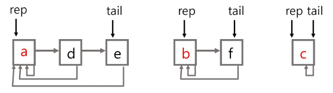
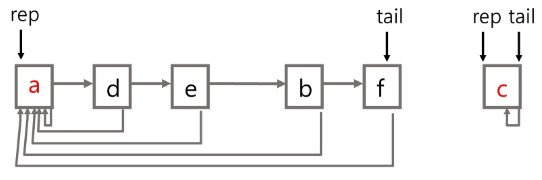
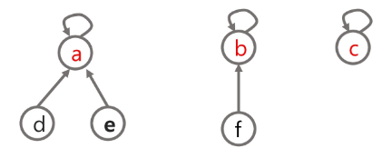
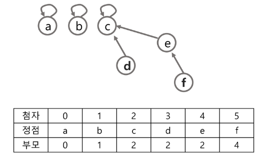

# 그래프의 기본과 탐색

## 그래프 기본

### 그래프
- 그래프는 아이템(사물 또는 추상적 개념)들과 이들 사이의 연결 관계를 표현한다.

- 그래프는 정점(Vertex)들의 집합과 이들을 연결하는 간선(Edge)들의 집합으로 구성된 자료 구조
   - V: 정점의 개수, E: 그래프에 포함된 간선의 개수
   - V개의 정점을 가지는 그래프는 최대 V(V-1)/2 간선이 가능
    - 예) 5개의 정점이 있는 그래프의 최대 간선 수는 10(5*4/2)이다

- 선형 자료구조나 트리 자료구조로 표현하기 어려운 N:N 관계를 가지는 원소들을 표현하기에 용이하다.

### 그래프 유형
- 무향 그래프
- 유향 그래프 
- 가중치 그래프
- 사이클 없는 방향 그래프
- 완전 그래프
  - 정점들에 대해 가능한 모든 간선들을 가진 그래프
- 부분 그래프
  - 원래 그래프에서 일부의 정점이나 간선을 제외한 그래프

#### 인접 정점
- 두 개의 정점에 간선이 존재하면 서로 인접해 있다고 한다.
- 완전 그래프에 속한 임의의 두 정점들은 모두 인접해있다.

### 그래프 표현

- 간선의 정보를 저장하는 방식, 메모리나 성능을 고려해서 결정

- 인접 행렬
  - V x V 크기의 2차원 배열을 이용해서 간선 정보를 저장
  - 배열의 배열
- 인접리스트
  - 각 정점마다 해당 정점으로 나가는 간선의 정보를 저장
- 간선의 배열 
  - 간선(시작 정점, 끝 정점)을 배열에 연속적으로 저장

#### 인접행렬

- 두 정점을 연결하는 간선의 유무를 행렬로 표현
  - V x V 정방 행렬
  - 행 번호와 열 번호는 그래프의 정점에 대응
  - 두 정점이 인접되어있으면 1, 그렇지 않으면 0
  - 무향 그래프
    - i 번째 행의 합 = i 번째 열의 합 = Vi의 차수
  - 유향 그래프 
    - 행 i의 합 = Vi의 진출 차수
    - 열 i의 합 = Vi의 진입 차수

## 그래프 탐색
### DFS(깊이우선탐색)

```py
def dfs(node):
    print(node, end=' ')  # 현재 노드 출력

    # 갈 수 있는 노드들을 탐색
    for next_node in graph[node]:
        if visited[next_node]:
            continue

        visited[next_node] = 1
        dfs(next_node)

N, M = map(int, input().split())
graph = [[] for _ in range(N + 1)]
visited = [0] * (N + 1)
for _ in range(M):
    s, e = map(int, input().split())
    graph[s].append(e)
    graph[e].append(s)

visited[1] = 1
dfs(1)
```

### BFS(넓이우선탐색)

```py
def bfs(node):
    q = [node]

    while q:
        now = q.pop(0)

        print(now, end=' ')  # 현재 노드 출력

        for next_node in graph[now]:
            if visited[next_node]:
                continue

            visited[next_node] = 1
            q.append(next_node)


N, M = map(int, input().split())
graph = [[] for _ in range(N + 1)]
visited = [0] * (N + 1)
for _ in range(M):
    s, e = map(int, input().split())
    graph[s].append(e)
    graph[e].append(s)

visited[1] = 1
bfs(1)
```

## Union-Find (Disjoint set) - 서로소 집합

- 서로소 또는 상호배타 집합들은 서로 중복 포함된 원소가 없는 집합들이다. 다시 말해 교집합이 없다.

- 집합에 속한 하나의 특정 멤버를 통해 각 집합들을 구분한다. 이를 대표자라 한다.

- 상호배타 집합을 표현하는 방법
  - 연결 리스트
  - 트리

- 상호배타 집합 연산
  - make-set(x)
  - find-set(x)
  - Union(x,y)

### 상호 배타 집합 표현 - 연결리스트

- 같은 집합의 원소들은 하나의 연결리스트로 관리한다.
- 연결리스트의 맨 앞의 원소를 집합의 대표 원소로 삼는다.
- 각 원소는 집합의 대표원소를 가리키는 링크를 갖는다.

  

- 연결리스트 연산 예
  - find-set(e)  -> return a
  - find-set(f)  -> return b
  - union(a,b)

  

### 상호 배타 집합 표현 - 트리

- 하나의 집합을 하나의 트리로 표현한다.
- 자식노드가 부모노드를 가리키며 루트 노드가 대표자가 된다.
  

- 상호배타 집합을 표현한 트리의 배열을 이용한 저장된 모습

  

### 상호 배타 집합에 대한 연산

- make-set(x): 유일한 멤버 x를 포함하는 새로운 집합을 생성하는 연산
- find-set(x): x를 포함하는 집합을 찾는 연산
- union(x, y): x와 y를 포함하는 두 집합을 통합하는 연산

- 연산의 효율을 높이는 방법

  - Rank를 이용한 Union
    - 각 노드는 자신을 루트로 하는 subtree의 높이를 랭크 rank 라는 이름으로 저장한다.
    - 두 집합을 합칠 때 rank가 낮은 집합을 rank가 높은 집합에 붙인다.

  - Path compression
    - find-set을 행하는 과정에서 만나는 모든 노드들이 직접 root를 가리키도록 포인터를 바꾸어준다.