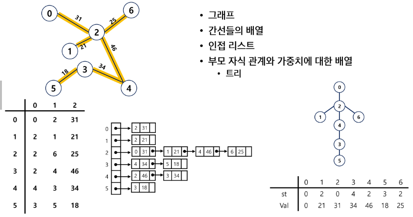
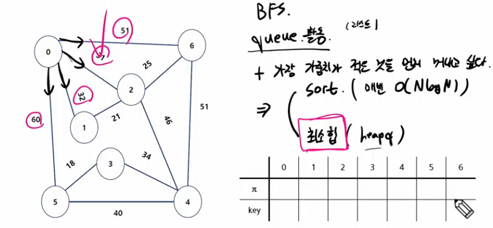
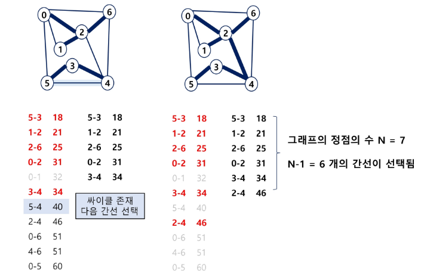

# 그래프의 최소 비용 문제

## 최소 비용 신장 트리(MST)

- 그래프에서 최소 비용 문제
  1) 모든 정점을 연결하는 간선들의 가중치의 합이 최소가 되는 트리
  2) 두 정점 사이의 최소 비용의 경로 찾기

- 신장 트리
  - n개의 정점으로 이루어진 무방향 그래프에서 n개의 정점과 n-1개의 간선으로 이루어진 트리 (계층적, 싸이클 x, 전체 그래프에서 신장트리는 여러개 될 수 있음)

- 최소 신장 트리
  - 무방향 가중치 그래프에서 신장트리를 구성하는 간선들의 가중치의 합이 최소인 신장 트리

### MST 표현

- 아래 두가지 알고리즘 활용할 예정

  1. Prim 알고리즘 - 정점을 기준
  2. Kruskal 알고리즘 - 간선을 기준

  -> 공통점 그리디 방식으로 접근 **(작은 것 부터 선택)**

### Prim 알고리즘

- 하나의 정점에서 연결된 간선들 중에 하나씩 선택하면서 MST를 만들어 가는 방식
  1) 임의 정점을 하나 선택해서 시작
  2) 선택한 정점과 인접하는 정점들 중의 최소 비용의 간선이 존재하는 정점을 선택
  3) 모든 정점이 선택될 때 까지 1), 2) 과정을 반복

- 서로소인 2개의 집합 정보를 유지
  - 트리 정점들 - MST를 만들기 위해 선택된 정점들
  - 비트리 정점들 - 선택되지 않은 정점들

### Kruskal 알고리즘

- 간선을 하나씩 선택해서 MST를 찾는 알고리즘

  1) 최초, 모든 간선을 가중치에 따라 오름차순으로 정렬
  2) 가중치가 가장 낮은 간선부터 선택하면서 트리를 증가시킴
    - 사이클이 존재하면 다음으로 가중치가 낮은 간선 선택
  3) n-1개의 간선이 선택될 때 까지 2)를 반복

  

### 최단경로

- 최단 경로 정의
  - 간선의 가중치가 있는 그래프에서 두 정점 사이의 경로들 중에 간선의 가중치의 합이 최소인 경로
- 하나의 시작 정점에서 끝 정점까지의 최단경로
  - 다익스트라(dijkstra) 알고리즘
    - 음의 가중치를 허용하지 않음
  - 벨만-포드(Bellman-Ford) 알고리즘
    - 음의 가중치 허용

- 모든 정점들에 대한 최단 경로 
  - 플로이드-워샬 알고리즘

#### Dijkstra 알고리즘

- 시작 정점에서 거리가 최소인 정점을 선택해 나가면서 최단 경로를 구하는 방식

- 시작 정점(s)에서 끝정점(t) 까지의 최단 경로에 정점 x가 존재한다.
- 이때, 최단경로는 s에서 x까지의 최단 경로와 x에서 t까지의 최단경로 구성된다.
- 탐용기법을 사용한 알고리즘으로 MST의 프림 알고리즘과 유사하다.

