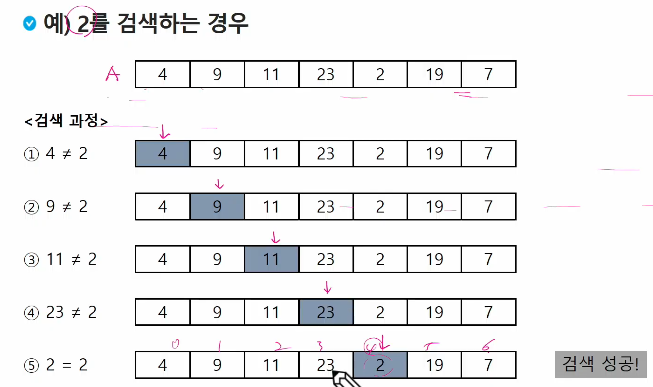
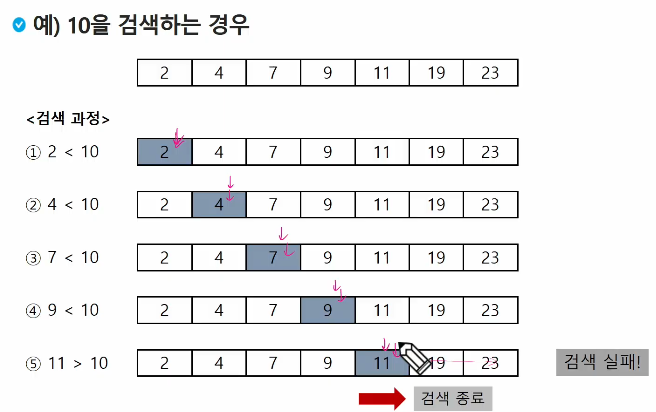
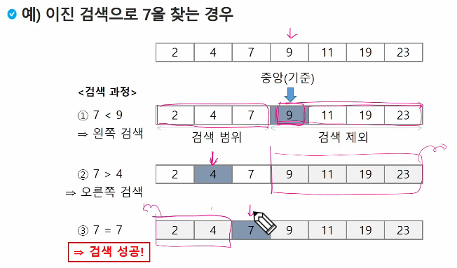
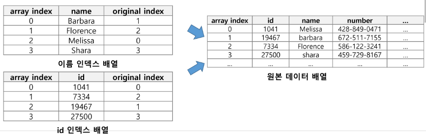
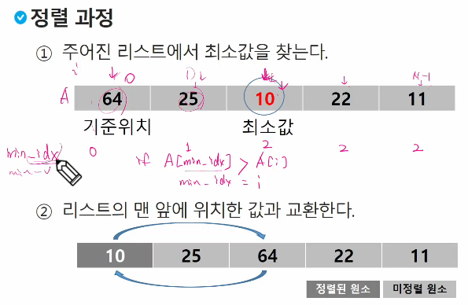

# APS
## 배열 2 (Array 2)
### 2차원 배열

#### 2차원 배열의 선언
- 1차원 List를 묶어놓은 List
- 2차원 이상의 다차원 List는 차원에 따라 index를 선언
- 2차원 List의 선언: 세로길이(행의 개수), 가로길이(열의 개수)를 필요로 함
- python에서는 데이터 초기화를 통해 변수선언과 초기화가 가능함

    arr = [[0, 1, 2, 3],[4, 5, 6, 7]] (2행 4열의 2차원 List)

        arr = | 0 | 1 | 2 | 3 |
              | 4 | 5 | 6 | 7 |

[참고]

```py
'''
3
1 2 3
4 5 6
7 8 9 
'''
N = int(input)
arr = [list(map(int, input().split())) for _ in range(N)]

arr = [[1,2,3], [4,5,6]]
print(len(arr))      # 2 , 행의 수
print(len(arr[0]))   # 3 , 열의 수

# 주의!! 이렇게 만들면 안됨
arr = [[0]*3]*2
print(arr)  # [[0,0,0],[0,0,0]]
arr[0][0] = 1
print(arr)  # [[1,0,0],[1,0,0]]
```

### 2차원 배열의 접근
#### 배열 순회
- n x m 배열의 ㅣn * m 개의 모든 원소를 빠짐없이 조사하는 방법

#### 행 우선 순회
```py
# i 행의 좌표
# j 열의 좌표
for i in range(n):
    for j in range(m):
        f(array[i][j]) # 필요한 연산 수행

# Q. 각 행의 합 중 최대 값은?
arr = [[2,1,1],[1,2,2]]
max_v = 0
for i in range(len(arr)):
    sum_v = 0
    for j in arr[i]:
        sum_v += j
    if max_v < sum_v:
        max_v = sum_v
print(max_v)
```

#### 열 우선 순회
```py
# i 행의 좌표
# j 행의 좌표

for j in range(m):
    for i in range(n):
        f(array[i][j])

# 열, 행 바꿔서 접근하려면
for i in range(n):
    for j in range(m):
        f(array[i][j])
        f(array[j][i])
```

#### 지그재그 순회

행이 짝수일 때 순서대로, 홀수일 때 역순대로

```py
for i in range(n): # 행은 그대로 증가
    for j in range(m): # 열은 왔다갔다
        # 행이 짝수면 나머지 0이어서 j만 남음
        # 행이 홀수면 나머지 1이고 m-1-j 를 만들어줘야함 
        f(array[i][j + (m-1-2*j) * (i % 2)] )  
```
#### 델타를 이용한 2차 배열 탐색
- 2차 배열의 한 좌표에서 4방향의 인접 배열 요소를 탐색하는 방법
- 인덱스 (i, j)인 칸의 상하좌우 칸 (ni, nj)
    

```py
arr[0...N-1][0...N-1] # NxN 배열
di = [0 , 1, 0, -1]
dj = [1, 0, -1, 0]
for i in range(0, N-1):
    for j in range(0, N-1):
        for k in range(4):
            ni = i + di[k]
            nj = j + dj[k]
            if 0 <= ni < N and 0 <= nj < N:
                f(arr[ni][nj]) 
```
#### 전치 행렬
```py
# i : 행의 좌표, len(arr)
# j : 열의 좌표, len(arr[0])

arr = [[1, 2, 3],[4, 5, 6],[7, 8, 9]] # 3,3 행렬

for i in range(3):
    for j in range(3):
        if i < j:
            arr[i][j], arr[j][i] = arr[j][i], arr[i][j]
```


- i, j 의 크기에 따라 접근하는 원소 비교
    

#### 연습문제 1-1

- 5x5 2차원 배열에 25개의 숫자를 저장하고
- 대각선 원소의 합을 구하시오. 대각선 원소는 다음과 같은 위치의 원소를 나타낸다.
    

#### 연습문제 1-2

```py
N = int(input())
arr = [list(map(int, input().split())) for _ in range(N)]

di = [0, 1, 0, -1]
dj = [1, 0, -1, 0]

# ni - i, nj - j -> abs 처리
total = 0
for i in range(N):
    for j in range(N):
        sum_v = 0
        for k in range(4):
            ni = i+di[k]
            nj = j+dj[k]
            if 0 <= ni < N and 0 <= nj < N:
                sum_v += abs(arr[i][j] - arr[ni][nj])
        total += sum_v
```
## 부분집합
### 부분집합 합 문제
- 유한 개의 정수로 이루어진 집합이 있을 때, 이 집합의 부분집합 중에서 그 집합의 원소를 모두 더한 값이 0이 되는 경우가 있는지를 알아내는 문제
- 예를 들어, [-7, -3, -2, 5, 8]라는 집합이 있을 때, [-3, -2, 5]는 이 집합의 부분집합이면서 (-3)+(-2)+5=0 이므로 이 경우의 답은 참이 된다.
- **knapsack (배낭문제) 해결할 때 유용함!!!**

### 부분집합 생성하기
- 완전 검색 기법으로 부분집합 합 문제를 풀기 위해서는, 우선 집합의 모든 부분집합을 생성한 후에 각 부분집합의 합을 계산해야 한다.
- 주어진 집합의 부분집합을 생성하는 방법에 대해서 생각해보자

#### 부분집합의 수
- 집합의 원소가 n개일 때 , 공집합을 포함한 부분집합의 수는 2**n개 이다.
- 이는 각 원소를 부분집합에 포함시키거나 포함시키지 않는 2가지 경우를 모든 원소에 적용한 경우의 수와 같다.
- 예) {1, 2, 3, 4} -> 2 x 2 x 2 x 2 = 16가지
    

- 각 원소가 부분집합에 포함되었는지를 loop를 이용하여 확인하고 부분집합을 생성하는 방법
    ```py
    bit = [0, 0, 0, 0]
    for i in range(2):    
        bit[0] = i
        for j in range(2):
            bit[1] = j
            for k in range(2):
                bit[2] = k
                for l in range(2):
                    bit[3] = l
                    print_subset(bit)  # 생성된 부분집합 출력  
    ```

### 비트 연산자
- 비트 연산자
    - & : 비트 단위로 AND 연산을 한다.
    - | : 비트 단위로 OR 연산을 한다.
    - << : 피연산자의 비트 열을 왼쪽으로 이동시킨다. 
    - >> : 피연산자의 비트 열을 오른쪽으로 이동시킨다.

- << 연산자
    - value << n
    - value(2진수)를 n비트만큼 왼쪽으로 shift, 왼쪽으로 밀어내고 남는 오른쪽 자리는 0으로 채움
    - 1 << n : 2**n 즉, 원소가 n개일 경우의 모든 부분집합의 수를 의미한다.

- & 연산자
    - i & (1<<j): i의 j번째 비트가 1인지 아닌지를 검사한다.

- 보다 간결하게 부분집합을 생성하는 방법
    ```py
    arr = [3, 6, 7, 1, 5, 4]
    n = len(arr)  # n: 원소의 개수

    for i in range(1<<n):
        for j in range(n):
            if i & (1<<j):
                print(arr[j], end=", ")
        print()
    print()
    ```

## 검색
- 저장되어 있는 자료 중에서 원하는 항목을 찾는 작업
- 목적하는 탐색 키를 가진 항목을 찾는 것
    - 탐색 키(search key) : 자료를 구별하여 인식할 수 있는 키
- 검색의 종류
    - 순차 검색
    - 이진 검색
    - 해쉬

### 순차 검색
- 일렬로 되어 있는 자료를 순서대로 검색하는 방법
    - 가장 간단하고 직관적
    - 배열이나 연결 리스트 등 순차구조로 구현된 자료구조에서 원하는 항목을 찾을 때 유용
    - 알고리즘 단순해 구현이 쉽지만, 검색 대상의 수가 많은 경우 수행시간이 급격히 증가하여 비효율적임
- 2가지 경우
    - 정렬되어 있지 않은 경우
    - 정렬되어 있는 경우
    
#### 정렬되어 있지 않은 경우
- 검색 과정
    - 첫 번째 원소부터 순서대로 검색 대상과 키 값이 같은 원소가 있는지 비교하며 찾는다.
    - 키 값이 동일한 원소를 찾으면 그 원소의 인덱스를 반환
    - 자료구조의 마지막에 이를 때까지 검색 대상 찾지 못하면 검색 실패



    ```py
    # 수도코드
    def f(key, A)
    for i : 0 -> N-1
        if key = A[:]
            return i 
    return -1
    ```
- 찾고자 하는 원소의 순서에 따라 비교회수가 결정됨
    - 첫 번째 원소를 찾을 때는 1번 비교, 두 번째 원소를 찾을 때는 2번 비교
    - 정렬되지 않은 자료에서의 순차 검색의 평균 비교 회수
        - = (1/n)*(1+2+3+..+n) = (n+1)/2
    - 시간 복잡도: O(n)
- 구현 예
    ```py
    def sequential search(a, n, key): # a -> array, n -> 개수, key -> 찾고자하는원소 
        i = 0 
        while i < n and a[i] != key: # 키가 다르면 다음 원소로 이동
            i = i + 1  
        if i < n : return i  # key를 찾으면 여기로 빠져나옴
        else: return -1 # 끝까지 도달했을 때는 여기로

#### 정렬되어 있는 경우
- 검색 과정
    - 자료가 오름차순으로 정렬된 상태에서 검색을 실시한다고 가정하자
    - 자료를 순차적으로 검색하면서 키 값을 비교하여, 원소의 키 값이 검색 대상의 키 값보다 크면 찾는 원소가 없다는 것이므로 더 이상 검색하지 않고 검색을 종료한다.
    - -> 이 방향으로 계속 찾아가면서 찾는 값 보다 작은 값이면 옆으로 넘어감
    

- 정렬하는 시간이 오래 걸릴 경우 사용 x

- 찾고자 하는 원소의 순서에 따라 비교회수가 결정됨
    - 정렬이 되어있으므로, 검색 실패를 반환 하는 경우 평균 비교회수가 반으로 줄어든다.
    - 시간 복잡도 : O(n)

    ```py
    # 수도 코드
    for i : 0 -> n-1
        if a[i] == key
            return i
        elif a[i] > key
            return -1
        # key 보다 큰 값을 못찾은 경우
    return -1
    ```

- 구현 예
    ```py
    def sequentialSearch2(a, n, key):
        i = 0
        # 인덱스 검사 부터!! 
        while i < n and a[i] < key: # a[i]<key and i<n 이렇게 쓰면 단축평가 때문에 안됨
            i = i+1
        if i <n and a[i] == key:
            return i
        else:
            return -1
    ```

### 이진 검색
- 자료의 가운데에 있는 항목의 키 값과 비교하여 다음 검색의 위치를 결정하고 검색을 계속 진행하는 방법
    - 목적 키를 찾을 때까지 이진 검색을 순환적으로 반복 수행함으로써 검색 범위를 반으로 줄여가면서 보다 빠르게 검색을 수행함
- 이진 검색을 하기 위해서는 자료가 **정렬된 상태**여야 한다.
    

#### 이진 검색 알고리즘
- 구현 
    - 검색 범위의 시작점과 종료점을 이용하여 검색을 반복 수행한다.
    - 인진 검색의 경우, 자료에 삽입이나 삭제가 발생했을 때 배열의 상태를 항상 정렬 상태로 유지하는 추가 작업이 필요하다.
    ```py
    def binarySearch(a, N, key):
        start = 0  # 시작원소 인덱스
        end = N-1  # 마지막원소 인덱스
        while start <= end:   # 남은구간이 있으면
            middle = (start + end)//2
            if a[middle] == key # 검색성공
                return 'true'
            elif a [middle] > key:
                end = middle - 1
            else:
                start = middle + 1  # 끝까지 검색 못하면 start > end 됨
        return 'false' # 검색실패
    ```
- 재귀 함수 이용
    - 아래와 같이 재귀 함수를 이용하여 이진 검색을 구현가능
    - 재귀 함수에 대해서는 나중에 더 자세히 배움
    
    ```py
    def binarySearch2(a, low, high, key):
        if low > high: # 검색 실패
            return False
        else:
            middle = (low + high) // 2
            if key == a[middle]: # 검색 성공
                return True
            elif key < a[middle]:
                return binarySearch2(a,low,middle-1,key)
            elif a[middle] < key:
                return binarySearch2(a,middle+1,high,key)
    ```
#### 인덱스
- 다음 예에서 원본 데이터 배열과 별개로, 배열 인덱스를 추가한 예를 보여주고 있다.
    - 원본 데이터에 데이터가 삽입될 경우 상대적으로 크기가 작은 인덱스 배열을 정렬하기 때문에 속도가 빠르다.
    

- 인덱스라는 용어는 Database에서 유래했으며, 테이블에 대한 동작 속도를 높여주는 자료 구조를 일컫는다.
- Database 분야가 아닌 곳에서는 Look up table등의 용어를 사용하기도 한다.
- 인덱스를 저장하는데 필요한 디스크 공간은 보통 테이블을 저장하는데 필요한 디스크 공간보다 작다. 왜냐하면 보통 인덱스는 키-필드만 갖고 있고, 테이블의 다른 세부 항목들은 갖고 있지 않기 때문이다.

- 인덱스
    - 대량의 데이터를 매번 정렬하면, 프로그램의 반응은 느려질 수 밖에 없다. 이러한 대량 데이터의 성능 저하 문제를 해결하기 위해 배열 인덱스를 사용할 수 있다.
> 데이터베이스 인덱스는 **이직 탐색 트리** 구조로 되어있다.

## 선택 정렬
- 주어진 자료들 중 가장 갖은 값의 원소부터 차례대로 선택하여 위치를 교환하는 방식

    - 앞서 살펴본 셀렉션 알고리즘을 전체 자료에 적용한 것이다.
- 정렬 과정
    - 주어진 리스트 중에서 최소값을 찾는다.
    - 그 값을 리스트의 맨 앞에 위치한 값과 교환
    - 맨 처음 위치를 제외한 나머지 리스트를 대상으로 위의 과정 반복
- 시간 복잡도
    - O(n**2)

### 선택 정렬 과정
- 정렬 과정
    1. 주어진 리스트에서 최소값을 찾는다.
    2. 리스트의 맨 앞에 위치한 값과 교환한다.
    
    3. 맨 앞 원소를 제외한 미정렬 리스트에서 최소값을 찾는다.
    4. 리스트의 맨 앞에 위치한 값과 교환한다.
    5. 반복..
    6. 미정렬 원소가 하나 남은 상황에서는 마지막 원소가 가장 큰 값을 갖게 되므로, 실행을 종료하고 선택 정렬이 완료된다.
```py
# 수도코드
for i : 0 -> N-2 # 기준위치 구간시작
    min_idx = i # 현재구간의 맨 앞을 최소로 가정
    for j in range(i+1, N) # 비교구간 원소 j
        if A[min_idx] > A[j]:
            # 자리 바꾸기
```
- 구현
```py
def SelectionSort(a,N):
    for i in range(N-2): # 기준위치 i (구간 시작)
        min_idx = i  # 기준위치를 최솟값 위치로 가정
        for j in range(i+1, N):
            if a[min_idx] > a[j]: # 기준위치보다 더 작으면
                min_idx = j
        a[i], a[min_idx] = a[min_idx], a[i]

```
### 셀렉션 알고리즘

- 저장되어 있는 자료로부터 k번째로 큰 혹은 작은 원소를 찾는 방법을 셀렉션 알고리즘이라 한다.
    - 최소값, 최대값 혹은 중간값을 찾는 알고리즘을 의미

- 선택과정
    - 셀렉션은 아래와 같은 과정을 통해 이루어진다
        - **정렬 알고리즘을 이용하여 자료 정렬하기**
        - **원하는 순서에 있는 원소 가져오기**

- k번째로 작은 원소를 찾는 알고리즘
    - 1번부터 k번째까지 작은 원소들을 찾아 배열의 앞쪽으로 이동시키고, 배열의 k번째를 반환한다.

