# APS
## 스택2

### 계산기1
- 문자열로 된 계산식이 주어질 때, 스택을 이용하여 이 계산식의 값을 계산할 수 있다.
- 문자열 수식 계산의 일반적 방법
    - step1. 중위 표기법의 수식을 후위 표기법으로 변경한다.(스택 이용)

        > 중위표기법(infix notation)
        - 연산자를 피연산자의 가운데 표기하는 방법 (A+B)
        > 후위표기법(postfix notation)
        - 연산자를 피연산자 뒤에 표기하는 방법 (AB+)

    - step2. 후위 표기법의 수식을 스택을 이용하여 계산한다.

#### step1. 중위표기식의 후위표기식 변환

- 수식의 각 연산자에 대해서 우선순위에 따라 괄호를 사용하여 다시 표현한다.
- 각 연산자를 그에 대응하는 오른쪽괄호의 뒤로 이동시킨다.
- 괄호를 제거한다.

    예) A*B-C/D

    1단계: ((A*B)-(C/D))

    2단계: ((A B)* (C D)/)-
    
    3단계: AB*CD/-

#### step1. 중위표기식에서 후위 표기법으로의 변환 알고리즘(스택 이용)2

1. 입력 받은 중위 표기식에서 토큰을 읽는다.
    
2. 토큰이 피연산자이면 토큰을 출력한다.
    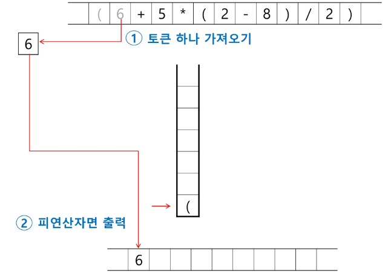
3. 토큰이 연산자(괄호포함)일 때, 이 토큰이 스택의 top에 저장되어 있는 연산자보다 우선순위가 높으면 스택에 push하고, 그렇지 않다면 스택 top의 연산자의 우선순위가 토큰의 우선순위보다 작을 때까지 스택에서 pop한 후 토큰의 연산자를 push한다.
만약 top에 연산자가 없으면 push한다.
    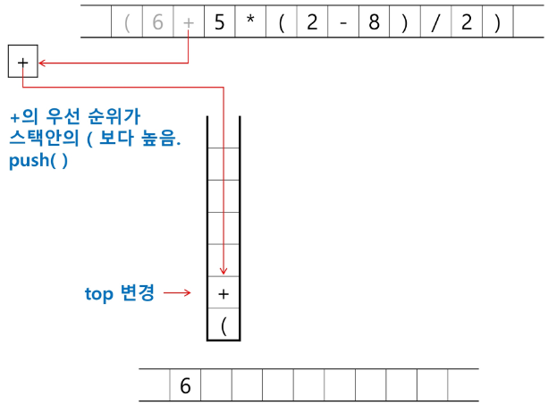
    
4. 토큰 오른쪽 괄호 ')'이면 스택 top에 왼쪽 괄호 '('가 올 때 까지 스택에 pop연산을 수행하고 pop한 연산자를 출력한다. 왼쪽 괄호를 만나면 pop만 하고 출력하지는 않는다.
    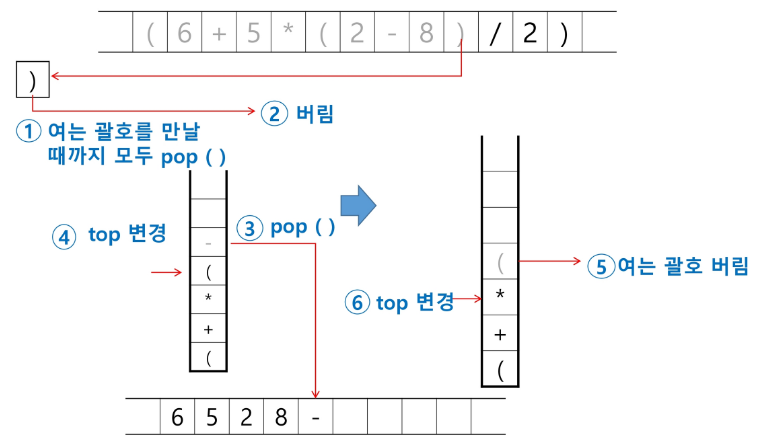
    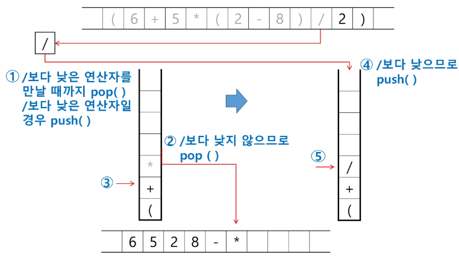
    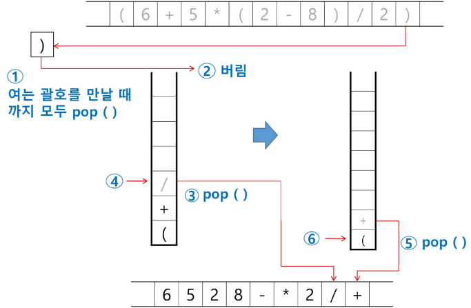s
5. 중위 표기식에 더 읽을 것이 없다면 중지하고, 더 읽을 것이 있다면 1부터 다시 반복한다.
6. 스택에 남아있는 연산자를 모두 pop하여 출력한다.

    - 스택 밖의 왼쪽 괄호는 우선 순위가 가장 높으며, 스택 안의 왼쪽 괄호는 우선 순위가 가장 낮다.
    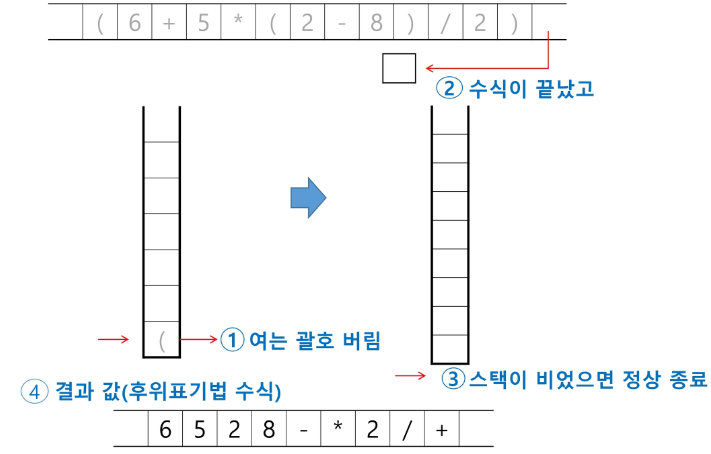

### 계산기2
#### step2. 후위 표기법의 수식을 스택을 이용하여 계산

1. 피연산자를 만나면 스택에 push한다.
    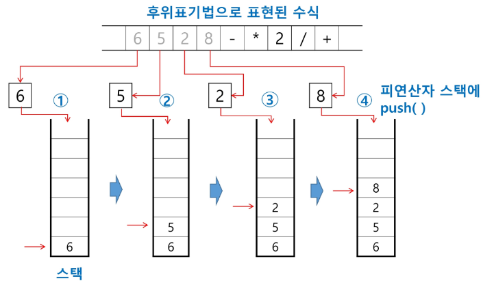
2. 연산자를 만나면 필요한 만큼의 피연산자를 스택에서 pop하여 연산하고, 연산결과를 다시 스택에 push한다.
    - **이때, 먼저 pop한게 뒤로 나중에 pop한게 앞으로 오게하고 연산**
    
    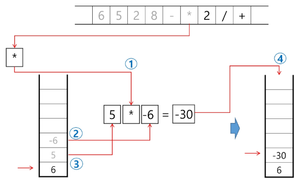
3. 수식이 끝나면, 마지막으로 스택을 pop하여 출력한다. 
    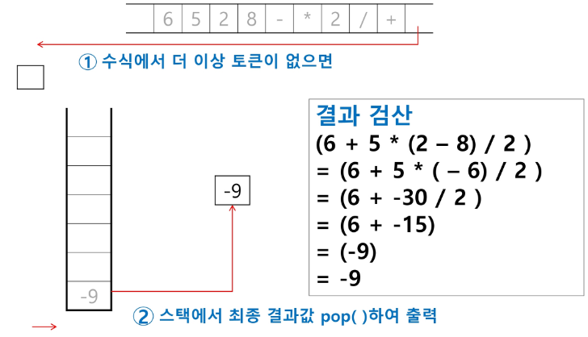

### 백트래킹
- 백트래킹 기법은 해를 찾는 도중에 **막히면** (즉, 해가 아니면) 되돌아가서 다시 해를 찾아 가는 기법
- 백트래킹 기법은 최적화 문제와 결정 문제를 해결할 수 있음
- 결정 문제: 문제의 조건을 만족하는 해가 존재하는지의 여부를 'yes' 또는 'no'가 답하는 문제
    - 미로찾기
    - n-Queen 문제
    - Map coloring
    - 부분 집합의 합(Subset sum) 문제 등

#### 백트래킹과 깊이우선탐색(dfs)과의 차이
- 어떤 노드에서 출발하는 경로가 해결책으로 이어질 것 같지 않으면 더 이상 그 경로를 따라가지 않음으로써 시도의 횟수를 줄임(prunning 가지치기)

- 깊이우선탐색이 모든 경로를 추적하는데 비해 백트래킹은 불필요한 경로를 조기에 차단
- 깊이우선탐색을 가하기에는 경우의 수가 너무나 많음. 즉, N! 가지의 경우의 수를 가진 문제에 대해 깊이우선탐색을 가하면 당연히 처리 불가능한 문제
- 백트래킹 알고리즘을 적용하면 일반적으로 경우의 수가 줄어들지만 이 역시 최악의 경우에는 여전히 지수함수 시간을 요하므로 처리 불가능

#### 백트래킹 기법

- 모든 후보를 검사?
    - NO!

- 어떤 노드의 유망성을 점검한 후에 유망하지 않다고 결정되면 그 노드의 부모로 되돌아가 다음 자식 노드로 감
- 어떤 노드를 방문하였을 때 그 노드를 포함한 경로가 해답이 될 수 없으면 그 노드는 유망하지 않다고 하며, 반대로 해답의 가능성이 있으면 유망하다고 한다.
- 가지치기: 유망하지 않는 노드가 포함되는 경로는 더 이상 고려하지 않는다.

- 백트래킹을 이용한 알고리즘은 다음과 같은 절차로 진행됨
    1. 상태 공간 트리의 깊이 우선 검색을 실시
    2. 각 노드가 유망한지를 점검
    3. 만일 그 노드가 유망하지 않으면, 그 노드의 부모 노드로 돌아가서 검색

#### 미로 찾기

- 아래 그림과 같이 입구와 출구가 주어진 미로에서 입구부터 출구까지의 경로를 찾는 문제
- 이동할 수 있는 방향은 4방향으로 제한
    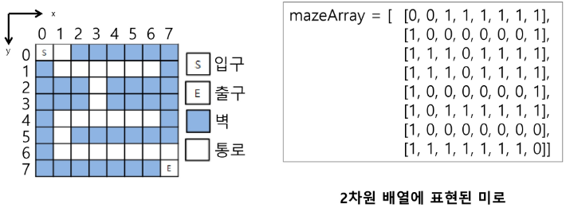

- 미로 찾기 알고리즘
    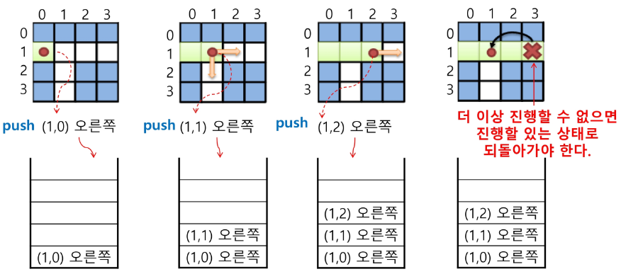
    - 스택을 이용하여 지나온 경로를 역으로 되돌아 간다
    
    - 스택을 이용하여 다시 경로를 찾는다
    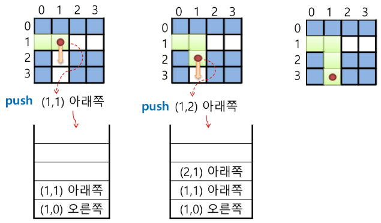

#### 일반 백트래킹 알고리즘 (N-Queen 문제)

- queen은 좌우위아래양대각선 방향에 중복해서 둘 수 없음
- NxN 체스판에 몇개의 queen 둘 수 있는지
    

- 상태 공간 트리
    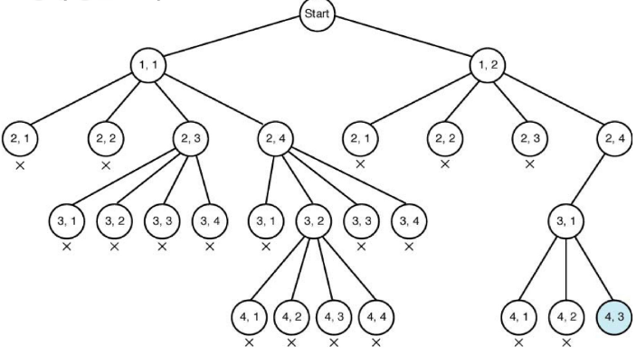

