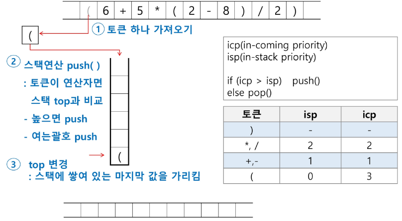
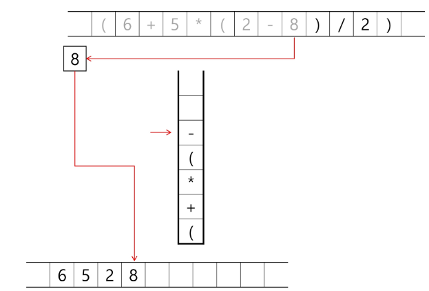
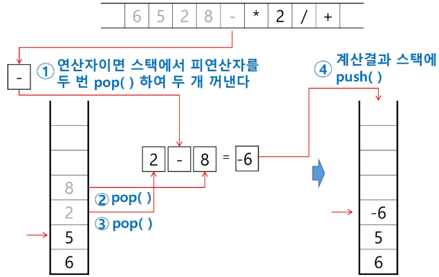
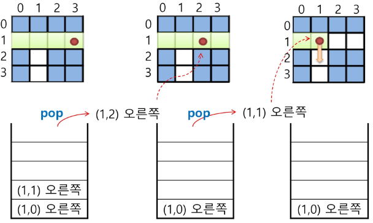
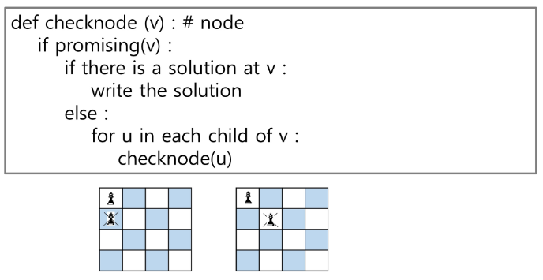

# APS
## 스택2

### 계산기1
- 문자열로 된 계산식이 주어질 때, 스택을 이용하여 이 계산식의 값을 계산할 수 있다.
- 문자열 수식 계산의 일반적 방법
    - step1. 중위 표기법의 수식을 후위 표기법으로 변경한다.(스택 이용)

        > 중위표기법(infix notation)
        - 연산자를 피연산자의 가운데 표기하는 방법 (A+B)
        > 후위표기법(postfix notation)
        - 연산자를 피연산자 뒤에 표기하는 방법 (AB+)

    - step2. 후위 표기법의 수식을 스택을 이용하여 계산한다.

#### step1. 중위표기식의 후위표기식 변환

- 수식의 각 연산자에 대해서 우선순위에 따라 괄호를 사용하여 다시 표현한다.
- 각 연산자를 그에 대응하는 오른쪽괄호의 뒤로 이동시킨다.
- 괄호를 제거한다.

    예) A*B-C/D

    1단계: ((A*B)-(C/D))

    2단계: ((A B)* (C D)/)-
    
    3단계: AB*CD/-

#### step1. 중위표기식에서 후위 표기법으로의 변환 알고리즘(스택 이용)2

1. 입력 받은 중위 표기식에서 토큰을 읽는다.
    
2. 토큰이 피연산자이면 토큰을 출력한다.
    
3. 토큰이 연산자(괄호포함)일 때, 이 토큰이 스택의 top에 저장되어 있는 연산자보다 우선순위가 높으면 스택에 push하고, 그렇지 않다면 스택 top의 연산자의 우선순위가 토큰의 우선순위보다 작을 때까지 스택에서 pop한 후 토큰의 연산자를 push한다.
만약 top에 연산자가 없으면 push한다.
    
    
4. 토큰 오른쪽 괄호 ')'이면 스택 top에 왼쪽 괄호 '('가 올 때 까지 스택에 pop연산을 수행하고 pop한 연산자를 출력한다. 왼쪽 괄호를 만나면 pop만 하고 출력하지는 않는다.
    
    
    s
5. 중위 표기식에 더 읽을 것이 없다면 중지하고, 더 읽을 것이 있다면 1부터 다시 반복한다.
6. 스택에 남아있는 연산자를 모두 pop하여 출력한다.

    - 스택 밖의 왼쪽 괄호는 우선 순위가 가장 높으며, 스택 안의 왼쪽 괄호는 우선 순위가 가장 낮다.
    

### 계산기2
#### step2. 후위 표기법의 수식을 스택을 이용하여 계산

1. 피연산자를 만나면 스택에 push한다.
    
2. 연산자를 만나면 필요한 만큼의 피연산자를 스택에서 pop하여 연산하고, 연산결과를 다시 스택에 push한다.
    - **이때, 먼저 pop한게 뒤로 나중에 pop한게 앞으로 오게하고 연산**
    
    
3. 수식이 끝나면, 마지막으로 스택을 pop하여 출력한다. 
    

### 백트래킹
- 백트래킹 기법은 해를 찾는 도중에 **막히면** (즉, 해가 아니면) 되돌아가서 다시 해를 찾아 가는 기법
- 백트래킹 기법은 최적화 문제와 결정 문제를 해결할 수 있음
- 결정 문제: 문제의 조건을 만족하는 해가 존재하는지의 여부를 'yes' 또는 'no'가 답하는 문제
    - 미로찾기
    - n-Queen 문제
    - Map coloring
    - 부분 집합의 합(Subset sum) 문제 등

#### 백트래킹과 깊이우선탐색(dfs)과의 차이
- 어떤 노드에서 출발하는 경로가 해결책으로 이어질 것 같지 않으면 더 이상 그 경로를 따라가지 않음으로써 시도의 횟수를 줄임(prunning 가지치기)

- 깊이우선탐색이 모든 경로를 추적하는데 비해 백트래킹은 불필요한 경로를 조기에 차단
- 깊이우선탐색을 가하기에는 경우의 수가 너무나 많음. 즉, N! 가지의 경우의 수를 가진 문제에 대해 깊이우선탐색을 가하면 당연히 처리 불가능한 문제
- 백트래킹 알고리즘을 적용하면 일반적으로 경우의 수가 줄어들지만 이 역시 최악의 경우에는 여전히 지수함수 시간을 요하므로 처리 불가능

#### 백트래킹 기법

- 모든 후보를 검사?
    - NO!

- 어떤 노드의 유망성을 점검한 후에 유망하지 않다고 결정되면 그 노드의 부모로 되돌아가 다음 자식 노드로 감
- 어떤 노드를 방문하였을 때 그 노드를 포함한 경로가 해답이 될 수 없으면 그 노드는 유망하지 않다고 하며, 반대로 해답의 가능성이 있으면 유망하다고 한다.
- 가지치기: 유망하지 않는 노드가 포함되는 경로는 더 이상 고려하지 않는다.

- 백트래킹을 이용한 알고리즘은 다음과 같은 절차로 진행됨
    1. 상태 공간 트리의 깊이 우선 검색을 실시
    2. 각 노드가 유망한지를 점검
    3. 만일 그 노드가 유망하지 않으면, 그 노드의 부모 노드로 돌아가서 검색

- 코드의 형태
    ```py
    def 재귀함수(n):
        if 정답이면:
            출력 or 저장
        else: 정답이 아니면:
            for 모든 자식 노드에 대해서:
                if 정답에 유망하다면(답의 가능성이 있으면):
                    자식노드로 이동
                    재귀함수(n+1)
                    부모노드로 이동
    ```
    > 백트래킹의 경우 유망 조건을 따로 함수로 만들어줘서 아래와 같이 구성하는 경우가 많다

    ```py
    def 백트래킹(n):
        if 정답이면:
            출력 or 저장
        else:
            for 모든 자식 노드에 대해:
                if 유망한지확인(m):
                    자식노드로 이동
                    백트래킹(n+1)
                    부모노드로 이동

    def 유망한지확인(m):
        if 조건에 안맞으면:
            return False
        return True
    ```

#### 미로 찾기

- 아래 그림과 같이 입구와 출구가 주어진 미로에서 입구부터 출구까지의 경로를 찾는 문제
- 이동할 수 있는 방향은 4방향으로 제한
    

- 미로 찾기 알고리즘
    
    - 스택을 이용하여 지나온 경로를 역으로 되돌아 간다
    
    - 스택을 이용하여 다시 경로를 찾는다
    

#### 일반 백트래킹 알고리즘 (N-Queen 문제)

- queen은 좌우위아래양대각선 방향에 중복해서 둘 수 없음
- NxN 체스판에 몇개의 queen 둘 수 있는지
    

- 상태 공간 트리
    

#### 부분집합

- 어떤 집합의 공집합과 자기자신을 포함한 모든 부분집합을 powerset이라고 하며 구하고자 하는 어떤 집합의 원소 개수가 n일 경우 부분집합의 개수는 2**n 개 이다.

- 백트래킹 기법으로 powerset을 만들어보자
    - 앞에서 설명한 일반적인 백트래킹 접근 방법을 이용한다.
    - n개의 원소가 들어있는 집합의 2**n개의 부분집합을 만들 때는, true 또는 false값을 가지는 항목들로 구성된 n개의 배열을 만드는 방법을 이용
    - 여기서 배열의 i번째 항목은 i번째의 원소가 부분집합의 값인지 아닌지를 나타내는 값이다.

- 각 원소가 부분집합에 포함되었는지를 loop 이용하여 확인하고 부분집합을 생성하는 방법
    ```py
    bit = [0,0,0,0]
    for i in range(2):
        bit[0] = i                  #0번째 원소
        for j in range(2):
            bit[1] = j              #1번째 원소
            for k in range(2):
                bit[2] = k          #2번째 원소
                for l in range(2)
                    bit[3] = l      #3번째 원소
                    print(bit)      #생성된 부분집합 출력
    ```
    

- powerset을 구하는 백트래킹 알고리즘

    ```py
    def backtrack(a, k, n): # a 주어진 배열, k 결정할 원소, n 원소 개수
        c = [0] * MAXCANDIDATES

        if k == n:
            process_solution(a,k) # 답이면 원하는 작업을 한다
        else:
            ncandidates = construct_candidates(a,k,n,c)
            for i in range(ncandidates):
                a[k] = c[i]
                backtrack(a, k+1, n) 

    def construct_candidates(a, k, n, c):
        c[0] = True
        c[1] = False
        return 2

    def process_solution(a, k):
        for i in range(k):
            if a[i]:
                print(num[i], end = '')
        print()

    MAXCANDIDATES = 2
    NMAX = 4
    a = [0] * NMAX
    num = [1,2,3,4]
    backtrack(a,0,3)

#### 순열

- 예) 집합 {1,2,3}에서 모든 순열을 생성하는 함수
    - 동일한 숫자가 포함되지 않았을 때, 각 자리 수 별로 loop을 이용해 아래와 같이 구현할 수 있다.

    ```py 
    for i1 in range(1,4):
        for i2 in range(1,4):
            if i2 != i1:
                for i3 in range(1,4):
                    if i3 != i1 and i3 != i2:
                        print(i1,i2,i3)
    ```

    

- 백트래킹을 이용하여 {1, 2, 3, ..., NMAX}에 대한 순열 구하기
    - 접근 방법은 앞의 부분집합 구하는 방법과 유사하다.

    ```py
    def backtrack(a, k, n):
        c = [0] * MAXCANDIDATES

        if k == n:
            for i in range(0,k):
                print(a[i], end=" ")
            print()
        else:
            ncandidates = construct_candidates(a,k,n,c)
            for i in range(ncandidates):
                a[k] = c[i]
                backtrack(a,k+1,n)

    def construct_candidates(a, k, n ,c):
        in_perm = [False]*(NMAX +1)

        for i in range(k):
            in_perm[a[i]] = True
        
        ncandidates = 0
        for i in range(1, NMAX +1):
            if in_perm[i] == False:
                c[ncandidates] = i
                ncandidates += 1
        return ncandidates

    MAXCANDIDATES = 3
    NMAX = 3
    a = [0]*NMAX
    backtrack(a,0,3)
    ```

- **다른 방법@@ 이 방법이 더 쉬운듯**
    ```py
    array = [1,2,3]
    k = 2
    used = [False for i in range(len(array))]

    def backtrack_perm(arr):       # 중복원소 포함
        if len(arr)==k:
            print(arr, end=" ")
            return arr

        for i in range(len(array)):
            if used[i]==False:
                used[i] = True
                backtrack_perm(arr+[array[i]])
                used[i] = False

    def backtrack_comb(idx, arr):  # 중복원소 제외
        if len(arr)==k:
            print(arr, end=" ")
            return arr

        for i in range(idx+1, len(array)):
            if used[i]==False:
                used[i] = True
                backtrack_comb(i, arr+[array[i]])
                used[i] = False

    backtrack_perm([])
    # [1, 2] [1, 3] [2, 1] [2, 3] [3, 1] [3, 2]

    backtrack_comb(-1, [])
    # [1, 2] [1, 3] [2, 3] 
    ```

#### 가지치기

- 부분 집합의 합
    
    
    
    

    ```py
    def f(i,k): # bit[i]를 결정하는 함수
        if i == K: # 모든 원소에 대해 결정하면 
            s = 0  # 부분집합의 합 저장
            for j in range(K):
                if bit[j]:  # bit[j] 가 0이 아니면
                    print(a[j], end=' ')
                    s += a[j]
            print(' : ',s) # 부분집합을 한 행에 표시
        else:
            #bit[i] = 1
            #f(i+1, K)
            #bit[i] = 0
            #f(i+1, K)
            for j in [1, 0]:
                bit[i] = j
                f(i+1, K)

    ```