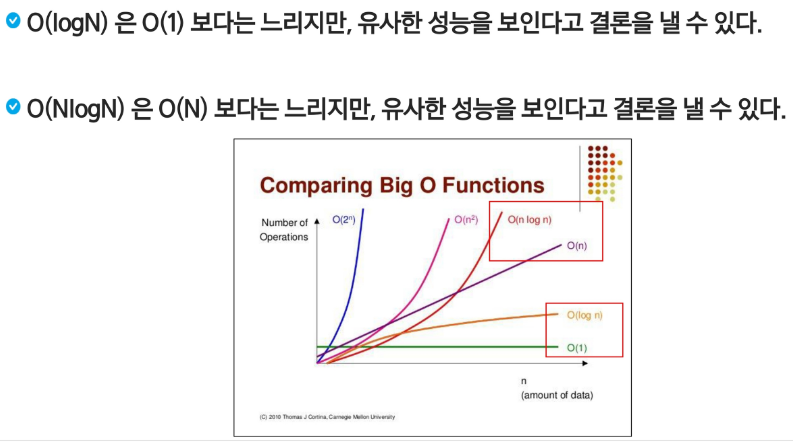
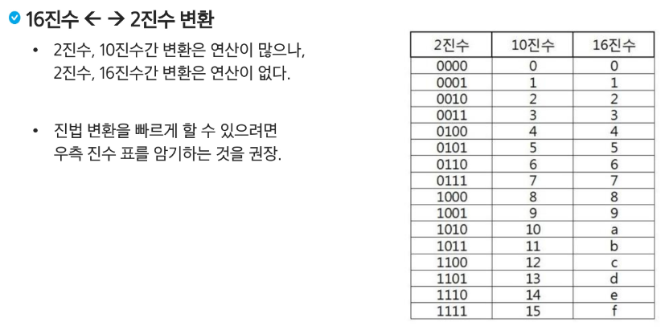

# APS 응용
## 시작하기 1

### SW 문제 해결

- 프로그램을 하기 위한 많은 제약 조건과 요구사항을 이해하고 최선의 방법을 찾아내는 능력

- 프로그래머가 사용하는 언어나 라이브러리, 자료구조, 알고리즘에 대한 지식을 적재적소에 퍼즐을 배치하듯 이들을 연결하여 큰 그림을 만드는 능력이라 할 수 있다.

- 문제 해결 역량은 추상적인 기술이다.
    - 프로그래밍 언어, 알고리즘처럼 명확히 정의된 실체가 없다.
    - 무작정 알고리즘을 암기하고 문제를 풀어본다고 향상되지 않는다.

- 문제 해결 역량을 향상시키기 위해서 훈련이 필요하다

#### 문제 해결 과정

1. 문제를 읽고 이해한다.
2. 문제를 익숙한 용어로 재정의한다.
3. 어떻게 해결할지 계획을 세운다. - 자료구조, 알고리즘
4. 계획을 검증한다. - 반례를 찾아보기 / 논리적인 허점을 찾자 
5. 프로그램으로 구현한다.
6. 어떻게 풀었는지 돌아보고, 개선할 방법이 있는지 찾아본다.

> 한문제당 3,40 분 계획하는데 쓰자..

#### 이유..

- 코딩 더 잘하게 하는 능력 높이기
- 기본문법, 자료구조, 알고리즘 더 능숙하게 쓰도록 훈련

### 복잡도 분석

- 알고리즘: 유한한 단계를 통해 문제를 해결하기 위한 절차자 방법

####  알고리즘의 효율

- 공간적 효율성과 시간적 효율성
    - 공간적 효율성은 연산량 대비 얼마나 적은 메모리 공간을 요하는가
    - 시간적 효율성은 연산량 대비 얼마나 적은 시간을 요하는가
    - 효율성을 뒤집어 표현하면 복잡도가 된다. 복잡도가 높을수록 효율성은 저하된다.

#### 복잡도의 점근적 표기

    - 시간 복잡도는 입력 크기에 대한 함수로 표기하는데, 이 함수는 주로 여러개의 항을 가지는 다항식
    - 이를 단순한 함수로 표현하기 위해 점근적 표시 사용
    - 입력 크기 n이 무한대로 커질 때의 복잡도를 간단히 표현하기 위해 사용하는 표기법

    - O(Big-Oh) 표기 사용

#### O(Big-Oh) 표기

- O-표기는 복잡도의 점근적 상한을 나타낸다.
- 복잡도가 f(n) = 2n^2-7n+4 라면, f(n)의 O표기는 O(n^2)이다.
- 먼저 f(n)의 단순화된 표현은 n^2이다.
- 단순화된 함수 n^2에 임의의 상수 c를 곱한 cn^2이 n이 증가함에 따라 f(n)의 상한이 된다.

- 대략적인 지표만 계산 가능! 

- O(N) O(N^2) 일때 어떤 것이 더 좋은 성능일까? 복합적으로 생각해야한다. 시간적인 측면에서는 N이 더 좋으나 구현될 때 시간 더 적게 걸리는게 좋다.

#### O(N) 이해하기

N = 10000 일때
O(N^2) = 100,000,000(1억) 나옴 ;;

O(logN)이면 더 낮음..



#### 왜 효율적인 알고리즘이 필요한가?

- 10억개의 숫자를 정렬하는데 PC에서 O(n^2) 알고리즘은 300여년이 걸리는 반면에 O(nlogn) 알고리즘은 5분만에 정렬한다.

- 효율적인 알고리즘은 슈퍼컴퓨터보다 더 큰 가치 있음
- 값 비싼 H/W 기술 개발보다 효율적인 알고리즘 개발이 훨씬 더 경제적

> 코테 문제 사이트 pc는 1초당 3천만번(파이썬이어서) 가능하다고 계산..

    - 만약 O(N) 이면 N값은 몇까지 가능? 3000만
    - 만약 O(N^2) 이면 ? 대략 5477 넘어가면 터진다...
    - 만약 O(logN)이면 ? 매우 크게 가능!!! 신경쓰지 x

    - sort() -> O(NlogN) 이면 ? 대략 140만 (만약 N이 천만이면 못씀)


### 표준 입출력
```py
import sys
sys.stdin = open('input.txt', 'r') # 인풋 파일인식
sys.stdout = open('output.txt', 'w') # 아웃풋 파일 만들어서 결과 저장해줌
```

> 풀이 제출할 때는 주석씌우고 제출하기

### 진수

- 2진수, 8진수, 10진수, 16진수
    - 10진수: 사람이 사용하는 진수
    - 2진수: 컴퓨터가 사용하는 진수
    - 16진수: 2진수를 더 가독성 있게 사용

- 16진수 왜 사용하는 것인가?
    
    - 2진수를 10진수로 변환 시 
        - 연산이 오래걸림
    
    - 2진수 16진수로 변환 시
        - 연산 속도가 매우 빠름

- 계산기 - 프로그래머 - HEX 16, DEC 10, OCT 8, BIN 2 으로 확인 가능

- 10진수를 2진수, 16진수로 바꾸고 2진수를 10진수로 바꿀줄 알아야함

    
    
    > 2, 4, 8, 15 는 잘 외워두기
