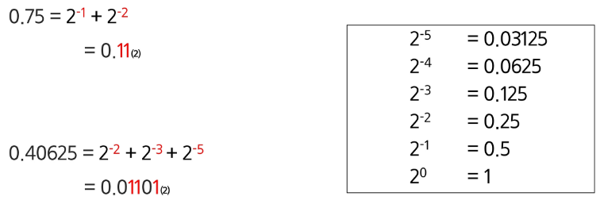

# APS 응용
## 시작하기 2

### 비트연산

#### 비트와 바이트
- 1bit: 0과 1을 표현하는 정보의 단위
- 1Byte: 8bit를 묶어 1Byte라고 한다.

<예시>
- 1001/0110/1101/1100 은 총 몇 비트이면서, 몇 바이트인가?
    - 16bit 2Byte  

#### 비트연산

- 컴퓨터의 CPU는 0과 1로 다루어 동작되며, 내부적으로 비트 연산을 사용하여 덧셈, 뺄셈, 곱셉 등을 계산한다.

- 사람이 사용하는 사칙연산이 아닌 컴퓨터가 사용하는 연산인 "비트연산"을 이해해본다.
- 프로그래밍에서 비트연산을 활용한 코딩 방법을 익혀본다.

#### AND와 OR

- a AND b: a, b 둘다 1일 때만 결과가 1이다. 그 외에는 0
- a OR b: a, b 둘 중 하나만 1이면 결과가 1이다. 그외에는 0

    

- 파이썬 구현 

    ```py
    7 & 5 # 이진수로 표현하면 111 & 101 => 101 (5)
    7 | 5 # 이진수로 표현하면 111 | 101 => 111 (7)
    ```

#### 파이썬에서 2진수, 16진수, 10진수 변환하여 출력하기

- 2진수는 0b 앞에 붙여 표현
- 16진수는 0x 붙여 표현

- bin(10) 
- hex(10)

- int("1011", 2)
- int("b", 16)

#### XOR 와 NOT 연산자

- XOR 연산자, OR 처럼 동작되는데 둘 다 1인 경우는 0이다.
    

- 암호화에 사용됨 (XOR 2번하면 그대로 같은 수로 돌아옴)

#### Shift 연산자

- Left Shift << : 특정 수 만큼 비트를 왼쪽으로 밀어낸다.
- Right Shift >> : 특정 수 만큼 비트를 오른쪽으로 밀어낸다.
    

#### 비트연산 응용 1

- 1 << n
    - 2^n의 값을 갖는다.
    - 임베디드 분야에서 계산을 빠르게 하기 위해 사용

- i & (1 << n)
    - i의 n번째 비트가 1인지 아닌지를 확인할 수 있다.
    - ex) 1101 & (1<<2)
        - 1101에서 2번 bit가 1인지 확인 가능하다. (결괏값 = 0100)
        - 결괏값이 0보다 크면 n번째 비트는 1임이 확정된다.

#### 음수 표현 방법

- 2의 보수: 반전 이후  + 1 을 해주고 올려진 비트는 버림


#### NOT 연산자
- (~) NOT 연산자: 모든 비트를 반전시킨다.
- 만약 8bit 일 때 ~(0001 1111) 이라면 값은 1110 0000 이 된다.

- 하지만 파이썬에서는   
    1. 부호비트 추가
    2. 부호비트를 제외하고 2의보수
    3. 최종결과 

    그래서 ~4 출력하면 -5가 됨...

### 실수

- **컴퓨터는 실수를 근사적으로 표현한다.**
    - 이진법으로 표현할 수 없는 형태의 실수는 정확한 값이 아니라 근사 값으로 저장되는데 이때 생기는 작은 오차가 계산 과정에서 다른 결과를 가져온다.

- 실수 자료형의 유효 자릿수
    - 32비트 실수형 유효자릿수(십진수) -> 약 6자리(C++) -> 크기 고정되어있어서;
    - 64비트 실수형 유효자릿수(십진수) -> 약 15자리(C++, Java) -> 크기 고정되어있어서;
    - **파이썬에서는 내부적으로 더 많은 비트를 사용해서 훨씬 넓은 범위의 실수를 표현할 수 있다.**

- 소수점 출력 방법
    - f-string 에서는 {t2:.2f} (소수점 둘째자리에서 반올림)으로 표현

#### 실수 표현 범위
    
- 파이썬에서는 다른 언어와 달리 내부적으로 더 큰 규모의 자료구조를 사용해서 훨씬 넓은 범위의 실수를 표현할 수 있다.
- 최대로 표현할 수 있는 값은 1.8*10^308 이 이상은 inf로 표현
- 최소로 표현할 수 있는 값은 5.0*10^-324이며 이 이하는 0으로 표현

- 파이썬 구조 특징 때문..!

- 컴퓨터는 실수를 내부적으로 근사적으로 관리한다.
    - 실수는 정확한 값이 아니라 근사 값으로 저장되는데 이때 생기는 작은 오차가 계산 과정에서 다른 결과를 가져온다.

- 소수점이 있는 10진수를 2진수로 변환 예시
    

#### 실수의 표현

- 컴퓨터는 실수를 표현하기 위해 부동 소수점 표기법을 사용한다.
- 이표기법은 IEEE 754 이라는 컴퓨터에서 부동소수점을 표기하는 국제표준이다.

- 부동 소수점 표기 방법은 소수점의 위치를 고정시켜 표현하는 방식이다.
- 소수점의 위치를 왼쪽의 가장 유효한 숫자 다음으로 고정시키고 밑수의 지수승으로 표현

