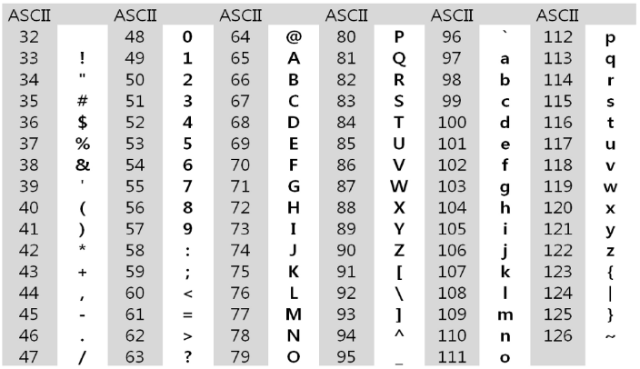
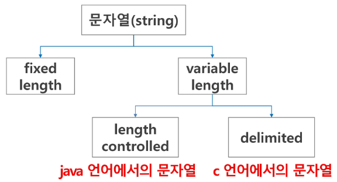
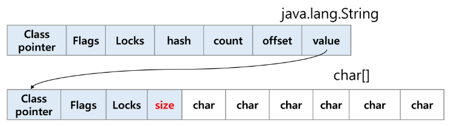
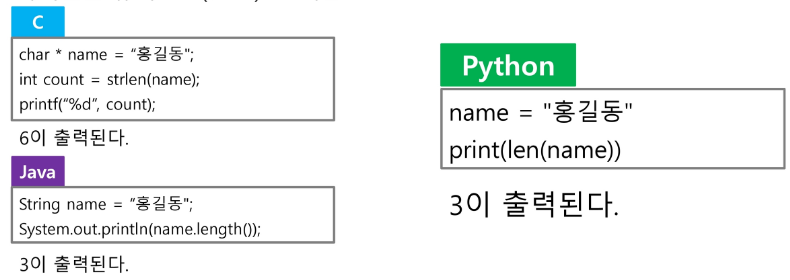
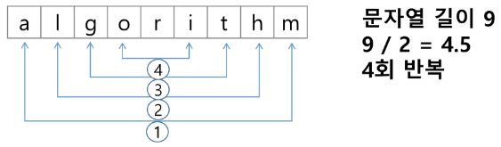

# APS
## 문자열(string)

### 문자의 표현

#### 컴퓨터에서의 문자표현

- 글자 A를 메모리에 저장한다면
- 칼로 A라는 글자를 새기는 방식은 아님. 메모리는 숫자만을 저장할 수 있기 때문에 A라는 글자 모양 그대로 비트맵으로 저장하는 방법을 사용하지 않는 한(메모리 낭비 심함) 각 문자에 대해서 대응되는 숫자를 정해놓고 이것을 메모리에 저장하는 방법이 사용될 것이다.
- 영어가 대소문자 합쳐서 52자 이므로 6(64가지)비트면 모두 표현할 수 있다. 이를 코드체계라고 한다.
    - 000000 -> 'a', 000001 -> 'b'

#### 문자의 표현
- 그런데 네트워크가 발전되기 전 미국의 각 지역 별로 코드체계를 정해놓고 사용 but
- 네트워크(인터넷)이 발전하면서 서로간에 정보를 주고 받을 때 정보를 달리 해석한다는 문제 발생
- 따라 표준안 만들기로 함

- 1967년, 미국에서 ASCII 라는 문자 인코딩 표준이 제정됨
- ASCII는 7-bit 인코딩으로 128문자(2**7)를 표현하며 33개의 출력 불가능한 제어 문자들과 공백을 비롯한 95개의 출력 가능한 문자들로 이루어짐

- 출력 가능 아스키 문자 (32~126)
    

- 확장 아스키는 표준 문자 이외의 악센트 문자, 도형 문자, 특수 문자, 특수 기호 등 부가적인 문자를 128개 추가할 수 있게 하는 부호(2**8=256개 표현 가능)
    - 표준 아스키는 7-bit를 사용하여 문자를 표현 but 확장 아스키는 1byte 내의 8-bit를 모두 사용함으로써 추가적인 문자 표현 가능
    - 컴퓨터 생산자와 소프트웨어 개발자가 여러가지 다양한 문자에 할당할 수 있도록 함. 이렇게 할당된 확장 부호는 표준 아스키와 같이 서로 다른 프로그램이나 컴퓨터 사이에 교환되지 못함
    - 표준 아스키는 마이크로컴퓨터 하드웨어 및 소프트웨어 사이에서 세계적으로 통용, 확장 아스키는 프로그램이나, 컴퓨터 또는 프린터가 그것을 해독할 수 있도록 설계되어있어야만 올바로 해독가능

- 오늘날 대부분의 컴퓨터는 문자를 읽고 쓰는데 ASCII 형식을 사용함
- 그런데 컴퓨터가 발전하면서 미국 뿐 아니라 각 나라에서도 컴퓨터가 발전했으며 각 국가들은 자국의 문자를 표현하기 위하여 코드체계를 만들어서 사용하게 됨
    - 우리나라도 한글 코드체계 만들어 사용. 조합형, 완성형 두 종류 가지고 있음
- 다국어 처리를 위해 표준 마련 -> **유니코드**

#### 유니코드

- 유니코드도 다시 Character Set 으로 분류된다.
    - UCS-2 (Universal Character Set 2)
    - UCS-4 (Universal Character Set 4)
    - 유니코드를 저장하는 변수의 크기를 정의
    - 그런, 바이트 순서에 대해서 표준화 하지 못했음
    - 파일을 인식 시 이 파일이 UCS-2, UCS-4 인지 인식하고 각 경우를 구분해서 모두 다르게 구현해야 하는 문제 발생
    - 그래서 유니코드의 적당한 외부 인코딩 필요

- 유니코드 인코딩 (UTF: Unicode Transformation Format)
    - UTF-8(in web)
        - min: 8bit, max: 32bit(1 Byte *4)
    - UTF-16(in windows, java)
        - min: 16bit, max: 32bit(2 Byte *2)
    - UTF-32(in unix)
        - min: 32bit, max: 32bit(4 Byte *1)
    
- 저장된 파일을 16진수 편집기로 읽어 확인할 수 있음 
    - https://hexed.it/

- python 인코딩
    - 2.x 버전 - ASCII -> #-*-coding:utf-8-*- (첫 줄에 명시)
    - 3.x 버전 - 유니코드 UTF-8 -> 생략 가능
    - 다른 인코딩 방식으로 처리시 첫 줄에 작성하는 위 항목에 원하는 인코딩 방식을 지정해주면 됨

### 문자열

- 문자열의 분류
    

- java에서 string 클래스에 대한 메모리 배치 예
    - 그림에서 보이듯, java.lang.String 클래스에는 기본적인 객체 메타 데이터 외에도 네가지 필드들이 포함되어 있는데, hash값(hash), 문자열의 길이(count), 문자열 데이터의 시작점(offset), 그리고 실제 문자열 배열에 대한 참조(value)이다.
    

- C언어에서 문자열 처리
    - 문자열은 문자들의 배열 형태로 구현된 응용 자료형
    - 문자배열에 문자열을 저장할 때는 항상 마지막에 끝을 표시하는 널문자('\0')를 넣어주어야 한다.
        ```c
        char ary[] = {'a','b','c','\0'};
        char ary[] = "abc"
        ```
    - 문자열 처리에 필요한 연산을 함수 형태로 제공한다.
        ```c
        strlen(), strcpy(), strcmp()....
        ```

### [참고]

- 다음 두 코드의 차이 이해하기
    ```py 
    s1 = list(input())  # ['a','b','c']
    s2 = input() # abc
    ```

- strlen() 함수 만들어 보기
    ```py
    def strlen(a): # '\'을 만나면 '\'을 제외한 글자수를 리턴
    
    # while을 써서 함수를 완성해보세요   
        while a[i] =! '\' 
    
    a = ['a','b','c',,'\0']
    print(strlen(a))    
    ```

### 문자열

- Java(객체지향 언어)에서의 문자열 처리

    - 문자열 데이터를 저장, 처리해주는 클래스를 제공
    - string 클래스를 사용
    ```java
    String str = "abc";
    String str = new String("abc")
    ```
    - 문자열 처리에 필요한 연산을 연산자, 메소드 형태로 제공
    ```java
    +, length(), replace(), split(), substring(),...
    ```

- Python 에서의 문자열 처리
    - char 타입 없음
    - 텍스트 데이터의 취급방법이 통일되어 있음
    - 문자열 기호
        - '홑따옴표, "쌍따옴표, '''홑따옴표 3개, """쌍따옴표 3개
        - '+' 연결 
        - '*' 반복
    - 문자열은 시퀀스 자료형으로 분류되고, 시퀀스 자료형에서 사용할 수 있는 인덱싱, 슬라이싱 연산들을 사용할 수 있음

    - 문자열 클래스에서 제공되는 메소드
        - replace(), split(), isalpha(), find()
    - 문자열은 튜플과 같이 요소값을 변경 할 수 없음(immutable)

- C와 Java의 String 처리의 기본적인 차이점
    - c는 아스키 코드로 저장한다.
    - java는 유니코드(UTF16, 2byte)로 저장
    - 파이썬은 유니코드(UTF8)로 저장
    

### 문자열 뒤집기

- 자기 문자열에서 뒤집는 방법이 있고 새로운 빈 문자열을 만들어 소스의 뒤에서부터 읽어서 타겟에 쓰는 방법이 있겠다.

- 자기 문자열을 이용할 경우는 swap을 위한 임시 변수가 필요하며 반복 수행을 문자열 길이의 반만을 수행해야 한다.
    

#### 연습문제 1. 문자열 뒤집기

```py
s = 'Reverse this strings'
s = s[::-1]

s = 'abcd'
s = list(s)
s.reverse()
s = "".join(s)

# for 문 사용하여 구현
```

### 문자열 비교 

- c는 strcmp() 함수를 제공
- java에서는 equals() 메소드를 제공
- 파이썬에서는 == 연산자와 is 연산자를 제공
    - == 연산자는 내부적으로 특수 메서드 __eq__()를 호출

    [참고] s1과 나머지 문자열을 ==, is로 비교한 결과를 확인해보세요.
    ```py
    s1 = 'abc'
    s2 = 'abc'
    s3 = 'def'
    s4 = s1
    s5 = s1[:2] + 'c'

    print(s1==s2)  # 내용 비교  # true

    s3 = s1[:2]+'c'
    print(s3)
    print(s2 == s3) # True
    print(s2 is s3) # False  # 참조 위치 같은지 확인
    print(s1 is s2) # True
    ```

- 다음 C코드를 참고해 문자열 비교함수를 만들어보자
    - 문자열이 같으면 0 리턴
    - str1이 str2보다 사전 순서상 앞서면 음수 혹은 -1리턴
    - str1이 str2보다 사전 순서상 나중이면 양수 혹은 1리턴

    ```c
    int my_strcmp(const char *str1, const char *str2)
    {
        int 1=0;
        while(str1[i] != '\0')
        {
            if(str1[i] != str2[i]) break;
            i++;
        }
    }
    ```

### 문자열 숫자를 정수로 변환하기

- c언어에서는 atoi()함수를 제공. 역함수로는 itoa()가 있음

- java에서는 숫자 클래스의 parse 메소드를 제공한다.
    - 예 : Integer.parseInt(String)
    - 역함수로는 toString() 메소드를 제공한다.

- 파이썬에서는 숫자와 문자변환 함수를 제공한다.
    - ex) int("123"), float("3.14"), str(123), repr(123)

- int()와 같은 atoi()함수 만들기
    ```c
    s = '123'
    a = atoi(s)
    print(a+1)
    ```

    ```py
    def atoi(s):
        i = 0
        for x in s:
            i = i*10 + ord(x)-ord('0')
        returen i
    ```

#### 연습문제 2

- str() 함수를 사용하지 않고, itoa()를 구현해 봅시다.
    - 양의 정수를 입력 받아 문자열로 반환하는 함수
    - 입력 값: 변환할 정수 값, 변환된 문자열을 저장할 문자배열
    - 반환 값: 없음
        - 참고: ord(), chr()
    - 음수를 변환할 때는 어떤 고려사항이 필요한가?

    ```py
    a = 123
    a % 10 # -> 나머지 나오면 3 -> '3' 으로 바꾸려면 ord() 사용
    # 반복
    ```