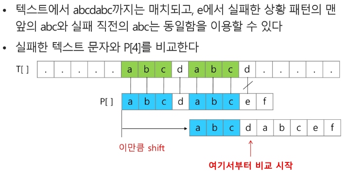
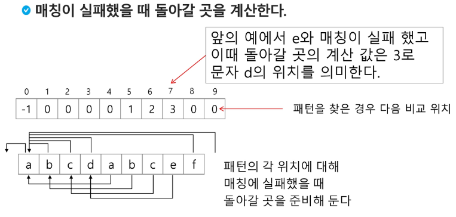
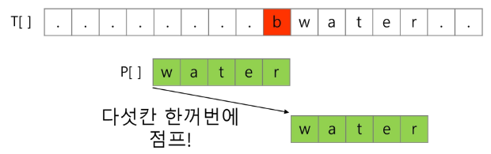
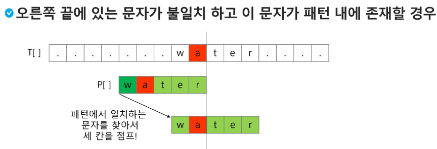
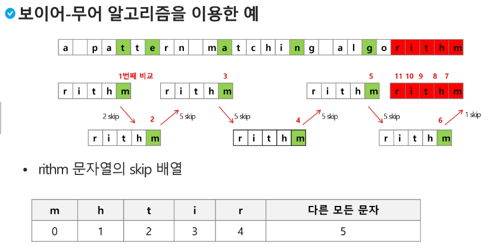

# APS
## 문자열
### 패턴매칭

- 고지식한 패턴 검색 알고리즘
- 카프-라빈 알고리즘
- KMP 알고리즘
- 보이어-무어 알고리즘

#### 고지식한 알고리즘(Brute Force)
- 본문 문자열을 처음부터 끝까지 차례대로 순회하면서 패턴내의 문자들을 일일이 비교하는 방식으로 동작
- 최악의 경우 시간 복잡도는 텍스트의 모든 위치에서 패턴을 비교해야 하므로 O(MN)이 된다. 
- (M : 찾을 패턴의 길이, N : 전체 텍스트의 길이)

```py

def Brute_Force(p,t):
    # 찾을 패턴의 길이
    M = len(p)
    # 전체 텍스트의 길이
    N = len(t)
    # p의 idx
    i = 0
    # t의 idx
    j = 0

    while i < M and j < N:
        # 같지 않다면 t는 시작점을 한 칸 뒤로, p는 맨앞으로,
        # 같으면 다음꺼 비교
        # (둘다 한 칸씩 이동해야하므로 코드 위치 주의!!!)
        if p[i] != t[j]:
            j -= i
            i = -1
        i += 1
        j += 1
    # 검색 성공 : p의 마지막 idx까지 확인
    if i == M:
        return j-M
    # 검색 실패
    else:
        return -1

# 찾을 패턴
p = 'is'
# 전체 텍스트
t = 'Python is funny!'

print(Brute_Force(p,t))
```

#### KMP 알고리즘

- 불일치가 발생한 텍스트 스트링의 앞부분에 어떤 문자가 있는지를 미 알고 있으므로, 불일치가 발생한 앞부분에 대하여 다시 비교하지 않고 매칭을 수행
- 패턴을 전처리하여 배열 next [M]을 구해서 잘못된 시작을 최소화함
- 전처리 : 원자료(raw data)를 데이터 분석 목적과 방법에 맞는 형태로 처리하기 위하여 불필요한 정보를 분리 제거하고 가공하기 위한 예비적인 조작.
- next [M] : 불일치가 발생했을 경우 이동할 다음 위치
- 시간 복잡도 : O(M+N)

    
    

```py
def kmp(t,p):
    # 패턴이 있는지 찾고자 하는 대상문자열 길이
    N = len(t)
    # 패턴의 길이
    M = len(p)

    # lps : Longest proper prefix which is also suffix
    # prefix : 접두사, suffix : 접미사, proper : 적절한
    lps = [0] * (M+1)
    #preprocessing : 전처리
    lps[0] = -1
    # 사전작업 : 매칭이 실패했을 때 패턴의 어느 인덱스로 돌아가야 하는지 계산
    # 일치한 개수를 저장하는 변수
    j = 0
    for i in range(1,M):
        # 어느 위치로 돌아가야 하는지 계산 : 앞쪽에 얼마나 많은 패턴이 맞았는가?
        # p[i] 이전에 일치한 개수
        lps[i] = j
        # 앞서서 패턴이 일치 했으면....j 증가
        if p[i] == p[j]:
            j += 1
        else:
            j = 0
    lps[M] = j

    print(lps)
    # ===============================

    # 패턴매칭 시작
    # Search
    # 비교할 텍스트 위치
    i = 0
    # 비교할 패턴 시작위치
    j = 0
    while i < N and j <= M:
        # 첫 글자가 불일치 했거나 or 일치하면
        if j == -1 or t[i] == p[j]:
            i += 1
            j += 1
        # 불일치
        else:
            # shift 찾기
            j = lps[j]
        # 패턴을 찾을 경우
        if j == M:
            # 패턴의 인덱스 출력
            return i-M
    return -1
# 예제1
t1 = 'zzzabcdabcdabcdf'
p1 = 'abcdabcdf'
# arr = [0,a,b,c,d,a,b,c,d,f]
# [-1,0,0,0,0,1,2,3,4,0]
# arr[5]의 a는 arr[1]의 a와 같으므로 인덱스 1로 이동
# t의 idx가 7일때 패턴 나타남
print(kmp(t1,p1))
# [-1, 0, 0, 0, 0, 1, 2, 3, 4, 0]
# 7

# 예제2
t2 = 'abcde'
p2 = 'cdd'
print(kmp(t2,p2))
# 패턴 나타나지 않음
# [-1, 0, 0, 0]
# -1
```

#### 보이어-무어 알고리즘

- 오른쪽에서 왼쪽으로 비교
    1. 패턴에 오른쪽 끝에 있는 문자가 불일치 + 이 문자가 패턴 내에 존재하지 않는 경우

    > 이동 거리 = 패턴의 길이

    

    2. 패턴의 오른쪽 끝에 있는 문자가 불일치 + 이 문자가 패턴 내에 존재할 경우
    > 이동 거리 = (패턴의 길이 - ((패턴 내에 존재하는 이 문자의 위치 index) +1))

    water의 이동 거리)
    
    w : 4, a : 3, t : 2, e : 1, r : 0

    

    

#### XOR (배타적 논리합:Exclusive-or)

- 같으면 0, 다르면 1 
