# Tree
## 트리 1
### 트리

- 비선형 구조
- 원소들 간에 1:n 관계를 가지는 자료구조
- 원소들 간에 계층관계를 가지는 계층형 자료구조
- 상위 원소에서 하위 원소로 내려가면서 확장되는 트리(나무)모양의 구조

- 한 개 이상의 노드로 이루어진 유한 집합이며 다음 조건을 만족한다.
    - 노드 중 최상위 노드를 루트(root)라 한다.
    - 나머지 노드들은 n(>=0)개의 분리 집합 T1,,,,Tn으로 분리될 수 있다.

- 이들 T1,,,,Tn은 각각 하나의 트리가 되며(재귀적 정의) 루트의 부 트리(subtree)라 한다.

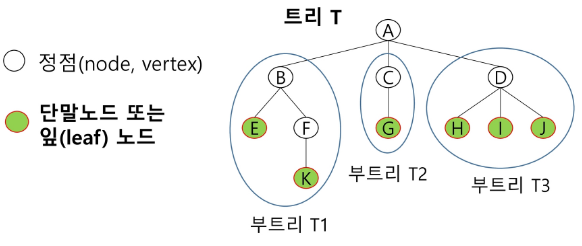

#### 노드

- 노드 - 트리의 원소
    - 트리 T의 노드 - A, B, C, D, E, F, G, H, I, J, K
- 간선 - 노드를 연결하는 선. 부모 노드와 자식 노드를 연결
- 루트 노드 - 트리의 시작 노드
    - 트리 T의 루트노드 - A
- 형제 노드 - 같은 부모 노드의 자식 노드들
    - B, C, D 는 형제 노드
- 조상 노드 - 간선을 따라 루트 노드까지 이르는 경로에 있는 모든 노드들
    - K의 조상 노드: F, B, A
- 서브 트리 (subtree) - 부모 노드와 연결된 간선을 끊었을 때 생성되는 트리
- 자손 노드 - 서브 트리에 있는 하위 레벨의 노드듣ㄹ
    - B의 자손 노드 - E, F, K

#### 차수

- 노드의 차수: 노드에 연결된 자식 노드의 수
    - B의 차수 = 2, C의 차수 = 1
- 트리의 차수: 트리에 있는 노드의 차수 중에서 가장 큰 값
    - 트리 T의 차수 = 3
- 단말 노드(리프 노드): 차수가 0인 노드. 자식 노드가 없는 노드

#### 높이

- 노드의 높이: 루트에서 노드에 이르는 간선의 수. 노드의 레벨
    - B의 높이 = 1, F의 높이 = 2
- 트리의 높이: 트리에 있는 노드의 높이 중에서 가장 큰 값. 최대 레벨
    - 트리 T의 높이 = 3

> 트리는 형제들끼리 연결할 수 없음. 계층 구조임!!

### 이진트리

- 모든 노드들이 2개의 서브트리를 갖는 특별한 형태의 트리
- **각 노드가 자식 노드를 최대한 2개** 까지만 가질 수 있는 트리
    - 왼쪽 자식 노드
    - 오른쪽 자식 노드

- 이진 트리의 예
    

- 레벨 i에서의 노드의 최대 개수는 2**i개
- 높이가 h인 이진 트리가 가질 수 있는 노드의 최소 개수는 (h+1)개가 되며, 최대 개수는 (2**(h+1)-1)개가 된다.
    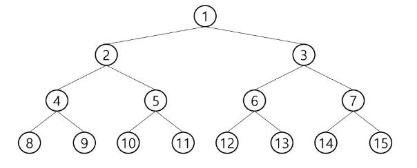

#### 포화 이진 트리 (Full Binary Tree)

- 모든 레벨에 노드가 포화상태로 차 있는 이진 트리
- 높이가 h일때, 최대의 노드 개수인 (2**(h+1)-1)의 노드를 가진 이진 트리
    - 높이 3일때 15개의 노드
- 루트를 1번으로 하여 2**(h+1)-1까지 정해진 위치에 대한 노드 번호를 가짐

#### 완전 이진 트리 (Complete Binary Tree)

- 높이가 h이고 노드 수가 n개일 때 **(단 2^h <= n <= 2^(h+1)-1)**, 포화 이진 트리의 노드 번호 1번부터 n번까지 빈 자리가 없는 이진 트리
- 예) 노드가 10개인 완전 이진 트리
    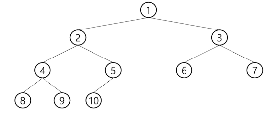

#### 편향 이진 트리 (Skewed Binary Tree)

- 높이 h에 대한 최소 개수의 노드를 가지면서 한쪽 방향의 자식 노드만을 가진 이진 트리
    - 왼쪽 편향 이진 트리
    - 오른쪽 편향 이진 트리
    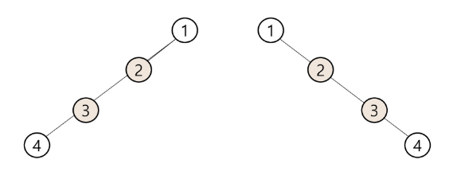

### 순회

- 순회란 트리의 각 노드를 중복되지 않게 전부 방문하는 것을 말하는데 트리는 비 선형 구조이기 때문에 선형구조에서와 같이 선후 연결 관계를 알 수 없다.

- 순회: 트리의 노드를 체계적으로 방문하는 것

- 3가지의 기본적인 순회방법
    1. 전위순회: VLR
    - 부모노드 방문 후, 자식노드를 좌,우 순서로 방문한다.
    2. 중위순회: LVR
    - 왼쪽 자식노드, 부모노드, 오른쪽 자식노드 순으로 방문한다.
    3. 후위 순회: LRV
    - 자식노드를 좌우 순서로 방문한 후, 부모노드로 방문한다.
    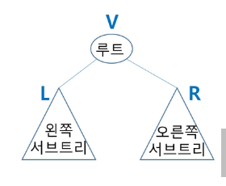

1. 전위 순회
    - 수행 방법
    1) 현재 노드 n을 방문하여 처리한다. -> V
    2) 현재 노드 n의 왼쪽 서브트리로 이동한다. -> L
    3) 현재 노드 n의 오른쪽 서브트리로 이동한다. -> R

    - 전위 순회 알고리즘
    ```py
    def preorder_traverse(T):
        if T:  # T is not None
            visit(T)  # print(T.item)
            preorder_traverse(T.left)
            preorder_traverse(T.right)
    ```
    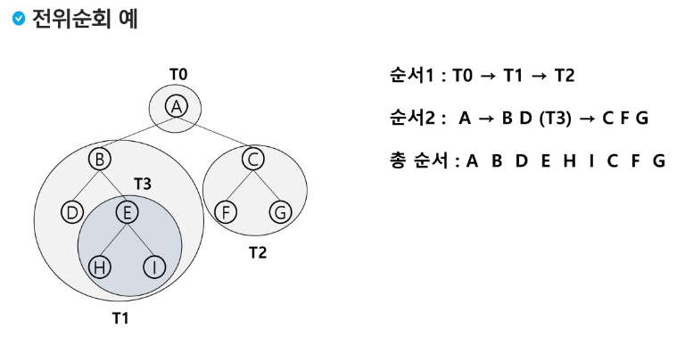

2. 중위 순회
    - 수행방법
    1) 현재 노드 n의 왼쪽 서브트리로 이동한다. -> L
    2) 현재 노드 n을 방문하여 처리한다. -> V
    3) 현재 노드 n의 오른쪽 서브트리로 이동한다. -> R

    - 중위 순회 알고리즘
    ```py
    def inorder_traverse(T):
        if T:
            inorder_traverse(T.left)
            visit(T)
            inorder_traverse(T.right)
    ```
    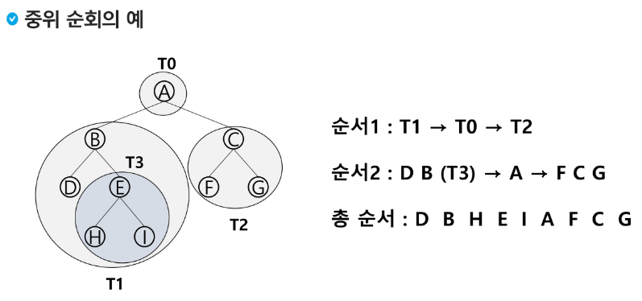

3. 후위 순회
    - 수행방법
    1) 현재 노드 n의 왼쪽 서브트리로 이동한다. -> L
    2) 현재 노드 n의 오른쪽 서브트리로 이동한다. -> R
    3) 현재 노드 n을 방문하여 처리한다. -> V

    - 후위 순회 알고리즘
    ```py
    def postorder_traverse(T):
        if T:
            postorder_traverse(T.left)
            postorder_traverse(T.right)
            visit(T)
    ```
    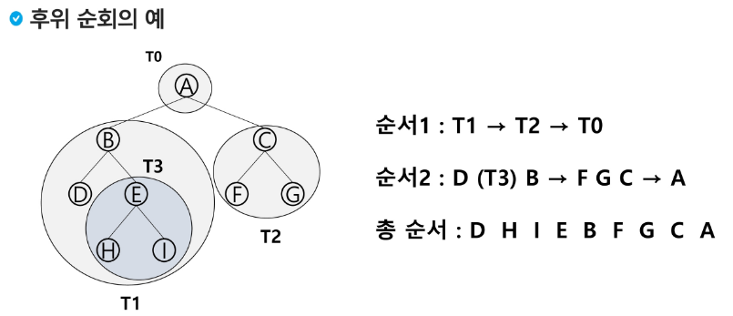

> 예제

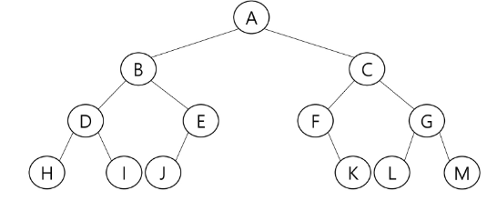

- 전위: ABDHIEJCFKGLM
- 중위: HDIBJEAFKCLGM
- 후위: HIDJEBKFLMGCA

### 이진 트리의 표현

- 배열을 이용한 이진 트리의 표현

    - 노드 번호를 배열의 인덱스로 사용
    - 이진 트리에 각 노드 번호를 다음과 같이 부여
    - 루트의 번호를 1로 함
    - 레벨 n에 있는 노드에 대하여 왼쪽부터 오른쪽으로 2^n 부터 2^(n+1)-1 까지 번호를 차례로 부여
    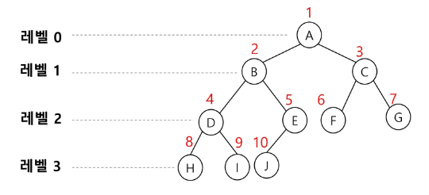
    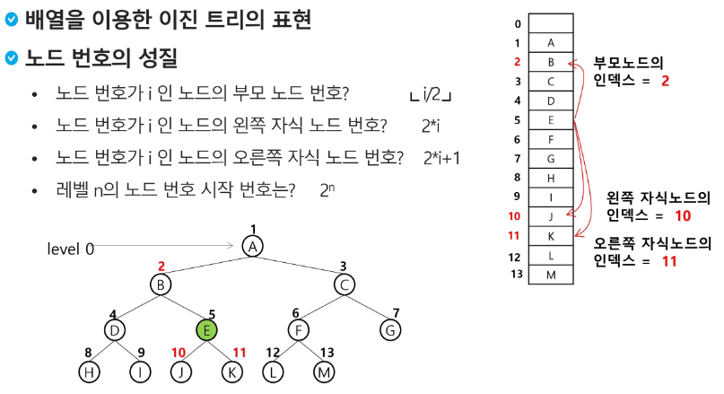

> 실제로 잘 사용되지 않음. 레벨이 높고 편향트리라면 빈공간 너무 차지하게됨

- 부모 번호를 인덱스로 자식 번호를 저장

    - 왼쪽, 오른쪽 나누어 다른 리스트에 저장
    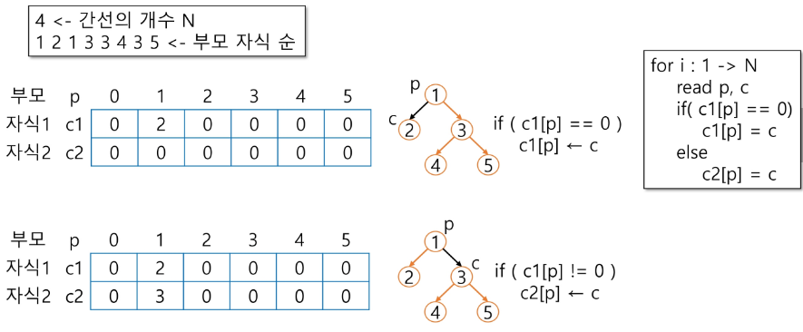

- 자식 번호를 인덱스로 부모 번호를 저장
    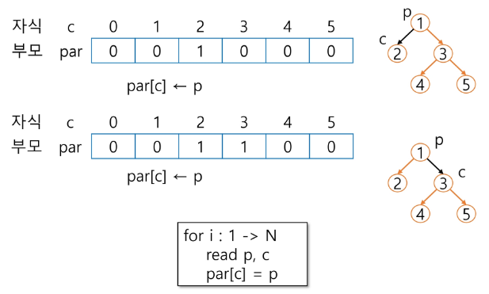

> 부모 리스트 따로 두면 root를 찾아갈 수 있음
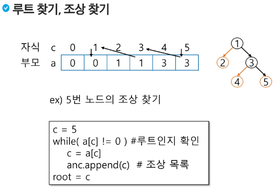

**<배열을 이용한 이진 트리 표현의 단점>**
    - 편향 이진 트리의 경우에 사용하지 않는 배열 원소에 대한 메모리 공간 낭비 발생
    - 트리의 중간에 새로운 노드를 삽입하거나 기존의 노드를 삭제할 경우 배열의 크기 변경 어려워 비효율적

#### 연결리스트 - 정석적인 version

- 배열을 이용한 이진 트리의 표현의 단점을 보완하기 위해 연결리스트를 이용하여 트리를 표현할 수 있다.

- 연결 자료구조를 이용한 이진트리의 표현 
    - 이진 트리의 모든 노드는 최대 2개의 자식 노드를 가지므로 일정한 구조의 단순 연결 리스트 노드를 사용하여 구현
    

#### 수식트리

- 수식을 표현하는 이진 트리
- 연산자는 루트노드이거나 가지노드
- 피연산자는 모두 잎 노드
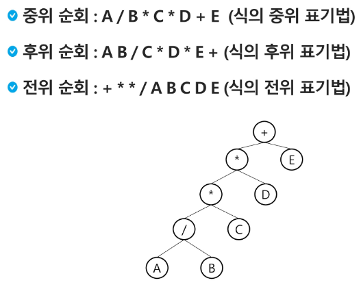

