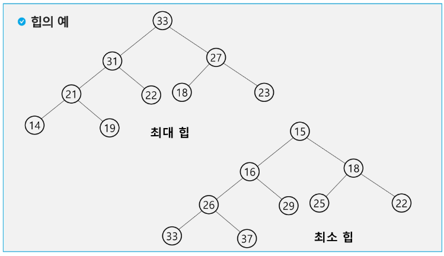
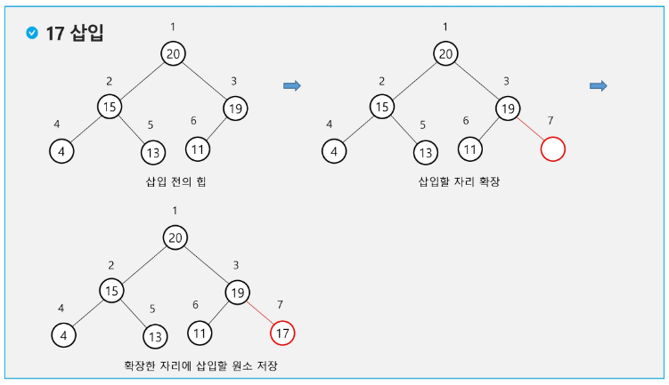
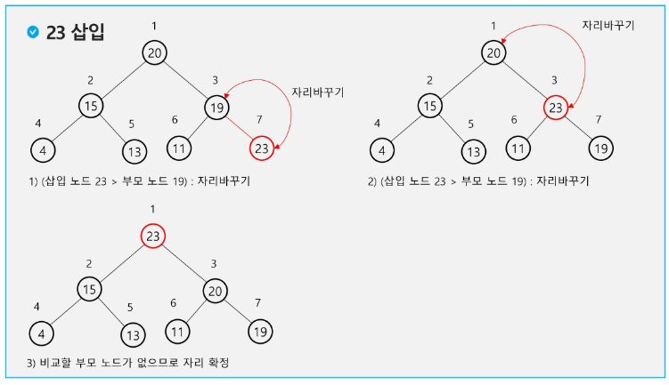
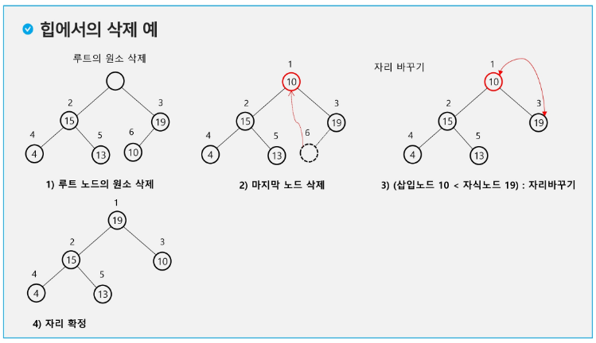

# tree
## heap 힙

- 완전 이진 트리에 있는 노드 중에서 키값이 가장 큰 노드나 키값이 가장 작은 노드를 찾기 위해서 만든 자료구조

- **힙의 키를 우선순위로 활용하여 우선순위 큐를 구현할 수 있다.**

- 최대 힙
    - 키값이 가장 큰 노드를 찾기 위한 완전 이진 트리
    - 부모노드의 키값 > 자식노드의 키값
    - 루트 노드: 키값이 가장 큰 노드

- 최소 힙
    - 키값이 가장 작은 노드를 찾기 위한 완전 이진 트리
    - 부모노드의 키값 < 자식노드의 키값
    - 루트 노드: 키값이 가장 작은 노드

### 힙연산

#### 삽입

1. 일단 맨 뒤에 삽입
2. 내 위치를 찾아감
    - 부모랑 크기 비교 -> 자리 바꾸기

<시간복잡도> - O(logN)
- 만약 N 개의 데이터를 힙으로 만든다면 - O(NlogN)

#### 삭제

- 힙에서는 루트 노드의 원소만을 삭제할 수 있다.
- 루트 노드의 원소를 삭제하여 반환한다.
- 힙의 종류에 따라 최대값 또는 최소값을 구할 수 있다.

1. 마지막 노드 삭제하고
2. 부모랑 크기 비교해서 자리 바꾸기

<시간복잡도> - O(logN)