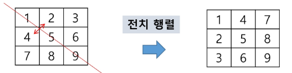
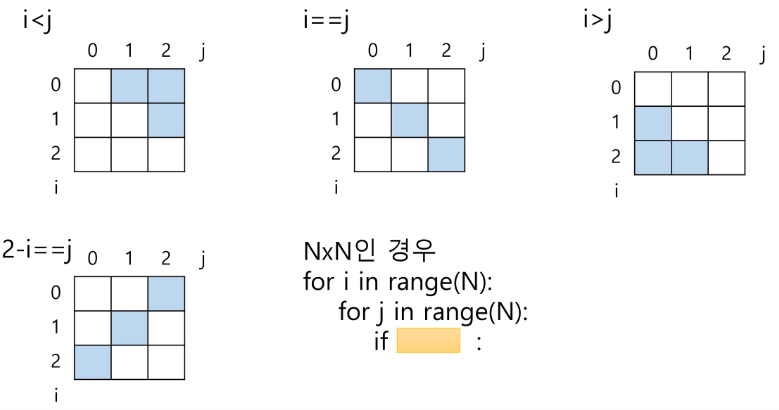
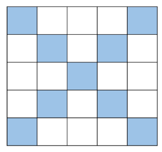
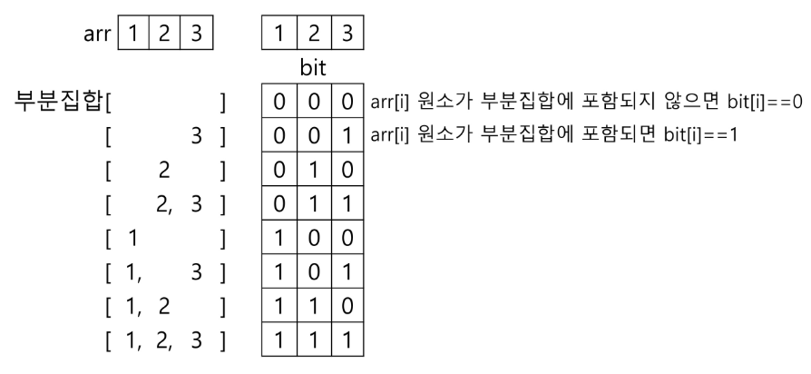

# APS
## 알고리즘

- 유한한 단계를 통해 **문제를 해결하기 위한 절차나 방법**이다.
- 주로 컴퓨터용어로 쓰이며, 컴퓨터가 어떤 일을 수행하기 위한 단계적 방법
- 어떠한 문제를 해결하기 위한 절차

- 컴퓨터 분야에서 알고리즘을 표현하는 방법은 크게 두 가지
    - 의사코드(슈도코드, pseudocode)와 순서도
    

## 알고리즘의 성능

- APS 과정의 목표 중의 하나는 보다 좋은 알고리즘을 이해하고 활용하는 것이다.

- 무엇이 좋은 알고리즘인가?
    - 정확성 : 얼마나 정확하게 동작하는가
    - 작업량 : 얼마나 적은 연산으로 원하는 결과를 얻어내는가
    - 메모리 사용량 : 얼마나 적은 메모리를 사용하는가
    - 단순성 : 얼마나 단순한가
    - 최적성 : 더 이상 개선할 여지없이 최적화되었는가

- 많은 문제에서 성능 분석의 기준으로 알고리즘의 작업량을 비교한다.

- 알고리즘의 작업량을 표현할 때 시간 복잡도로 표현한다.

### 시간 복잡도 

- 시간 복잡도
    - 실제 걸리는 시간을 측정
    - 실행되는 명령문의 개수를 계산

- 빅-오 표기법
    - 빅-오 표기법
    - 시간 복잡도 함수 중에서 가장 큰 영향력을 주는 n에 대한 항만을 표시
    - 계수(coefficient)는 생략하여 표시
    
    - n개의 데이터를 입력 받아 저장한 후 각 데이터에 1씩 증가시킨 후 각 데이터를 화면에 출력하는 알고리즘의 시간복잡도는?  ->  **O(n)**

### 다양한 시간 복잡도의 비교
- 요소 수가 증가함에 따라 각기 다른 시간복잡도의 알고리즘은 아래와 같은 연산 수를 보인다.

    

## 배열

- 일정한 자료형의 변수들을 하나의 이름으로 열거하여 사용하는 자료구조
- 6개의 변수를 사용해야 하는 경우, 이를 배열로 바꾸어 사용하는 예
    

### 배열의 필요성

- 프로그램 내에서 여러개의 변수가 필요할 때, 일일이 다른 변수명을 이용하여 자료에 접근하는 것은 매우 비효율적일 수 있다.
- 배열을 사용하면 하나의 선언을 통해서 둘 이상의 변수를 선언할 수 있다.
- 단순히 다순의 변수 선언을 의미하는 것이 아니라, 다수의 변수로는 하기 힘든 작업을 배열을 활용해 쉽게 할 수 있다.

### 1차원 배열
- 별도의 선언 방법이 없으면 변수에 처음 값을 할당할 때 생성
- 이름: 프로그램에서 사용할 배열의 이름
    ```py
    Arr = list()
    Arr = []
    Arr = [1, 2, 3]
    Arr = [0] * 10

    Arr[0] = 10           # 배열 Arr의 0번 원소에 10을 저장하라
    Arr[idx] = 20         # 배열 Arr의 idx번 원소에 20을 저장하라
    ```
- 입력받은 정수를 1차원 배열에 저장하는 방법
    ```py
    # 첫 줄에 양수의 개수 N이 주어진다. (5 <= N <= 1000)
    N = int(input())
    
    # 다음 줄에 빈칸으로 구분된 N개의 양수 Ai가 주어진다. (1 <= Ai <= 1000000)
    arr = list(map(int, input().split()))  # split() << 이거로 쓰기 ' '쓰지 말기
    ```

### 연습문제

Q. N개의 양의 정수에서 가장 큰 수와 가장 작은 수의 차이를 출력하라.

[입력]
첫 줄에 테스트 케이스의 수 T가 주어진다. (1 <= T <= 50)
각 케이스의 첫 줄에 양수의 개수 N이 주어진다. (5 <= N <= 1000)
다음 줄에 N개의 양수 ai가 주어진다. (1 <= ai <= 1000000)

[출력]
각 줄마다 "#T" (T는 테스트 케이스 번호)를 출력한 뒤, 답을 출력한다.

```py
T = int(input())
for test_case in list(map(int, input().splitlines())):


```
Q. 상자 값 차이 최대인 수 

```py

```

## 정렬

- 2개 이상의 자료를 특정 기준에 의해 작은 값 부터 큰 값(오름차순 : ascending), 혹은 그 반대의 순서대로 (내림차순 : descending) 재배열 하는 것
- 키
    - 자료를 정렬하는 기준이 되는 특정 값

- 대표적인 정렬 방식의 종류
    - 버블 정렬
    - 카운팅 정렬
    - 선택 정렬
    - 퀵 정렬
    - 삽입 정렬
    - 병합 정렬

### 버블 정렬
- 인접한 두 개의 원소를 비교하며 자리를 계속 교환하는 방식

- 정렬 과정
    - 첫 번째 원소부터 인접한 원소끼리 계속 자리를 교환하면서 맨 마지막 자리까지 이동한다.
    - 한 단계가 끝나면 가장 큰 원소가 마지막 자리로 정렬된다.
    - 교환하며 자리를 이동하는 모습이 물 위에 올라오는 거품 모양과 같다고 하여 버블 정렬이라고 한다.

- 시간 복잡도
    - O(n**2)

- 예시
    - [55, 7, 78, 12, 42]를 버블 정렬하는 과정(오름차순)
        
        - 첫 번째 패스 : 기준 index 0 -> N-2
        - 두 번째 패스 : 기준 index 0 -> N-3
        - ... 이어서 하다가 남은 원소가 2개 일 때 까지 반복

        ```py
        def BubbleSort(a, N):             # 정렬할 배열과 배열의 크기
            for i in range(N-1, 0, -1):   # 정렬할 구간의 끝. 범위의 끝 위치
                for j in range(0, i):     # 비교할 원소 중 왼쪽 원소의 인덱스
                    if a[j] > a[j+1]:     # 왼쪽 원소가 더 크면
                        a[j], a[j+1] = a[j+1], a[j]  # 오른쪽 원소와 교환
        ```

### 카운팅 정렬

- 항목들의 순서를 결정하기 위해 집합에 각 항목이 몇 개씩 있는지 세는 작업을 하여, 선형 시간에 정렬하는 효율적인 알고리즘
- 0 ~ 100만 정도 숫자가 있을 때 까지만 사용하는게 좋음

- 제한 사항
    - 정수나 정수로 표현할 수 있는 자료에 대해서만 적용 가능: 각 항목의 발생 회수를 기록하기 위해, 정수 항목으로 인덱스 되는 카운트들의 배열을 사용하기 때문이다.
    - 카운트들을 위한 충분한 공간을 할당하려면 집합 내의 가장 큰 정수를 알아야 한다.

- 시간 복잡도 
    - O(n+k) : n은 리스트 길이, k는 정수의 최대값

- 카운팅 정렬 과정
    - 수도코드, 접근
    ```py
    data = [0, 4, 1, 3, 1, 2, 4, 1] 

    # 0부터 4까지의 개수를 저장하는 리스트 생성
    counts = [0] * 5

    # data를 돌다가 인덱스가 원소인 값을 만나면 카운트 개수 1씩 올려줌
    #counts[0] += 1
    
    for x in data:
        counts[x] += 1

    # counts 리스트에 갯수를 모두 저장했다면
    # counts[i]까지 들어있는 갯수를 누적해볼 수 있음
    for i in range(1, N-1): 

    # i 까지의 누적 개수
        counts[i] = counts[i-1] + counts[i] 

    # N개의 길이를 가진 temp 리스트 생성, 정렬된 데이터 입력예정
    temp = [0] * N
    
    # data의 가장 마지막 원소부터 차례로 이동
    for j in range(N, 0, -1):

        temp_idx = counts[data[j]] - 1
        temp[temp_idx] = data[j]
    ```
    - 정리코드
    ```py
    def Counting_Sort(data, temp, k)
    data = [0,4,1,3,1,2,4,1] # 입력 배열 
    N = len(data)

    # 0부터 K까지 카운트할 리스트
    counts = [0] * (4+1)
    temp = [0] * N

    # 1단계 : data 원소 별 개수 세기
    for x in data:
        counts[x] += 1

    # 2단계 : 각 숫자까지의 누적개수 구하기
    # count[1] ~ count[4] 까지의 누적개수
    for i in range(1, 4+1):
        counts[i] += counts[i-1]

    # 3단계 : data의 맨 뒤부터 temp에 자리잡기
    for j in range(N-1, -1, -1):
        counts[data[j]] -= 1
        temp[counts[data[j]]] = data[j]
    ```

### 정렬 알고리즘 비교

- 정렬 끼리의 시간 비교
    

## Baby-gin Game

- 0~9 사이의 숫자 카드에서 임의의 카드 6장을 뽑았을 때, 3장의 카드가 연속적인 번호를 갖는 경우를 run이라 하고, 3장의 카드가 동일한 번호를 갖는 경우를 tripet 이라고 한다.
- 그리고 6장의 카드가 run과 triplet로만 구성된 경우를 baby-gin으로 부른다.

- 6자리의 숫자를 입력받아 baby-gin 여부를 판단하는 프로그램을 작성하라.

- 입력 예
    - 667767은 두개의 triplet으로 baby-gin 이다. (666, 777)
    - 054060은 한개의 run과 한개의 triplet이므로 역시 baby-gin이다.(456, 000)
    - 101123은 한 개의 triplet가 존재하나, 023이 run이 아니므로 baby-gin이 아니다.

### 완전 검색
- 완전 검색 방법은 문제의 해법으로 생각할 수 있는 모든 경우의 수를 나열해보고 확인하는 기법

- Brute-force 혹은 generate-and-test 기법이라고도 불리운다.
- 모든 경우의 수를 테스트한 후, 최종 해법을 도출한다.
- 일반적으로 경우의 수가 상대적으로 작을 때 유용하다.
- 모든 경우의 수를 생성하고 테스트하기 때문에 수행 속도는 느리지만, 해답을 찾아내지 못할 확률이 작다.
- 자격검정평가 등에서 주어진 문제를 풀 때, 우선 완전 검색으로 접근하여 해답을 도출한 후, 성능 개선을 위해 다른 알고리즘을 사용하고 해답을 확인하는 것이 바람직

### 완전 검색을 활용한 Baby-gin 접근
- 고려할 수 있는 모든 경우의 수 생성하기

    - 6개의 숫자로 만들 수 있는 모든 숫자 나열(중복 포함)
    - 예) 입력으로 [2, 3, 5, 7, 7, 7]을 받았을 경우, 아래와 같이 순열을 생성할 수 있다.
- 해답테스트하기
    - 앞의 3자리와 뒤의 3자리를 잘라, run와 triplet여부를 테스트하고 최종적으로 baby-gin을 판단한다.

### 순열
- 서로 다른 것들 중 몇개를 뽑아서 한줄로 나열하는 것
- 서로 다른 n개 중 r개를 택하는 순열은 아래와 같이 표현한다.
    - nPr
- 그리고 nPr은 다음과 같은 식이 성립한다.
    - nPr = n * (n-1) * (n-2) * ... * (n-r+1) 
- nPn = n! 이라고 표기하며 Factorial이라 부른다.
    - n! = n * (n-1) * (n-2) * ... * 2 * 1

- 예) {1, 2, 3}을 포함하는 모든 순열을 생성하는 함수
    - 동일한 숫자가 포함되지 않았을 때, 각 자리 수 별로 loop을 이용해 아래와 같이 구현
    ```py
    for i1 in range(1,4):
        for i2 in range(1,4):
            if i2 != i1:
                for i3 in range(1,4):
                    if i3 != i1 and i3 != i2:
                        print(i1, i2, i3)
    ```

### 탐욕(Greedy) 알고리즘
- 탐욕 알고리즘은 최적해를 구하는데 사용되는 근시안적인 방법
- 여러 경우 중 하나를 결정해야 할 때마다 그 순간에 최적이라고 생각되는 것을 선택해 나가는 방식으로 진행하여 최종적인 해답에 도달한다.
- 각 선택의 시점에서 이루어지는 결정은 지역적으로는 최적이지만, 그 선택들을 계속 수집하여 최종적인 해답을 만들었다고 하여, 그것이 최적이라는 보장은 없다.
- 일반적으로, 머릿속에 떠오르는 생각을 검증 없이 바로 구현하면 Greedy 접근이 된다.

- 탐욕 알고리즘의 동작 과정
    1. 해 선택: 현재 상태에서 부분 문제의 최적 해를 구한 뒤, 이를 부분해 집합(solution set)에 추가한다.
    2. 실행 가능성 검사: 새로운 부분해 집합이 실행 가능한지를 확인한다.
    곧, 문제의 제약조건을 위반하지 않는지를 검사한다.
    3. 해 검사: 새로운 부분해 집합이 문제의 해가 되는지를 확인한다.
    아직 전체 문제의 해가 완성되지 않았다면 1)의 해 선택부터 다시 시작한다.

#### 거스름돈 줄이기
- 어떻게 하면 손님에게 거스름돈으로 주는 지폐와 동전의 개수를 최소한으로 줄일 수 있을까?

    1. 해 선택: 가장 좋은 해 선택. 단위가 큰 동전으로만 거스름돈을 만들면 동전의 개수가 줄어들으므로 현재 고를 수 있는 가장 단위가 큰 동전을 하나 골라 거스름돈에 추가한다.
    2. 실행 가능성 검사: 거스름돈이 손님에게 내드려야 할 액수를 초과하는지 확인. 초과한다면 마지막에 추가한 동전을 거스름 돈에서 빼고, 1)로 돌아가서 현재보다 한 단계 작은 단위의 동전 추가
    3. 해 검사: 거스름돈 문제의 해는 당연히 거스름돈이 손님에게 내드려야 하는 액수와 일치해야함.
    거스름돈 확인해서 액수에 무자라면 다시 1)로 돌아가서 거스름돈에 추가할 동전을 고른다.

- baby-gin을 완전 검색 아닌 방법으로 풀어보자
    - 6개의 숫자는 6자리의 정수 값으로 입력
    - counts 배열의 각 원소를 체크하여 run과 triplet 및 baby-gin 여부를 판단한다.

- 풀이
    - run : 3개 연속으로 1이상
    - run 데이터 1개씩 완전 삭제
    - i , i+1, i+2 >= 1 : -1
    - 하지만 아래 333456 과 같은 경우 때문에 안됨
    

    - triplet 조사 후 triplet 데이터 완전 삭제 
    

- 순열로 구현 예
    ```py
    num = 456789 # baby gin 확인할 6자리 수
    c = [0] * 12 # 6자리 수로부터 각 자리 수를 추출하여 개수를 누적할 리스트

    for i in range(6):
        # 10으로 나눠준 나머지는 1의 자리 수, 마지막 자리
        c[num % 10] += 1 # c의 인덱스 9에 개수 1개 카운트하고 일의 자리수 숫자 없애기
        num //=10
    
    i = 0 
    tri = tun =0
    while i < 10:
        if c[i] >= 3: # triplet 조사 후 데이터 삭제
            c[i] -= 3
            tri += 1
            continue
        if c[i] >= 1 and c[i+1] >= 1 and c[i+2] >= 1: # run 조사 후 삭제
            c[i] -= 1
            c[i+1] -= 1
            c[i+2] -= 1
            run += 1
            continue
        i += 1

    if run + tri == 2:
        print("Baby Gin")
    else:
        print("Lose")

    ```

