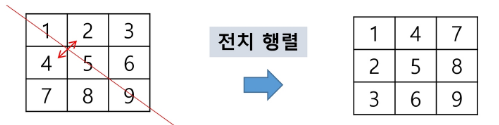
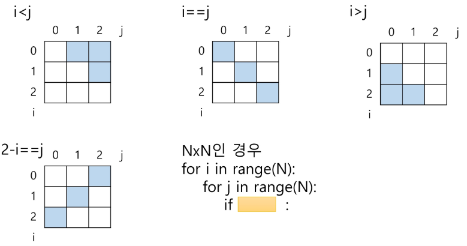
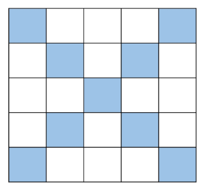

# APS
## 배열 2 (Array 2)
### 2차원 배열

#### 2차원 배열의 선언
- 1차원 List를 묶어놓은 List
- 2차원 이상의 다차원 List는 차원에 따라 index를 선언
- 2차원 List의 선언: 세로길이(행의 개수), 가로길이(열의 개수)를 필요로 함
- python에서는 데이터 초기화를 통해 변수선언과 초기화가 가능함

    arr = [[0, 1, 2, 3],[4, 5, 6, 7]] (2행 4열의 2차원 List)

        arr = | 0 | 1 | 2 | 3 |
              | 4 | 5 | 6 | 7 |

[참고]

```py
'''
3
1 2 3
4 5 6
7 8 9 
'''
N = int(input)
arr = [list(map(int, input().split())) for _ in range(N)]

arr = [[1,2,3], [4,5,6]]
print(len(arr))      # 2 , 행의 수
print(len(arr[0]))   # 3 , 열의 수

# 주의!! 이렇게 만들면 안됨
arr = [[0]*3]*2
print(arr)  # [[0,0,0],[0,0,0]]
arr[0][0] = 1
print(arr)  # [[1,0,0],[1,0,0]]
```

### 2차원 배열의 접근
#### 배열 순회
- n x m 배열의 ㅣn * m 개의 모든 원소를 빠짐없이 조사하는 방법

#### 행 우선 순회
```py
# i 행의 좌표
# j 열의 좌표
for i in range(n):
    for j in range(m):
        f(array[i][j]) # 필요한 연산 수행

# Q. 각 행의 합 중 최대 값은?
arr = [[2,1,1],[1,2,2]]
max_v = 0
for i in range(len(arr)):
    sum_v = 0
    for j in arr[i]:
        sum_v += j
    if max_v < sum_v:
        max_v = sum_v
print(max_v)
```

#### 열 우선 순회
```py
# i 행의 좌표
# j 행의 좌표

for j in range(m):
    for i in range(n):
        f(array[i][j])

# 열, 행 바꿔서 접근하려면
for i in range(n):
    for j in range(m):
        f(array[i][j])
        f(array[j][i])
```

#### 지그재그 순회

행이 짝수일 때 순서대로, 홀수일 때 역순대로

```py
for i in range(n): # 행은 그대로 증가
    for j in range(m): # 열은 왔다갔다
        # 행이 짝수면 나머지 0이어서 j만 남음
        # 행이 홀수면 나머지 1이고 m-1-j 를 만들어줘야함 
        f(array[i][j + (m-1-2*j) * (i % 2)] )  
```
#### 델타를 이용한 2차 배열 탐색
- 2차 배열의 한 좌표에서 4방향의 인접 배열 요소를 탐색하는 방법
- 인덱스 (i, j)인 칸의 상하좌우 칸 (ni, nj)
    

```py
arr[0...N-1][0...N-1] # NxN 배열
di = [0 , 1, 0, -1]
dj = [1, 0, -1, 0]
for i in range(0, N-1):
    for j in range(0, N-1):
        for k in range(4):
            ni = i + di[k]
            nj = j + dj[k]
            if 0 <= ni < N and 0 <= nj < N:
                f(arr[ni][nj]) 
```
#### 전치 행렬
```py
# i : 행의 좌표, len(arr)
# j : 열의 좌표, len(arr[0])

arr = [[1, 2, 3],[4, 5, 6],[7, 8, 9]] # 3,3 행렬

for i in range(3):
    for j in range(3):
        if i < j:
            arr[i][j], arr[j][i] = arr[j][i], arr[i][j]
```


- i, j 의 크기에 따라 접근하는 원소 비교
    

#### 연습문제 1-1

- 5x5 2차원 배열에 25개의 숫자를 저장하고
- 대각선 원소의 합을 구하시오. 대각선 원소는 다음과 같은 위치의 원소를 나타낸다.
    

#### 연습문제 1-2

```py
N = int(input())
arr = [list(map(int, input().split())) for _ in range(N)]

di = [0, 1, 0, -1]
dj = [1, 0, -1, 0]

# ni - i, nj - j -> abs 처리
total = 0
for i in range(N):
    for j in range(N):
        sum_v = 0
        for k in range(4):
            ni = i+di[k]
            nj = j+dj[k]
            if 0 <= ni < N and 0 <= nj < N:
                sum_v += abs(arr[i][j] - arr[ni][nj])
        total += sum_v
```
## 부분집합
### 부분집합 합 문제
- 유한 개의 정수로 이루어진 집합이 있을 때, 이 집합의 부분집합 중에서 그 집합의 원소를 모두 더한 값이 0이 되는 경우가 있는지를 알아내는 문제
- 예를 들어, [-7, -3, -2, 5, 8]라는 집합이 있을 때, [-3, -2, 5]는 이 집합의 부분집합이면서 (-3)+(-2)+5=0 이므로 이 경우의 답은 참이 된다.

### 부분집합 생성하기
- 완전 검색 기법으로 부분집합 합 문제를 풀기 위해서는, 우선 집합의 모든 부분집합을 생성한 후에 각 부분집합의 합을 계산해야 한다.
- 주어진 집합의 부분집합을 생성하는 방법에 대해서 생각해보자

#### 부분집합의 수
- 집합의 원소가 n개일 때 , 공집합을 포함한 부분집합의 수는 2**n개 이다.
- 이는 각 원소를 부분집합에 포함시키거나 포함시키지 않는 2가지 경우를 모든 원소에 적용한 경우의 수와 같다.
- 예) {1, 2, 3, 4} -> 2 x 2 x 2 x 2 = 16가지
    

- 각 원소가 부분집합에 포함되었는지를 loop를 이용하여 확인하고 부분집합을 생성하는 방법
    ```py
    bit = [0, 0, 0, 0]
    for i in range(2):    
        bit[0] = i
        for j in range(2):
            bit[1] = j
            for k in range(2):
                bit[2] = k
                for l in range(2):
                    bit[3] = l
                    print_subset(bit)  # 생성된 부분집합 출력  
    ```

### 비트 연산자
- 비트 연산자
    - & : 비트 단위로 AND 연산을 한다.
    - | : 비트 단위로 OR 연산을 한다.
    - << : 피연산자의 비트 열을 왼쪽으로 이동시킨다. 
    - >> : 피연산자의 비트 열을 오른쪽으로 이동시킨다.

- << 연산자
    - 1 << n : 2**n 즉, 원소가 n개일 경우의 모든 부분집합의 수를 의미한다.

- & 연산자
    - i & (1<<j): i의 j번째 비트가 1인지 아닌지를 검사한다.

- 보다 간결하게 부분집합을 생성하는 방법
    ```py
    arr = [3, 6, 7, 1, 5, 4]
    n = len(arr)  # n: 원소의 개수

    for i in range(1<<n):
        for j in range(n):
            if i & (1<<j):
                print(arr[j], end=", ")
        print()
    print()
    ```