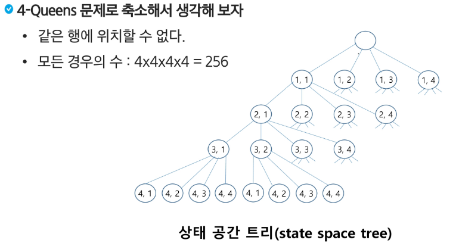

# 백트래킹 & 그래프(트리)
## 백트래킹

### 백트래킹 개념

- 여러가지 선택지들이 존재하는 상황에서 한가지를 선택한다.
- 선택이 이루어지면 새로운 선택지들의 집합이 생성된다
- 이런 선택을 반복하면서 최종상태에 도달한다.
  - 올바른 선택을 계속하면 목표상태에 도달한다.

#### 당첨 리프노드 찾기

- 루트에서 갈 수 있는 노드를 선택한다.
- 꽝 노드까지 도달하면 최근의 선택으로 되돌아와서 다시 시작한다.
- 더 이상의 선택지가 없다면 이전의 선택지로 돌아가서 다른 선택을 한다.
- 루트까지 돌아갔을 경우 더 이상 선택지가 없다면 찾는 답이 없다.

#### 백트래킹과 깊이 우선 탐색(DFS) 과의 차이

- 어떤 노드에서 출발하는 경로가 해결책으로 이어질 것 같지 않으면 더 이상 그 경로를 따라가지 않음으로써 시도의 횟수를 줄임(prunning 가지치기)
- 깊이 우선탐색이 모든 경로를 추적하는데 비해 백트래킹은 불필요한 경로를 조기에 차단
- 깊이 우선 탐색을 가하기에는 경우의 수가 너무나 많음. 즉 N! 가지의 경우의 수를 가진 문제에 대해 깊이 우선 탐색을 가하면 당연히 처리 불가능한 문제

- **백트래킹 알고리즘을 적용하면 일반적으로 경우의 수가 줄어들지만 이 역시 최악의 경우에는 여전히 지수함수 시간을 요하므로 처리 불가능**

#### 문제 제시: N-Queen 문제

- n x n 서양 장기판에서 배치한 Queen들이 서로 위협하지 않도록 n개의 Queen을 배치하는 문제
  - 어떤 두 Queen도 서로를 위협하지 않아야한다.
  - Queen을 배치한 n개의 위치는?

- 서로를 공격할 수 없도록 배치하는 모든 경우
- 후보 해의 수 : 64C8
- 실제 해의 수 : 92
- 44억개가 넘는 후보 해의 수 속에서 92개를 최대한 효율적으로 찾아내는 방법..



```py
checknode(node v)
  if promising(v)
    if there is a solution at v
      write the solution
    else
      for each child u of v
        checknode(u)
```

### 백트래킹 개념

- 루트 노드에서 리프 노드까지의 경로는 해답후보가 되는데, 깊이 우선 검색을 하여 그 해답후보 중에서 해답을 찾을 수 있다.
- 그러나 이 방법을 사용하면 해답이 될 가능성이 전혀 없는 노드의 후손 노드들도 모두 검색해야 하므로 비효율적이다.

- 모든 후보를 검사?
  - NO

#### 백트래킹 기법

  - 어떤 노드의 유망성을 점검한 후에 유망하지 않다고 결정되면 그 노드의 부모로 되돌아가 다음 자식 노드로 감
  - 어떤 노드를 방문하였을 때 그 노드를 포함한 경로가 해답이 될 수 없으면 그 노드는 유망하지 않다고 하며, 반대로 해답의 가능성이 있으면 유망하다고 한다.
  - 가지치기: 유망하지 않는 노드가 포함되는 경로는 더 이상 고려하지 않는다.

- 백트래킹을 이용한 알고리즘은 다음과 같은 절차로 진행된다.
  1. 상태 공간 트리의 깊이 우선 검색을 실시한다.
  2. 각 노드가 유망한지를 점검한다. 
    - **설계단계에서 유망하지 않는 경우를 생각하고 구현해야 한다**
  3. 만일 그 노드가 유망하지 않으면, 그 노드의 부모 노드로 돌아가서 검색을 계속한다.


  ## 트리

  - 트리는 싸이클이 없는 무향 연결 그래프이다.
    - 두 노드(or 정점) 사이에는 유일한 경로가 존재
    - 각 노드는 최대 하나의 부모 노드가 존재
    - 각 노드는 자식도느가 없거나 하나 이상이 존재할 수 있다.
  
  - 비선형 구조
    - 원소들 간에 1:n 관계를 가지는 자료구조
    - 원소들 간에 계층관계를 가지는 계층형 자료구조