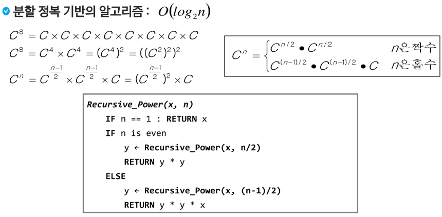
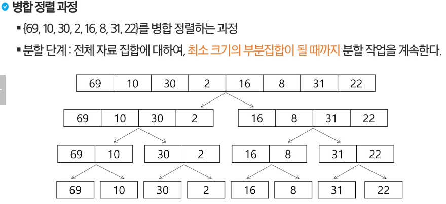
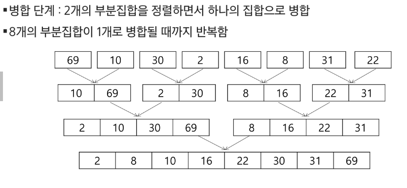

# 분할 정복
## 설계 전략

- 분할: 해결할 문제를 여러개의 작은 부분으로 나눈다.
- 정복: 나눈 작은 문제를 각각 해결한다.
- 통합: 해결된 해답을 모은다.

### 분할 정복 기법 예시 - 거듭 제곱

- 시간 복잡도 : O(log2n)

  

## 병합 정렬

- 여러 개의 정렬된 자료의 집합을 병합하여 한 개의 정렬된 집합으로 만드는 방식

- 분할 정복 알고리즘 활용
  - 자료를 최소 단위 문제까지 나눈 후에 차례대로 정렬하여 최종 결과를 얻어냄
  - top-down 방식

- 시간 복잡도 : O(nlogn)

  
  

## 퀵정렬

- 주어진 배열을 두 개로 분할하고, 각각을 정렬한다.
  - 병합 정렬과 동일?

> 병합 정렬은 그냥 두 부분으로 나누는 반면에, 퀵 정렬을 분할할 때, 기준 아이템 중심으로 분할한다. -> 기준보다 작은 건 왼편, 큰건 오른편에 위치

> 각 부분 정렬이 끝난 후, 병합정렬은 병합이란 후처리 작업이 필요하나, 퀵 정렬은 필요로 하지 않는다.

- 시간 복잡도
  - 평균적으로 O(nlogn) , 최악(이미 정렬 or 역순)일 때 n^2

### Partitioning

1. 작업영역을 정한다.
2. 작업영역 중 가장 왼쪽에 있는 수를 pivot 이라고 하자
3. pivot을 기준으로 왼쪽에는 pivot 보다 작은 수를 배치 (정렬안됨).
오른쪽에는 pivot 보다 큰 수를 배치(정렬안됨).

4. 파티셔닝 끝나고 pivot의 위치는 확정된다.
5. 왼쪽 또 반복
6. 오른쪽 또 반복

## 이진 검색

- 자료의 가운데에 있는 항목의 키 값과 비교하여 다음 검색의 위치를 결정하고 검색을 계속 진행하는 방법
  - 목적 키를 찾을 때까지 이진 검색을 순환적으로 반복 수행함으로써 검색 범위를 반으로 줄여가면서 보다 빠르게 검색을 수행함

- **이진 검색을 하기 위해서는 자료가 정렬된 상태여야한다.**

### 검색 과정

1. 자료의 중앙에 있는 원소를 고른다.
2. 중앙 원소의 값과 찾고자 하는 목표 값을 비교한다.
3. 목표 값이 중앙 원소의 값보다 작으면 자료의 왼쪽 반에 대해서 새로 검색을 수행하고, 크다면 자료의 오른쪽 반에 대해서 새로 검색을 수행한다.
4. 찾고자 하는 값을 찾을 때 까지 1~3의 과정을 반복한다.