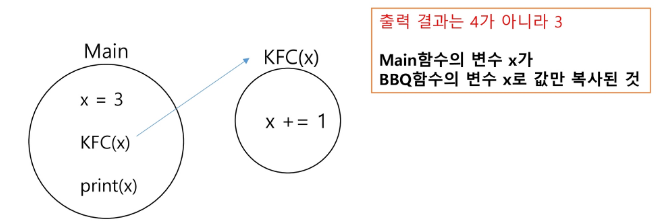
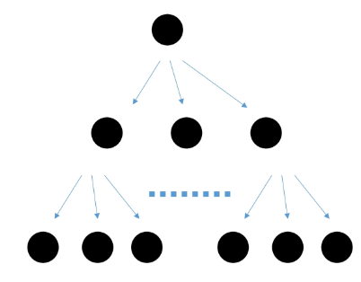

# 완전 검색
## 반복과 재귀

- 반복과 재귀는 유사한 작업을 수행할 수 있다.
- 반복은 수행하는 작업이 완료될 때 까지 계속 반복
  - 루프 (for, while 구조)
  - 반복문은 코드를 n번 반복시킬 수 있다.

- 재귀는 주어진 문제의 해를 구하기 위해 동일하면서 더 작은 문제의 해를 이용하는 방법
  - 하나의 큰 문제를 해결할 수 있는(해결하기 쉬운) 더 작은 문제로 쪼개고 결과들을 결합한다.
  - 재귀호출은 n중 반복문을 만들어낼 수 있다.

### 재귀를 연습하기 전, 알아야 할 함수의 특징 1

- KFC 함수 호출할 때, int 타입 객체를 전달하면 **값만 복사**가 된다.
  - 하지만 리스트 사용하면 값 갱신됨 (시퀀스 타입같이 주소값을 참조하는 타입만 갱신됨)
  - call by value, call by reference

- 아래 예시에서, main 함수의 x와, KFC 함수의 x는 서로 다른 객체이다.
  

```py
def KFC(x):
  print(x)    # 4
  x+= 1       
  print(x)    # 5

x = 3
KFC(x+1)
print(x)      # 3
```

### 재귀를 연습하기 전, 알아야 할 함수의 특징 2

- 함수가 끝나면, Main으로 되돌아 오는 것이 아니라, 해당 함수를 호출했던 곳으로 돌아온다.
- 무한 재귀 호출이면, 1000번 이상 깊게 들어가면 error

```py
def KFC(x):
  if x == 2:
    return
  print(x)
  KFC(x+1)
  print(x)

KFC(0)
print("끝")
```

- 재귀호출 공부의 시작은, 무한 재귀호출을 막는 것 부터 시작
- 기저조건 세우기

## 반복과 재귀

- KFC 함수 내부에 KFC(x+1) 재귀 호출 코드가 세개일 때,,


- 그림을 코드로 나타낼 수 있어야함

```py
def KFC(x):
  if x == 2:   # 2는 level, depth / 기저조건
    return

  # 경우의 수... for i in range(3): KFC(x+1)
  KFC(x+1)
  KFC(x+1)
  KFC(x+1)
  print(x)

KFC(0)  
```

```py 
def KFC(x):
  if x == 3:
    return

for in in range(4):
  KFC(x+1)

KFC(0)
```

## 순열

- 서로 다른 N개에서, R개를 **중복없이**, 순서를 고려하여 나열하는 것

### 중복 순열

- 서로 다른 N개에서, R개를 **중복을 허용**하과, 순서를 고려하여 나열하는 것

#### 구현 원리

1. **재귀 호출을 할 때 마다, 이동 경로를 흔적으로 남긴다.**
2. 가장 마지막 레벨에 도착했을 때, 이동 경로를 출력한다.(기저 조건을 만족했을 때)

```py
path = []

def KFC(x):
  if x == 2:    # 기저조건, 2개를 뽑음
    print(path)    # 출력해주고 되돌아가라
    return

  for i in range(3):   # 후보군 3가지 반복하면서 다음 재귀 호출
    path.append(i)     # path에 경로 기록해주기
    KFC(x+1)
    path.pop()         # 돌아와서 안 골랐던 곳으로 가기 위해서

KFC(0)
```

- 중복순열 [1,1,1] ~ [6,6,6] 까지 출력하는 코드 재귀로 구현

```py

path = []

def KFC(x):
  if len(path) == 3:  # 길이가 3이면..
    print(path)
    return

  for i in range(1, 7):
    path.append(i)
    KFC(i)
    path.pop()

KFC(1)
```

- 중복을 취급하지 않는 순열 구현 방법

  1. 중복 순열 코드를 작성한다.
  2. 중복을 제거하는 코드를 추가하면 순열 코드가 된다.

- 중복을 제거하는 원리

  - 전역 리스트를 사용하면 이미 선택했던 숫자인지 아닌지 구분할 수 있다.
  - 이를 used 배열 또는 visited 배열 이라고 한다.


## 완전 탐색 (Brute-Force)

- 모든 가능한 경우를 모두 시도를 해보아, 정답을 찾아 내는 알고리즘
- 서로 영향이 없는 독립적인 문제, 규칙 x 일 때 사용함

### 예시 문제

- 주사위 눈금의 합
- 연속 3장의 트럼프 카드
- 베이비 진
