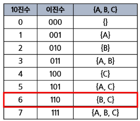

# 탐욕 알고리즘
## 부분 집합

- 집합에 포함된 원소들을 선택하는 것

- 부분 집합 예시
  - 오른쪽 표는 집합 {A, B, C} 로 만들 수 있는 부분집합의 예시이다.
  - 부분 집합에는 아무것도 선택하지 않은 경우도 집합에 포함된다.(공집합)
  - {} {A} {B} {C} {A B} {A C} {B C} {A B C}

### 구현 방법

#### 1. 완전탐색

  - 재귀호출을 이용한 완전탐색으로 부분 집합 구할 수 있음
  - 학습용으로 추천

```py
arr = {'O', 'X'}
path = []
name = ['MIN', 'CO', 'TIM']

def print_name():
  print('{', end = '')
  for i in range(3):
    if path[i] == 'O':
      print(name[i], end = ' ')
  print('}')

def run(lev):
  if lev == 3:
    print_name()
    return
  
  for i in range(2):
    path.append(arr[i])
    run(lev + 1)
    path.pop()

run(0)
```

#### 2. Binary Counting

- 2진수 & 비트연산을 이용하여, 부분집합을 구할 수 있다.
- 부분 집합이 필요할 때 사용하는 추천 방법
  - 원소 수에 해당하는 N개의 비트열을 이용한다.

<집합의 총 개수>

- 만들 수 있는 집합의 총 개수는 2^n 
- 2^n 은 1<<n 공식을 이용하여 빠르게 구할 수 있음



```py 
arr = ['A', 'B', 'C']
n = len(arr)

def get_sub(tar):
  for i in range(n):
    if tar & 0x1:
      print(arr[i], end = '')
      tar >>= 1                  

for tar in range(0, 1 << n) : # range(0,8) # 전체 부분집합을 확인하겠다.
  print('{', end = '')
  get_sub(tar)
  print('}')
```

## 조합

- 서로 다른 n개의 원소 중 r개를 순서 없이 골라낸 것

#### 순열과 조합 차이

- 순열: 5명 중 1,2,3등 뽑기
- 조합: 5명 중 3명 뽑기

### for 문으로 조합 구현하기

- 5명 중 3명 뽑는 조합은 3중 for문으로 구현 가능

```py
arr = ["A", "B", "C", "D", "E"]

for a in range(N):
  for b in range(a+1, N):
    for c in range(b+1, N):
      print(arr[a], arr[b], arr[c])
```

### 재귀 호출 사용

- n중 for로 구현 가능. 재귀호출 구현
- branch. 최대 5개, level. n

```py
arr = ["A", "B", "C", "D", "E"]
path = []

n = 3
def run(lev, start):
  if lev == n:
    print(path)
    return

  for i in range(start, 5):
    path.append(arr[i])
    run(lev + 1, i + 1)
    path.pop()

run(0, 0)
```

## 그리디

- 결정이 필요할 때, 현재 기준으로 가장 좋아보이는 선택지로 결정하여 답을 도축하는 알고리즘

#### 대표적인 문제 해결 기법

1. 완전 탐색 - 답이 될 수 있는 모든 경우 시도
2. 그리디 - 가장 좋아보이는 선택지로 결정
3. DP - 과거의 데이터 이용해 현재의 데이터 만들어냄
4. 분할정복 - 큰 문제를 작은 문제로 나누어 해결

### 그리디의 핵심 조건

1. 각 단계에서 최적해를 찾아야한다.
2. 단계의 결과들을 합하는 방법을 찾아야 한다.
3. 각 단계의 합 == 전체 문제의 합이라는 것을 증명해야 한다.

- 반례 찾는게 굉장히 힘듬 ㅠㅠ!
- 그리디랑 디피는 많이 풀어보는 수 밖에 없다 ㅠㅠ
- 손으로 완전탐색 같이 몇개 생각해보고 풀기

### 화장실 문제

- 대기시간의 누적합이 최소가 되는 방법
- 최솟값 부터 고려

**하나가 작업하고 있을 때 다른 사람한테 영향 주는 경우 - 대기, 순서**

### knapsack 문제

- 물건 0, 1개씩 존재하면 완전탐색, DP로 접근해야함.
- 물건을 원하는 만큼 자를 수 있으면 그리디로 풀기 가능

### 활동선택문제 (회의실 배정) 

- 종료시간이 빠른 순서대로 선택해주면 된다.
- 