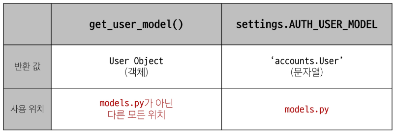

# Many to one relationships
## 모델 관계

한 테이블의 0개 이상의 레코드가 다른 테이블의 레코드 한 개와 관련된 관계

### Comment(N) - Article(1)
0개 이상의 댓글은 1개의 게시글에 작성될 수 있다.

- 테이블 관계
  

## 댓글 모델 정의

- ForeignKey 클래스의 인스턴스 이름은 **참조하는 모델 클래스 이름의 단수형**으로 작성하는 것을 권장
- 외래 키는 ForeignKey 클래스를 작성하는 위치와 관계없이 테이블의 마지막 필드로 생성됨

```py
class Comment(models.Model):
    # ForeignKey(상대 모델 클래스, 상대모델클래스가 삭제되었을때 댓글을 어떻게 처리할지)
    article = models.ForeignKey(Article, on_delete=models.CASCADE)
    content = models.CharField(max_length=200)
    created_at = models.DateTimeField(auto_now_add=True)
    updated_at = models.DateTimeField(auto_now=True)
```
### ForeignKey(to, on_delete)

- 한 모델이 다른 모델을 참조하는 관계를 설정하는 필드

> N:1 관계 구현
> 데이터베이스에서 외래 키로 구현

- to
  - 참조하는 모델 class 이름

- on_delete
  - 외래 키가 참조하는 객체(1)가 사라졌을 때, 외래키를 가진 객체(N)를 어떻게 처리할 지 정의하는 설정(데이터 무결성)

#### on_delete의 'CASCADE'

- 참조 된 객체(부모 객체)가 삭제될 때 이를 참조하는 모든 객체도 삭제되도록 지정

> 기타 on_delete 설정 값 참고

### 모델 생성 후 makemigrations -> migrate!!

- 댓글 테이블의 article_id 외래 키 필드 확인
- 만들어지는 필드 이름
  - '참조 대상 클래스 이름' + _ + 'id'
  

> 참조하는 클래스 이름의 소문자(단수형)로 작성하는 것이 권장되었던 이유

## 댓글 생성 연습

1. shell_plus 실행 및 게시글 작성

```bash
# shell plus 실행
python manage.py shell_plus

# 게시글 생성
Article.objects.create(title='title', content='content')
```

2. 댓글 생성

```bash
# Comment 클래스의 인스턴스 comment 생성
comment = Comment()

# 인스턴스 변수 저장
comment.content = 'first comment'

# 게시글 조회
article = Article.objects.get(pk=1)

# 외래 키 데이터 입력
comment.article = article
# 또는 comment.article_id = article.pk 표현으로 
# pk 값을 직접 외래 키 컬럼에 넣어 줄수도 있지만 권장하지 않음

# 댓글 저장 및 확인
comment.save()
```

3. comment 인스턴스를 통한 article 값 참조하기

```bash
comment.pk
=> 1

comment.content
=> 'first comment'

comment.article
=> <Article: Article object (1)>

comment.article_id 
=> 1

# 1번 댓글이 작성된 게시물의 pk 조회
comment.article.pk
=> 1

# 1번 댓글이 작성된 게시물의 content 조회
comment.article.content
=> 'content'
```

4. 두번째 댓글 생성
```bash
comment = Comment(content = 'second comment', article=article)
comment.save()
```

# 관계 모델 참조
## 역참조

- N:1 관계에서 1에서 N을 참조하거나 조회하는 것 (1 -> N)

- 모델 간의 관계에서 관계를 정의한 모델이 아닌, 관계의 대상이 되는 모델에서 연결된 객체들에 접근하는 방식

> N은 외래 키를 가지고 있어 물리적으로 참조가 가능하지만, 1은 N에 대한 참조방법이 존재하지 않아 별도의 역참조 키워드가 필요

### 역참조 사용 예시


#### related manager

- N:1 혹은 M:N 관계에서 역참조 시에 사용하는 매니저
> 'objects' 매니저를 통해 QuerySet API를 사용했던 것처럼 related manager를 통해 QuerySet API를 사용할 수 있게 됨

- N:1 관계에서 생성되는 Related manager의 이름은 "모델명_set" 형태로 자동 생성됨
  - 관계를 직접 정의하지 않은 모델에서 연결된 객체들을 조회할 수 있게함

- 특정 댓글의 게시글 참조(Comment -> Article)
  - comment.article

- 특정 게시글의 댓글 목록 참조 (Article -> Comment)
  - article.comment_set.all()

```bash
#1번 게시글에 작성된 모든 댓글 조회하기 (역참조)
>>> article.comment_set.all()
<QuerySet [<Comment: Comment object (1)>, <Comment: Comment object (2)>]>
```

# 댓글 구현
## 댓글 CREATE

1. 사용자로부터 댓글 데이터를 입력 받기 위한 CommentForm 정의
```py
# articles/forms.py

from .models import Article, Comment

class CommentForm(forms.ModelForm):
  class Meta:
    model = Comment
    fields = ('content',)

2. detail view 함수에서 CommentForm을 사용하여 detail 페이지에 렌더링

  - 외래 키 필드 데이터는 사용자로 부터 입력 받는 값이 아닌 view 함수 내에서 다른 방법으로 전달 받아 저장되어야함

```py
# articles/views.py

from .forms import ArticleForm, CommentForm

def detail(request, pk):
    article = Article.objects.get(pk=pk)
    comment_form = CommentForm()
    context = {
        'article': article,
        'comment_form' : comment_form,
    }
    return render(request, 'articles/detail.html', context)
```
```html
  <form action="#" method="POST">
    
    {{ comment_form }}
    <input type="submit">
  </form>
```
3. url 작성 및 action 값 작성

  - 출력에서 제외된 외래 키 데이터는 어디서 받아와야 할까?
  - detail 페이지의 URL을 살펴보면
  path('<int:pk>/', views.detail, name='detail')
  에서 해당 게시글의 pk 값이 사용되고 있음

  - 댓글의 외래 키 데이터에 필요한 정보가 바로 게시글의 pk 값
```py
# articles/urls.py

urlpatterns = [
    path('', views.index, name='index'),
    path('<int:pk>/', views.detail, name='detail'),
    path('create/', views.create, name='create'),
    path('<int:pk>/delete/', views.delete, name='delete'),
    path('<int:pk>/update/', views.update, name='update'),
    path('<int:pk>/comments/', views.comments_create, name='comments_create'),
]
```
```html
 댓글 작성 
<form action="" method="POST">
  
  {{ comment_form }}
  <input type="submit">
</form>
```

4. comments_create view 함수 정의

> url로 받은 pk 인자를 게시글을 조회하는데 사용

- save(commit=False)
  - DB에 저장 요청을 보내지 않고 인스턴스만 반환

```py
# articles/views.py
def comments_create(request, pk):
    # 어떤 게시글에 작성되는지 게시글을 조회
    article = Article.objects.get(pk=pk)
    comment_form = CommentForm(request.POST)
        # 외래 키 데이터를 넣는 타이밍이 필요
        # 외래 키를 넣으려면 2가지 조건이 필요
        # 1. comment 인스턴스 필요
        # 2. save 메서드가 호출 되기 전이어야 함
        # 그런데 comment 인스턴스는 save 메서드가 호출되어야 생성됨
    if comment_form.is_valid():
        comment = comment_form.save(commit=False)
        comment.article = article
        comment.save()
        return redirect('articles:detail', article.pk)
    context = {
        'article': article,
        'comment_form': comment_form,
    }
    return render(request, 'articles/detail.html', context)
```

## 댓글 READ

1. detail view 함수에서 전체 댓글 데이터를 조회

```py
# articles/views.py

def detail(request, pk):
    article = Article.objects.get(pk=pk)
    comment_form = CommentForm()
    # 해당 게시글에 작성된 모든 댓글 조회 (역참조)
    comments = article.comment_set.all()
    context = {
        'article': article,
        'comment_form' : comment_form,
        'comments' : comments,
    }
    return render(request, 'articles/detail.html', context)
```
2. 전체 댓글 출력 및 확인

```html
   댓글 출력 
  <ul>
    
      <li>
        {{ comment.content }}
      </li>
    
  </ul>
```
## 댓글 DELETE

1. 댓글 삭제 url 작성

```py
# articles/urls.py

path('<int:article_pk>/comments/<int:comment_pk>/delete/', views.comments_delete, name='comments_delete'),
```

2. 댓글 삭제 view 함수 정의
```py
def comments_delete(request, article_pk, comment_pk):
    # 어떤 댓글 삭제할지 조회
    comment = Comment.objects.get(pk=comment_pk)
    comment.delete()
    return redirect('articles:detail', article_pk)
```

3. 댓글 삭제 버튼 작성
```html
  <ul>
    
      <li>
        {{ comment.content }}
        <form action="#" method="POST">
          
          <input type="submit" value="삭제">
        </form>
      </li>
    
  </ul>
```

# 참고
## 데이터 무결성

- 데이터베이스에 저장된 데이터의 정확성, 일관성, 유효성을 유지하는 것
- 데이터베이스에 저장된 데이터 값의 정확성을 보장하는 것

> 중요성
  1. 데이터의 신뢰성 학보
  2. 시스템 안정성
  3. 보안 강화

## admin site 댓글 등록

- Comment 모델을 admin site에 등록해 CRUD 동작 확인하기

```py
# articles/admin.py
from .models import Article, Comment

admin.site.register(Article)
admin.site.register(Comment)
```

## 댓글 추가 구현

1. 댓글이 없는 경우 대체 콘텐츠 출력
  - for empty 태그 사용하기

2. 댓글 개수 출력하기
  - DTL filter - 'length' 사용

  ```py
  {{ comments|length }}
  {{ article.comment_set.all|length }}
  ```

  - QuerySet API - 'count()' 사용

  ```py
  {{ article.comment_set.count }}
  ```

# Article & User

## 모델 관계 설정

1. User 외래 키 정의

```py
# articles/models.py
from django.conf import settings

# Article (N) : User (1)
class Article(models.Model):
    # user에 대한 정보 외래키로 설정
    # 일반적인 다른 app으로부터 Model을 import 받아왔을 때 발생하는 문제
    # settings.py 에서 AUTH_USER_MODEL = 'accounts.User' 로 해놓은거 사용하기
    user = models.ForeignKey(settings.AUTH_USER_MODEL, on_delete=models.CASCADE)
```

### User 모델을 참조하는 2가지 방법

- django 프로젝트 '내부적인 구동 순서'와 '반환 값'에 따른 이유
> 기억해야 할 것은 User 모델은 직접 참조하지 않는다는 것

  

#### Migration

- 기존에 테이블이 있는 상황에서 필드를 추가 하려하기 때문에 발생하는 과정
- 기본적으로 모든 필드에는 NOT NULL 제약조건이 있기 때문에 데이터가 없이는 새로운 필드가 추가되지 못함
- '1'을 입력하고 Enter 진행

- 추가하는 외래 키 필드에 어떤 데이터를 넣을 것인지 직접 입력해야함
- 마찬가지로 '1'을 입력하고 Enter 진행
> 기존에 작성된 게시글이 있다면 모두 1번 회원이 작성한 것으로 처리됨

- migrations 파일 생성 후 migrate 진행


## 게시글 CREATE

1. ArticleForm 출력 필드 수정
```py
# articles/forms.py

class ArticleForm(forms.ModelForm):
    class Meta:
        model = Article
        fields = ('title','content',)
```

2. 게시글 작성 시 작성자 정보가 함께 저장될 수 있도록 save의 commit 옵션 활용

```py
# articles/views.py

@login_required
def create(request):
    if request.method == 'POST':
        form = ArticleForm(request.POST)
        if form.is_valid():
            article = form.save(commit=False)
            article.user = request.user
            article.save()
            return redirect('articles:detail', article.pk)
```

## 게시글 READ

- 각 게시글의 작성자 이름 출력 (아래 두개 다 같음)

```html
<!-- articles/index.html -->
<body>
  <p>작성자: {{ article.user.username }}</p>
  <p>작성자: {{ article.user }}</p>
  <hr>
```

## 게시글 UPDATE

- 게시글 수정 요청 사용자와 게시글 작성 사용자를 비교하여 본인의 게시글만 수정 할 수 있도록 하기

```py
# articles/views.py

@login_required
def update(request, pk):
    article = Article.objects.get(pk=pk)
    if article.user == request.user:
        if request.method == 'POST':
            form = ArticleForm(request.POST, instance=article)
            if form.is_valid():
                form.save()
                return redirect('articles:detail', article.pk)
        else:
            form = ArticleForm(instance=article)
        context = {
            'article': article,
            'form': form,
        }
        return render(request, 'articles/update.html', context)
    else:
        return redirect('articles:index')
```

- 해당 게시글의 작성자가 아니라면, 수정/삭제 버튼을 출력하지 않도록 하기

```html
<!-- articles/detail.html -->

  <a href="">UPDATE</a><br>
  <form action="" method="POST">
    
    <input type="submit " value="DELETE">
  </form>

```
## 게시글 DELETE

- 삭제를 요청하려는 사람과 게시글을 작성한 사람을 비교하여 본인의 게시글만 삭제 할 수 있도록 하기

```py
# articles/views.py

@login_required
def delete(request, pk):
    article = Article.objects.get(pk=pk)
    if request.user == article.user:
        article.delete()
    return redirect('articles:index')
```

# Comment & User

## 모델 관계 설정

```py
# articles/models.py

class Comment(models.Model):
    article = models.ForeignKey(Article, on_delete=models.CASCADE)
    user = models.ForeignKey(settings.AUTH_USER_MODEL, on_delete=models.CASCADE)
    content = models.CharField(max_length=200)
    created_at = models.DateTimeField(auto_now_add=True)
    updated_at = models.DateTimeField(auto_now=True)
```
### Migration

- 기존 Comment 테이블에 새로운 필드가 빈 값으로 추가 될 수 없기 때문에 기본 값 설정 과정이 필요

- 동일하게 '1' 두번 입력

## 댓글 CREATE

- 댓글 작성 시 이전에 게시글 작성 할 때와 동일한 에러 발생
- 댓글의 user_id 필드 데이터가 누락되었기 때문

- 댓글 작성 시 작성자 정보가 함께 저장할 수 있도록 작성

```py
def comments_create(request, pk):
    article = Article.objects.get(pk=pk)
    comment_form = CommentForm(request.POST)
    if comment_form.is_valid():
        comment = comment_form.save(commit=False)
        comment.article = article
        comment.user = request.user
        comment.save()
        return redirect('articles:detail', article.pk)
```

## 댓글 READ

- 댓글 출력 시 댓글 작성자와 함께 출력

```html
<p>{{comment.user.username}} | {{comment.content}}</p>  
```

## 댓글 DELETE

- 댓글 삭제 요청 사용자와 댓글 작성 사용자를 비교하여 본인의 댓글만 삭제할 수 있도록 하기

```py
# articles/views.py

def comments_delete(request, article_pk, comment_pk):
    comment = Comment.objects.get(pk=comment_pk)
    if request.user == comment.user:
        comment.delete()
    return redirect('articles:detail', article_pk)
```

- 해당 댓글의 작성자가 아니라면, 댓글 삭제 버튼을 출력하지 않도록 함

```html

      <li>
        <p>{{comment.user.username}} | {{comment.content}}</p>
        
          <form action="" method="POST">
            
            <input type="submit" value="DELETE">
          </form>
        
      </li>
    
```

# View decorators

- view 함수의 동작을 수정하거나 추가 기능을 제공하는데 사용되는 python 데코레이터
> 코드의 재사용성을 높이고 뷰 로직을 간결하게 유지

## Allowed HTTP methods

- 특정 HTTP method 로만 view 함수에 접근할 수 있도록 제한하는 데코레이터

1. require_http_methods(["METHOD1","METHOD2",...])
  - 지정된 HTTP method 만 허용

2. require_safe()
  - GET 과 HEAD method만 허용

3. require_POST()
  - POST method만 허용

- 지정되지 않은 HTTP method로 요청이 들어오면 HttpResponseNotAllowed(405)를 반환

- 대문자로 HTTP method을 지정

### require_GET 대신 require_safe 를 권장하는 주요 이유

- 웹 표준 준수
  - GET과 HEAD는 안전한(safe) 메소드로 간주됨

- 호환성
  - 일부 소프트웨어는 HEAD 요청에 의존

> 웹 표준을 준수하고, 더 넓은 범위의 클라이언트와 호환되며, 안전한 HTTP 메소드만을 허용하는 view 함수를 구현할 수 있음

# ERD

- Entity-Relationship Diagram
- 데이터베이스의 구조를 시각적으로 표현하는 도구
- Entity(개체), 속성, 그리고 엔티티 간의 관계를 그래픽 형태로 나타내어 시스템의 논리적 구조를 모델링하는 다이어그램

## ERD 구성 요소

1. 엔티티
  - 데이터베이스에 저장되는 객체나 개념
  - ex) 고객, 주문, 제품

2. 속성
  - 엔티티의 특성이나 성질
  - ex) 고객(이름, 주소, 전화번호)

3. 관계
  - 엔티티 간의 연관성
  - ex) 고객이 '주문'한 제품

### 개체와 속성

- 개체 : 회원(User)
- 속성 : 회원번호(id), 이름(name), 주소(address)등
  - 개체가 지닌 속성 및 속성의 데이터 타입
  

### 관계

- 관계 : 회원과 댓글 간의 관계
  - 회원이 '작성'한 댓글
  

### Cardinality

- 한 엔티티와 다른 엔티티 간의 수적 관계를 나타내는 표현
- 주요 유형
  1. 일대일 (1:1)
  2. 다대일 (N:1)
  3. 다대다 (N:N)

- 선의 끝 부분에 표시되며 일반적으로 숫자나 기호(까마귀 발)로 표현됨
  

- 회원은 여러 댓글을 작성한다.
- 각 댓글은 하나의 회원만 존재한다.
  

### ERD의 중요성

- 데이터베이스 설계의 핵심 도구
- 시각적 모델링으로 효과적인 의사소통 지원
- 실제 시스템 개발 전 데이터 구조 최적화에 중요

## ERD 제작 사이트

- Draw.io
  - https://app.diagrams.net/

- ERDCloud
  - https://www.erdcloud.com/
