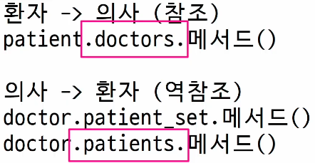

# Many to many relationships

- 한 테이블의 0개 이상의 레코드가 다른 테이블의 0개 이상의 레코드와 관련된 경우
> 양쪽 모두에서 N:1 관계를 가짐

## N:1의 한계

- 1번 환자가 두 의사 모두에게 진료를 받고자 한다면 환자 테이블에 1번 환자 데이터가 중복으로 입력될 수 밖에 없음 (example.1)

- 동시에 예약 남기려면..? -> 예약 테이블을 따로 만들자

## 중개 모델

1. 예약 모델 생성

  - 환자 모델의 외래 키를 삭제하고 별도의 예약 모델을 새로 생성
  - 예약 모델은 의사와 환자에 각각 N:1 관계를 가짐

```py
class Doctor(models.Model):
    name = models.TextField()

    def __str__(self):
        return f'{self.pk}번 의사 {self.name}'


# 외래키 삭제
class Patient(models.Model):
    name = models.TextField()

    def __str__(self):
        return f'{self.pk}번 환자 {self.name}'


# 중개모델 작성
class Reservation(models.Model):
    doctor = models.ForeignKey(Doctor, on_delete=models.CASCADE)
    patient = models.ForeignKey(Patient, on_delete=models.CASCADE)

    def __str__(self):
        return f'{self.doctor_id}번 의사의 {self.patient_id}번 환자'
```

2. 예약 데이터 생성

  - 데이터베이스 초기화 후 Migration 진행 및 shell_plus 실행
  - 의사와 환자 생성 후 예약 만들기

```py
# 예약 데이터 생성
doctor1 = Doctor.objects.create(name='allie')
patient1 = Patient.objects.create(name='carol')

Reservation.objects.create(doctor=doctor1, patient=patient1)

# 예약 정보 조회 - 의사, 환자가 예약 모델을 통해 각각 본인의 진료 내역 확인
doctor1.reservation_set.all()
patient1.reservation_set.all()

# 추가 예약 생성 - 1번 의사에게 새로운 환자 예약 생성
patient2 = Patient.objects.create(name='duke')
Reservation.objects.create(doctor=doctor1, patient=patient2)
```

#### Django에서는 'ManyToManyField'로 중개모델을 자동으로 생성

### ManyToManyField

- ManyToManyField() : M:N 관계 설정 모델 필드

  ```py
  # 환자 모델에 ManyToManyField 작성
  # 의사 모델에 작성해도 상관 없으며 참조/역참조 관계만 잘 기억할 것

  class Doctor(models.Model):
    name = models.TextField()

    def __str__(self):
        return f'{self.pk}번 의사 {self.name}'


  class Patient(models.Model):
    # ManyToManyField 작성
    doctors = models.ManyToManyField(Doctor)
    name = models.TextField()

    def __str__(self):
        return f'{self.pk}번 환자 {self.name}'
  ```

  - 데이터베이스 초기화 후 Migration 진행 및 shell_plus 실행
  - 생성된 중개 테이블 hospitals_patient_doctors 확인

  ```py
  # 의사 1명과 환자 2명 생성
  doctor1 = Doctor.objects.create(name='allie')
  patient1 = Patient.objects.create(name='carol')
  patient2 = Patient.objects.create(name='duke')

  # 예약 생성 (환자가 예약)
  # patient1이 doctor1에게 예약
  patient1.doctors.add(doctor1)

  # patient1 - 자신이 예약한 의사목록 확인
  patient1.doctors.all()

  # doctor1 - 자신의 예약된 환자목록 확인
  doctor1.patient_set.all()

  # doctor1이 patient2을 예약
  doctor1.patient_set.add(patient2)

  doctor1.patient_set.all()
  patient2.doctors.all()
  patient1.doctors.all()

  # 예약 취소하기
  # 이전에는 Reservation을 찾아서 지워야 했다면, 이제는 remove()로 삭제 가능

  # doctor1이 patient1 진료 예약 취소
  doctor1.patient_set.remove(patient1)
  doctor1.patient_set.all()
  patient1.doctors.all()

  # patient2가 doctor1 진료 예약 취소
  patient2.patient_set.remove(doctor1)
  patient2.doctors.all()
  doctor1.patient_set.all()
  ```

#### 만약 예약 정보에 병의 증상, 예약일 등 추가 정보가 포함되어야 한다면?

### 'through' argument

- 중개 테이블에 '추가 데이터'를 사용해 M:N 관계를 형성하려는 경우에 사용

  ```py
  # Reservation Class 재작성 및 through 설정
  # 이제는 예약 정보에 '증상'과 '예약일'이라는 추가 데이터가 생김
  class Doctor(models.Model):
    name = models.TextField()

    def __str__(self):
        return f'{self.pk}번 의사 {self.name}'


  class Patient(models.Model):
    doctors = models.ManyToManyField(Doctor, through='Reservation')
    name = models.TextField()

    def __str__(self):
        return f'{self.pk}번 환자 {self.name}'


  class Reservation(models.Model):
    doctor = models.ForeignKey(Doctor, on_delete=models.CASCADE)
    patient = models.ForeignKey(Patient, on_delete=models.CASCADE)
    symptom = models.TextField()
    reserved_at = models.DateTimeField(auto_now_add=True)

    def __str__(self):
        return f'{self.doctor.pk}번 의사의 {self.patient.pk}번 환자'
  ```

  - 데이터베이스 초기화 후 Migration 진행 및 shell_plus 진행

  ```py
  # 의사 1명과 환자 2명 생성
  doctor1 = Doctor.objects.create(name='allie')
  patient1 = Patient.objects.create(name='carol')
  patient2 = Patient.objects.create(name='duke')

  # 1. Reservation class를 통한 예약 생성
  reservation1 = Reservation(doctor=doctor1, patient=patient1, symptom='headache')
  reservation1.save()
  doctor1.patient_set.all()
  patient1.doctors.all()

  # 2. Patient 객체를 통한 예약 생성
  patient2.doctors.add(doctor1, through_defaults={'symptom': 'flu'})
  doctor1.patient_set.all()
  patient2.doctors.all()

  # 생성과 마찬가지로 의사와 환자 모두 각각 예약 삭제 가능
  doctor1.patient_set.remove(patient1)
  patient2.doctors.remove(doctor1)
  ```

### M:N 관계 주요 사항

- M:N 관계로 맺어진 두 테이블에는 물리적인 변화가 없음
- ManyToManyField는 중개 테이블을 자동으로 생성
- ManyToManyField는 M:N 관계를 맺는 두 모델 어디에 위치해도 상관 없음
  - 대신 필드 작성 위치에 따라 참조와 역참조 방향을 주의할 것

- N:1 은 완전한 종속의 관계였지만 M:N은 종속적인 관계가 아니며 '의사에게 진찰받는 환자 & 환자를 진찰하는 의사' 이렇게 2가지 형태 모두 표현 가능

### ManyToManyField

- ManyToManyField(to, **options) : M:N 관계 설정 시 사용하는 모델 필드

- 양방향 관계
  - 어느 모델에서든 관련 객체에 접근할 수 있음

- 중복 방지 
  - 동일한 관계는 한번만 저장됨

#### 대표 인자 3가지

1. related_name
2. symmetrical
3. through

#### 1. 'related_name' arguments

- 역참조시 사용하는 manager name을 변경



```py
class Doctor(models.Model):
    name = models.TextField()

    def __str__(self):
        return f'{self.pk}번 의사 {self.name}'

class Patient(models.Model):
    # ManyToManyField - related_name 작성
    doctors = models.ManyToManyField(Doctor, related_name='patients')
    name = models.TextField()

# 변경 전 
doctor.patient_set.all()

# 변경 후 (변경 후 이전 manager name은 사용 불가)
doctor.patients.all()
```

#### 2. 'symmetrical' arguments

- 관계 설정 시 대칭 유무 설정
- ManyToManyField가 동일한 모델을 가리키는 정의에서만 사용
- 기본 값 : True
- ex. 팔로우, 맞팔로우 기능

```py
class Person(models.Model):
  # 대칭 기능 켜놓고 싶으면 기본 세팅
  friends = models.ManyToManyField('self')
  # 대칭 기능 끄고 싶으면 False로 세팅
  # friends = models.ManyToManyField('self', symmetrical=False)
```

- True일 경우
  - source 모델의 인스턴스가 target 모델의 인스턴스를 참조하면 자동으로 target 모델 인스턴스도 source 모델 인스턴스를 자동으로 참조하도록 함 (대칭)
  - 즉, 내가 당신의 친구라면 자동으로 당신도 내 친구가 됨

- False일 경우
  - True와 반대 (대칭되지 않음)

> source 모델 : 관계를 시작하는 모델
> target 모델 : 관계의 대상이 되는 모델

#### 3. 'through' arguments

- 사용하고자 하는 중개모델을 지정
- 일반적으로 "추가 데이터를 M:N 관계와 연결하려는 경우"에 활용

```py
class Patient(modes.Model):
  doctors = models.ManyToManyField(Doctor, through='Reservation')

class Reservation(models.Model):
  doctor = models.ForeignKey(Doctor, on_delete=models.CASCADE)
  patient = models.ForeignKey(Patient, on_delete=models.CASCADE)
  symptom = models.TextField()
  reserved_at = models.DateTimeField(auto_now_add=True)
```

#### M:N 에서의 대표조작 methods

- add()
  - 관계 추가
  - '지정된 객체를 관련 객체 집합에 추가'

- remove()
  - 관계 제거
  - 관련 객체 집합에서 지정된 모델 객체를 제거


## 좋아요 기능 구현

### 모델 관계 설정

- Article(M) - User(N)
  - 0개 이상의 게시글은 0명 이상의 회원과 관련

> 게시글은 회원으로부터 0개 이상의 좋아요를 받을 수 있고, 회원은 0개 이상의 게시글에 좋아요를 누를 수 있음

1. Article 클래스에 ManyToManyField 작성

- Article - User (N:1)
  - N:1에서의 역참조
  - user.article_set

- Article - User (N:M)
  - N:1에서의 역참조
  - 유저가 좋아요 누른 모든 게시글
  - user.like_articles

```py
class Article(models.Model):
    user = models.ForeignKey(
        settings.AUTH_USER_MODEL, on_delete=models.CASCADE
    )
    like_users = models.ManyToManyField(settings.AUTH_USER_MODEL, related_name='like_articles')
    title = models.CharField(max_length=10)
    content = models.TextField()
    created_at = models.DateTimeField(auto_now_add=True)
    updated_at = models.DateTimeField(auto_now=True)
```

- related_name 지정안해주면 역참조 매니저 충돌남..

- like_users 필드 생성 시 자동으로 역참조 매니저 .article_set 가 생성됨
- 그러나 이전 N:1 (Article-User) 관계에서 이미 같은 이름의 매니저를 사용중
  - user.article_set.all() -> 해당 유저가 작성한 모든 게시글 조회

- user가 작성한 글 (user.article_set)과 user가 좋아요를 누른 글(user.article_set)을 구분할 수 없게 됨

> user와 관계된 ForeignKey 혹은 ManyToManyField 둘 중 하나에 related_name 작성 필요

#### User-Article간 사용 가능한 전체 related manager

- article.user
  - 게시글을 작성한 유저 - N:1

- user.article_set
  - 유저가 작성한 게시글(역참조) - N:1

- article.like_users
  - 게시글을 좋아요 한 유저 - M:N

- user.like_articles
  - 유저가 좋아요 한 게시글(역참조) - M:N

### 기능 구현

1. url 작성

```py
# articles/urls.py

path('<int:article_pk>/likes/', views.likes, name='likes'),
```

2. view 함수 작성
```py
def likes(request, article_pk):
    # 어떤 글에 좋아요를 눌렀는지 글을 먼저 조회
    article = Article.objects.get(pk=article_pk)

    # 좋아요를 추가하는 것이냐 / 취소하는 것이냐
    # 만약 좋아요를 요청한 유저가 해당 글의 좋아요를 누른 유저 목록에 포함되어있다면(좋아요 취소)
    if request.user in article.like_users.all():
        article.like_users.remove(request.user)
    # 그게 아니라 좋아요를 요청한 유저가 해당글의 좋아요를 누른 유저 목록에 없다면(좋아요 추가)
    else:
        article.like_users.add(request.user)
    return redirect('articles:index')
```

3. index 템플릿에서 각 게시글에 좋아요 버튼 출력

```html
  <form action="" method="POST">
    
    
      <input type="submit" value="좋아요 취소">
    
      <input type="submit" value="좋아요">
    
  </form>
```