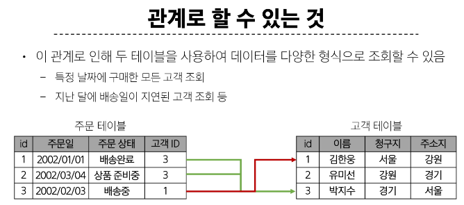
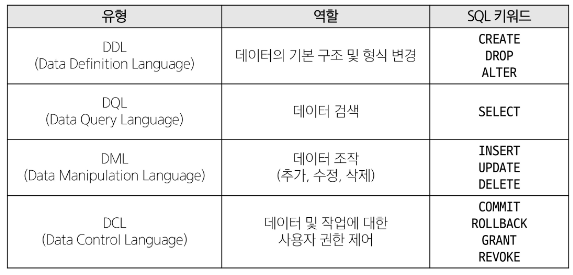
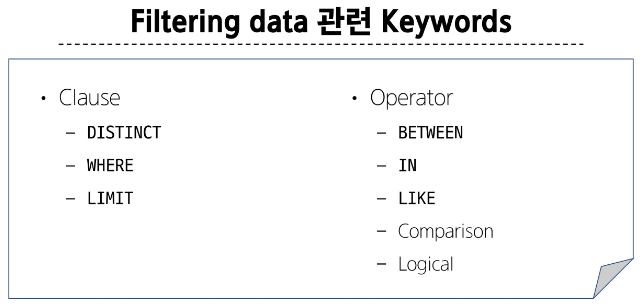
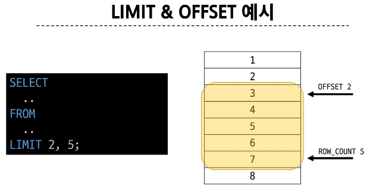
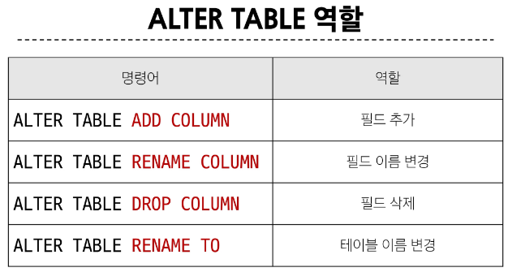
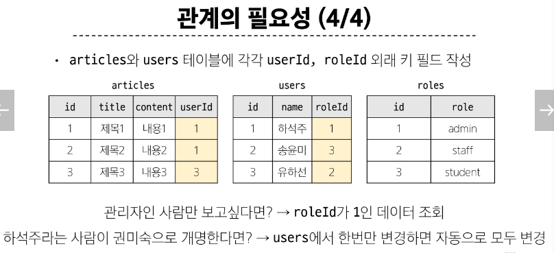
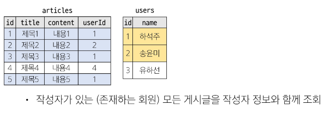
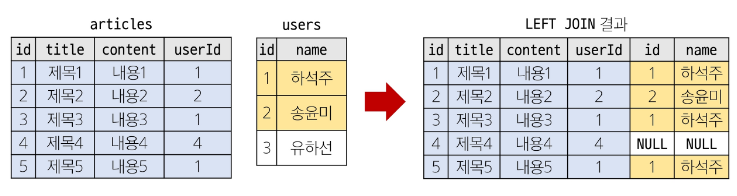

# SQL
## Database

- 데이터베이스 : 체계적인 데이터 모음, 데이터를 저장하고 조작
- 데이터 : 저장이나 처리에 효율적인 형태로 변환된 정보

> 데이터를 저장하고 잘 관리하여 활용할 수 있는 기술이 중요해짐

### 기존의 데이터 저장 방식

1. 파일 이용
- 어디에서나 쉽게 사용 가능
- 데이터를 구조적으로 관리하기 어려움

2. 스프레드 시트 이용
- 테이블의 열과 행을 사용해 데이터를 구조적으로 관리 가능
- 일반적으로 약 100만 행 까지만 저장 가능
- 단순히 파일이나 링크 소유 여부에 따른 단순한 접근 권한 기능 제공
- 데이터의 정보를 수정하려면 테이블 모든 위치에서 해당 값을 업데이트 해야함

## Relational Database

- 관계형 데이터 베이스 : 데이터 간에 관계가 있는 데이터 항목들의 모음
  - 테이블, 행, 열의 정보를 구조화하는 방식
  - 서로 관련된 데이터 포인터를 저장하고 이에 대한 액세스를 제공

  

### 관계형 데이터베이스 관련 키워드

1. Table (Relation) 
  - 데이터를 기록하는 곳

2. Field (Column, Attribute, 열)
  - 각 필드에는 고유한 데이터 형식(타입)이 지정됨

3. Record (Row, Tuple, 행)
  - 각 레코드에는 구체적인 데이터 값이 저장됨

4. Database (Schema)
  - 테이블의 집합

5. Primary Key (기본 키, PK)
  - 각 레코드의 고유한 값
  - 관계형 데이터베이스에서 레코드의 식별자로 활용

6. Foreign Key (왜래 키, FK)
  - 테이블의 필드 중 다른 테이블의 레코드를 식별할 수 있는 키
  - 다른 테이블의 기본 키를 참조
  - 각 레코드에서 서로 다른 테이블 간의 관계를 만드는 데 사용
  
### RDBMS

- DBMS (Database Managemant System): 데이터베이스를 관리하는 소프트웨어 프로그램
  - 데이터 저장 및 관리를 용이하게 하는 시스템
  - 데이터베이스와 사용자 간의 인터페이스 역할
  - 사용자가 데이터 구성, 업데이트, 모니터링, 백업, 복구 등을 할 수 있도록 도움

- RDBMS: 관계형 데이터베이스를 관리하는 소프트웨어 프로그램
  - ex. SQLite, MySQL, Oracle...

#### 데이터베이스 정리

- Table은 데이터가 기록되는 곳
- Table에는 행에서 고유하게 식별 가능한 기본 키라는 속성이 있으며, 외래 키를 사용하여 각 행에서 서로 다른 테이블 간의 관계를 만들 수 있음
- 데이터는 기본 키 또는 외래 키를 통해 결합될 수 있는 여러 테이블에 걸쳐 구조화 됨

## SQL (Structure Query Language)

- 데이터베이스에 정보를 저장하고 처리하기 위한 프로그래밍 언어
- 테이블의 형태로 구조화된 관계형 데이터베이스에게 요청을 질의(요청)

### SQL Syntax

```sql
SELECT column_name FROM table_name;
```

1. SQL 키워드는 대소문자를 구분하지 않음 (하지만 대문자로 작성하는 것을 권장- 명시적 구분)
2. 각 SQL Statements의 끝에는 세미콜론(;)이 필요
  - 세미콜론은 각 SQL Statements을 구분하는 방법(명령어의 마침표)

### SQL Statements

- SQL을 구성하는 가장 기본적인 코드 블록

```sql
SELECT column_name FROM table_name;
```
- 해당 예시 코드는 SELECT Statement라 부름
- 이 Statement는 SELECT, FROM 2개의 keyword로 구성됨

#### 수행 목적에 따른 SQL Statements 4가지 유형

1. DDL - 데이터 정의
2. DQL - 데이터 검색
3. DML - 데이터 조작
4. DCL - 데이터 제어



## 참고

### Query 

- 데이터베이스로 부터 정보를 요청하는 것
- 일반적으로 SQL로 작성하는 코드를 쿼리문 (SQL문)이라 함

### SQL 표준

- SQL은 미국 국립 표준 협회와 국제 표준화 기구에 의해 표준이 채택됨
- 모든 RDBMS에서 SQL 표준을 지원
- 다만 각 RDBMS 마다 독자적인 기능에 따라 표준을 벗어나는 문법이 존재하니 주의

# Single Table Queries

## Querying data
### SELECT

- SELECT statement : 테이블에서 데이터를 조회

```sql
SELECT select_list FROM table_name;
```
- **SELECT** 키워드 이후 데이터를 선택하려는 **필드**를 하나 이상 지정
- **FROM** 키워드 이후 데이터를 선택하려는 **테이블**의 이름을 지정

#### SELECT 활용

- 테이블 employees에서 LastName 필드의 모든 데이터를 조회
```sql
SELECT 
  LastName 
FROM 
  employees;
```

- 테이블 employees에서 LastName, FirstName 필드의 모든 데이터를 조회
```sql
SELECT 
  LastName, FirstName 
FROM 
  employees;
```

- 테이블 employees에서 모든 필드 데이터를 조회
```sql
SELECT 
  * 
FROM 
  employees;
```

- 테이블 employees 에서 FirstName 필드의 모든 데이터를 조회 
  - 단, 조회시 FirstName이 아닌 '이름'으로 출력 될 수 있도록 변경
```sql
SELECT 
  FirstName AS '이름'
FROM
  employees;
```

- 테이블 tracks 에서 Name, Milliseconds 필드의 모든 데이터 조회
  - 단, Milliseconds 필드는 60000으로 나눠 분 단위 값으로 출력
```sql
SELECT 
  Name AS '곡 명',
  Milliseconds/60000 AS '재생 시간(분)'
FROM
  tracks;
```

## Sorting data
### ORDER BY

- ORDER BY statement : 조회 결과의 레코드를 정렬

```sql
SELECT
  select_list
FROM 
  table_name
ORDER BY
  column1 [ASC|DESC],
  column2 [ASC|DESC];
```
- FROM clause 뒤에 위치
- 하나 이상의 컬럼을 기준으로 결과를 오름차순 (ASC, 기본값), 내림차순(DESC)으로 정렬

#### ORDER BY 활용

- 테이블 employees에서 FirstName 필드의 모든 데이터를 오름차순으로 조회
```sql
SELECT 
  FirstName
FROM
  employees
ORDER BY
  FirstName ASC;
```

- 테이블 customers에서 country 필드를 기준으로 내림차순 정렬한 다음 city 필드 기준으로 오름차순 정렬하여 조회 
  - country 먼저 내림차 순 정렬한 다음에 같은 country 일때 도시 오름차순으로 정렬했음
```sql
SELECT 
  Country, City
FROM
  customers
ORDER BY
  Country DESC,
  City ASC;
```

- 테이블 tracks 에서 Milliseconds 필드를 기준으로 내림차순 정렬한 다음 Name, Milliseconds 필드의 모든 데이터를 조회
```sql
SELECT 
  Name, 
  Milliseconds/60000 AS '재생 시간(분)'
FROM
  tracks
ORDER BY
  Milliseconds DESC;
```

#### 정렬에서의 NULL

- NULL 값이 존재할 경우 오름차순 정렬 시 결과에 NULL이 먼저 출력

#### SELECT Statement 실행 순서

1. 테이블에서 (FROM)
2. 조회하여 (SELECT)
3. 정렬 (ORDER BY)

## Filtering data


### DISTINCT

- DISTINCT statement: 조회 결과에서 중복된 레코드를 제거

```sql
SELECT DISTINCT
  select_list
FROM
  table_name;
```

#### DISTINCT 활용

- 테이블 customers에서 Country 필드의 모든 데이터를 중복없이 오름차순 조회
```sql
SELECT DISTINCT
  Country
FROM
  customers
ORDER BY
  Country;
```

### WHERE (!!! 중요)

- WHERE statement : 조회시 특정 검색 조건을 지정

```sql
SELECT
  select_list
FROM
  table_name
WHERE
  search_condition;
```
- FROM clause 뒤에 위치
- search_condition은 비교연산자 및 논리연산자(AND, OR, NOT등)를 사용하는 구문이 사용됨

#### WHERE 활용

- 테이블 customers 에서 City 필드 값이 'Prague'인 데이터의 LastName, FirstName, City 조회
```sql
SELECT
  LastName, FirstName, City
FROM
  customers
WHERE
  City = 'Prague'

-- praque아닌 데이터 조회
SELECT
  LastName, FirstName, City
FROM
  customers
WHERE
  City != 'Prague';
```

- 테이블 customers에서 Company 필드 값이 NULL이고 Country 필드 값이 'USA'인 데이터의 LastName, FirstName, Company, Country 조회
```sql
SELECT 
  LastName, FirstName, Company, Country
FROM
  customers
WHERE
  Company IS NULL
  AND Country = 'USA';

-- NULL 이거나 미국에 살거나
SELECT 
  LastName, FirstName, Company, Country
FROM
  customers
WHERE
  Company IS NULL
  OR Country = 'USA';
```

- 테이블 tracks 에서 Bytes 필드 값이 10,000 이상 500,000 이하인 데이터의 Name, Bytes 조회

```sql
SELECT 
  Name, Bytes
FROM
  tracks
WHERE
  Bytes BETWEEN 10000 AND 500000;

-- WHERE
--   10000 <= Bytes 
--   AND Bytes <= 500000
```

- 테이블 tracks 에서 Bytes 필드 값이 10,000 이상 500,000 이하인 데이터의 Name, Bytes를 Bytes 기준으로 오름차순 조회

```sql
SELECT 
  Name, Bytes
FROM
  tracks
WHERE
  Bytes BETWEEN 10000 AND 500000
ORDER BY
  Bytes
```

- 테이블 customers 에서 Country 필드 값이 'Canada'또는 'Germany' 또는 'France'인 데이터의 LastName, FirstName, Country 조회
```sql
SELECT
  LastName, FirstName, Country
FROM
  customers
WHERE 
  Country IN ('Canada', 'Germany', 'France');
-- WHERE
--   Country = 'Canada' 
--   OR Country = 'Germany' 
--   OR Country = 'France';

SELECT
  LastName, FirstName, Country
FROM
  customers
WHERE 
  Country NOT IN ('Canada', 'Germany', 'France');
```

- 테이블 customers 에서 LastName 필드 값이 'son'으로 끝나는 데이터의 LastName, FirstName 조회
```sql
SELECT
  LastName, FirstName
FROM
  customers
WHERE
  LastName LIKE '%son';

-- 4자리면서 'a'로 끝나는 데이터 조회
SELECT 
  LastName, FirstName
FROM
  customers
WHERE
  FirstName LIKE '___a'
```

#### Comparision Operators (비교연산자)

- =, >=, <=, !=, IS, LIKE, IN, BETWEEN ... AND

#### Logical Operators (논리연산자)

- AND(&&), OR(||), NOT(!)

#### Wildcard Characters - LIKE 와 함께 사용,,

- '%' : 0개 이상의 문자열과 일치하는지 확인
- '_' : 단일 문자와 일치하는지 확인

### LIMIT

- LIMIT clause : 조회하는 레코드 수를 제한

```sql
SELECT 
  select_list
FROM 
  table_name
LIMIT [offset,] row_cont;
```
- 하나 또는 두 개의 인자를 사용(0 또는 양의 정수)
- row_count는 조회하는 최대 레코드 수를 지정

  

#### LIMIT 활용

- 테이블 tracks 에서 TrackId, Name, Bytes 필드 데이터를 Bytes 기준 내림차순으로 7개만 조회
```sql
SELECT
  TrackId, Name, Bytes
FROM
  tracks
ORDER BY
  Bytes DESC
LIMIT 7;
```

- 테이블 tracks 에서 TrackId, Name, Bytes 필드 데이터를 Bytes 기준 내림차순으로 4번째부터 7번째 데이터만 조회

```sql
SELECT
  TrackId, Name, Bytes
FROM
  tracks
ORDER BY
  Bytes DESC
LIMIT 3, 4;
-- LIMIT 4 OFFSET 3;
```
## Grouping data
### GROUP BY

- GROUP BY clause : 레코드를 그룹화하여 요약본 생성 ('집계 함수'와 함께 사용)

```sql
SELECT 
  c1, c2, .. , cn, aggregate_function(ci)
FROM 
  table_name
GROUP BY
  c1, c2, .. , cn;
```

- FROM 및 WHERE 절 뒤에 배치
- GROUP BY 절 뒤에 그룹화 할 필드 목록을 작성

#### Aggregation Functions - 집계 함수

- 값에 대한 계산을 수행하고 단일한 값을 반환하는 함수
  - SUM, AVG, MAX, MIN, COUNT

#### GROUP BY 활용

- 테이블 tracks 에서 Composer 필드를 그룹화하여 각 그룹에 대한 Bytes의 평균 값을 내림차순 조회

```sql
SELECT 
  Composer, AVG(Bytes)
FROM
  tracks
GROUP BY
  Composer
ORDER BY
  AVG(Bytes) DESC;

-- 다른 방법
SELECT 
  Composer, 
  AVG(Bytes) AS avgofBytes
FROM
  tracks
GROUP BY
  Composer
ORDER BY
  avgofBytes DESC;
```

- 테이블 tracks 에서 Composer 필드를 그룹화하여 각 그룹에 대한 Milliseconds의 평균 값이 10 미만인 데이터 조회
```sql
SELECT
  Composer,
  AVG(Milliseconds/60000) AS avgofmilli
FROM
  tracks
GROUP BY
  Composer
HAVING
  avgofmilli < 10;
```

## SELECT statement 실행 순서

1. 테이블에서 (FROM)
2. 특정 조건에 맞추어 (WHERE)
3. 그룹화 하고 (GROUP BY)
4. 만약 그룹 중에서 조건이 있다면 맞추고 (HAVING)
5. 조회하여 (SELECT)
6. 정렬하고 (ORDER BY)
7. 특정 위치의 값을 가져옴 (LIMIT)

# Managing Tables
## Create a table

- CREATE TABLE statement : 테이블 생성

```sql
CREATE TABLE table_name (
  column_1 data_type constraints,
  column_2 data_type constraints,
  ...,
);
```
- 각 필드에 적용할 데이터 타입 작성
- 테이블 및 필드에 대한 제약조건 작성

### CREATE TABLE 활용

- examples 테이블 생성 및 확인
```sql
CREATE TABLE examples (
  ExamId INTEGER PRIMARY KEY AUTOINCREMENT,
  LastName VARCHAR(50) NOT NULL,
  FirstName VARCHAR(50) NOT NULL
);
```

#### PRAGMA

- 테이블 schema(구조) 확인
- sqlite에서 확인하는 방식

```sql
PRAGMA table_info('examples');
```
> cid
>  - Column ID를 의미하며 각 컬럼의 고유한 식별자를 나타내는 정수 값 
>  - 직접 사용하지 않으며 PRAGMA 명령과 같은 메타데이터 조회에서 출력 값으로 활용됨 

#### SQLite 데이터 타입

1. NULL 
  - 아무런 값도 포함하지 않음을 나타냄
2. INTEGER
  - 정수
3. REAL 
  - 부동 소수점
4. TEXT 
  - 문자열
5. BLOB
  - 이미지, 동영상, 문서 등의 바이너리 데이터

#### Constraints - 제약조건

테이블의 필드에 적용되는 규칙 또는 제한 사항

> 데이터의 무결성을 유지하고 데이터베이스의 일관성을 보장

1. PRIMARY KEY
  - 해당 필드를 기본 키로 지정
  >INTEGER 타입에만 적용되며 INT, BIGINT 등과 같은 다른 정수 유형은 적용되지 않음

2. NOT NULL
  - 해당 필드에 NULL 값을 허용하지 않도록 지정

3. FOREIGN KEY 
  - 다른 테이블과의 외래 키 관계를 정의

#### AUTOINCREMENT keyword

- 자동으로 고유한 정수 값을 생성하고 할당하는 필드 속성
- 필드의 자동 증가를 나타내는 특수한 키워드
- 주로 primary key 필드에 적용
- INTEGER PRIMARY KEY AUTOINCREMENT 가 작성된 필드는 항상 새로운 레코드에 대해 이전 최대 값보다 큰 값을 할당
- 삭제된 값은 무시되며 재사용할 수 없게 됨

## Modifying table fields
### ALTER TABLE

- 테이블 필드 및 조작
  

1. ALTER TABLE ADD COLUMN syntax
  ```sql
  ALTER TABLE
    table_name
  ADD COLUMN
    column_definition;
  ```
  - ADD COLUMN 키워드 이후 추가하고자 하는 새 필드 이름과 데이터 타입 및 제약 조건 작성
  > 단, 추가하고자 하는 필드에 NOT NULL 제약조건이 있을 경우 NULL 이 아닌 기본 값 설정 필요

  - 예시
  ```sql
  ALTER TABLE
    examples
  ADD COLUMN
    Adress VARCHAR(100) NOT NULL DEFAULT 'default value';
  ```

2. ALTER TABLE RENAME COLUMN syntax
  ```sql
  ALTER TABLE
    table_name
  RENAME COLUMN
    current_name TO new_name
  ```
  - RENAME COLUMN 키워드 뒤에 이름을 바꾸려는 필드의 이름을 지정하고 TO 키워드 뒤에 새 이름을 지정

  - 예시
  ```sql
  ALTER TABLE
    examples
  RENAME COLUMN
    Adress TO PostCode;
  ```
3. ALTER TABLE DROP COLUMN syntax
  ```sql
  ALTER TABLE
    table_name
  DROP COLUMN
    column_name
  ```
  - DROP COLUMN 키워드 뒤에 삭제할 필드 이름 지정
  - 예시
  ```sql
  ALTER TABLE 
  examples
  DROP COLUMN PostCode;
  ```

4. ALTER TABLE RENAME TO syntax
  ```sql
  ALTER TABLE
    table_name
  RENAME TO
    new_table_name
  ```
  - RENAME TO 키워드 뒤에 새로운 테이블 이름 지정
  - 예시
  ```sql
  ALTER TABLE
    examples
  RENAME TO
    new_examples
  ```

### Delete a table

#### DROP TABLE syntax
  ```sql
  DROP TABLE table_name;
  ```
  - DROP TABLE statement 이후 삭제할 테이블 이름 작성
  - 예시
  ```sql
  DROP TABLE new_examples;
  ```
## 참고

### 타입 선호도 (Type Affinity)

- 컬럼에 데이터 타입이 명시적으로 지정되지 않았거나 지원하지 않을 때 SQLite가 자동으로 데이터 타입을 추론하는 것

1.  유연한 데이터 타입 지원
  - 데이터 타입을 명시적으로 지정하지 않고도 데이터를 저장하고 조회할 수 있음
  - 컬럼에 저장되는 값의 특성을 기반으로 데이터 타입을 유추

2. 간편한 데이터 처리
  - INTEGER Type Affinity 를 가진 열에 문자열 데이터를 저장해도 SQLite는 자동으로 숫자를 변환하여 처리

3. SQL 호환성
  - 다른 데이터베이스 시스템과 호환성을 유지

### 반드시 NOT NULL 제약을 사용해야 할까?

- nope. 하지만 대부분 NOT NULL을 정의


# Modifying Data
## Insert data

```sql
INSERT INTO table_name (c1,c2,..)
VALUES (v1,v2,..);
```
- INSERT INTO 절 다음에 테이블 이름과 괄호안에 필드 목록 작성
- VALUES 키워드 다음 괄호 안에 해당 필드에 삽입할 값 목록 작성

- 예시 
  ```sql
  INSERT INTO
    articles(title, content, createdAt)
  VALUES
    ('hello', 'world', '2000-01-01');

  INSERT INTO
    articles(title, content, createdAt)
  VALUES
    ('title1', 'content1', '1900-01-01'),
    ('title2', 'content2', '1800-01-01'),
    ('title3', 'content3', '1700-01-01');

  INSERT INTO
    articles(title, content, createdAt)
  VALUES
    ('mytitle', 'mycontent', DATE());
  ```

## Update data

- 테이블 레코드 수정

```sql
UPDATE 
  table_name
SET 
  column_name = expression,
WHERE
  condition;
```
- SET 절 다음에 수정 할 필드와 새 값을 지정
- WHERE 절에서 수정 할 레코드를 지정하는 조건 작성
- WHERE 절을 작성하지 않으면 모든 레코드를 수정

## Delete data

- 테이블 레코드 삭제

```sql
DELETE FROM table_name
WHERE 
  condition;
```
- DELETE FROM 절 다음에 테이블 이름 작성
- WHERE 절에서 삭제할 레코드를 지정하는 조건 작성
- WHERE 절을 작성하지 않으면 모든 레코드를 삭제

- 예시
  ```sql
  DELETE FROM articles
  WHERE id = 1;

  DELETE FROM articles
  WHERE 
    id IN (2, 3);

  DELETE FROM
    articles
  WHERE id IN (
    SELECT id FROM articles
    ORDER BY createdAt
    LIMIT 2
  );
  ```

# Multi table queries
## Join

- 관계 : 여러 테이블 간의 (논리적) 연결


#### JOIN이 필요한 순간

- 테이블을 분리하면 데이터 관리는 용이해질 수 있으나 출력시에는 문제가 있음
- 테이블 한 개 만을 출력할 수 밖에 없어 다른 테이블과 결합하여 출력하는 것이 필요해짐

> 이 때 사용하는 것이 'JOIN'

## Joining tables

1. INNER JOIN
2. LEFT JOIN

### INNER JOIN

- 두 테이블에서 값이 일치하는 레코드에 대해서만 결과를 반환

```sql
SELECT 
  select_list
FROM 
  table_a
INNER JOIN table_b
  ON table_b.fk = table_a.pk;
```
- FROM 절 이후 메인 테이블 지정(table_a)
- INNER JOIN 절 이후 메인 테이블과 조인할 테이블을 지정(table_b)
- ON 키워드 이후 조인 조건을 작성
- 조인 조건은 table_a와 table_b 간의 레코드를 일치시키는 규칙을 지정

#### INNER JOIN 예시



```sql
SELECT * FROM articles
INNER JOIN users
  ON users.id = articles.userId;

-- 1번 회원 (하석주) 가 작성한 모든 게시글의 제목과 작성자명을 조회
SELECT * FROM articles
INNER JOIN users
  ON users.id = articles.userId
WHERE users.id = 1;
```

### LEFT JOIN

- 오른쪽 테이블의 일치하는 레코드와 함께 왼쪽 테이블의 모든 레코드 반환
  ```sql
  SELECT 
    select_list
  FROM
    table_a
  LEFT JOIN table_b
    ON table_b.fk = table_a.pk
  ```

  - FROM 절 이후 왼쪽 테이블 지정(table_a)
  - LEFT JOIN 절 이후 오른쪽 테이블 지정(table_b)
  - ON 키워드 이후 조인 조건을 작성
    - 왼쪽 테이블의 각 레코드를 오른쪽 테이블의 모든 레코드와 일치시킴

#### LEFT JOIN 예시


- 왼쪽 테이블의 모든 레코드를 표기
- 오른쪽 테이블과 매칭되는 레코드가 없으면 NULL을 표시

```sql
-- 게시글을 작성한 이력이 없는 회원 정보 조회
SELECT users.name
FROM users
LEFT JOIN articles
  ON articles.userId = users.id
WHERE articles.userId IS NULL;
```