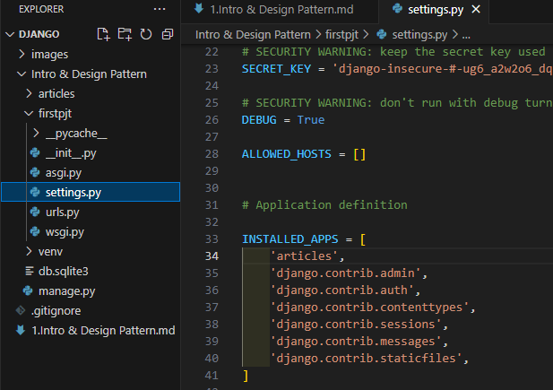
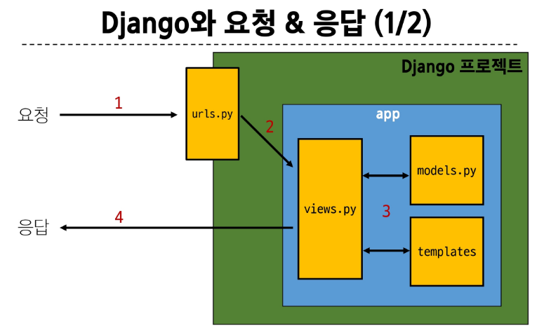
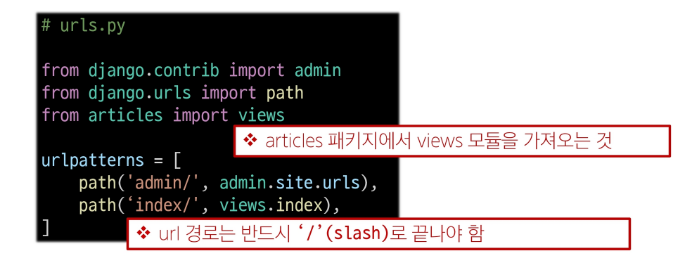
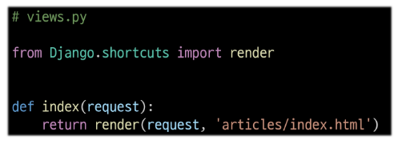
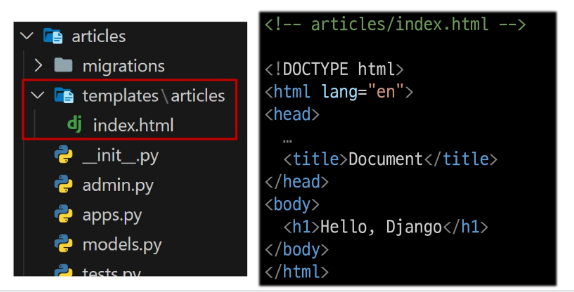
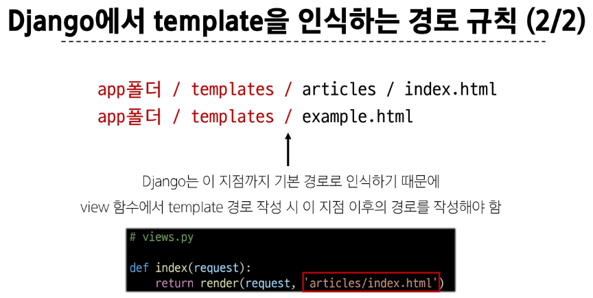
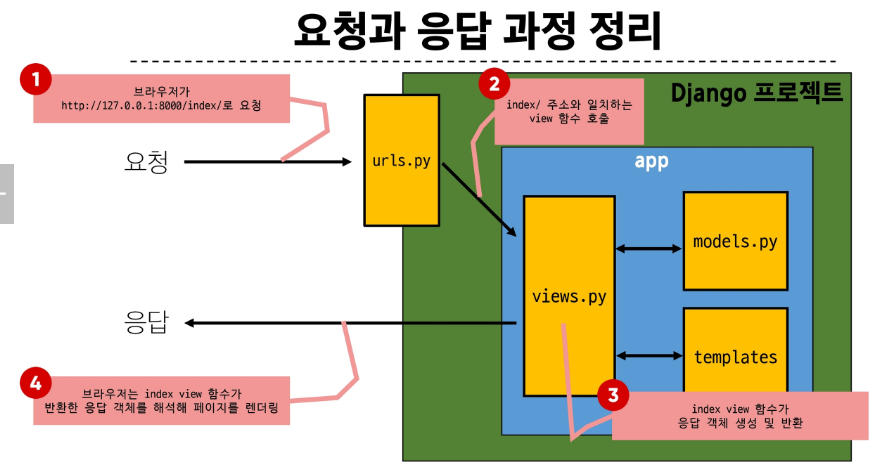
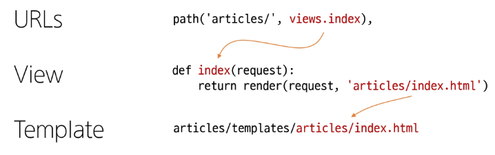

# Intro & Design Pattern

## Web Application

### Web application (web service) 개발

- 인터넷을 통해 사용자에게 제공되는 소프트웨어 프로그램을 구축하는 과정
- 다양한 디바이스(모바일, 태블릿, PC 등)에서 웹 브라우저를 통해 접근하고 사용할 수 있음

### 클라이언트와 서버

- 웹의 동작 방식은 클라이언트- 서버 구조

- 클라이언트
  - 서비스를 요청하는 주체(웹 사용자의 인터넷이 연결된 장치, 웹 브라우저)
- 서버
  - 클라이언트의 요청에 응답하는 주체(웹 페이지, 앱을 저장하는 컴퓨터)

### 웹 개발에서의 프론트엔드와 백엔드

- 프론트엔드
  - 사용자 인터페이스(UI)를 구성하고, 사용자가 애플리케이션과 상호작용할 수 있도록 함
  > HTML, CSS, JavaScript, 프론트엔드 프레임워크 등

- 백엔드
  - 서버 측에서 동작하며, 클라이언트의 요청에 대한 처리와 데이터베이스와의 상호작용 등을 담당
  > 서버언어(python, java 등) 및 백엔드 프레임워크, 데이터베이스, API, 보안 등

## Framework

### Web Framework

- 웹 어플리케이션을 빠르게 개발할 수 있도록 도와주는 도구(개발에 필요한 기본 구조, 규칙, 라이브러리 등을 제공)

### Django Framework

- 파이썬 기반의 대표적인 웹 프레임 워크

- Django를 사용해서 서버를 구현할 것!

### 가상환경

- python 애플리케이션과 그에 따른 패키지들을 격리하여 관리할 수 있는 독립적인 실행 환경

1. 가상 환경 venv 생성
  - venv라는 이름의 가상환경 생성
  - 임의 의름으로 생성이 가능하나 관례적으로 venv 이름을 사용

  ```bash
  python -m venv venv
  ```

2. 가상 환경 활성화

  - 활성화 명령어가 OS에 따라 다름에 주의
    - macOS/Linux: $ source venv/bin/activate

  ```bash
  source venv/Scripts/activate
  ```    

3. 환경에 설치된 패키지 목록 확인

  ```bash
  pip list
  ```   

4. 설치된 패키지 목록 생성 (다른 사용자들과 공유하기 위해)

- 현재 Python 환경에 설치된 모든 패키지와 그 버전을 텍스트 파일로 저장
- requirements.txt: 생성될 파일 이름 (관례적으로 사용)

  ```bash
  pip freeze > requirments.txt
  ```  

5. [번외] 패키지 목록 기반 설치

- 생성된 requirements.txt로 다른 환경에서 동일한 환경 구성하기
- 가상환경 활성화 후 requirements.txt에 작성된 목록을 기반으로 설치

  ```bash
  pip install -r requirements.txt
  ```   

6. 가상환경 비활성화

  ```bash
  deactivate
  ```  

#### 의존성 패키지

- 한 소프트웨어 패키지가 다른 패키지의 기능이나 코드를 사용하기 때문에 그 패키지가 존재해야만 제대로 작동하는 관계
- 사용하려는 패키지가 설치되지 않았거나, 호환되는 버전이 아니면 오류가 발생하거나 예상치 못한 동작을 보일 수 있음

#### 패키지 목록 파일 특징 및 주의사항

- 가상환경 패키지 목록을 쉽게 공유 가능
- 프로젝트의 의존성을 명확히 문서화
- 동일한 개발 환경을 다른 시스템에서 재현 가능

- 사용시 주의사항
  - 활성화된 가상환경에서 실행해야 정확한 패키지 목록 생성
  - 시스템 전역 패키지와 구분 필요

#### 가상환경 주의 사항 및 권장사항

1. 가상 환경에 "들어가고 나오는" 것이 아니라 사용할 python 환경을 "On/Off"로 전환하는 개념
  - 가상환경 활성화는 현재 터미널 환경에만 영향을 끼침
  - 새 터미널 창을 열면 다시 활성화 해야함

2. 가상환경은 "방"이 아니라 "도구 세트"
  - 활성화는 특정 도구 세트를 선택하는 것

3. 프로젝트마다 별도의 가상환경 사용
4. 일반적으로 가상환경 폴더 venv는 관련된 프로젝트와 동일한 경로에 위치

5. 가상환경 폴더 venv는 gitignore에 작성되어 원격 저장소에 공유되지 않음
  - 저장소 크기를 줄여 효율적인 협업과 배포를 가능하게 하기 위함 (requirements.txt를 공유)

### Django project

1. 프로젝트 생성
  ```bash
  django-admin startproject 프로젝트명
  ``` 
2. 서버 실행
  ```bash
  python manage.py runserver
  ``` 

## Django Design Pattern
### 디자인 패턴

소프트웨어 설계에서 발생하는 문제를 해결하기 위한 일반적인 해결책(공통적인 문제를 해결하는데 쓰이는 형식화 된 관행)

#### MVC 디자인 패턴 (model, view, controller)

애플리케이션을 구조화하는 대표적인 패턴(데이터 & 사용자 인터페이스 & 비즈니스 로직을 분리)
> 시작적 요소와 뒤에서 실행되는 로직을 서로 영향 없이, 독립적이고 쉽게 유지 보수할 수 있는 애플리케이션을 만들기 위해

#### MTV 디자인 패턴 (model, template, view)

django에서 애플리케이션을 구조화하는 패턴(기존 MVC 패턴과 동일하나 단순히 명칭을 다르게 정의한 것 view -> template, controller -> view)

### Project & App

- Django project
  - 애플리케이션의 집합(DB 설정, URL 연결, 전체 앱 설정 등을 처리)

- Django application
  - 독립적으로 작동하는 기능 단위 모듈(각자 특정한 기능을 담당하며 다른 앱들과 함께 하나의 프로젝트를 구성)

#### 앱 사용하기 위한 순서

1. 앱 생성

- 앱의 이름은 '복수형'으로 지정하는 것을 권장

  ```bash
  python manage.py startapp articles
  ``` 

2. 앱 등록

- 반드시 앱을 생성(1)한 후에 등록(2)해야 함(등록 후 생성은 불가능)
- firstpjt > settings.py 에 articles 추가!!



#### 프로젝트 구조(firstpjt)

- settings.py 
  - 프로젝트의 모든 설정을 관리

- urls.py
  - 요청 들어오는 URL에 따라 이에 해당하는 적절한 views를 연결

> 아래는 수업과정에서 수정할 일 없음

- __init__.py
  - 해당 폴더를 패키지로 인식하도록 설정하는 파일

- asgi.py
  - 비동기식 웹 서버와의 연결 관련 설정

- wsgi.py
  - 웹 서버와의 연결 관련 설정

- manage.py
  - Django 프로젝트와 다양한 방법으로 상호작용하는 커맨드라인 유틸리티

#### 앱 구조 (articles)

- admin.py
  - 관리자용 페이지 설정

- models.py
  - DB와 관련된 Model을 정의
  - MTV 패턴의 M

- views.py
  - HTTP 요청을 처리하고 해당 요청에 대한 응답을 반환
  (url, model, template과 연계)
  - MTV 패턴의 V

> 아래는 수업 과정에서 수정할 일 없음

- apps.py
  - 앱의 정보가 작성된 곳

- test.py
  - 프로젝트 테스트 코드를 작성하는 곳

## 요청과 응답
### Django와 요청 & 응답



1. URLs

- firstpjt > urls.py 에서



- http://127.0.0.1:8000/index/ 로 요청이 왔을 때, request 객체를 views 모듈의 index view 함수에게 전달하며 호출

2. View



- view 함수가 정의되는 곳
- 특정 경로에 있는 template과 request 객체를 결합해 응답 객체를 반환
- 모든 view 함수는 첫번째 인자로 요청 객체를 필수적으로 받음
- 매개변수 이름이 request가 아니어도 되지만 그렇게 작성하지 않음

3. Template



  1) articles 앱 폴더 안에 templates 폴더 생성
    > 폴더명은 반드시 templates 여야 하며 개발자가 직접 생성해야함
  2) templates 폴더 안에 articles 폴더 생성
  3) articles 폴더 안에 템플릿 파일 생성



#### 요청과 응답 과정 정리



#### 데이터 흐름에 따른 코드 작성하기

URLS -> View -> Template



## 참고

### Django 프로젝트 생성 전 루틴 + git

1. 가상환경 생성
python -m venv venv

2. 가상환경 활성화
source venv/Scripts/activate

3. Django 설치
pip install django

4. 패키지 목록 파일 생성
pip freeze > requirements.txt

5. .gitignore 파일 생성 (첫 add 전)
6. git 저장소 생성 (git init)
7. Django 프로젝트 생성

### render 함수

- 주어진 템플릿을 주어진 컨텍스트 데이터와 결합하고 렌더링 된 텍스트와 함께 HttpResponse 응답 객체를 반환하는 함수

**render(request, template_name, context)**

1. request
  - 응답을 생성하는데 사용되는 요청 객체

2. template_name
  - 템플릿 이름의 경로

3. context 
  - 템플릿에서 사용할 데이터(딕셔너리 타입으로 작성)

