# Template & URLs

## Template System

### Django Template System

데이터 표현을 제어하면서, 표현과 관련된 부분을 담당

- HTML의 콘텐츠를 변수 값에 따라 변경하기

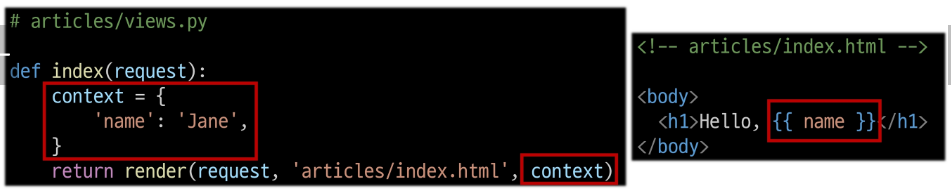

### Django Template Language

Template에서 조건, 반복, 변수 등의 프로그래밍적 기능을 제공하는 시스템

#### 1. Variable

- render 함수의 세번째 인자로 딕셔너리 데이터를 사용
- 딕셔너리 key에 해당하는 문자열이 template에서 사용 가능한 변수명이 됨
- dot('.')를 사용하여 변수 속성에 접근할 수 있음

- {{ variable }} <- 이렇게 나타냄

#### 2. Filters

- 표시할 변수를 수정할 때 사용 (변수 + '|' + 필터)
- chained(연결)이 가능하며 일부 필터는 인자를 받기도 함
- 약 60개의 built-in template filters를 제공

- {{ variable|filter:30 }}

#### 3. Tags

- 반복 또는 논리를 수행하여 제어 흐름을 만듬
- 일부 태그는 시작과 종료 태그가 필요
- 약 24개의 built-in template tags 제공

- 
-  

#### 4. comments

- {# 여기 #}
-  

## 템플릿 상속

- **페이지의 공통요소를 포함**하고, **하위 템플릿이 재정의 할 수 있는 공간**을 정의하는 기본 skeleton 템플릿을 작성하여 상속 구조를 구축

#### 기존 템플릿 구조의 한계

- 만약 모든 템플릿에 bootstrap을 적용하려면?
> 모든 템플릿에 bootstrap CDN을 작성해야 할까?

### 'extends' tag

- 자식(하위)템플릿이 부모 템플릿을 확장한다는 것을 알림
> 반드시 자식 템플릿 최상단에 작성되어야 함 (2개 이상 사용 불가)

- 

### 'block' tag

- 하위 템플릿에서 재정의 할 수 있는 블록을 정의 (상위 템플릿에 작성하며 하위 템플릿이 작성할 수 있는 공간을 지정하는 것)

- 

## HTML form
### 요청과 응답

#### 데이터를 보내고 가져오기

- HTML 'form' element를 통해 사용자와 애플리케이션 간의 상호작용 이해하기
- HTML 'form'은 HTTP 요청을 서버에 보내는 가장 편리한 방법

#### 'form' element

- 사용자로부터 할당된 데이터를 서버로 전송
> 웹에서 사용자 정보를 입력하는 여러 방식 (text, password, checkbox 등)을 제공

#### 'action' & 'method'

- form의 핵심 속성 2가지
- 데이터를 어디(action)로 어떤 방식(method)으로 요청할지

- action
  - 입력 데이터가 전송될 URL을 지정(목적지)
  - 만약 이 속성을 지정하기 않으면 데이터는 현재 form이 있는 페이지의 URL로 보내짐

- method
  - 데이터를 어떤 방식으로 보낼 것인지 정의
  - 데이터의 HTTP request methods (GET, POST)를 지정

#### 'input' element

- 사용자의 데이터를 입력 받을 수 있는 요소
  (type 속성 값에 따라 다양한 유형의 입력 데이터를 받음)

> 핵심 속성 - 'name'

#### 'name' attribute

- input의 핵심 속성
- 사용자가 입력한 데이터에 붙이는 이름(key)
- 데이터를 제출했을 때 서버는 name 속성에 설정된 값을 통해서만 사용자가 입력한 데이터에 접근할 수 있음

#### Query String Parameters

- 사용자의 입력 데이터를 URL 주소에 파라미터를 통해 서버로 보내는 방법
- 문자열은 앰퍼샌드(&)로 연결된 key=value 쌍으로 구성되며, 기본 URL과는 물음표(?)로 구분됨

- 예시
  - http://host:port/path?key=value&key=value

### form 활용

1. throw 로직 작성
  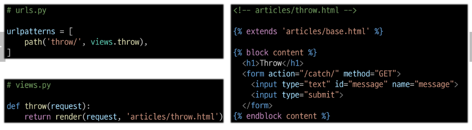

2. catch 로직 작성
  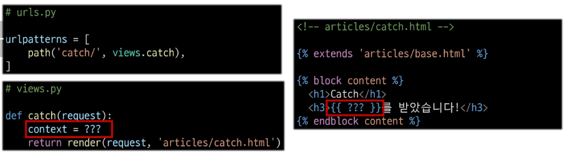

#### HTTP request 객체

- form으로 전송한 데이터 뿐만 아니라 Django로 들어오는 모든 요청 관련 데이터가 담겨있음 (view 함수의 첫번째 인자로 전달됨)

#### request 객체에서 form 데이터 추출

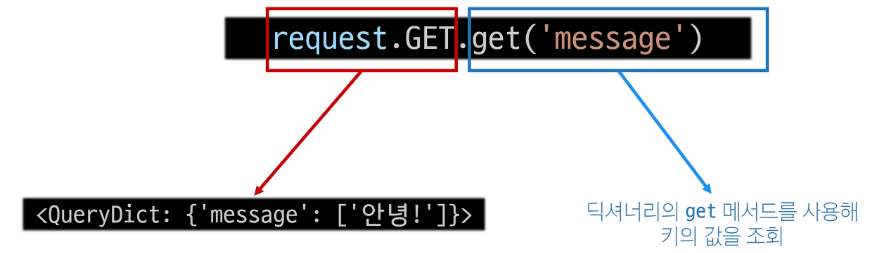

3. catch 로직 마무리

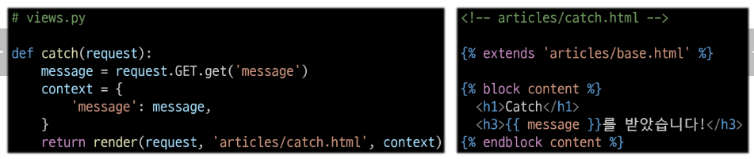

#### throw-catch 간 요청과 응답 정리

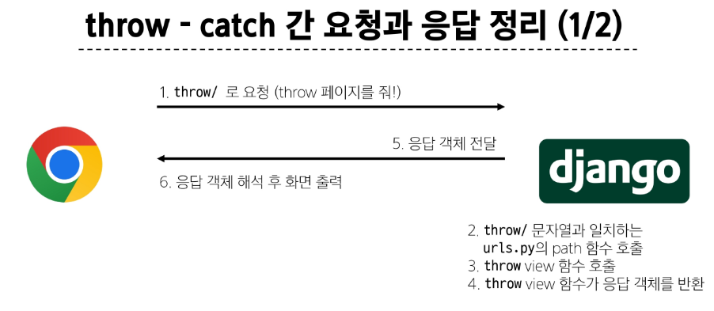
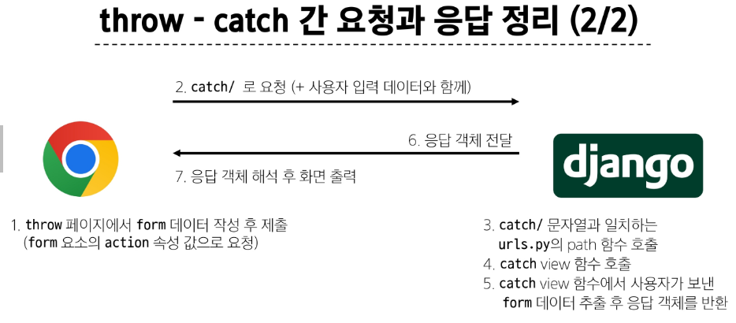

## Django URLs

#### 요청과 응답에서 Django URLs의 역할

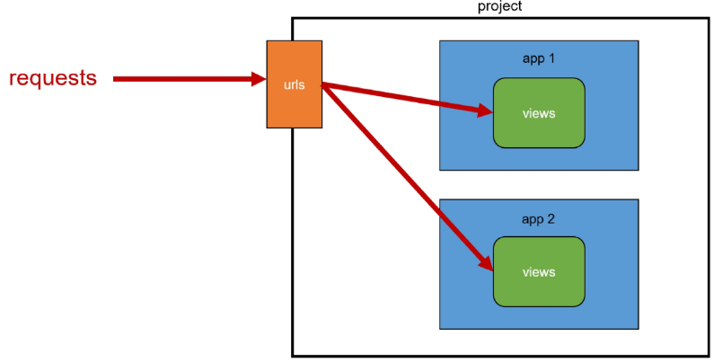

#### URL dispatcher

- URL 패턴을 정의하고 해당 패턴이 일치하는 요청을 처리할 view 함수를 연결(매핑)

### Variable Routing 

- URL 일부에 변수를 포함시키는 것 (변수는 view함수의 인자로 전달할 수 있음)

- 작성법
  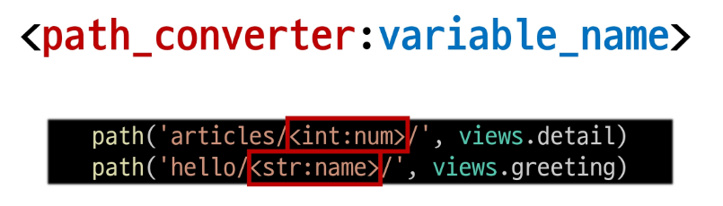

- greeting.html 참고

#### Path converters

- URL 변수의 타입을 지정(str, int 등 5가지 타입 지원)

## App과 URL

### App URL mapping

- 각 앱에 URL을 정의하는 것
> 프로젝트와 각 앱이 URL을 나누어 관리를 편하게 하기 위함
> URL을 각자 app에서 관리

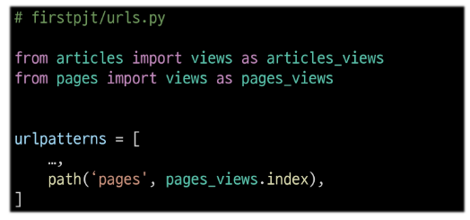

- url 구조 변화
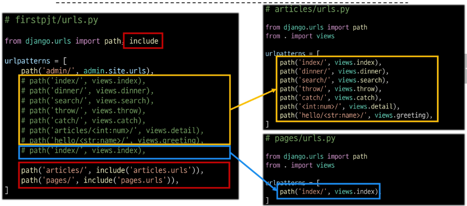

#### include()

- 프로젝트 내부 앱들의 URL을 참조할 수 있도록 매핑하는 함수
> URL의 일치하는 부분까지 잘라내고, 남은 문자열 부분은 후속 처리를 위해 include 된 URL로 전달

### URL 이름 지정

- URL에 이름을 지정하는 것(path 함수의 name 인자를 정의해서 사용)

#### naming URL patterns 적용
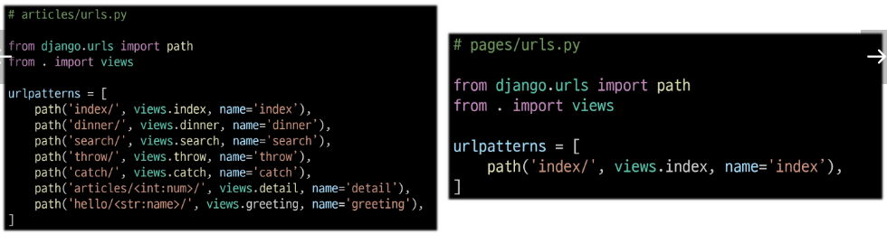

#### URL 표기 변화

- url을 작성하는 모든 곳에서 변경(a 태그의 href 속성 값 뿐만 아니라 form의 action 속성 등도 포함)

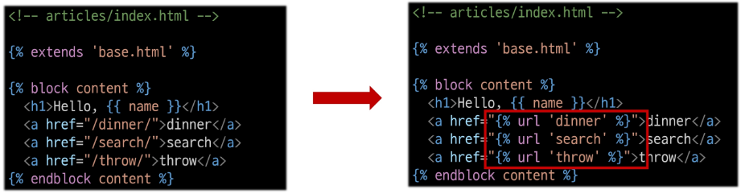

#### 'url' tag

- 주어진 URL 패턴의 이름과 일치하는 절대 경로 주소를 반환
- 

### URL 이름 공간

#### URL 이름 지정 후 남은 문제
- articles 앱의 url 이름과 pages 앱의 url 이름이 같은 상황
- 단순히 이름만으로는 완벽하게 분리할 수 없음

> 이름에 성(key)을 붙이자

- path('index/', views.index, name='index')

#### 'app_name' 속성 지정

- app_name 변수 값 설정
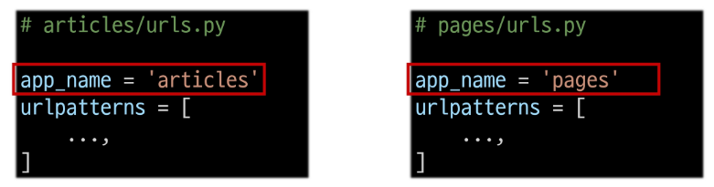

#### URL tag의 최종 변화

- 마지막으로 url 태그가 사용하는 모든 곳의 표기 변경하기
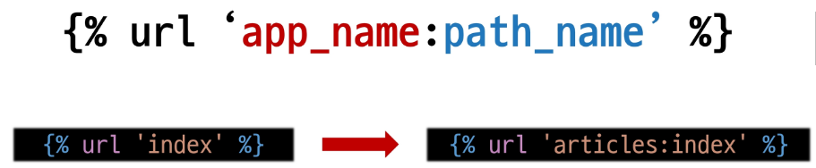