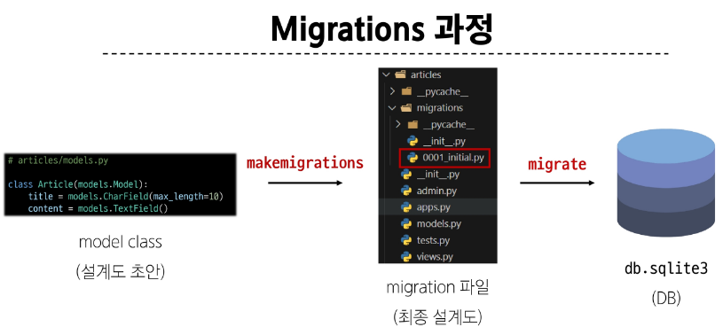
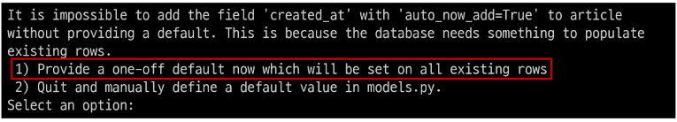
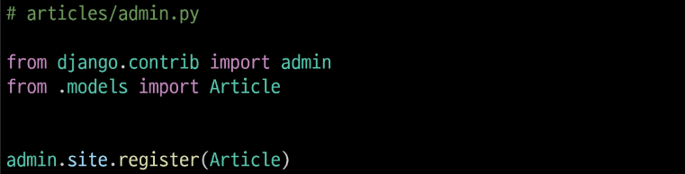

# Model

## Model

- DB의 테이블을 정의하고 데이터를 조작할 수 있는 기능들을 제공
> 테이블 구조를 설계하는 청사진

### Model Class

- 작성한 모델 클래스는 최종적으로 DB에 다음과 같은 테이블 구조를 만듬
  - id 필드는 Django 가 자동생성

- django.db.models 모듈의 Model이라는 부모 클래스를 상속받음
- Model은 model에 관련된 모든 코드가 이미 작성 되어있는 클래스

> 개발자는 가장 중요한 테이블 구조를 어떻게 설계할지에 대한 코드만 작성하도록 하기 위한 것(상속을 활용한 프레임워크의 기능 제공)

- 클래스 변수명
  - 테이블의 각 "필드(열) 이름" (ex. title, content)

- Model Field
  - 데이터베이스 테이블의 열을 나타내는 중요한 구성 요소
  - "데이터의 유형"과 "제약 조건"을 정의

```py
class Article(models.Model):   
    title = models.CharField(max_length=10)
    content = models.TextField
```

## Model Field

- DB 테이블의 필드(열)을 정의하며, 해당 필드에 저장되는 데이터 타입과 제약조건을 정의

### Model Field 구성

1. Field types (필드 유형)
  - 데이터 베이스에 저장될 "데이터의 종류"를 정의

2. Field options (필드 옵션)
  - 필드의 "동작"과 "제약 조건"을 정의

### Field Types

- 데이터베이스에 저장될 "데이터의 종류"를 정의 (models 모듈의 클래스로 정의되어 있음)

#### 주요 필드 유형

- 문자열 필드
  - CharField, TextField

- 숫자 필드
  - IntegerField, FloatField

- 날짜/시간 필드
  - DateField, TimeField, DateTimeField

- 파일 관련 필드
  - FileField, ImageField

#### CharField()

제한된 길이의 문자열을 저장(필드의 최대 길이를 결정하는 max_length는 필수 옵션)

#### TextField()

길이 제한이 없는 대용량 텍스트를 저장(무한대는 아니며 사용하는 시스템에 따라 달라짐)

### Field Options

- 필드의 동작과 제약 조건을 정의

#### 주요 필드 옵션

- null 
  - 데이터베이스에서 NULL 값을 허용할지 여부를 결정 (기본값: False)

- blank
  - form에서 빈 값을 허용할지 여부를 결정 (기본값: False)

- default
  - 필드의 기본값을 설정

#### 제약조건 (constraint)

- 특정 규칙을 강제하기 위해 테이블의 열이나 행에 적용되는 규칙이나 제한사항
> ex) 숫자만 저장되도록, 문자가 100자 까지만 저장되도록 하는 등

## Migrations

- model 클래스의 변경사항(필드 생성, 수정 삭제 등)을 DB에 최종 반영하는 방법

### Migrations 과정



- 두가지 과정을 거쳐서 진행: makemigrations, migrate

#### Migrations 핵심 명령어 2가지

- model class를 기반으로 최종 설계도(migration) 작성

```py
python manage.py makemigrations
```
- 최종 설계도를 DB에 전달하여 반영

```py
python manage.py migrate
```

### 추가 모델 필드 작성

```py
class Article(models.Model):
    title = models.CharField(max_length=10)
    content = models.TextField()
    created_at = models.DateTimeField(auto_now_add=True)
    updated_at = models.DateTimeField(auto_now=True)
```

- 이미 기존 테이블이 존재하기 때문에 필드를 추가 할 때 필드의 기본 값 설정이 필요
- **1번**은 현재 대화를 유지하면서 직접 기본 값을 입력하는 방법
- 2번은 현재 대화에서 나간 후 models.py에 기본 값 관련 설정을 하는 방법



- 추가하는 필드의 기본 값을 입력해야 하는 상황
- 날짜 데이터이기 때문에 직접 입력하기 보다 Django가 제안하는 기본 값을 사용하는 것을 권장
- 아무것도 입력하지 않고 enter를 누르면 Django가 제안하는 기본 값으로 설정됨

- migrations 과정 종료 후 2번째 migration 파일이 생성됨을 확인
- 이처럼 Django는 설계도를 쌓아가면서 추후 문제가 생겼을 시 복구하거나 되돌릴 수 있도록 함

> model class에 변경사항(1)이 생겼다면, 반드시 새로운 설계도를 생성(2)하고, 이를 DB에 반영(3)해야 한다.

#### DateTimeField의 필드 옵션

- auto_now 
  - 데이터가 저장될 때마다 자동으로 현재 날짜시간을 저장

- auto_now_add
  - 데이터가 처음 생성될 때만 자동으로 현재 날짜시간을 저장

## Admin site

### Automatic admin interface

- Django가 추가 설치 및 설정 없이 자동으로 제공하는 관리자 인터페이스
> 데이터 확인 및 테스트 등을 진행하는데 매우 유용

1. admin 계정 생성

  - email은 선택사항이기 때문에 입력하지 않고 진행 가능
  - 비밀번호 입력시 보안상 터미널에 출력되지 않으니 무시하고 입력 이어가기

  ```py
  python manage.py createsuperuser
  ```

2. DB에 생성된 admin 계정 확인

  - db.sqlite3 > Tables > auth_user : 에서 확인 가능

3. admin에 모델 클래스 등록

  - admin.py에 작성한 모델 클래스를 등록해야만 admin site에서 확인 가능

  

4. admin site 로그인 후 등록된 모델 클래스 확인
5. 데이터 생성, 수정, 삭제 테스트
6. 테이블 확인

## 참고

### 데이터베이스 초기화

1. migration 파일 삭제
2. db.sqlite3 파일 삭제

> migrations 폴더, __init__.py 삭제하면 안됨!! 

### Migrations 기타 명령어

```py
python manage.py showmigrations
```
- migrations 파일들이 migrate 됐는지 안됐는지 여부를 확인하는 명령어
- [x] 표시가 있으면 migrate가 완료되었음을 의미

```py
python manage.py sqlmigrate articles 0001
```
- 해당 migrations 파일이 SQL 언어(DB에서 사용하는 언어)로 어떻게 번역되어 DB에 전달되는지 확인하는 명령어