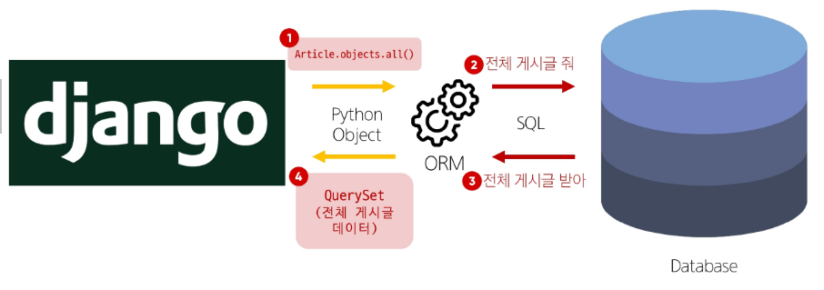
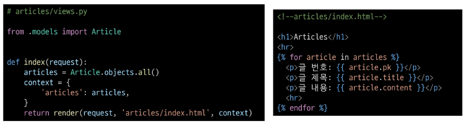

# Orm

## Orm

- 객체 지향 프로그래밍 언어를 사용하여 호환되지 않는 유형의 시스템 간에 데이터를 변환하는 기술

### ORM의 역할

- Django와 DB간에 사용하는 언어가 다르기 때문에 소통 불가
- Django에 내장된 ORM이 중간에서 이를 해석

## QuerySet API

- ORM에서 데이터를 검색, 필터링, 정렬 및 그룹화 하는데 사용하는 도구
> API를 사용하여 SQL이 아닌 Python 코드로 데이터를 처리

**python의 모델 클래스와 인스턴스를 활용해 DB에 데이터를 저장, 조회, 수정, 삭제하는 것**

### QuerySet API 구문

Article.objects.all()

- Article : Model class
- objects : Manager
- all() : Queryset API

#### QuerySet API 구문 동작 예시



### Query

- 데이터베이스에 특정한 데이터를 보여 달라는 요청
- "쿼리문을 작성한다" 
  > 원하는 데이터를 얻기 위해 데이터베이스에 요청을 보낼 코드를 작성한다.

- 파이썬으로 작성한 코드가 ORM에 의해 SQL로 변환되어 데이터베이스에 전달되며, 데이터베이스의 응답 데이터를 ORM이 QuerySet이라는 자료 형태로 변환하여 우리에게 전달

### QuerySet

- 데이터베이스에게서 전달 받은 객체 목록(데이터 모음)
  - 순회가 가능한 데이터로써 1개 이상의 데이터를 불러와 사용할 수 있음

- Django ORM을 통해 만들어진 자료형
- 단, 데이터베이스가 단일한 객체를 반환 할 때는 QuerySet이 아닌 모델(class)의 인스턴스로 반환됨

### CRUD

소프트웨어가 가지는 기본적인 데이터 처리 기능

- Create (저장), Read (조회), Update(갱신), Delete(삭제)

## QuerySet API 실습 
### 사전 준비

```bash
# 설치
pip install ipython
pip install django-extensions

# 설치된거 txt에 기록
pip freeze > requirements.txt

# setttings.py 에 꼭 기입하기

INSTALLED_APPS = [
    'articles',
    'django_extensions',

# migrate
python manage.py migrate

# shell 실행
python manage.py shell_plus

```

#### Django shell

- Django 환경 안에서 실행되는 python shell(입력하는 QuerySet API 구문이 Django 프로젝트에 영향을 미침)

### Create

#### 데이터 객체를 만드는 3가지 방법

- 첫번째 방법

```shell

# 특정 테이블에 새로운 행을 추가하여 데이터 추가

>>> article = Article()  # Article(class)로 부터 article(instance) 생성
>>> article
<Article: Article object (None)>

>>> article.title = 'first'       # 인스턴스 변수(title)에 값을 할당
>>> article.content = 'django!'   # 인스턴스 변수(content)에 값을 할당

# save를 하지 않으면 아직 DB에 값이 저장되지 않음
# save를 호출하고 확인하면 저장된 것을 확인
>>> article.save()

>>> article.id
>>> article.pk    # 이걸로 게시글이 작성된 숫자 확인

>>> Article.objects.all()
<QuerySet [<Article: Article object (1)>]>

# 인스턴스 article을 활용하여 인스턴스 변수 활용하기
>>> article.title   # 게시글 제목
>>> article.content # 게시글 내용
>>> article.created_at  # 게시글 언제 작성되었는지
```

- 두번째 방법

```shell
>>> article = Article(title='second', content='django')

>>> article.save()

>>> Article.objects.all()
<QuerySet [<Article: Article object (1)>, <Article: Article object (2)>]>
```

- 세번째 방법

```shell
# 인스턴스에 할당 되는 과정 없이 바로 저장
# 위 2가지 방법과 달리 바로 저장 이후 바로 생성된 데이터가 반환된다

>>> Article.objects.create(title='third', content='django!')
<Article: Article object (3)>

>>> Article.objects.all()
<QuerySet [<Article: Article object (1)>, <Article: Article object (2)>, <Article: Article object (3)>]>
```

### Read

#### 대표적인 조회 메서드

- Return new QuerySets
  - all()
  - filter()

- Do not return QuerySets
  - get()

#### all()

- 전체 데이터 조회
- >>> Article.objects.all()

#### filter()

- 주어진 매개변수와 일치하는 객체를 포함하는 QuerySet 반환
```shell
>>> Article.objects.filter(content='django!')
<QuerySet [<Article: Article object (1)>, <Article: Article object (2)>, <Article: Article object (3)>]>

>>> Article.objects.filter(title='abc')
<QuerySet []>     # 없어도 빈 QuerySet 반환

# 만약 값이 30 이하인거 찾고 싶을 때,,
title__lte  >> 이런 식으로 사용하기, 공식문서 참고 
```

#### get()

- 주어진 매개변수와 일치하는 객체를 반환
> 위와 같은 특징을 가지고 있기 때문에 **primary key**와 같이 고유성을 보장하는 조회에서 사용해야함

```shell
# pk로 조회
>>> Article.objects.get(pk=1)
<Article: Article object (1)>

# 없으면 예외 발생
>>> Article.objects.get(pk=100)
DoesNotExist: Article matching query does not exist.

# 여러개있으면 예외 발생
>>> Article.objects.get(content='django!')
MultipleObjectsReturned: get() returned more than one Article -- it returned 3! 

# 고유한 게시물만 조회 가능!!!
```

### Update

#### 데이터 수정

- 인스턴스 변수를 변경 후 save 메서드 호출

```shell
# 수정할 인스턴스 조회
>>> article = Article.objects.get(pk=2)

# 인스턴스 변수를 변경
>>> article.title = 'byebye'

# 저장!!! 꼭하기!!!
>>> article.save()

# 바뀐거 확인 가능
>>> article.title()
'byebye'
```

### Delete

#### 데이터 삭제

- 삭제하려는 데이터 조회 후 delete 메서드 호출

```shell
# 삭제할 인스턴스 조회
>>> article = Article.objects.get(pk=1)

# delete 메서드 호출 (삭제 된 객체가 반환)
>>> article.delete()
(1, {'articles.Article': 1})

# 삭제한 데이터는 더이상 조회할 수 없음
>>> Article.objects.get(pk=2)
DoesNotExist: Article matching query does not exist.

# 삭제 후 pk 숫자 재 이용 하지 않음. 한 번 사용한 숫자는 재활용 x

# exit 사용하면 빠져나옴
```

## ORM with view

- Django shell에서 연습했던 QuerySet API를 직접 view 함수에서 사용하기

### 전체 게시글 조회

- urls.py 에서 include 처리해서 articles 에 urls.py 따로 생성
- 그리고 아래와 같이 정보 가져오기 



## 참고

### Field lookups

- query에서 조건을 구성하는 방법
- QuerySet 메서드 filter(), exclude() 및 get()에 대한 키워드 인자로 지정됨

```shell
# 내용에 'dja'가 포함된 모든 게시글 조회
Article.objects.filter(content__contains='dja')

# 제목이 he로 시작하는 모든 게시글 조회
Article.objects.filter(title__satrtswith='he')
```

### ORM, QuerySet API를 사용하는 이유

1. 데이터베이스 추상화
  - 개발자는 특정 데이터베이스 시스템에 종속되지 않고 일관된 방식으로 데이터를 다룰 수 있음

2. 생산성 향상
  - 복잡한 SQL 쿼리를 직접 작성하는 대신 python 코드로 데이터베이스 작업을 수행할 수 있음

3. 객체 지향적 접근
  - 데이터베이스 테이블을 python 객체로 다룰 수 있어 객체 지향 프로그래밍의 이점을 활용할 수 있음