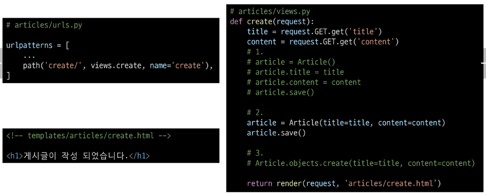

# ORM with view

- Django shell에서 연습했던 QuerySet API를 직접 view 함수에서 사용하기

## Read

### 전체 게시글 조회

- urls.py 에서 include 처리해서 articles 에 urls.py 따로 생성
- 그리고 아래와 같이 정보 가져오기 

### 단일 게시글 조회

- 고유한 primary key 활용

- 단일 게시글 조회

- 단일 게시글 페이지 링크 작성

## Create

- create 로직 사용하기 위해 view 함수 2개 필요함
  - new(사용자 입력 데이터를 받을 페이지를 렌더링), create(사용자가 입력한 요청 데이터를 받아 DB에 저장)

## HTTP request methods

#### HTTP 

- 네트워크 상에서 데이터(리소스)를 주고 받기 위한 약속

### HTTP request methods

- 데이터에 대해 수행을 원하는 작업(행동)을 나타내는 것
  - 서버에게 원하는 작업의 종류를 알려주는 역할

- 클라이언트가 웹 서버에 특정 동작을 요청하기 위해 사용하는 표준 명령어

- 대표 메서드 
  - GET, POST

### GET Method

- 서버로부터 데이터를 요청하고 받아오는데(조회) 사용

#### GET Method 특징

**조회 할 때만 사용**

1. 데이터 전송
  - URL의 쿼리 문자열(Query String)을 통해 데이터를 전송
  - http://127.0.0.1:8000/articles/create/?title=제목&content=내용

2. 데이터 제한
  - URL 길이에 제한이 있어 대량의 데이터 전송에는 적합하지 않음

3. 브라우저 히스토리
  - 요청 URL이 브라우저 히스토리에 남음

4. 캐싱
  - 브라우저는 GET 요청의 응답을 로컬에 저장할 수 있음
  - 동일한 URL로 다시 요청할 때, 서버에 접속하지 않고 저장된 결과를 사용
  - 페이지 로딩 시간을 크게 단축

#### GET Method 사용 예시

- 검색 쿼리 전송
- 웹 페이지 요청
- API에서 데이터 조회

### POST Method

- 서버에 데이터를 제출하여 리소스를 변경(생성, 수정, 삭제) 하는데 사용

#### POST Method 특징

**데이터 생성이나 수정에 사용**

1. 데이터 전송
  - HTTP Body를 통해 데이터를 전송

2. 데이터 제한
  - GET에 비해 더 많은 양의 데이터를 전송할 수 있음

3. 브라우저 히스토리
  - POST 요청은 브라우저 히스토리에 남지 않음

4. 캐싱
  - POST 요청은 기본적으로 캐시 할 수 없음
  - POST 요청이 일반적으로 서버의 상태를 변경하는 작업을 수행하기 때문

#### POST Method 사용 예시

- 로그인 정보 제출
- 파일 업로드
- 새 데이터 생성(새 게시글 작성)
- API에서 데이터 변경 요청

## HTTP response status code

- 서버가 클라이언트의 요청에 대한 처리 결과를 나타내는 3자리 숫자

- 클라이언트에게 요청 처리 결과를 명확히 전달
- 문제 발생 시 디버깅에 도움
- 웹 애플리케이션의 동작을 제어하는데 사용

### 403 Forbidden

- 서버에 요청이 전달되었지만, **권한** 때문에 거절되었다는 것을 의미

- CSRF token이 누락되었다 라는 응답 -> 거절됨

### CSRF

- Cross-Site-Request-Forgery
- 사이트 간 요청 위조

> 사용자가 자신의 의지와 무관하게 공격자가 의도한 행동을 하여 특정 웹 페이지를 보안에 취약하게 하거나 수정, 삭제 등의 작업을 하게 만드는 공격 방법

### CSRF Token 적용

- DTL의 csrf_token 태그를 사용해 손쉽게 사용자에게 토큰 값을 부여
- 요청시 토큰 값도 함께 서버로 전송될 수 있도록 함

#### 요청시 CSRF Token을 함께 보내야 하는 이유

- Django 서버는 해당 요청이 DB에 데이터를 하나 생성하는 (DB에 영향을 주는) 요청에 대해 "Django가 직접 제공한 페이지에서 데이터를 작성하고 있는 것인지"에 대한 확인 수단이 필요한 것
- 것모습이 똑같은 위조 사이트나 정상적이지 않은 요청에 대한 방어 수단

- 기존
  - 요청 데이터 -> 게시글 작성

- 변경
  - 요청 데이터 + 인증 토큰 -> 게시글 작성

#### 왜 POST 일때만 Token을 확인?

- POST는 단순 조회를 위한 GET과 달리 특정 리소스에 변경 (생성, 수정, 삭제)을 요구하는 의미와 기술적인 부분을 가지고 있기 때문

- DB에 조작을 가하는 요청은 반드시 인증 수단이 필요

> 데이터베이스에 대한 변경사항을 만드는 요청이기 때문에 토큰을 사용해 최소한의 신원 확인을 하는 것

### Redirect

- POST 요청에 대한 페이지를 응답하는거 매우 어색한 방법임

- 서버는 데이터 저장 후 페이지를 응답하는 것이 아닌 사용자를 적절한 기존 페이지로 보내야한다.
  - 사용자를 보낸다 -> 사용자가 GET 요청을 한 번 더 보내도록 해야한다.

> 실제로 서버가 클라이언트를 직접 다른 페이지로 보내는 것이 아닌 클라이언트가 GET 요청을 한번 더 보내도록 응답하는 것

- 클라이언트가 인자에 작성된 주소로 다시 요청을 보내도록 하는 함수

#### redirect 동작 원리

1. redirect 응답을 받은 클라이언트는 detail url로 다시 요청을 보내게 됨

2. 결과적으로 detail view 함수가 호출되어 detail view 함수의 반환 결과인 detail 페이지를 응답 받게 되는 것

> 결국 사용자는 게시글 작성 후 작성된 게시글의 detail 페이지로 이동하는 것으로 느끼게 됨

### Delete

- delete 기능 구현

### Update

- update 로직을 구현하기 위해 필요한 view 함수 개수? 2개
  - 사용자 입력 데이터를 받을 페이지를 렌더링(edit)
  - 사용자가 입력한 데이터를 받아 DB에 저장(update)

