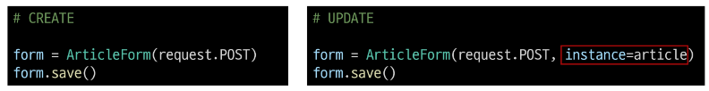
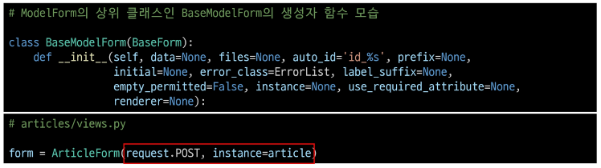

# Form

## Django Form
### 개요

#### HTML'form'

지금까지 사용자로부터 데이터를 제출 받기위해 활용한 방법 그러나 비정상적 혹은 악의적인 요청을 필터링 할 수 없음
> 유효한 데이터인지에 대한 확인이 필요

#### 유효성 검사

수집한 데이터가 정확하고 유효한지 확인하는 과정

- 유효성 검사를 구현하기 위해서는 입력 값, 형식, 중복, 범위, 보안 등 많은 것들을 고려해야 함
> 이런 과정과 기능을 직접 개발하는 것이 아닌 Django가 제공하는 Form을 사용

### Django Form

사용자 입력 데이터를 수집하고, 처리 및 유효성 검사를 수행하기 위한 도구
> 유효성 검사를 단순화하고 자동화 할 수 있는 기능을 제공

#### Form class

1. forms.py 생성

```py
from django import forms

class ArticleForm(forms.Form):
  title = forms.CharField(max_length=10)
  content = forms.CharField()
```

2. view 함수 new 변경

```py
def new(request):
    form = ArticleForm()
    context = {
        'form' : form
    }
    return render(request, 'articles/new.html', context)
```

3. new 페이지에서 form 인스턴스 출력
- form.as_p : p태그로 감싸줘서 각각 다른 줄에 나타냄

```html
<form action="" method="POST">
    
    {{ form.as_p }}   
    <input type="submit">
  </form>
```

#### Widgets

- HTML 'input' element의 표현을 담당
- widget은 단순히 input 요소의 속성 및 출력되는 부분을 변경하는 것

```py
# 이런식으로 사용가능
content = forms.CharField(widget=forms.Textarea)
```

## Django ModelForm

- Form : 사용자 입력 데이터를 DB에 저장하지 않을 때 (ex. 검색, 로그인)

- ModelForm : 사용자 입력 데이터를 DB에 저장해야 할 때 (ex. 게시글 작성, 회원가입)

### ModelForm

Model과 연결된 Form을 자동으로 생성해주는 기능을 제공
> Form + Model

#### ModelForm class

- 알아서 Model에 기반한 Form 만들어줌

```py
from django import forms
from .models import Article

class ArticleForm(forms.ModelForm):
    class Meta:
        model = Article
        fields = '__all__'
```

### Meta class

- ModelForm의 정보를 작성하는 곳

#### fields 및 exclude 속성

- exclude 속성을 사용하여 모델에서 포함하지 않을 필드를 지정할 수 있음

```py
class ArticleForm(forms.ModelForm):
    class Meta:
        model = Article
        exclude = ('title',)
```
#### Meta class 주의사항

- Django에서 ModelForm에 대한 추가 정보나 속성을 작성하는 클래스 구조를 Meta 클래스로 작성 했을 뿐이며, 파이썬의 inner class와 같은 문법적인 관점으로 접근하지 말 것

### ModelForm 적용

```py
def create(request):
    # 1. 모델폼 인스턴스 생성 (+ 사용자 입력 데이터를 통째로 인자로 작성)
    form = ArticleForm(request.POST)
    
    # 2. 유효성 검사
    if form.is_valid():
        # 3. 저장
        article = form.save()
        return redirect('articles:detail', article.pk)
    # 유효성 검사 실패하면 이유 넘겨주면서 다시 new 페이지 렌더링함
    context = {
        'form' : form,
    }
    return render(request, 'articles/new.html', context)
```

#### is_valid()

여러 유효성 검사를 실행하고, 데이터가 유효한지 여부를 Boolean으로 반환

- 모델 필드에는 기본적으로 빈 값은 허용하지 않는 제약조건이 설정되어있음
- 빈 값은 is_valid()에 의해 False로 평가되고 form 객체에는 그에 맞는 에러 메세지가 포함되어 다음 코드로 진행됨

#### ModelForm을 적용한 edit 로직

```py
# articles/views.py

def edit(request, pk):
    article = Article.objects.get(pk=pk)
    form = ArticleForm(instance=article)
    context = {
        'article': article,
        'form' : form,
    }
    return render(request, 'articles/edit.html', context)
```

```html
<!-- articles/edit.html -->

<form action="" method="POST">
  
  {{ form.as_p }}
  <input type="submit" value="수정">
</form>
```

#### ModelForm을 적용한 update 로직

```py
def update(request, pk):
    # 1. 어떤 게시글 수정할지 조회
    article = Article.objects.get(pk=pk)

    # 2. 모델폼 인스턴스 생성 (+ 사용자 입력 데이터 & 기존 데이터)
    form = ArticleForm(request.POST, instance=article)
    
    # 3. 유효성 검사
    if form.is_valid():
        form.save()
        return redirect('articles:detail', article.pk)
    context = {
        'article' : article,
        'form' : form,
    }
    return render(request, 'articles/edit.html', context)
```

#### save()

데이터베이스 객체를 만들고 저장하는 ModelForm의 인스턴스 메서드

- save() 메서드가 생성과 수정을 구분하는 법
  - 키워드 인자 instance 여부를 통해 생성할지, 수정할지를 결정



## HTTP 요청 다루기

**HTTP request method 차이점을 활용해 동일한 목적을 가지는 2개의 view 함수를 하나로 구조화**

### new & create 함수 결합

#### new & create view 함수간 공통점과 차이점

- 공통점: 데이터 생성을 구현
- 차이점: new는 GET method 요청만을, create는 POST method 요청만을 처리

#### 새로운 create view 함수

```py
def create(request):
    # 요청 메서드가 POST일 때
    # 기존 create
    if request.method == "POST":
        form = ArticleForm(request.POST)
        if form.is_valid():
            article = form.save()
            return redirect('articles:detail', article.pk)
    # 요청 메서드가 POST가 아닐때 (GET, PUT, DELETE)
    # 기존 new
    else:
        form = ArticleForm()
    context = {
        'form':form,
    }
    return render(request, 'articles/create.html', context)
```

- 기존에 있던 new의 흔적들 다 없애주기, 경로변경, 이름변경

#### request method에 따른 요청의 변화

- GET -> articles/create/ -> 게시글 생성 페이지를 줘!
- POST -> articles/create/ -> 게시글을 생성해줘

### edit & update 함수 결합

#### 새로운 update view 함수

```py
def update(request, pk):
    article = Article.objects.get(pk=pk)
    if request.method == "POST":
        form = ArticleForm(request.POST, instance=article)
        if form.is_valid():
            form.save()
            return redirect('articles:detail', article.pk)
    else:
        form = ArticleForm(instance=article)
    context = {
        'article': article,
        'form' : form,
    }
    return render(request, 'articles/edit.html', context)
```

## 참고

### ModelForm의 키워드 인자 구성

- data는 첫번째에 위치한 키워드 인자이기 때문에 생략 가능
- instance는 9번째에 위치한 키워드 인자이기 때문에 생략할 수 없었음



### Widgets 응용

```py
class ArticleForm(forms.ModelForm):
    # widget 쓰려면 form 형태로 써야함..
    title = forms.CharField(
        label='제목',
        widget=forms.TextInput(
            attrs={
                'class':'my-title',
                'placeholder': 'Enter the title',
                'maxlength' : 10,
            }
        ),
    )
    content = forms.CharField(
        label='내용',
        widget=forms.Textarea(
            attrs={
                'class': 'my-content',
                'placeholder':'Enter the content',
                'rows': 5,
                'cols': 50,
            }
        ),
        error_messages={'required' : '내용을 입력해주세요.'}
    )
```
