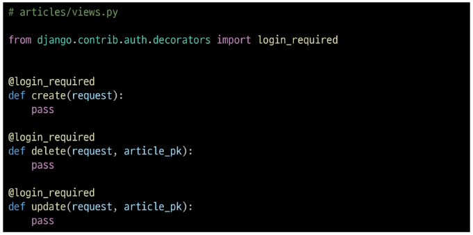
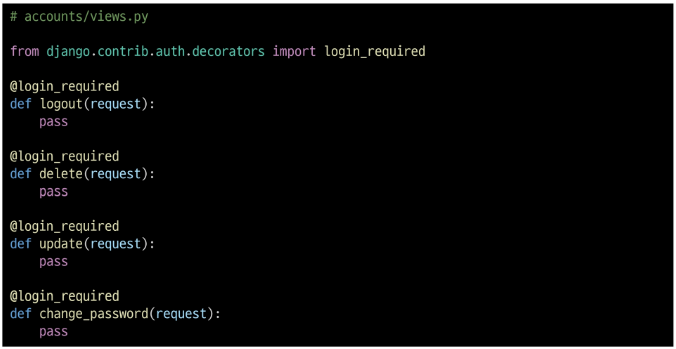

# Authentication System
## Cookie & Session

### HTTP

- HTML 문서와 같은 리소스들을 가져올 수 있도록 해주는 규약
- 웹(www)에서 이루어지는 모든 데이터 교환의 기초

1. 비연결지향(connectionless)
  - 서버는 요청에 대한 응답을 보낸 후 연결을 끊음

2. 무상태(stateless)
  - 연결을 끊는 순간 클라이언트와 서버 간의 통신이 끝나며 상태 정보가 유지되지 않음
    - 상태가 없다는 것은... 장바구니 상품 유지x, 로그인 상태 유지x
  
### 쿠키

- 서버가 사용자의 웹 브라우저에 전송하는 작은 데이터 조각

> 서버가 제공하여 클라이언트 측에서 저장되는 작은 데이터 파일
> 사용자 인증, 추적, 상태 유지등에 사용되는 데이터 저장 방식

#### 쿠키 동작 예시

1. 브라우저가 웹 서버에 웹 페이지를 요청
2. 웹 서버는 요청된 페이지와 함께 쿠키는 포함한 응답을 브라우저에게 전송
3. 브라우저는 받은 쿠키를 저장소에 저장. 쿠키의 속성(만료시간, 도메인, 주소)도 함께 저장됨
4. 이후 브라우저가 같은 웹 서버에 웹 페이지를 요청할 때 저장된 쿠키 중 해당 요청에 적용 가능한 쿠키를 포함하여 함께 전송 
5. 웹 서버는 받은 쿠키 정보를 확인하고, 필요에 따라 사용자 식별, 세션 관리 등을 수행

6. 웹 서버는 요청에 대한 응답을 보내며, 필요한 경우 새로운 쿠키를 설정하거나 기존 쿠키를 수정할 수 있음

#### 쿠키의 작동 원리와 활용

1. 쿠키 저장 방식
  - 브라우저(클라이언트)는 쿠키를 key-value 의 데이터 형식으로 저장
  - 쿠키에는 이름, 값 외에도 만료시간, 도메인, 경로 등의 추가 속성이 포함됨

2. 쿠키 전송 과정 
  - 서버는 HTTP 응답 헤더의 set-cookie 필드를 통해 클라이언트에게 쿠키를 전송
  - 브라우저는 받은 쿠키를 저장해 두었다가, 동일한 서버에 재요청시 HTTP 요청 Header의 Cookie 필드에 저장된 쿠키를 함께 전송

3. 쿠키의 주요 용도
  - 두 요청이 동일한 브라우저에서 들어왔는지 아닌지를 판단할 때 주로 사용됨
  - 이를 이용해 사용자의 로그인 상태를 유지할 수 있음
  - 상태가 없는 HTTP 프로토콜에서 상태 정보를 기억시켜 주는 역할

  > 서버에게 나 로그인된 사용자야 라는 인증 정보가 담긴 쿠키를 매요청마다 계속 보내는 것

#### 쿠키 사용 목적

1. 세션 관리
  - 로그인, 아이디 자동완성, 공지 하루 안 보기, 팝업 체크, 장바구니 등의 정보 관리

2. 개인화
  - 사용자 선호 설정(언어 설정, 테마 등) 저장

3. 트래킹
  - 사용자 행동을 기록 및 분석

### 세션

- 서버 측에서 생성되어 클라이언트와 서버 간의 상태를 유지 상태 정보를 저장하는 데이터 저장 방식
> 쿠키에 세션 데이터를 저장하여 매 요청시마다 세션 데이터를 함께 보냄

#### 세션 작동 원리

1. 클라이언트가 로그인 요청 후 인증에 성공하면 서버가 session 데이터를 생성 후 저장
2. 생성된 session 데이터에 인증할 수 있는 session id를 발급
3. 발급한 session id를 클라이언트에게 응답
4. 클라이언트는 응답 받은 session id를 쿠키에 저장
5. 클라이언트가 다시 동일한 서버에 접속하면 요청과 함께 쿠키(session id)를 서버에 전달
6. 쿠키는 요청 때 마다 서버에 함께 전송 되므로 서버에서 session id를 확인해 로그인 되어있다는 것을 계속해서 확인하도록 함

- 서버 측에서는 세션 데이터를 생성 후 저장하고 이 데이터에 접근할 수 있는 세션 id를 생성
- 이 id를 클라이언트 측으로 전달하고, 클라이언트는 쿠키에 이 id에 저장
- 이후 클라이언트가 같은 서버에 재요청 시마다 저장해 두었던 쿠키도 요청과 함께 전송

> 예를 들어 로그인 상태 유지를 위해 로그인 되어있다는 사실을 입증하는 데이터를 매 요청마다 계속해서 보내는 것

#### 쿠키와 세션의 목적

- 클라이언트와 서버 간의 상태 정보를 유지하고 사용자를 식별하기 위해 사용

### Django Authentication System

- 사전 준비
  - 두번째 app accounts 생성 및 등록
  - app폴더 urls.py 만들기

#### Authentication(인증)

- 사용자가 자신이 누구인지 확인하는 것

## Custom User model
### User model 대체하기

- 우리는 지금까지 별도의 User 클래스 정의 없이 내장된 auth 앱에 작성된 User 클래스를 사용했음
- Django의 기본 User 모델은 username, password 등 제공되는 필드가 매우 제한적
- 추가적인 사용자 정보가 필요하다면 이를 위해 기본 User Model 을 변경하기 어려움
  - 별도의 설정 없이 사용할 수 있어 간편하지만, 개발자가 직접 수정하기 어려움

1. AbstractUser 클래스를 상속받는 커스텀 User 클래스 작성

> 기존 User 클래스도 AbstractUser를 상속받기 때문에 **커스텀 User 클래스도 기존 User 클래스와 완전히 같은 모습을 가지게 됨**

```py
# accounts/models.py

from django.contrib.auth.models import AbstractUser

class User(AbstractUser):
    pass
```

2. django 프로젝트에서 사용하는 기본 User 모델을 우리가 작성한 User 모델로 사용할 수 있도록 AUTH_USER_MODEL 값을 변경
  - 수정 전 기본 값은 'auth.User'

```py
# settings.py

AUTH_USER_MODEL = 'accounts.User'
```

3. admin site에 대체한 User 모델 등록
  - 기본 User 모델이 아니기 때문에 등록하지 않으면 admin 페이지에 출력되지 않기 때문ㅇ

```py
# accounts/admin.py

from django.contrib import admin
from django.contrib.auth.admin import UserAdmin
from .models import User

admin.site.register(User, UserAdmin)
```
#### AUTH_USER_MODEL

- django 프로젝트의 User를 나타내는데 사용하는 모델을 지정하는 속성

**!! 주의 !!**
- 프로젝트 중간에 AUTH_USER_MODEL을 변경 할 수 없음
- 프로젝트를 시작하며 반드시 User 모델을 대체해야한다.

- 커스텀 User 모델을 설정하는 것을 강력하게 권장하고있음
- 커스텀 User 모델은 기본 User 모델과 동일하게 작동하면서도, 필요한 경우 나중에 맞춤 설정 할 수 있기 때문

#### User Model 대체의 필요성 (중요!)

- 프로젝트의 특정 요구사항에 맞춰 사용자 모델을 확장할 수 있음
- 예를 들어 이메일을 username으로 사용하거나, 다른 추가필드를 포함시킬 수 있음

### Login

- 로그인은 session을 create 하는 과정

- 로그인 로직

```py
# accouts/views.py
from django.shortcuts import render, redirect
from django.contrib.auth.forms import AuthenticationForm
from django.contrib.auth import login as auth_login

def login(request):
    if request.method == 'POST':
        # 로그인 로직 작성
        # ModelForm이 아니라, Form 이기 때문에 request 먼저 작성해줘야함
        form = AuthenticationForm(request, request.POST)
        if form.is_valid():
            # 만약 인증된 사용자라면 로그인 진행(세션 데이터 생성)
            auth_login(request, form.get_user())
            return redirect('articles:index')
    else:
        form = AuthenticationForm()
    context = {
        'form' : form,
    }
    return render(request, 'accounts/login.html', context)
```

#### AuthenticationForm()

- 로그인 인증에 사용할 데이터를 입력 받는 built-in form

#### login(request, user)

- AuthenticationForm을 통해 인증된 사용자를 로그인 하는 함수

#### get_user()

- AuthenticationForm의 인스턴스 메서드
> 유효성 검사를 통과했을 경우 로그인 한 사용자 객체를 반환

#### 세션 데이터 확인하기

1. 로그인 후 발급받은 세션 확인
  - django_session 테이블에서 확인

2. 브라우저에서 확인
  - 개발자도구 - Application - Cookies

### Logout

- 로그아웃은 session을 delete하는 과정

#### logout(request)

1. DB에서 현재 요청에 대한 Session Data를 삭제
2. 클라이언트의 쿠키에서도 Session ID를 삭제

```py 

# accounts/views.py
from django.contrib.auth import logout as auth_logout

def logout(request):
    auth_logout(request)
    return redirect('articles:index')
```

## Template with Authntication data

### 템플릿과 인증 데이터

- Template with Authntication data
  - 템플릿에서 인증 관련 데이터를 출력하는 방법

- 현재 로그인 되어있는 유저 정보 출력하기
  > django가 미리 준비한 context 데이터가 존재하기 때문

```html
<!-- articles/index.html>

<h3>Hello, {{ user.username }}</h3>
```

#### context processors

- 템플릿이 렌더링 될 때 호출 가능한 컨텍스트 데이터 목록
- 작성된 컨텍스트 데이터는 기본적으로 템플릿에서 사용 가능한 변수로 포함됨

> django에서 자주 사용하는 데이터 목록을 미리 템플릿에 로드 해둔 것


### 회원가입

- User 객체를 Create 하는 과정

#### UserCreationForm()

- 회원 가입시 사용자 입력 데이터를 받는 built-in ModelForm

#### 회원 가입 페이지 작성

```py
# accounts/urls.py - 경로 등록
# accounts/signup.html - 템플릿 등록
# accounts/views.py
from django.contrib.auth.forms import UserCreationForm

def signup(request):
    if request.method == 'POST':
        form = UserCreationForm(request.POST)
        if form.is_valid():
            form.save()
            return redirect('articles:index')
    else:
        form = UserCreationForm()
    context = {
        'form' : form,
    }
    return render(request, 'accounts/signup.html', context)
```

- UserCreationForm 과 UserChangeForm 커스텀

```py
from django.contrib.auth.forms import UserCreationForm, UserChangeForm
# django는 User모델을 직접 참조하는 것을 권장하지 않는다.
# 그래서 django는 User 모델을 간접적으로 참조할 수 있는 방법을 별도로 제공한다.
from django.contrib.auth import get_user_model

class CustomUserCreationForm(UserCreationForm):
    class Meta(UserCreationForm.Meta):
        model = get_user_model()


class CustomUserChangeForm(UserChangeForm):
    class Meta(UserChangeForm.Meta):
        model = get_user_model()
```

#### get_user_model()

- 현재 프로젝트에서 활성화된 사용자 모델을 반환하는 함수

> User 모델을 직접 참조하지 않는 이유
  - get_user_model()을 사용해 User 모델을 참조하면 커스텀 User모델을 자동으로 반환하기 때문

  - Django는 필수적으로 User 클래스를 직접 참조하는 대신 get_user_mode()을 사용해 참조해야한다고 강조하고 있음

### 회원탈퇴

- User 객체를 Delete 하는 과정

```py
def delete(request):
    # 누가 요청할건지 User 모델에서 검색할 필요가 없다.
    # request 객체에 요청을 보내는 user 정보가 함께 들어있기 때문.
    request.user.delete()
    return redirect('articles:index')
```

### 회원수정

```py
# accounts/views.py

def update(request):
    if request.method == 'POST':
        form = CustomUserChangeForm(request.POST, instance=request.user)
        if form.is_valid():
            form.save()
            return redirect('articles:index')
    else:
        form = CustomUserChangeForm(instance=request.user)
    context = {
        'form' : form,
    }
    return render(request, 'accounts/update.html', context)

# accounts/forms.py
class CustomUserChangeForm(UserChangeForm):
    class Meta(UserChangeForm.Meta):
        model = get_user_model()
        # 아래와 같이 원하는 항목만 설정해주기
        fields = ('first_name', 'last_name', 'email',)
```

#### UserChangeForm()

- 회원정보 수정시 사용자 입력 데이터를 받는 built-in ModelForm

- User 모델의 모든 정보들(fields) 까지 모두 출력됨
- 일반 사용자들이 접근해서는 안되는 정보는 출력하지 않도록 해야함

> CustomUserChangeForm에서 출력 필드를 다시 조정하기

### 비밀번호 변경

- 인증된 사용자의 Session 데이터를 Update 하는 과정

1. django는 비밀번호 변경 페이지를 회원정보 수정 form 하단에서 별도 주소로 안내
  > /user_pk/password/

2. 비밀번호 변경 페이지 작성

```py
# crud/urls.py
from accounts import views

path('<int:user_pk>/password/', views.change_password, name='change_password'),

# accounts - template 생성
  <h1>비밀번호 변경</h1>
  <form action="" method="POST">
    
    {{ form.as_p }}
    <input type="submit">
  </form>

# accounts/views.py
def change_password(request, user_pk):
    if request.method == 'POST':
        form = PasswordChangeForm(request.user, request.POST)
        if form.is_valid():
            form.save()
            return redirect('articles:index')
    else:
        form = PasswordChangeForm(request.user)
    context = {
        'form':form,
    }
    return render(request, 'accounts/change_password.html', context)
```

#### PasswordChangeForm()

- 비밀번호 변경시 사용자 입력 데이터를 받는 built-in Form

### 세션 무효화 방지

- 암호 변경시 세션 무효화 되는 현상..(비번 수정시 자동 로그아웃)
- 비밀번호가 변경되면 기존 세션과의 회원 인증 정보가 일치하지 않게 되어 버려 로그인 상태가 유지되지 못하고 로그아웃 처리됨

- 비밀번호가 변경되면서 기존 세션과의 회원 인증 정보가 일치하지 않기 때문

```py
# accounts/views.py
from django.contrib.auth import update_session_auth_hash

def change_password(request, user_pk):
    if request.method == 'POST':
        form = PasswordChangeForm(request.user, request.POST)
        if form.is_valid():
            user = form.save()
            update_session_auth_hash(request, user)
            return redirect('articles:index')
    else:
        form = PasswordChangeForm(request.user)
    context = {
        'form':form,
    }
    return render(request, 'accounts/change_password.html', context)
```

#### update_session_auth_hast(request, user)

- 암호변경 시 세션 무효화를 막아주는 함수
> 암호가 변경되면 새로운 password의 Session Data로 기본 session을 자동으로 갱신

### 인증된 사용자에 대한 접근 제한

#### 로그인 사용자에 대해 접근을 제한하는 2가지 방법

1. is_authenticated 속성
2. login_required 데코레이터

#### is_authenticated

- 사용자가 인증되었는지 여부를 알 수 있는 User model의 속성

> 모든 User 인스턴스에 대해 항상 True인 읽기 전용 속성
> 비인증 사용자에 대해서는 항상 False

1. 로그인과 비로그인 상태에서 화면에 출력되는 링크를 다르게 설정하기

```html
<!-- 이렇게 사용가능! 로그인된 사용자가 볼 수 있는 것-->

    <p>안녕하세요 {{ user.username }}</p>
    <form action="" method="POST">
      
      <input type="submit" value="LOGOUT">
    </form>
    <form action="" method="POST">
      
      <input type="submit" value="회원탈퇴">
    </form>
    <a href="">회원정보 수정</a>
    <a href="">CREATE</a>
    
      <p>글 번호: {{ article.pk }}</p>
      <a href="">
        <p>글 제목: {{ article.title }}</p>
      </a>
      <p>글 내용: {{ article.content }}</p>
      <hr>
      
  
    <a href="">LOGIN</a>
    <a href="">회원가입</a>
  

```

2. 인증된 사용자라면 로그인/회원가입 로직을 수행할 수 없도록 하기

```py
#accounts/views.py
def login(request):
    if request.user.is_authenticated:
        return redirect('articles:index')

def signup(request):
    if request.user.is_authenticated:
        return redirect('articles:index')
```

#### login_required

- 인증된 사용자에 대해서만 view 함수를 실행시키는 데코레이터

> 비인증 사용자의 경우 /accounts/login/주소로 redirect 시킴

1. 인증된 사용자만 게시글을 작성/수정/삭제 할 수 있도록 수정


2. 인증된 사용자만 로그아웃/탈퇴/수정/비밀번호 변경 할 수 있도록 수정



