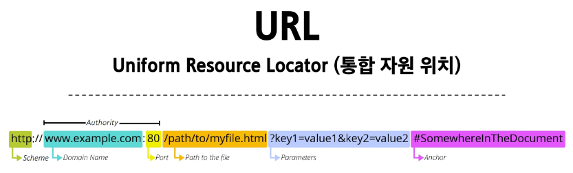
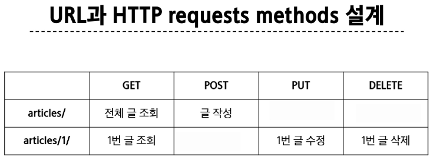

# DRF
## Rest API
### API

- API(Application Programming Interface) : 두 소프트웨어가 서로 통신할 수 있게 하는 메커니즘

> 클라이언트 - 서버처럼 서로 다른 프로그램네서 요청과 응답을 받을 수 있도록 만든 체계

#### Web API

- 웹 서버 또는 웹 브라우저를 위한 API
- 현대 웹 개발은 하나부터 열까지 직접 개발하기보다 여러 Open API들을 활용하는 추세 
- Third Party Open API 서비스 (youtube, google, naver, kakao...)

### REST API 

- Representational State Transfer
- API Server를 개발하기 위한 일종의 소프트웨어 설계 방법론 (규칙 x)

#### RESTful API

- REST 원리를 따르는 시스템을 RESTful 하다고 부름
- 자원을 정의하고 자원에 대한 주소를 지정하는 전반적인 방법을 서술

- API 서버 구조 작성하는 모습이 다르니까 약속을 통해 통일하쟈

#### REST에서 자원을 정의하고 주소를 지정하는 방법

1. 자원의 식별
  - URI

2. 자원의 행위
  - HTTP Methods

3. 자원의 표현
  - JSON 데이터 (궁극적으로 표현되는 데이터 결과물)

### 자원의 식별

#### URI (Uniform Resource Identifier) : 통합 자원 위치

- 인터넷에서 리소스(자원)를 식별하는 문자열
> 가장 일반적인 URI는 웹 주소로 알려진 URL

#### URL (Uniform Resource Locator) : 통합 자원 위치

- 웹에서 주어진 리소스의 주소
> 네트워크 상에 리소스가 어디있는지를 알려주기 위한 약속



1. Schema (or Protocol)

- 브라우저가 리소스를 요청하는데 사용해야 하는 규약
- URL의 첫 부분은 브라우저가 어떤 규약을 사용하는지를 나타냄
- 기본적으로 웹은 http(s)를 요구
  - 메일을 열기위한 mailto:, 파일을 전송하기 위한 frp: 등 다른 프로토콜도 존재

2. Domain Name

- 요청 중인 웹 서버를 나타냄
- 어떤 웹 서버가 요구되는 지를 가리키며 직접 IP 주소를 사용하는 것도 가능하지만, 사람이 외우기 어렵기 때문에 주로 Domain Name으로 사용

3. Port

- 웹 서버의 리소스에 접근하는데 사용되는 기술적인 문 (Gate)

- HTTP 프로토콜의 표준 포트
  - HTTP - 80
  - HTTPS - 443

- 표준 포트만 작성 시 생략 가능

4. Path

- 웹 서버의 리소스 경로
- 초기에는 실제 파일이 위치한 물리적 위치를 나타냈지만, 오늘날은 실제 파일이 위치가 아닌 추상화된 형태의 구조를 표현

- 예) /articles/create/라는 주소가 실제 articles 폴더안에 create 폴더안을 나타내는 것은 아님

5. Parameters

- 웹 서버에 제공하는 추가적인 데이터
- '&' 기호로 구분되는 key-value 쌍 목록
- 서버는 리소스를 응답하기 전에 이러한 파라미터를 사용하여 추가 작업을 수행할 수 있음

6. Anchor

- 일종의 '북마크'를 나타내며 브라우저에 해당 지점에 있는 콘텐츠를 표시
- '#' (부분 식별자) 이후 부분은 서버에 전송되지 않음

- 서버에 전달되지 않고 브라우저에게 해당지점으로 이동할 수 있도록 함

### 자원의 행위

#### HTTP Request Methods

- 리소스에 대한 행위(수행하고자 하는 동작)를 정의
> HTTP verbs 라고도 함

1. GET (R)

- 서버에 리소스의 표현을 요청
- GET을 사용하는 요청은 데이터만 검색해야 함

2. POST (C)

- 데이터를 지정된 리소스에 제출
- 서버의 상태를 변경

3. PUT (U)

- 요청한 주소의 리소스를 수정

4. DELETE (D)

- 지정된 리소스를 삭제

#### HTTP Response status codes

- 특정 HTTP요청이 성공적으로 완료되었는지 여부를 나타냄

1. Informational responses (100-199)
2. Successful responsers (200-299)
3. Redirection messages (300-399)
4. Client error responses (400-499)
5. Server error responses (500-599)

### 자원의 표현

- 그동안 서버가 응답했던 것

  - 지금까지 django 서버는 사용자에게 페이지(html)만 응답하고 있었음
  - 하지만 서버가 응답할 수 있는 것은 페이지 뿐만 아니라 다양한 데이터 타입을 응답할 수 있음
  - REST API는 이 중에서도 JSON 타입으로 응답하는 것을 권장

- Django는 더 이상 Template 부분에 대한 역할을 담당하지 않게 되며, Front-end, Back-end가 분리되어 구성됨
- 이제부터 Django를 사용해 RESTful API서버를 구축할 것

### json 데이터 응답

- 99-json-response-practice 이거 파일 보면서 진행
- migrate 진행
- fixture 파일 load
- python-request-sample.py 실행해서 요청-응답 확인

## DRF with Single Model
### DRF

- Django에서 RESTful API 서버를 쉽게 구축할 수 있도록 도와주는 오픈소스 라이브러리

- pip install djangorestframework
- settings 에서 'rest_framework' 등록해야함!

### Serializer (직렬화)

- 여러 시스템에서 활용하기 위해 데이터 구조나 객체 상태를 나중에 재구성 할 수 있는 포맷으로 변환하는 과정

> 어떠한 언어나 환경에서도 나중에 다시 쉽게 사용할 수 있는 포맷으로 변환하는 과정

#### Serializer 

- Serialization을 진행하여 Serialized data를 반환해주는 클래스

#### ModelSerializer

- Django 모델과 연결된 Serializer 클래스 
> 일반 Serializer와 달리 사용자 입력 데이터를 받아 자동으로 모델 필드에 맞추어 Serialization 을 진행

- Article 모델을 토대로 직렬화를 수행하는 ArticleSerializer 정의
> 게시글 데이터 목록 제공

```py
# articles/serializers.py
# ModelForm 와 비슷한 문법 구조

from rest_framework import serializers
from .models import Article

class ArticleSerailizer(serializers.ModelSerializer):
  class Meta:
    model = Article
    fields = '__all__'
```

## CRUD with ModelSerializer



### GET method - 조회
#### list

- 게시글 데이터 목록 조회하기
- 게시글 데이터 목록을 제공하는 ArticleListSerializer 정의

```py
# articles/serializers.py

from rest_framework import serializers
from .models import Article

class ArticleListSerializer(serializers.ModelSerializer):
    class Meta:
        model = Article
        fields = ('id', 'title', 'content',)
```

- url 및 view 함수 작성

```py
# articles/urls.py

urlpatterns = [
    path('articles/', views.article_list),

# articles/views.py

from rest_framework.response import Response
from rest_framework.decorators import api_view
from .models import Article
from .serializers import ArticleListSerializer

@api_view(['GET'])
def article_list(request):
    # 전체 게시글 조회 (타입: 쿼리셋)
    articles = Article.objects.all()
    # 변환하기 쉬운 포멧으로 변환 (직렬화) (쿼리셋 다중데이터는 many=True 작성 필수)
    serializer = ArticleListSerializer(articles, many=True)
    return Response(serializer.data)
```

#### ModelSerializer의 인자 및 속성

- many 옵션
  - Serialize 대상이 QuerySet인 경우 입력

- data 속성
  - Serialized data 객체에서 실제 데이터를 추출

#### 'api_view' decorator

- DRF view 함수에서는 필수로 작성되며 view 함수를 실행하기 전 HTTP 메서드를 확인
- 기본적으로 GET 메서드만 허용되며 다른 메서드 요청에 대해서는 405 Method Not Allowed 로 응답
- DRF view 함수가 응답해야 하는 HTTP 메서드 목록을 작성

#### detail

- 단일 게시글 데이터 조회하기
  - 각 게시글의 상세 정보를 제공하는 ArticleSerializer 정의

```py
# articles/serializers.py

class ArticleSerializer(serializers.ModelSerializer):
    class Meta:
        model = Article
        fields = '__all__'
```

- url 및 view 함수 작성

```py
# articles/urls.py

path('articles/<int:article_pk>/', views.article_detail),

# articles/views.py
from .serializers import ArticleListSerializer, ArticleSerializer

@api_view(['GET'])
def article_detail(request, article_pk):
    article = Article.objects.get(pk=article_pk)
    serializer = ArticleSerializer(article)
    return Response(serializer.data)
```

### POST method - 생성

- 게시글 데이터 생성하기
  1. 데이터 생성이 성공했을 경우 201 Created 응답
  2. 데이터 생성이 실패했을 경우 400 Bad request 응답

- article_list view 함수 구조 변경 (method에 따른 분기처리)

```py
# articles/views.py

from rest_framework import status

@api_view(['GET', 'POST'])
def article_list(request):
    
    if request.method == 'GET':
        # 전체 게시글 조회 (타입: 쿼리셋)
        articles = Article.objects.all()
        # 변환하기 쉬운 포멧으로 변환 (직렬화) (쿼리셋 다중데이터는 many=True 작성 필수)
        serializer = ArticleListSerializer(articles, many=True)
        return Response(serializer.data)
    
    elif request.method == 'POST':
        serializer = ArticleSerializer(data=request.data)
        if serializer.is_valid():
            serializer.save()
            # 저장 성공 후 201 응답 상태코드 반환
            return Response(serializer.data, status=status.HTTP_201_CREATED)
        # 저장 실패 후 400 에러 메세지 반환 - raise 처리해주면 안써줘도 됨
        return Response(serializer.errors, status=status.HTTP_400_BAD_REQUEST)
```

### DELETE method - 삭제

- 요청에 대한 데이터 삭제가 성공했을 경우는 204 No Content 응답

```py
# articles/views.py

@api_view(['GET', 'DELETE'])
def article_detail(request, article_pk):
    article = Article.objects.get(pk=article_pk)
    
    if request.method == 'GET':
        serializer = ArticleSerializer(article)
        return Response(serializer.data)
    
    elif request.method == 'DELETE':
        article.delete()
        return Response(status=status.HTTP_204_NO_CONTENT)
```

### PUT method - 수정

- 게시글 데이터 수정하기
  - 요처에 대한 데이터 수정이 성공했을 경우는 200 OK 응답

```py
# articles/views.py

@api_view(['GET', 'DELETE', 'PUT'])
def article_detail(request, article_pk):
    article = Article.objects.get(pk=article_pk)
    
    if request.method == 'GET':
        serializer = ArticleSerializer(article)
        return Response(serializer.data)
    
    elif request.method == 'DELETE':
        article.delete()
        return Response(status=status.HTTP_204_NO_CONTENT)
    
    elif request.method == 'PUT':
        # partial은 부분 수정 허용 위함
        serializer = ArticleSerializer(article, data=request.data, partial=True)
        # serializer = ArticleSerializer(instance=article, data=request.data, partial=True)
        if serializer.is_valid():
            serializer.save()
            return Response(serializer.data)
        return Response(serializer.errors, status=status.HTTP_400_BAD_REQUEST)
```

#### 'partial' argument

- 부분 업데이트를 허용하기 위한 인자
- 예를 들어 partial 인자 값이 False 일 경우 게시글 title 만을 수정하려고 해도 반드시 content 값도 요청 시 함께 전송해야함

- 기본적으로 serializer는 모든 필수 필드에 대한 값을 전달 받기 때문
  - 즉, 수정하지 않는 다른 필드 데이터도 모두 전송해야 하며 그렇지 않으면 유효성 검사에서 오류가 발생

## 참고 
### raise_exception

- is_valid()의 선택 인자
- 유효성 검사를 통과하지 못할 경우 ValidationError 예외를 발생시킴
- DRF에서 제공하는 기본 예외 처리기에 의해 자동으로 처리되며 기본적으로 HTTP 400 응답을 반환