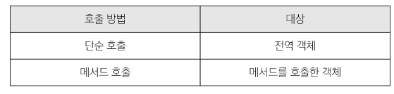

# 객체

- object : 키로 구분된 데이터 집합을 저장하는 자료형

## 구조 및 속성

#### 객체 구조

- 중괄호 {}를 이용해 작성
- 중괄호 안에는 key:value 쌍으로 구성된 속성을 여러개 작성 가능
- key는 문자형만 허용
- value는 모든 자료형 허용

```js
const user = {
  name:'Alice',
  'key with space':true,
  greeting: function () {
    return 'hello'
  }
}

// 조회
console.log(user.name) // Alice
console.log(user['key with space']) // true

// 추가
user.address = 'Korea'
console.log(user) // {name: 'Alice', key with space: true, address: 'korea', greeting: ƒ}

// 수정
user.name = 'Bella'
console.log(user) // Bella

// 삭제
delete user.name
console.log(user) // {key with space: true, address: 'korea', greeting: ƒ}

// in 연산자
console.log('greeting' in user) // true
console.log('country' in user) // false

// 메서드 호출
console.log(user.greeting()) // hello
```

## 메서드

- method : 객체 속성에 정의된 함수

- object.method() 방식으로 호출
- 메서드는 객체를 행동 할 수 있게함

### this

- this 키워드를 사용해 객체에 대한 특정한 작업을 수행 할 수 있음

- 함수나 메서드를 호출한 객체를 가리키는 키워드
  - 함수 내에서 객체의 속성 및 메서드에 접근하기 위해 사용
  
> javascript 에서 this는 함수를 **호출하는 방법**에 따라 가리키는 대상이 다름

  

1. 단순 호출 시 this
   
- 가리키는 대상 => 전역 객체

```js
const myFunc = function () {
  return this
}
console.log(myFunc()) // window
```

2. 메서드 호출 시 this 

- 가리키는 대상 => 메서드를 호출한 객체

```js
const myObj = {
  data: 1,
  myFunc: function () {
    return this
  }
}
console.log(myObj.myFunc()) // object
``` 

#### 중첩된 함수에서의 this 문제점과 해결책

- forEach의 인자로 작성된 함수는 일반적인 함수 호출이기 때문에 this가 전역 객체를 가리킴
- 화살표 함수는 자신만의 this를 가지지 않기 때문에 외부 함수에서의 this 값을 가져옴

```js
// 2.1 일반 함수
const myObj2 = {
  numbers: [1, 2, 3],
  myFunc: function () {
    this.numbers.forEach(function (number) {
      console.log(this) // window
    })
  }
}
console.log(myObj2.myFunc())

// 2.2 화살표 함수
const myObj3 = {
  numbers: [1, 2, 3],
  myFunc: function () {
    this.numbers.forEach((number) => {
      console.log(this) // myObj3
    })
  }
}
console.log(myObj3.myFunc())
```

- javascript의 함수는 호출될 때 this를 암묵적으로 전달 받음
- javascript에서 this는 함수가 '호출되는 방식'에 따라 결정되는 현재 객체를 나타냄

- python의 self와 java의 this가 선언시 이미 값이 정해지는 것에 비해 
  javascript의 this는 함수가 호출되기 전까지 값이 할당되지 않고 호출시에 결정됨 (동적 할당)

- 장점 : 함수를 하나만 만들어 여러 객체에서 재사용할 수 있음
- 단점 : 이런 유연함이 실수로 이어질수도..?


## 추가 객체 문법

```js
// 1. 단축 속성
const name = 'Alice'
const age = 30

const user1 = {
  name: name,
  age: age
}

const user2 = {
  name,
  age,
}


// 2. 단축 메서드
const myObj1 = {
  myFunc: function () {
    return 'Hello'
  }
}

const myObj2 = {
  myFunc() {
    return 'Hello'
  }
}


// 3. 계산된 속성
const product = prompt('물건 이름을 입력해주세요')
const prefix = 'my'
const suffix = 'property'

const bag = {
  [product]: 5,
  [prefix + suffix]: 'value'
}

console.log(bag) // {연필: 5, myproperty: 'value'}


// 4. 구조 분해 할당
const userInfo = {
  firstName: 'Alice',
  userId: 'alice123',
  email: 'alice123@gmail.com'
}

const {firstName, userId, email} = userInfo

console.log(firstName, userId, email)

// 구조 분해 할당 활용 - "함수 매개변수"
function printInfo({ name, age, city }) {
  console.log(`이름: ${name}, 나이: ${age}, 도시: ${city}`)
}

const person = {
  name: 'Bob',
  age: 35,
  city: 'London',
}

// 함수 호출 시 객체를 구조 분해하여 함수의 매개변수로 전달
printInfo(person)

// 5. 전개 구문 - "객체 복사"
const obj = { b: 2, c: 3, d: 4 }
const newObj = {a:1, ...obj, e:5}
console.log(newObj) // {a: 1, b: 2, c: 3, d: 4, e: 5}

// 6. 유용한 객체 메서드 (Object.keys(), Object.values())
const profile = {
  name: 'Alice',
  age: 30
}

console.log(Object.keys(profile)) // ['name', 'age']
console.log(Object.values(profile)) // ['Alice', 30]

```

7. Optional chaining ('?.')
   
- 속성이 없는 중첩 객체를 에러 없이 접근할 수 있는 방법
- 만약 참조 대상이 null 또는 undefined라면 에러가 발생하는 것 대신
  평가를 멈추고 undefined를 반환

1. Optional chaining은 존재하지 않아도 괜찮은 대상에만 사용해야함
   - 왼쪽 평가대상이 없어도 괜찮은 경우에만 선택적으로 사용
   - 중첩객체를 에러 없이 접근하는 것이 사용 목적

2. Optional chaining 앞의 변수는 반드시 선언 되어 있어야함

- 정리
  - obj가 존재하면 그 뒤를 반환하고 아니면 undefined 반환

  - obj?.prop
  - obj?.[prop]
  - obj?.method()

```js
const user = {
  name: 'Alice',
  greeting: function () {
    return 'hello'
  }
}

console.log(user.address.street) // Uncaught TypeError: Cannot read properties of undefined (reading 'street')
console.log(user.address?.street) // undefined

console.log(user.nonMethod()) // Uncaught TypeError: user.nonMethod is not a function
console.log(user.nonMethod?.()) // undefined

// 아래 예시 코드 논리상 user는 반드시 있어야 하지만 address는 필수 값이 아님
// user에 값을 할당하지 않은 문제가 있을 때 바로 알아낼 수 있어야 하기 때문
console.log(user.address && user.address.street) // undefined
console.log()

// Bad
user?.address?.street

// Good
user.address?.street
```

## json

- "JavaScript Object Notation"
  
- key-value 형태로 이루어진 자료 표기법
- JavaScript의 Object와 유사한 구조를 가지고 있지만
  JSON은 형식이 있는 '문자열'
- JavaScript에서 JSON을 사용하기 위해서는 Object 자료형으로 변경해야함

### Object <-> JSON 변환하기

```js
const jsObject = {
  coffee: 'Americano',
  iceCream: 'Cookie and cream'
}

// Object -> JSON
const objToJson = JSON.stringify(jsObject)
console.log(objToJson)  // {"coffee":"Americano","iceCream":"Cookie and cream"}
console.log(typeof objToJson)  // string

// JSON -> Object
const jsonToObj = JSON.parse(objToJson)
console.log(jsonToObj)  // { coffee: 'Americano', iceCream: 'Cookie and cream' }
console.log(typeof jsonToObj)  // object
```

# 참고
## 클래스

- 객체를 생성하기 위한 템플릿

> 객체의 속성, 메서드를 정의하는 청사진 역할

1. class 키워드
2. 클래스 이름
3. 생성자 메서드 
   - constructor()

```js
class Member { 
  constructor(name, age) {
    this.name = name
    this.age = age
  }
  sayHi(){
    console.log(`Hi, I am ${this.name}`)
  }
}

// new 연산자 : 클래스나 생성자 함수를 사용하여 새로운 객체를 생성
const member3 = new Member('Alice', 20)

console.log(member3) // Member { name: 'Alice', age: 20 }
console.log(member3.name) // Alice
member1.sayHi() // Hi I am Alice
```

#### new 연산자

- 클래스의 constructor()는 new 연산자에 의해 자동으로 호출되며 특별한 절차 없이 객체를 초기화 할 수 있음
- new 없이 클래스를 호출하면 TypeError 발생