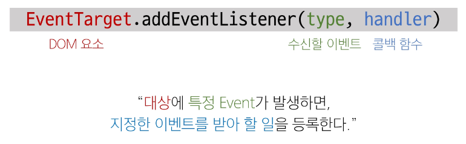
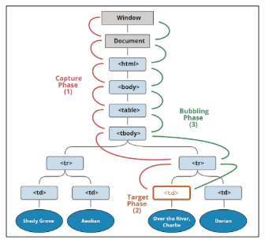

# 이벤트

> 웹에서의 모든 동작은 이벤트 발생과 함께 한다.

## event 객체

- event : 무언가 일어났다는 신호, 사건

> 모든 DOM 요소는 이러한 event를 만들어 냄  

- mouse, input, keyboard, touch, ...
- DOM 요소에서 event가 발생하면, 해당 event는 연결된 이벤트 처리기에 의해 처리 됨
  
## event handler

- 특정 이벤트가 발생했을 때 실행되는 함수
  
> 사용자의 행동에 어떻게 반응할지를 JavaScript 코드로 표현한 것

### .addEventListener()

- 대표적인 이벤트 핸들러 중 하나

> 특정 이벤트를 DOM 요소가 수신할 때 마다 콜백 함수를 호출



#### addEventListener의 인자

- type 
  - 수신할 이벤트 이름
  - 문자열로 작성(ex. 'click')

- handler
  - 발생한 이벤트 객체를 수신하는 콜백 함수
  - 이벤트 핸들러는 자동으로 event 객체를 매개변수로 받음

#### addEventListener 활용

- 버튼을 클릭하면 버튼 요소 출력하기

> 버튼에 이벤트 처리기를 부착하여 클릭 이벤트가 발생하면 이벤트가 발생한 버튼정보를 출력

- 요소에 addEventListener를 연결하게 되면 내부의 this 값은 연결된 요소를 가리키게 됨
  (event 객체의 currentTarget 속성 값과 동일)

```js
  // 1. 버튼 선택
  const btn = document.querySelector('#btn')

  // 2. 콜백 함수
  const detectClick = function (event) {
    console.log(event) // PointerEvent
    console.log(event.currentTarget) // <button id="btn">버튼</button>
    console.log(event.target)
    console.log(this) // <button id="btn">버튼</button>
  }

  // 3. 버튼에 이벤트 핸들러를 부착
  btn.addEventListener('click', detectClick)
```

#### addEventListener의 콜백 함수 특징

- 이벤트 핸들러 내부의 this는 이벤트 리스너에 연결된 요소 (currentTarget)를 가리킴
- 이벤트가 발생하면 event 객체가 생성되어 첫번째 인자로 전달
  - event 객체가 필요 없는 경우 생략 가능

# 버블링

- 한 요소에 이벤트가 발생하면, 이 요소에 할당된 핸들러가 동작하고, 이어서 부모 요소의 핸들러가 동작하는 현상
- 가장 최상단의 조상 요소를 만날 때까지 이 과정이 반복되면서 요소 각각에 할당된 핸들러가 동작
  
> 이벤트가 제일 깊은 곳에 있는 요소에서 시작해 부모 요소를 거슬러 올라가며 발생하는 것이 마치 물속 거품과 닮았기 때문
> 최하위 <p> 요소를 클릭하면 p -> div -> form 순서로 3개의 이벤트 핸들러가 모두 순차적으로 동작했던 것

- 이벤트가 정확히 어디서 발생했는지 접근할 수 있는 방법
  - event.currentTarget
  - event.target

### currentTarget & target 속성

- currentTarget 속성
  - '현재' 요소
  - 항상 이벤트 핸들러가 연결된 요소만을 참조하는 속성
  - 'this'와 같음

- target 속성
  - 이벤트가 발생한 가장 안쪽의 요소를 참조하는 속성
  - 실제 이벤트가 시작된 요소
  - 버블링이 진행되어도 변하지 않음 

## 캡처링과 버블링

### 캡처링 

- 이벤트가 하위 요소로 전파되는 단계(버블링과 반대)
  


### 캡처링과 버블링

- table의 하위 요소 td를 클릭하면 이벤트는 먼저 최상위 요소부터 아래로 전파됨 (캡처링)
- 실제 이벤트가 발생한 지점(event.target)에서 실행된 후 다시 위로 전파 (버블링)
  - 이 전파 과정에서 상위요소에 할당된 이벤트 핸들러들이 호출되는 것
  
> 캡처링은 실제 개발자가 다루는 경우가 거의 없으므로 버블링에 집중하기

## 버블링의 필요성

- 만약 각자 다른 동작을 수행하는 버튼이 여러 개가 있다고 가정
- 왜 각 버튼마다 서로 다른 이벤트 핸들러를 할당해야할까..?
  
> 각 버튼의 공통 조상인 div 요소에 이벤트 핸들러 단 하나만 할당

- 요소의 공통 조상에 이벤트 핸들러를 단 하나만 할당하면, 여러 버튼요소에서
  발생하는 이벤트를 한꺼번에 다룰 수 있음

- 공통 조상에 할당한 핸들러에서 event.target을 이용하면 실제 어떤 버튼에서 
  이벤트가 발생했는지 알 수 있기 때문

# event handler 활용

1. click 이벤트 실습 - 버튼을 클릭하면 숫자를 1씩 증가해서 출력하기
  ```js
  // 1. 초기값
  let counterNumber = 0

  // 2. 버튼 요소 선택
  const btn = document.querySelector('#btn')

  // 3. 콜백 함수 (버튼에 클릭 이벤트가 발생할 때 마다 실행할 코드)
  const clickHandler = function () {
    // 3.1 초기값 += 1
    counterNumber += 1

    // 3.2 p 요소를 선택
    const spanTag = document.querySelector('#counter')
    // 3.3 p 요소의 컨텐츠를 1증가한 초기값으로 설정
    spanTag.textContent = counterNumber
  }

  // 4. 버튼에 이벤트 핸들러 부착 (클릭 이벤트)
  btn.addEventListener('click', clickHandler)
  ```
2. input 이벤트 실습 - 사용자의 입력 값을 실시간으로 출력하기  

  ```js
  // 1. input 요소 선택
  const inputTag = document.querySelector('#text-input')

  // 2. p 요소 선택
  const pTag = document.querySelector('p')

  // 3. 콜백 함수 (input 요소에 input 이벤트가 발생할 때 마다 실행할 코드)
  const inputHandler = function (event) {
    console.log(event)

    // 3.1 작성하는 데이터가 어디에 누적되고 있는지 찾기
    // 핸들러 붙어있는 곳의 이벤트 찾기
    // console.log(event.currentTarget.value)

    // 3.2 p요소의 컨텐츠에 작성하는 데이터를 추가
    pTag.textContent = event.currentTarget.value 
  }

  // 4. 선택된 input 요소에 이벤트 핸들러
  inputTag.addEventListener('input', inputHandler)
  ```
3. click & input  이벤트 실습
   
- 사용자의 입력 값을 실시간으로 출력
  - '+' 버튼을 클릭하면 출력한 값의 CSS 스타일을 변경하기
  
  ```js
  //  input 구현
  const inputTag = document.querySelector('#text-input')
  const h1Tag = document.querySelector('h1')

  const inputHandler = function (event) {
    h1Tag.textContent = event.currentTarget.value
  }

  inputTag.addEventListener('input', inputHandler)

  // click 구현
  const btn = document.querySelector('#btn')

  const clickHandler = function () {
    
    // 1. add 방법
    h1Tag.classList.add('blue')

    // 2. toggle 방법
    h1Tag.classList.toggle('blue')

    // 3. if 방법
    if (h1Tag.classList.value) {
      h1Tag.classList.remove('blue')
    }
    else {
      h1Tag.classList.add('blue')
    }
  }

  btn.addEventListener('click', clickHandler)
  ```

4. todo 실습

  ```js
  //  input 설정
  const inputTag = document.querySelector('.input-text')
  //  버튼 설정
  const btn = document.querySelector('#btn')
  //  ul tag
  const ulTag = document.querySelector('ul')

  const addTodo = function (event) {

    // 2.1 사용자 입력 데이터 저장
    const inputData = inputTag.value

    //  만약 빈 문자열이라면,, 경고 대화상자 띄우기!
    if (inputData.trim()) {
      // 2.2 데이터를 저장할 li 요소를 생성
      const liTag = document.createElement('li')

      // 2.3 li 요소 컨텐츠에 데이터 입력
      liTag.textContent = inputData

      // 2.4 li 요소를 부모 ul 요소의 자식 요소로 추가
      ulTag.appendChild(liTag)

      // 2.5 todo 추가 후 input 입력 데이터는 초기화
      inputTag.value = ''
    }
    else {
      alert('할 일을 입력하세요!')
    }
  }

  btn.addEventListener('click', addTodo)
  ```

5. 로또 번호 생성기 실습

```html
<!-- lodash 사용 -->
<script src="https://cdn.jsdelivr.net/npm/lodash@4.17.21/lodash.min.js"></script>
<script>
  // 1. 필요한 요소 선택
  const h1Tag = document.querySelector('h1')
  const btn = document.querySelector('#btn')
  const divTag = document.querySelector('div')

  // 2. 로또 번호를 생성하는 함수 - 6번 랜덤 숫자 ul 안에 li에 만들
  const makelottonum = function (event) {

    // 1 부터 45 까지 값 필요
    const numbers = _.range(1, 46)

    // 45개의 요소가 있는 배열에서 6개 번호 추출
    const sixNumbers = _.sampleSize(numbers, 6)

    // 6개의 li 요소를 담을 ul 요소 생성
    const ulTag = document.createElement('ul')

    // 추출한 번호 배열 반복하면서 li 요소 생성
    sixNumbers.forEach((number) => {
      const liTag = document.createElement('li')
      liTag.textContent = number

      // 만들어진 li를 ul에 추가
      ulTag.appendChild(liTag)
    })
    // 완성한 ul요소를 div요소에 추가
    divTag.appendChild(ulTag)

  }

  // 3. 버튼에 이벤트 핸들러 추가
  btn.addEventListener('click', makelottonum)

</script>
```

#### lodash

- 모듈성, 성능 및 추가 기능을 제공하는 JavaScript 유틸리티 라이브러리
- array, object 등 자료구조를 다룰 때 사용하는 유용하고 간편한 함수들을 제공'

- https://lodash.com/
  
## 이벤트 기본 동작 취소하기

- HTML의 각 요소가 기본적으로 가지고 있는 이벤트가 때로는 방해가 되는 경우가
  있어 이벤트의 기본 동작을 취소할 필요가 있음

- 예시
  - form 요소의 제출 이벤트를 취소하여 페이지 새로고침을 막을 수 있음
  - a 요소를 클릭할 때 페이지 이동을 막고 추가 로직을 수행할 수 있음

#### .preventDefault()

- 해당 이벤트에 대한 기본 동작을 실행하지 않도록 지정

```js
// 1 : copy 이벤트 동작 취소
const h1Tag = document.querySelector('h1')

h1Tag.addEventListener('copy', function (event) {
  console.log(event)
  event.preventDefault()
  alert('복사 할 수 없습니다.')
})

// 2 : form 제출 시 페이지 새로고침 동작 취소
// form 요소의 submit 동작(action 값으로 요청)을 취소시킴
const formTag = document.querySelector('#my-form')

const handleSubmit = function (event) {
  event.preventDefault()
}

formTag.addEventListener('submit', handleSubmit)
```

# 참고
## addEventListener와 화살표 함수 관계

- 화살표 함수는 자신만의 this를 생성하지 않음
- 대신, 화살표 함수가 정의된 곳의 상위 스코프의 this를 그대로 사용
- 대부분의 경우, 이는 전역 객체(브라우저에서는 window)를 가리키게 됨

- 해결책
  1. 일반 함수로 사용
  2. 화살표 함수일 경우 event.currentTarget 사용하기
   
  ```js
  // 일반적인 this 바인딩 규칙
  // 1. 일반 함수 호출: window
  // 2. 메서드 호출: 메서드를 소유한 객체

  // addEventListener는 위의 일반적인 규칙과 다르게 동작하는데, 
  // 이는 JavaScript 엔진이 addEventListener 메서드를 특별하게 처리하기 때문
  // 내부 구현 참고 (https://developer.mozilla.org/en-US/docs/Web/API/EventTarget/addEventListener)

  const functionButton = document.querySelector('#function')
  const arrowButton = document.querySelector('#arrow')

  // 1. 일반 함수 사용
  functionButton.addEventListener('click', function () {
    console.log(this) // <button id="function">function</button>
  })

  // 2. 화살표 함수 사용
  arrowButton.addEventListener('click', () => {
    console.log(this) // window
  })

  // 3. 화살표 함수에서는 event.currentTarget으로 대체 가능
  arrowButton.addEventListener('click', (event) => {
    console.log(event.currentTarget) // <button id="arrow">arrow function</button>
  })
  ```