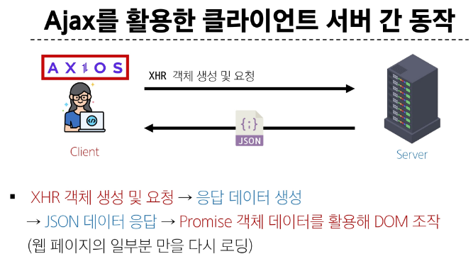

# 비동기

- synchronous(동기) : 프로그램의 실행 흐름이 순차적으로 진행

> 하나의 작업이 완료된 후에 다음 작업이 실행되는 방식

- Asynchronous(비동기) : 특정 작업의 실행이 완료될 때까지 기다리지 않고 다음 작업을 즉시 실행하는 방식

> 작업의 완료 여부를 신경 쓰지 않고 동시에 다른 작업들을 수행할 수 있음

### Asynchronous 특징

- 병렬적 수행
- 당장 처리를 완료할 수 없고 시간이 필요한 작업들은 백그라운드에서 실행되며 빨리 완료되는 작업부터 처리

# javascript와 비동기

- single thread 언어, javascript
  - thread란? : 작업을 처리할 때 실제로 작업을 수행하는 주체로, multi-thread면 업무를 수행할 수 있는 주체가 여러개라는 의미

> 그러면 어떻게 single thread인 javascript가 비동기 처리를 할 수 있을까? 

## javascript runtime

- javascript 가 동작할 수 있는 환경(runtime)
  - 브라우저, node.js

- javascript는 single thread이므로 비동기 처리를 할 수 있도록 도와주는 환경이 필요

### 브라우저 환경에서의 javascript 비동기 처리 관련 요소

1. Javascript engine의 Call Stack
   - 요청이 들어올 때 마다 순차적으로 처리하는 Stack(LIFO)
   - 기본적인 JavaScript의 Single Thread 작업 처리
  
2. Web API
   - JavaScript 엔진이 아닌 브라우저에서 제공하는 runtime 환경
   - 시간이 소요되는 작업을 처리 (setTimeout, DOM Event, 비동기 요청 등)
  
3. Task Queue
   - 비동기 처리된 Callback 함수가 대기하는 Queue(FIFO)
  
4. Event Loop
   - 테스크(작업)가 들어오길 기다렸다가 태스크가 들어오면 이를 처리하고, 처리할 태스크가 없는 경우엔 잠드는, 끊임없이 돌아가는 자바스크립트 내 루프
   - Call Stack과 Task Queue를 지속적으로 모니터링
   - Call Stack이 비어있는지 확인 후 비어있다면 Task Queue에서 대기 중인 오래된 작업을 Call Stack으로 Push

### 브라우저 환경에서의 JavaScript 비동기 처리 동작 방식

1. 모든 작업은 Call Stack(LIFO)으로 들어간 후 처리된다.
2. 오래 걸리는 작업이 Call Stack으로 들어오면 Web API로 보내 별도로 처리하도록 한다.
3. Web API에서 처리가 끝난 작업들은 곧바로 Call Stack으로 들어가지 못하고 Task Queue(FIFO)에 순서대로 들어간다. 
   (3초로 설정하면,, task queue에 3초뒤에 들어가는 것. 순서 정할 수 없음)
   
4. Event Loop가 Call Stack이 비어있는 것을 계속 체크하고 Call Stack이 빈다면 Task Queue에서 가장 오래된 작업을 Call Stack으로 보낸다.

# Ajax (Asynchronous JavaScript and XML)

- 비동기적인 웹 애플리케이션 개발을 위한 기술

- XMLHttpRequest 기술을 사용해 복잡하고 동적인 웹 페이지를 구성하는 프로그래밍 방식
- 브라우저와 서버간의 데이터를 비동기적으로 교환하는 기술
- Ajax를 사용하면 페이지 전체를 새로고침 하지 않고도 동적으로 데이터를 불러와 화면을 갱신할 수 있음

> Ajax의 x는 XML이라는 데이터 타입을 의미하긴 하지만, 요즘은 더 가벼운 용량과 JavaScript의 일부라는 장점 때문에 JSON을 많이 사용

### Ajax 목적

1. 비동기 통신
   - 웹페이지 전체를 새로고침 하지 않고 서버와 데이터를 주고받을 수 있음
2. 부분 업데이트
   - 전체 페이지가 다시 로드되지 않고 HTML 페이지 일부 DOM 만 업데이트
   - 페이지의 일부분만 동적으로 갱신할 수 있어 사용자 경험이 향상

3. 서버 부하 감소
   - 필요한 데이터만 요청하므로 서버의 부하를 줄일 수 있음

#### XMLHttpRequest 객체 (XHR)

- 웹 브라우저와 서버간의 비동기 통신을 가능하게 하는 JavaScript 객체

- JavaScript를 사용하여 서버에 HTTP요청을 할 수 있는 객체
- 웹 페이지의 전체 새로고침 없이도 서버로부터 데이터를 가져오거나 보낼 수 있음

> 이름에 XML이라는 데이터 타입이 들어가긴 하지만 XML 뿐만 아니라 모든 종류의 데이터를 가져올 수 있음

#### 기존 기술과의 차이 - 기존 방식

1. 클라이언트(브라우저)에서 form을 채우고 이를 서버로 제출(submit)
2. 서버는 요청 내용에 따라 데이터 처리 후 새로운 웹페이지를 작성하여 응답으로 전달

> 결과적으로 모든 요청에 따라 새로운 페이즈를 응답받기 때문에 계속해서 새로고침이 발생
> 기존 페이지와 유사한 내용을 가지고 있는 경우 중복된 코드를 다시 전송 받음으로써 대역폭을 낭비하게 되는 경우가 많음

#### 기존 기술과의 차이 - Ajax

1. XHR 객체 생성 및 요청
2. 서버는 새로운 페이지를 응답으로 만들지 않고 필요한 부분에 대한 데이터만 처리 후 응답(json및 기타 데이터)

> 새로운 페이지를 받는 것이 아닌 필요한 부분의 데이터만 받아 기존 페이지의 일부를 수정(새로고침 x)
> 서버에서 모두 처리되던 데이터 처리의 일부분이 이제는 클라이언트 쪽에서 처리되므로 교환되는 데이터 양과 처리량이 줄어듬

#### 이벤트 핸들러는 비동기 프로그래밍의 한 형태

- 이벤트가 발생할 때마다 호출되는 함수를 제공하는 것
- HTTP 요청은 응답이 올때까지의 시간이 걸릴 수 있는 작업이라 비동기며, 이벤트 핸들러를 XHR 객체에 연결해 요청의 진행 상태 및 최종 완료에 대한 응답을 받음

## Axios

- 브라우저와 Node.js에서 사용할 수 있는 Promise 기반의 HTTP 클라이언트 라이브러리

- 클라이언트 및 서버 사이에 HTTP 요청을 만들고 응답을 처리하는데 사용되는 자바스크립트 라이브러리
- 서버와의 HTTP 요청과 응답을 간편하게 처리할 수 있도록 도와주는 도구
- 브라우저를 위한 XHR 객체 생성
- 간편한 API를 제공하며, Promise 기반의 비동기 요청을 처리

> 주로 웹 애플리케이션에서 서버와 통신할 때 사용



### Axios 설치 및 사용

- CDN 방식으로 사용하기
- <script src="https://cdn.jsdelivr.net/npm/axios/dist/axios.min.js"></script>
- https://axios-http.com/kr/


### Promise object

- 자바스크립트에서 비동기 작업을 처리하기 위한 객체
- 비동기 작업의 최종 완료(또는 실패)와 그 결과 값을 나타냄

```js
const promiseObj = axios({
  method: 'get',
  url:  'https://api.thecatapi.com/v1/images/search'
})

console.log(promiseObj) // Promise object
```

- 주요 메서드
  
  - then(): 작업이 성공적으로 완료되었을 때 실행될 콜백 함수를 지정
  - catch(): 작업이 실패했을 때 실행될 콜백 함수를 지정
  
  ```js
  promiseObj
  // 작업이 성공적으로 완료되었을 때 실행될 콜백 함수를 지정
  .then((response) => {
    console.log(response)  // Promise object
    // console.log(response.data)  // Promise data
  })

  // 작업이 실패했을 때 실행될 콜백 함수를 지정
  .catch((error) => {
    console.error(error)
  })
  ```

### Axios 기본 구조

- axios 객체를 활용해 요청을 보낸 후 응답 데이터 promise 객체를 받음

- 성공처리
  - then 메서드를 사용해서 '성공했을 때 수행할 로직'을 작성
  - 서버로부터 받은 응답 데이터를 처리

- 실패처리
  - catch 메서드를 사용해서 '실패했을 때 수행할 로직'을 작성
  - 네트워크 오류나 서버 오류 등의 예외 상황을 처리

#### then & catch 특징

- then(callback)
  - 요청한 작업이 성공하면 callback 실행
  - callback은 이전 작업의 성공 결과를 인자로 전달 받음

- catch(callback)
  - then()이 하나라도 실패하면 callback 실행 (남은 then은 중단)
  - callback은 이전 작업의 실패 객체를 인자로 전달 받음

## Axios 활용

1. 고양이 사진 가져오기 실습
2. 고양이 사진 가져오기 실습 심화

## Ajax와 Axios

- Ajax 
  - 하나의 특정한 기술을 의미하는 것이 아니라, 비동기적인 웹 애플리케이션 개발에 사용하는 기술들의 집합을 지칭

- Axios
  - 클라이언트 및 서버 사이에 HTTP 요청을 만들고 응답을 처리하는데 사용되는 자바스크립트 라이브러리
  - Promise API 기반으로 하여 비동기 처리를 더 쉽게 할 수 있음

> 프론트엔드에서 Axios를 활용해 DRF로 만든 API 서버로 요청을 보내고, 받아온 데이터를 비동기적으로 처리하는 로직을 작성하게 됨

- Ajax 는 개념이자 접근 방식이며, Axios는 이를 실현하는 구체적인 도구
- Axios는 Ajax를 구현하는 도구 중 하나로, XMLHttpRequest를 추상화하여 더 사용하기 쉽게 만든 라이브러리

# Callback과 Promise

## 비동기 처리의 특성과 관리

- 비동기 처리의 특성
  - 비동기 처리의 핵심은 작업이 시작되는 순서가 아니라 완료되는 순서에 따라 처리된다는 것

- 비동기 처리의 어려움
  - 개발자 입장에서 코드의 실행순서가 불명확하다는 단점 존재
  - 이로 인해 실행결과를 정확히 예측하며 코드를 작성하기 어려울 수 있음

- 비동기 처리 관리 방법
  
  1. 비동기 콜백
    - 비동기 작업이 완료된 후 실행될 함수를 미리 정의
  
  2. Promise
    - 비동기 작업의 최종 완료 또는 실패를 나타내는 객체

## 비동기 콜백

- 비동기적으로 처리되는 작업이 완료되었을 때 실행되는 함수
- 연쇄적으로 발생하는 비동기 작업을 순차적으로 동작할 수 있게 함

> 작업의 순서와 동작을 제어하거나 결과를 처리하는데 사용

- 콜백 지옥 발생할수도...

## 프로미스(Promise)

- JavaScript에서 비동기 작업의 결과를 나타내는 객체

> 비동기 작업이 완료되었을 때 결과 값을 반환하거나, 실패 시 에러를 처리할 수 있는 기능을 제공
> Promise 기반의 HTTP 클라이언트 라이브러리가 바로 Axios

### then & catch 의 chaining

- axios로 처리한 비동기 로직은 항상 promise 객체를 반환
- 즉, then과 catch는 모두 항상 promise 객체를 반환
  > 계속해서 chaining을 할 수 있음

- then을 계속 이어 나가면서 작성할 수 있게 됨
- 비동기 작업의 '순차적인' 처리 가능

#### then 메서드 chaining의 장점

1. 가독성
  - 비동기 작업의 순서와 의존 관계를 명확히 표현할 수 있어 코드의 가독성이 향상

2. 에러처리
  - 각각의 비동기 작업 단계에서 발생하는 에러를 분할에서 처리 가능

3. 유연성
  - 각 단계마다 필요한 데이터를 가공하거나 다른 비동기 작업을 수행할 수 있어서 더 복잡한 비동기 흐름을 구성할 수 있음

4. 코드관리 
  - 비동기 작업을 분리하여 구성하면 코드를 관리하기 용이


### Promise가 제공하는 이점 (비동기 콜백과 비교)

1. 실행 순서의 보장
2. 유연한 비동기 처리
3. 체이닝을 통한 연속적인 비동기 처리
4. 에러처리의 일원화 (catch로 에러 한곳에서 처리)

# 참고

- 비동기 처리 적용 사례

1. 소셜 미디어 피드
  - 스크롤 하면서 새로운 콘텐츠를 비동기적으로 로드

2. 검색 자동완성
  - 사용자가 입력하는 동안 실시간으로 추천 검색어를 제공

3. 대시보드
  - 여러 데이터 소스에서 정보를 비동기적으로 가져와 표시