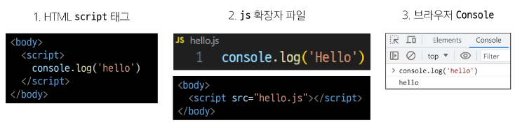

# DOM

## History of JavaScript 
### ECMA Script

- Ecma International이 정의하고 있는 표준화된 스크립트 프로그래밍 언어 명세

> 스크립트 언어가 준수해야 하는 규칙, 세부사항 등을 제공

## 변수
### 변수 작성 규칙

(링크 참고) https://standardjs.com/rules-kokr

- 반드시 문자, 달러 또는 밑줄로 시작
- 대소문자를 구분
- 예약어 사용 불가 (for, if...)

- 카멜 케이스 (camelCase)
  - 변수, 객체, 함수에 사용

- 파스칼 케이스 (PascalCase)
  - 클래스, 생성자에 사용

- 대문자 스네이크 케이스 (SNAKE_CASE)
  - 상수(constants) 사용

### 변수 선언 키워드

1. let

- 블록 스코프를 갖는 지역 변수를 선언
- 재할당 가능
- 재선언 불가능
- ES6에서 추가

```javascript
let number = 10 // 1. 선언 및 초기값 할당
number = 20 // 2. 재할당 

let number = 10  // 1. 선언 및 초기값 할당
let number = 20  // 2. 재선언 불가능
```

2. const

- 블록 스코프를 갖는 지역 변수를 선언
- 재할당 불가능
- 재선언 불가능
- ES6에서 추가

```js
const number = 10  // 1. 선언 및 초기값 할당 
number = 10  // 2. 재할당 불가능
 
const number = 10  // 1. 선언 및 초기값 할당
const number = 20  // 2. 재선언 불가능

const number  // 선언시 반드시 초기값 설정 필요 빈값 xx
```

**let과 const의 제일 큰 차이는 재할당의 여부**

#### 어떤 변수 선언 키워드를 사용해야 함?

- **const를 기본으로 사용**
  - 코드의 의도 명학화
  - 버그 예방

- 필요한 경우에만 let으로 전환
  - 재할당이 필요한 경우
  - let을 사용하는 것은 해당 변수가 의도적으로 변경될 수 있음
  - 코드의 유연성을 확보하면서도 const의 장점을 최대한 활용할 수 있음
  

### 블록 스코프

- if, for, 함수 등의 중괄호{} 내부를 가리킴
- 블록 스코프를 가지는 변수는 블록 바깥에서 접근 불가능

```js
let x = 1

if (x===1) {
  let x = 2
  console.log(x)  //2
}

console.log(x)  //1
```

## DOM

- **문서의 요소들을 객체로 제공하여 다른 프로그래밍 언어에서 접근하고 조작할 수 있는 방법을 제공하는 API**
  
- 웹 브라우저에서의 JavaScript : 웹 페이지의 동적인 기능을 구현

- The Document Object Model
  - 웹 페이지를 구조화된 객체로 제공하여 프로그래밍 언어가 페이지 구조에 접근할 수 있는 방법을 제공
  
> 문서 구조, 스타일, 내용 등을 변경할 수 있도록 함

#### DOM API

- 다른 프로그래밍 언어가 웹 페이지에 접근 및 조작 할 수 있도록 페이지 요소들을 객체 형태로 제공하며 이에 따른 메서드 또한 제공

#### DOM 특징

- DOM 에서 모든 요소, 속성, 텍스트는 하나의 개게
- 모두 document 객체의 하위 객체로 구성됨

#### DOM tree 

- 브라우저는 HTML 문서를 해석하여 DOM tree 라는 객체 트리로 구조화
  
> 객체 간 상속 구조가 존재

#### JavaScript 실행 환경 종류



### document 객체

- 웹 페이지 객체
- DOM Tree의 진입점
- 페이지를 구성하는 모든 객체 요소를 포함

## DOM 선택

웹 페이지를 동적으로 만들기 == 웹 페이지를 조작하기

- 조작 순서
  1. 조작 하고자 하는 요소를 선택 (또는 탐색)
  2. 선택된 요소의 콘텐츠 또는 속성을 조작

### 선택 메서드

- document.querySelector()
  - 요소 한 개 선택

- document.querySelectorAll()
  - 요소 여러 개 선택

#### document.querySelector(selector)

- 제공한 선택자와 일치하는 element 한 개 선택
> 제공한 선택자를 만족하는 첫 번째 element 객체를 반환(없다면 null 반환)

#### document.querySelectorAll(selector)

- 제공한 선택자와 일치하는 여러 element를 선택
> 제공한 선택자를 만족하는 NodeList를 반환

```html
<body>
  <h1 class="heading">DOM 선택</h1>
  <a href="https://www.google.com/">google</a>
  <p class="content">content1</p>
  <p class="content">content2</p>
  <p class="content">content3</p>
  <ul>
    <li>list1</li>
    <li>list2</li>
  </ul>

  <script>
    console.log(document.querySelector('.heading'))
    console.log(document.querySelector('.content'))
    console.log(document.querySelectorAll('.content'))
    console.log(document.querySelectorAll('ul > li'))
  </script>
</body>
```

## DOM 조작
### 속성 조작 

#### 클래스 속성 조작

- classList 메서드
    
- 요소의 클래스 목록을 DOMTokenList(유사 배열) 형태로 변환

1. element.classList.add()
   - 지정한 클래스 값을 추가
  
2. element.classList.remove()
   - 지정한 클래스 값을 제거
  
3. element.classList.toggle()
   - 클래스가 존재한다면 제거하고 false를 반환
   - 존재하지 않으면 클래스를 추가하고 true를 반환
   
#### 일반 속성 조작

1. Element.getAttribute()
   - 해당 요소에 지정된 값을 반환(조회)

2. Element.setAttribute()
   - 지정된 요소의 속성 값을 설정
   - 속성이 이미 있으면 기존 값을 갱신 (그렇지 않으면 지정된 이름과 값으로 새 속성이 추가)

3. Element.removeAttrbute()
   - 요소에서 지정된 이름을 가진 속성 제거

### HTML 콘텐츠 조작

- textContent property
- 요소의 텍스트 콘텐츠를 표현

### DOM 요소 조작

1. document.createElement(tagName)
   - 작성한 tagName의 HTML요소를 생성하여 반환

2. Node.appendChild()
   - 한 Node를 특정 부모 Node의 자식 NodeList 중 마지막 자식으로 삽입
   - 추가된 Node 객체를 반환

3. Node.removeChild()
   - DOM 에서 자식 Node를 제거
   - 제거된 Node를 반환

### style 조작

- style property
- 해당 요소의 모든 style 속성 목록을 포함하는 속성

## 참고
### DOM 속성 확인 Tip

- 개발자도구 - Elements - Properties
- 선택한 해당 요소의 모든 DOM 속성 확인 가능
    
### 용어 정리

#### Node

- DOM의 기본 구성 단위
- DOM 트리의 각 부분은 Node라는 객체로 표현됨
  - Document Node : HTML 문서 전체를 나타내는 노드
  - Element Node : HTML 요소를 나타내는 노드 (예를들어 <p>)
  - Text Node : HTML 텍스트
  - Attribute Node : HTML 요소의 속성을 나타내는 노드

#### NodeList

- DOM 메서드를 사용해 선택한 Node의 목록
- 배열과 유사한 구조를 가짐
- Index로만 각 항목에 접근 가능
- JavaScript 의 배열 메서드 사용 가능
- querySelectorAll()에 의해 반환되는 NodeList는 DOM의 변경사항을 실시간으로 반영하지 않음

#### Element

- Node의 하위 유형
- Element는 DOM 트리에서 HTML 요소를 나타내는 특별한 유형의 Node
- Node의 속성과 메서드를 모두 가지고 있으며 추가적으로 요소 특화된 기능을 가지고 있음

> 모든 Element는 Node이지만, 모든 Node가 Element인 것은 아님

#### Parsing(구문 분석, 해석)

- 브라우저가 문자열을 해석하여 DOM Tree로 만드는 과정

### 세미콜론

- 자동으로 세미콜론 삽입됨
  
### var
### 호이스팅