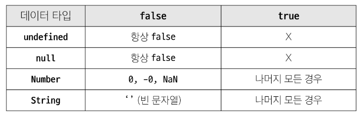

# 데이터 타입

- 원시 자료형, 참조 자료형

## 원시 자료형
- 변수에 값이 직접 저장되는 자료형(불변, 값이 복사)
  > 변수 간에 서로 영향을 미치지 않음

- Number, String, Boolean, null, undefined

### Number 

```js
const a = 13
const b = -5
const c = 2.998e8
const d = Infinity
const e = NaN // Not a Number 를 나타내는 값. 숫자를 문자로 나누려고 하면 발생
```

### String

- + 연산자를 사용해 문자열끼리 결합
- 뺄셈, 곱셈, 나눗셈 불가능

#### Template literals

- 내장된 표현식을 허용하는 문자열 작성 방식
- 백틱(``) 사용, 여러 줄에 걸쳐 문자열 정의 또는 변수 문자열 안에 연결 가능
- ${표현식} 사용
- ES6+ 부터 지원

### null 과 undefined

- null : 프로그래머가 의도적으로 '값이 없음'을 나타낼 때 사용

- undefined : 시스템이나 javascript 엔진이 '값이 할당되지 않음'을 나타낼 때 사용

```js
let a = null
console.log(a) // null

let b 
console.log(b) // undefined
```

### Boolean

- 조건문 또는 반복문에서 Boolean이 아닌 데이터 타입은 '자동 형변환 규칙'에 따라 
true 또는 false로 변환됨



## 참조 자료형
- 객체의 주소가 저장되는 자료형(가변, 주소가 복사)
  > 변수 간에 서로 영향을 미침

- objects(Object, Array, Function)

# 연산자

## 할당 연산자

- 오른쪽에 있는 피연산자의 평가 결과를 왼쪽 피연산자에 할당하는 연산자
- 단축 연산자 지원

```js
let a = 0 

a += 10
a -= 10
a *= 10
a %= 10
```

## 증가 & 감소 연산자

- 증가 연산자 (++)
  - 피연산자를 증가시키고 연산자의 위치에 따라 증가하기 전이나 후의 값을 반환

- 감소 연산자 (--)
  - 피연산자를 감소시키고 연산자의 위치에 따라 감소하기 전이나 후의 값을 반환
  
> += 또는 -= 와 같이 더 명시적인 표현으로 작성하는 것을 권장

## 비교 연산자 

- 피연산자들 (숫자, 문자, Boolean)을 비교하고 결과
  값을 boolean으로 반환하는 연산자

## 동등 연산자 (==)

- 두 피연산자가 같은 값으로 평가되는지 비교 후 boolean 값을 반환
- '암묵적 타입 변환' 통해 타입을 일치시킨 후 같은 값인지 비교
- 두 피연산자가 모두 객체일 경우 메모리의 같은 객체를 바라보는지 판별

## 일치 연산자 (===)

- 두 피연산자의 값과 타입이 모두 같은 경우 true를 반환
- 같은 객체를 가리키거나, 같은 타입이면서 같은 값인지를 비교
- 엄격한 비교가 이뤄지며 암묵적 타입 변환이 발생하지 않음
- 특수한 경우를 제외하고는 동등 연산자가 아닌 일치 연산자 사용 권장

## 논리 연산자

- and : &&
- or : ||
- not : !
- 단축 평가 지원
  
## 삼항 연산자

condition ? expression1 : expression2

- condition
  - 평가할 조건 (true 또는 false로 평가)

- expression1
  - 조건이 true일 경우 반환할 값 또는 표현식

- expression2
  - 조건이 false일 경우 반환할 값 또는 표현식

- 간단한 조건부 로직을 간결하게 표현할 때 유용
> 복잡한 로직이나 대다수의 경우에는 가독성이 떨어질 수 있으므로 적절한 상황에서만 사용할 것

# 조건문

#### if 

- 조건 표현식의 결과 값을 boolean 타입으로 변환 후 참/거짓을 판단

# 반복문

## while

- 조건문이 참이면 문장을 계속해서 수행
  
```js
while (조건문) {
  //do something
}

let i = 0

while (i<6){
  console.log(i)
  i += 1
}
```

## for

- 특정한 조건이 거짓으로 판별될 때까지 반복
  
```js
for ([초기문]; [조건문]; [증감문]) {
  //do something
}

for (let i = 0; i < 6; i++) {
  console.log(i)
}
```

## for in 

- 객체의 열거 가능한 속성에 대해 반복

```js
const object = {
  a: 'apple',
  b: 'banana'
}

for (const property in object){  
  console.log(property)             // a b
  console.log(object[property])     // apple banana
}
```

## for of

- 반복 가능한 객체 (배열, 문자열 등)에 대해 반복

```js
const numbers = [0, 1, 2, 3]

for (const number of numbers){
  console.log(number)
}

const myStr = 'apple'

for (const char of myStr){
  console.log(char)
}
```
## for in 과 for of

- for in은 특정 순서에 따라 인덱스를 반환하는 것을 보장할 수 없음

- for in 은 인덱스의 순서가 중요한 배열에서는 사용하지 않음
- 배열에서는 for문, for of를 사용

### 반복문 사용시 const 사용 여부

- for 문
  - let 써야함. 재할당 하기 때문에!

- for in, for of
  - const 써도 에러 발생 x
  - 블록 내부에서 변수 수정 불가

# 참고
## NaN 예시

1. 숫자로서 읽을 수 없음
2. 결과가 허수인 수학 계산식
3. 피연산자가 NaN
4. 정의할 수 없는 계산식
5. 문자열을 포함하면서 덧셈이 아닌 계산식
