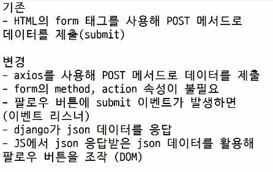

# Ajax와 서버

- Ajax : 비동기적인 웹 어플리케이션 개발에 사용하는 기술

- XML 객체 생성 및 요청 -> Ajax 요청 처리 -> 응답 데이터 생성
  -> JSON 데이터 응답 -> Promise 객체 데이터를 활용해 DOM 조작 (웹페이지의 일부분 만을 다시 로딩)

# Ajax with follow
## 비동기 팔로우 구현

#### 사전 준비 

- 가상환경 생성, 활성화 및 패키지 설치
- M:N Django 프로젝트 준비

#### Ajax 적용

1. 프로필 페이지에 axios CDN 작성

```html
<!-- accounts/profile.html -->

<script src="https://cdn.jsdelivr.net/npm/axios/dist/axios.min.js"></script>

```

2. form 요소 선택을 위해 id 속성 지정 및 선택

  - action과 method 속성은 삭제
  - 요청은 axios 로 대체되기 때문

  

```html
<!-- accounts/profile.html -->

<form action="" method="POST">
</form>

<!-- 이거를 아래처럼 변경-->

<form id="follow-form">
```

3. form 요소에 이벤트 핸들러 할당
4. submit 이벤트의 기본 동작 취소하기

```html
<!-- accounts/profile.html -->

<script>
// 1. 팔로우 버튼 선택
const formTag = document.querySelector('#follow-form')

// 2. 팔로우 버튼에 이벤트 리스너를 부착 (submit 이벤트 감지)
formTag.addEventListener('submit', function (event) {
  event.preventDefault()
})
</script>
```

5. axios 요청 코드 작성
  - url 작성에 필요한 user pk는 어떻게 작성해야 할까?
  - csrftoken은 어떻게 보내야 할까?

```html
<script>
  // 1. 팔로우 버튼 선택
  const formTag = document.querySelector('#follow-form')

  // 2. 팔로우 버튼에 이벤트 리스너를 부착 (submit 이벤트 감지)
  formTag.addEventListener('submit', function (event) {
    // 3. submit 이벤트의 기본 동작 취소
    event.preventDefault() 
    // 4. axios 준비
    axios({
      method: 'post',
      url: `/accounts/${유저ID}/follow/`
    })
  })
</script>
```

6. url에 작성할 user pk 가져오기 (HTML -> JavaScript)
7. 요청 url 작성 마무리

```html
<form id="follow-form" data-user-id="{{ person.pk }}">
</form>

<script>
  // 1. 팔로우 버튼 선택
  const formTag = document.querySelector('#follow-form')

  // 2. 팔로우 버튼에 이벤트 리스너를 부착 (submit 이벤트 감지)
  formTag.addEventListener('submit', function (event) {
    // 3. submit 이벤트의 기본 동작 취소
    event.preventDefault()
    // 5. HTML에서 준비한 user의 pk를 조회
    const userId = event.currentTarget.dataset.userId
    const userId = this.dataset.userId
    const userId = formTag.dataset.userId

    // 4. axios 준비
    axios({
      method: 'post',
      url: `/accounts/${userId}/follow/`
    })
  })
</script>
```

   - 'data-*' 속성
     -  사용자 지정 데이터 특성을 만들어 임의의 데이터를 HTML과 DOM 사이에서 교환할 수 있는 방법

     ```html
     <div>data-my-id = "my-data"</div>
     <script>
       const myId = event.target.dataset.myId
     </script>
     ```

     - 모든 사용자 지정 데이터는 JavaScript에서 dataset 속성을 통해 접근
     - 주의사항  
       - 대소문자 여부에 상관없이 'xml' 문자로 시작 불가
       - 세미콜론 포함 불가
       - 대문자 포함 불가

8. 문서상 input hidden 타입으로 존재하는 csrf token 데이터를 이제는 axios 로 전송해야함
9. csrf 값을 가진 input 요소를 직접 선택 후 axios에 작성하기

```html
<script>
  // 1. 팔로우 버튼 선택
  const formTag = document.querySelector('#follow-form')
  
  // 7. csrf 선택
  const csrftoken = document.querySelector('[name=csrfmiddlewaretoken]').value
  
  // 2. 팔로우 버튼에 이벤트 리스너를 부착 (submit 이벤트 감지)
  formTag.addEventListener('submit', function (event) {
    // 3. submit 이벤트의 기본 동작 취소
    event.preventDefault()
    // 5. HTML에서 준비한 user의 pk를 조회
    const userId = event.currentTarget.dataset.userId
    //const userId = this.dataset.userId
    //const userId = formTag.dataset.userId 

    // 4. axios 준비
    axios({
      method: 'post',
      url: `/accounts/${userId}/follow/`,

      // 8. 선택한 csrftoken 값을 요청 headers에 세팅
      headers: {'X-CSRFToken': csrftoken},
    })
  })
</script>
```

10. 팔로우 상태 여부를 JavaScript에게 전달할 데이터 작성
11. 응답은 더이상 HTML 문서가 아닌 JSON 데이터로 응답하도록 변경

```py
# accouts/views.py

from django.http import JsonResponse

def follow(request, user_pk):
    User = get_user_model()
    you = User.objects.get(pk=user_pk)
    me = request.user

    if me != you:
        # 9. JS에게 팔로우 상태여부를 전달할 데이터 생성
        if me in you.followers.all():
            you.followers.remove(me)
            # me.followings.remove(you)
            is_followed = False
        else:
            you.followers.add(me)
            # me.followings.add(you)
            is_followed = True
        context = {
            'is_followed': is_followed,
        }
        # 10. JSON 데이터로 응답
        return JsonResponse(context)
    return redirect('accounts:profile', you.username)
```

12. 응답 데이터 is_followed 에 따라 팔로우 버튼을 조작하기

```js
// accounts/profile.html

// 버튼에 클래스 추가한 다음 조작하기
<form id="follow-form" data-user-id="{{ person.pk }}">
        
        
          <input type="submit" value="언팔로우" class="follow-input">
        
          <input type="submit" value="팔로우" class="follow-input">
        
      </form>

axios({
        method: 'post',
        url: `/accounts/${userId}/follow/`,

        // 8. 선택한 csrftoken 값을 요청 headers에 세팅
        headers: {'X-CSRFToken': csrftoken},
      })
        .then((response) => {
          // 11. django로 부터 응답받은 팔로우 상태 정보
          console.log(response.data)
          // 12. 팔로우 상태 정보 데이터에 따라 팔로우 버튼을 조작
          const isFollowed = response.data.is_followed
          const followBtn = document.querySelector('.follow-input')
          if (isFollowed === true) {
            followBtn.value = '언팔로우'
          }
          else {
            followBtn.value = '팔로우'
          }
        })
        .catch((response) => {
          console.log(error)
        })
```

13. 팔로잉 수와 팔로워 수 비동기 적용
  - 해당 요소를 선택할 수 있도록 span 태그와 id 속성 작성
  - 각 span 태그 선택

```html
<!-- accounts/profile.html -->

<div>
  팔로잉 : <span id="followings-count">{{ person.followings.all|length }}</span> / 
  팔로워 : <span id="followers-count">{{ person.followers.all|length }}</span>
</div>

<script>
  .then((response) => {
    // 13. 팔로워 & 팔로잉 수 선택
    const followingsCountTag = document.querySelector('followings-count')
    const followersCountTag = document.querySelector('followers-count')
  })
</script>
```

14. Django view 함수에서 팔로워, 팔로잉 인원 수 연산을 진행하여 결과를 응답데이터로 전달

```py
# accounts/views.py

def follow(request, user_pk):
    User = get_user_model()
    you = User.objects.get(pk=user_pk)
    me = request.user

    if me != you:
        # 9. JS에게 팔로우 상태여부를 전달할 데이터 생성
        if me in you.followers.all():
            you.followers.remove(me)
            # me.followings.remove(you)
            is_followed = False
        else:
            you.followers.add(me)
            # me.followings.add(you)
            is_followed = True
        context = {
            'is_followed': is_followed,
            # 14. 응답 데이터에 팔로워, 팔로잉 인원 수 연산 추가
            'followings_count': you.followings.count(),
            'followers_count': you.followers.count(),
        }
        # 10. JSON 데이터로 응답
        return JsonResponse(context)
    return redirect('accounts:profile', you.username)
```

15. 응답데이터를 받아 각 태그의 인원수 값 변경에 활용

```js
// accounts/profile.html

axios({
  method: 'post',
  url: `/accounts/${userId}/follow/`,

  // 8. 선택한 csrftoken 값을 요청 headers에 세팅
  headers: {'X-CSRFToken': csrftoken},
})
  .then((response) => {
    // 11. django로 부터 응답받은 팔로우 상태 정보
    console.log(response.data)
    // 12. 팔로우 상태 정보 데이터에 따라 팔로우 버튼을 조작
    const isFollowed = response.data.is_followed
    const followBtn = document.querySelector('.follow-input')
    if (isFollowed === true) {
      followBtn.value = '언팔로우'
    }
    else {
      followBtn.value = '팔로우'
    }
    // 13. 팔로워 & 팔로잉 수 선택
    const followingsCountTag = document.querySelector('followings-count')
    const followersCountTag = document.querySelector('followers-count')
    // 15. 응답 데이터 받아서 태그 인원수 값 변경
    followingsCountTag.textContent = response.data.followings_count
    followersCountTag.textContent = response.data.followers_count
  })
```

# Ajax with likes
## 비동기 좋아요 구현

- 전반적인 Ajax 적용은 팔로우 구현 과정과 동일 
  but 팔로우와 달리 좋아요 버튼은 한 페이지에 여러개가 존재

- 버블링 기능 활용해서 각 버튼의 공통 조상인 div 요소에 이벤트 핸들러 단 하나만 할당하기

#### Ajax 적용 

1. 모든 좋아요 form 요소를 포함하는 최상위 요소 작성

```html
<!-- articles/index.html -->
<article class="article-container">
  
    ...
  
</article>
```

2. 최상위 요소 선택
3. 이벤트 핸들러 할당
4. 하위 요소들의 submit 이벤트를 감지하고 submit 기본 이벤트를 취소

```html
<!-- articles/index.html -->

<script src="https://cdn.jsdelivr.net/npm/axios/dist/axios.min.js"></script>
<script>
  // 2. 게시글을 모두 포함하는 최상위 요소를 선택
  const articleContainer = document.querySelector('.article-container')

  // 3. 선택한 최상위 요소에 이벤트 핸들러를 부착
  articleContainer.addEventListener('submit', function (event) {
    // 4. submit 이벤트 기본 동작 취소
    event.preventDefault()
  })
</script>
```

5. axios 코드 작성

```js
// 7. csrf 선택
const csrftoken = document.querySelector('[name=csrfmiddlewaretoken]').value

// 6. axios 요청 작성
axios({
  method:'post',
  url:`/articles/${게시글ID}/likes/`,

  // 8. 선택한 csrftoken 값을 요청 headers에 세팅
  headers: {'X-CSRFToken': csrftoken,},
})
```

6. 각 좋아요 form에 article.pk를 부여 후 HTML의 article.pk 값을 JavaScript에서 참조하기
  - 이때 event.target 사용해야함

```html
<form data-article-id="{{ article.pk }}">
  ...
</form>

<script>
  // 2. 게시글을 모두 포함하는 최상위 요소를 선택
  const articleContainer = document.querySelector('.article-container')
  // 7. csrf 선택
  const csrftoken = document.querySelector('[name=csrfmiddlewaretoken]').value

  // 3. 선택한 최상위 요소에 이벤트 핸들러를 부착
  articleContainer.addEventListener('submit', function (event) {
    // 4. submit 이벤트 기본 동작 취소
    event.preventDefault()
    // 10. HTML에서 전달한 게시글 id 받기 - currentTarget이 아니라 target임
    const articleId = event.target.dataset.articleId
    // 6. axios 요청 작성
    axios({
      method:'post',
      // 11. 전달받은 게시글 id로 url 완성
      url:`/articles/${articleId}/likes/`,
      // 8. 선택한 csrftoken 값을 요청 headers에 세팅
      headers: {'X-CSRFToken': csrftoken,},
    })
  })
</script>
```

7. 좋아요 상태 여부를 JavaScript에게 전달할 데이터 작성 및 JSON 데이터 응답

```py
# articles/views.py

def likes(request, article_pk):
    article = Article.objects.get(pk=article_pk)

    if request.user in article.like_users.all():
        article.like_users.remove(request.user)
        is_liked = False
    else:
        article.like_users.add(request.user)
        is_liked = True
    # 12. 좋아요 상태 여부 js 에게 전달할 데이터 작성
    context = {
        'is_liked':is_liked,
    }
    # 13. JSON 데이터 응답
    return JsonResponse(context)
```

8. 응답 데이터 is_liked를 받아 isLiked 변수에 할당
  
```js
// articles/index.html

axios({
  method:'post',
  // 11. 전달받은 게시글 id로 url 완성
  url:`/articles/${articleId}/likes/`,
  // 8. 선택한 csrftoken 값을 요청 headers에 세팅
  headers: {'X-CSRFToken': csrftoken,},
})
  .then((response) => {
    // 14. 응답 데이터 is_liked 받아서 isLiked 변수에 할당
    const isLiked = response.data.is_liked
  })
  .catch((error) => {
    console.log(error)
  })
```

9. 문자와 article의 pk 값을 혼합하여 각 버튼에 id 속성 값을 설정

```js
// articles/index.html


   16. id 속성 값 버튼에 설정 
  <input type="submit" value="좋아요 취소" id="like-{{ article.pk}}">

  <input type="submit" value="좋아요" id="like-{{ article.pk}}">

```

10. 각 좋아요 버튼을 선택 후 isLiked 에 따라 버튼을 토글

```js
// articles/index.html

.then((response) => {
  // 14. 응답 데이터 is_liked 받아서 isLiked 변수에 할당
  const isLiked = response.data.is_liked
  // 16. isLiked 에 따라 좋아요 버튼을 토글하기
  const likeBtn = document.querySelector(`#like-${articleId}`)
  if (isLiked === true) {
    likeBtn.value = '좋아요 취소'
  } 
  else {
    likeBtn.value = '좋아요'
  }
})
```