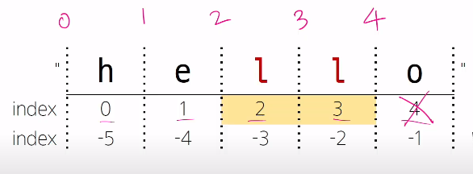

# Data Types
## Data Types

### 개요
- 값의 종류와 그 값에 적용 가능한 연산과 동작을 결정하는 속성

### 데이터 타입 분류
- Numeric Types
    - int(정수), float(실수), complex(복소수)
- Text Sequence Types
    - str(문자열)
- Sequence Types
    - list, tuple, range
- Non-sequence Types
    - set, dict
- 기타
    - boolean, None, functions

### 데이터 타입이 필요한 이유
- 값들을 구분하고, 어떻게 다뤄야 하는지를 알 수 있음
- 요리 재료마다 특정한 도구가 필요하듯이 각 데이터 타입 값들도 각자에게 적합한 도구를 가짐
- 타입을 명시적으로 지정하면 코드를 읽는 사람이 변수의 의도를 더 쉽게 이해할 수 있고, 잘못된 데이터 타입으로 인한 오류를 미리 예방

## Numeric Types
### int (정수 자료형)

- 정수를 표현하는 자료형
    ```py
    a = 10
    b = 0
    c = -5
    ```

#### 진수 표현

- 2진수(binary) : 0b
- 8진수(octal) : 0o
- 16진수(hexadecimal) : 0x

### float (실수 자료형)

- 실수를 표현하는 자료형
    ```py
    d = 3.14
    e = -2.7
    ```
- 프로그래밍 언어에서 float는 **실수에 대한 <span style='color:crimson;'>근삿값</span>**

#### 유한 정밀도

- 컴퓨터 메모리 용량이 한정돼 있고 한 숫자에 대해 저장하는 용량이 제한 됨
- 0.6666666666666666과 1.6666666666666667은 제한된 양의 메모리에 저장할 수 있는 2/3과 5/3에 **가장 가까운 값**

    ```python
    # 0.6666666666666666
    print(2 / 3)

    # 1.6666666666666667
    print(5 / 3)
    ```

#### 실수 연산시 주의사항

- 컴퓨터는 2진수를 사용, 사람은 10진법을 사용

- 이때 10진수 0.1은 2진수로 표현하면 0.0001100110011001100110... - 같이 무한대로 반복
- 무한대 숫자를 그대로 저장할 수 없어서 사람이 사용하는 10진법의 근사값만 표시
- 0.1의 경우 3602879701896397 / 2 ** 55 이며 0.1에 가깝지만 정확히 동일하지는 않음
- 이런 과정에서 예상치 못한 결과가 나타남
- 이런 증상을 <span style='color:crimson;'>Floating point rounding error 부동소수점 에러</span>라고 함

#### 부동소수점 에러
- 컴퓨터가 실수를 표현하는 방식으로 인해 발생하는 작은 오차
- 원인
    - 실수를 2진수로 변환하는 과정에서 발생하는 근사치 표현

#### 부동소수점 에러 해결책

- 대표적으로 decimal 모듈을 사용해 부동소수점 연산의 정확성을 보장하는 방법
- 이외에도 다양한 해결 방법이 존재

    ```py
    # 해결 전
    a = 3.2 - 3.1
    b = 1.2 - 1.1
    print(a) # 0.1000000000009
    print(b) # 0.0999999999987

    print(a == b)  # False

    # 해결 후 
    from decimal import Decimal

    a = Decimal('3.2') - Decimal('3.1')
    b = Decimal('1.2') - Decimal('1.1')

    print(a) # 0.1
    print(b) # 0.1
    print(a == b) # True 
    ```

#### 지수 표현 방식

- `e` 또는 `E`를 사용한 지수 표현

    ```py
    # 314 ∗ 0.01
    number = 314e-2    # e-2(0.01)

    # 3.14
    print(number)
    ```

## Sequence Types
### Sequence Types

- **여러 개의 값**들을 <span style='color:crimson;'>순서대로 나열</span>하여 저장하는 자료형 (str, list, tuple, range) 
- 정렬은 아니다!

#### Sequence Type 특징

1. 순서(Sequence) 
    - 값들이 순서대로 저장(정렬 x)
2. 인덱싱(Indexing)
    - 각 값에 고유한 인덱스(번호)를 가지고 있으며, 인덱스를 사용하여 특정 위치의 값을 선택하거나 수정할 수 있음
3. 슬라이싱(Slicing)
    - 인덱스 범위를 조절해 부분적인 값을 추출할 수 있음
4. 길이(Length)
    - len() 함수를 사용하여 저장된 값의 개수(길이)를 구할 수 있음
5. 반복(Iteration)
    - 반복문을 사용하여 저장된 값들을 반복적으로 처리할 수 있음

### str `문자열`
- 문자들의 순서가 있는 변경 불가능한 시퀀스 자료형

#### 문자열 표현
- 문자열은 단일 문자나 여러 문자의 조합으로 이루어짐
- 작은따옴표(') 또는 큰따옴표(") 감싸서 표현

    ```py
    # Hello, World!
    print('Hello, World!')

    # str
    print(type('Hello, World!'))
    ```

#### 중첩 따옴표

- 따옴표 안에 따옴표를 표현할 경우 
    - 작은 따옴표가 들어 있는 경우는 큰따옴표로 문자열 생성
    - 큰 따옴표가 들어 있는 경우는 작은따옴표로 문자열 생성

```py
# 문자열 안에 '작은 따옴표'를 사용하려면 큰따옴표로 묶는다.
print("문자열 안에 '작은 따옴표'를 사용하려면 큰따옴표로 묶는다.")

# 문자열 안에 "큰따옴표"를 사용하려면 작은 따옴표로 묶는다.
print('문자열 안에 "큰따옴표"를 사용하려면 작은 따옴표로 묶는다.')
```

#### Escape sequence

- 역슬래시(backslash, `/`) 뒤에 특정 문자가 와서 특수한 기능을 하는 문자 조합
- 파이썬의 일반적인 문법 규칙을 잠시 탈출한다는 의미

|     예약   문자    	|      내용(의미)    	|
|:------------------:	|:------------------:	|
|          `\n`        	|      줄   바꿈     	|
|          `\t`        	|          탭        	|
|          `\\`        	|       백슬래시     	|
|          `\’`        	|     작은 따옴표    	|
|          `\"`        	|     큰   따옴표    	|

#### Escape sequence 예시

```py
# 철수야 '안녕'
print('철수야 \'안녕\'') 

# 이 다음은 엔터
# 입니다.
print('이 다음은 엔터\n입니다.')
```

#### String Interpolation

- 문자열 내에 변수나 표현식을 삽입하는 방법

#### <span style='color:crimson;'>f-string</span> <매우 중요!>

- 문자열에 `f` 또는 `F` 접두어를 붙이고 표현식을 {expression}로 작성하는 문법
- 문자열에 파이썬 표현식의 값을 삽입할 수 있음

```python
bugs = 'roaches'
counts = 13
area = 'living room'

# Debugging roaches 13 living room
print(f'Debugging {bugs} {counts} {area}')

# 오늘 날씨는 28도 입니다.
temp = 14 * 2
print(f'오늘 날씨는 {temp}도 입니다.')
```

#### 문자열 sequence 특징

```python
my_str = 'hello'

# 인덱싱
print(my_str[1]) # e

# 슬라이싱
print(my_str[2:4]) # 11

# 길이
print(len(my_str)) # 5
```

#### - 인덱스 `index`

- 시퀀스 내의 값들에 대한 고유한 번호로, 각 값의 위치를 식별하는 데 사용되는 숫자
- 빈칸도 인덱스 세어주어야함

##### index 예시

|         "    	|      h    	|      e    	|      l    	|      l    	|      o    	|     "    	|
|-------------:	|:---------:	|:---------:	|:---------:	|:---------:	|:---------:	|----------	|
|     index    	|      0    	|      1    	|      2    	|      3    	|      4    	|          	|
|     index    	|     -5    	|     -4    	|     -3    	|     -2    	|     -1    	|          	|


마이너스는 반대 +1!!!



#### - 슬라이싱 `slicing`

시퀀스의 일부분을 선택하여 추출하는 작업

-> 시작 인덱스와 끝 인덱스를 지정하여 해당 범위의 값을 포함하는 새로운 시퀀스를 생성

##### 슬라이싱 예시

```python
my_str = 'hello'
my_str[2:4]

# ll
```


```python
my_str = 'hello'
my_str[:3]

# hel
```


```python
my_str = 'hello'
my_str[3:]

# lo
```

```python
my_str = 'hello'
my_str[-5:-1]

# hell
```


- step을 지정하여 추출
```python
my_str = 'hello'
my_str[0:5:2] # 0부터 5까지 2씩 뛰어서

# hlo
```


- **step이 음수일 경우**
```python
my_str = 'hello'
my_str[::-1]

# olleh
```


#### <span style='color:red;'>문자열은 불변 (변경 불가)</span>

```python
my_str = 'hello'

# TypeError: 'str' object does not support item assignment
my_str[1] = 'z'
```

#### 문자열 뒤집기
```python
my_str = 'hello'

# 끝에 뒤집는 [::-1] 추가해주기
my_str[1:4][::-1]  # lle
```

### 참고
- 변수명 직관적으로 보일 수 있게 고려하기
- 주석

    ```python
    # 한 줄 주석 
    """ 
    여러 줄 주석  <- doc string 문서적 기능
    """
    # ctrl + / 드래그 된 부분 주석처리
    ```

### list `리스트`

- 여러 개의 값을 순서대로 저장하는 **변경 가능한** 시퀀스 자료형

#### 리스트 표현

- 0개 이상의 객체를 포함하며 데이터 목록을 저장
- 대괄호 `[]` 로 표기
- **데이터는 어떤 자료형도 저장할 수 있음**

```python
my_list_1 = []
my_list_2 = [1, 'a', 3, 'b', 5]
my_list_3 = [1, 2, 3, 'python', ['hello', 'world', '!!!']]
```

#### 리스트의 시퀀스 특징

```python
my_list = [1, 'a', 3, 'b', 5]

# 인덱싱
print(my_list[1])  # a

# 슬라이싱
print(my_list[2:4])  # [3, 'b']
print(my_list[:3])  # [1, 'a', 3]
print(my_list[3:])  # ['b', 5]
print(my_list[0:5:2])  # [1, 3, 5]
print(my_list[::-1])  # [5, 'b', 3, 'a', 1]

# 길이
print(len(my_list))  # 5
```

#### 중첩된 리스트 접근

출력 값 예상해보기

```python
my_list = [1, 2, 3, 'Python', ['hello', 'world', '!!!']]
print(len(my_list))  # 5
print(my_list[4][-1])  # !!!
print(my_list[-1][1][0])  # w
```

#### **리스트는 가변 (변경 가능)**

```python
my_list = [1, 2, 3]
my_list[0] = 100

print(my_list) # [100, 2, 3]
```

### tuple `튜플`

- 여러 개의 값을 순서대로 저장하는 <span style='color:red;'>**변경 불가능한**</span> 시퀀스 자료형

#### 튜플 표현

- 0개 이상의 객체를 포함하며 데이터 목록을 저장
- 소괄호 `()`로 표기
- 데이터는 어떤 자료형도 저장할 수 있음

```python 
my_tuple_1 = ()
my_tuple_2 = (1,)  # (1) 이렇게 표현하면 int로 표시됨
my_typle_3 = (1, 'a', 3, 'b', 5)
```

#### 튜플의 시퀀스 특징

```python
my_tuple = (1, 'a', 3, 'b', 5)

# 인덱싱
print(my_tuple[1])  # a

# 슬라이싱
print(my_tuple[2:4])  # (3, 'b')
print(my_tuple[:3])  # (1, 'a', 3)
print(my_tuple[3:])  # ('b', 5)
print(my_tuple[0:5:2])  # (1, 3, 5)
print(my_tuple[::-1])  # (5, 'b', 3, 'a', 1)

# 길이
print(len(my_tuple))  # 5
```

#### 튜플은 불변(변경 불가)

```python
my_tuple = (1, 'a', 3, 'b', 5)

# TypeError: 'tuple' object does not support item assignment -> 변경불가능에러
my_tuple[1] = 'z'
```

#### 튜플은 어디에 쓰일까?

- 튜플의 불변 특성을 사용한 안전하게 여러 개의 값을 전달, 그룹화, **다중 할당** 등
- 개발자가 직접 사용하기 보다 **파이썬 내부 동작**에서 주로 사용됨

```python
x, y = (10, 20) # 괄호 생략해도 동일하게 할당함

print(x) # 10
print(y) # 20

# 파이썬은 쉼표를 튜플 생성자로 사용하니 괄호는 생략 가능
x, y = 10, 20
```

### range 

- 연속된 정수 시퀀스를 생성하는 변경 불가능한 자료형

#### range 표현 1

- `range(시작 값, 끝 값, 증가 값)`
- `range(n)`
    - 0부터 n-1까지의 숫자의 시퀀스
- `range(n, m)`
    - n부터 m-1까지의 숫자의 시퀀스

    ```python
    my_range_1 = range(5)
    my_range_2 = range(1,10)

    print(my_range_1) # range(0, 5)
    print(my_range_2) # range(1, 10)
    ```

#### range 특징
- 증가 값이 없으면 1씩 증가
- 증가 값이 음수이면 감소 / 증가 값이 양수이면 증가
- 증가 값이 0이면 에러
- 증가 값이 음수이면 시작 값이 끝 값보다 커야 함
- 증가 값이 양수이면 시작 값이 끝 값보다 작아야 함

#### range 표현 2

- 주로 반복문과 함께 사용 예정

    ```python
    # 리스트로 형 변환 시 데이터 확인 가능
    print(list(range(5)))   # [0, 1, 2, 3, 4]
    print(list(range(1, 10)))  # [1, 2, 3, 4, 5, 6, 7, 8, 9]

    # 반복문과 함께 활용
    for i in range(1, 10):
        print(i)  # 1 2 3 4 5 6 7 8 9
    for i in range(1, 10, 2):
        print(i)  # 1 3 5 7 9
    ```

## Non-sequence Types
### dict `딕셔너리`

- **key - value 쌍**으로 이루어진 순서와 중복이 없는 변경 가능한 자료형 

#### 딕셔너리 표현

- key는 **변경 불가능한 자료형만** 사용 가능 (str, int, float, tuple, range …)
- value는 **모든 자료형** 사용 가능
- 중괄호 `{}`로 표기

    ```python
    my_dict_1 = {}
    my_dict_2 = {'key': 'value'}
    my_dict_3 = {'apple': 12, 'list': [1, 2, 3]}  # 요소가 2개

    print(my_dict_1)  # {}
    print(my_dict_2)  # {'key': 'value'}
    print(my_dict_3)  # {'apple': 12, 'list': [1, 2, 3]}
    ```

#### 딕셔너리 사용

- key를 통해 value에 접근

    ```python
    my_dict = {'apple': 12, 'list': [1, 2, 3]}
    print(my_dict['apple'])  # 12
    print(my_dict['list'])  # [1, 2, 3]

    # 추가
    my_dict['banana'] = 50
    print(my_dict) # {'apple': 12, 'list': [1, 2, 3], 'banana': 50}

    # 변경
    my_dict['apple'] = 100
    print(my_dict) # {'apple': 100, 'list': [1, 2, 3], 'banana': 50}
    ```

### set `세트` (집합 자료형)

- **순서와 중복이 없는 변경 가능한** 자료형
- 중복제거/집합연산에 주로 사용됨

#### 세트 표현

- 수학에서의 집합과 동일한 연산 처리 가능
- 중괄호 `{}` 로 표기

    ```python
    my_set_1 = set() # 먼저 선언 후 중괄호로 세트 만듬
    my_set_2 = {1, 2, 3}
    my_set_3 = {1, 1, 1} # 중복이 존재할 수 없음, 순서 없음, 인덱스 없음

    print(my_set_1)  # set()
    print(my_set_2)  # {1, 2, 3}
    print(my_set_3)  # {1}
    ```

#### 세트의 집합 연산
- 집합처럼 연산 가능

    ```python
    my_set_1 = {1, 2, 3}
    my_set_2 = {3, 6, 9}

    # 합집합
    print(my_set_1 | my_set_2)  # {1, 2, 3, 6, 9} 

    # 차집합
    print(my_set_1 - my_set_2)  # {1, 2}

    # 교집합
    print(my_set_1 & my_set_2)  # {3}
    ```

## Other Types
### None
- 파이썬에서 '값이 없음'을 표현하는 자료형

#### None 표현
- None 값 할당 가능

    ```python
    variable = None  # N을 꼭 대문자로 쓰기, 변수는 있는데 값이 없을 수도 있을 때

    print(variable)  # None
    ```
### Boolean
- 참(True)과 거짓(False)을 표현하는 자료형

#### 불리언 표현
- 비교 / 논리 연산의 평가 결과로 사용됨
- 주로 조건 / 반복문과 함께 사용

    ```python
    bool_1 = True   # T랑 F 대문자로 쓰기
    bool_2 = False

    print(bool_1)  # True
    print(bool_2)  # False
    print(3 > 1)  # True
    print('3' != 3)  # True
    ```

## Collection
### Collection
- 여러 개의 항목 또는 요소를 담는 자료 구조
- str, list, tuple, set, dict

#### 컬렉션 정리
|     컬렉션    	|     변경 가능 여부    	|     순서 여부    	|          	|
|:-------------:	|:---------------------:	|:----------------:	|:--------:	|
|       str     	|            X          	|         O        	|  시퀀스  	|
|      list     	|            O          	|         O        	|  시퀀스  	|
|      tuple    	|            X          	|         O        	|  시퀀스  	|
|       dict     	|            O          	|         X        	| 비시퀀스 	|
|      set     	|            O          	|         X        	| 비시퀀스 	|


#### 불변과 가변의 차이 (1/2)
```python
my_str = 'hello'
# TypeError: 'str' object does not support item assignment
my_str[0] = 'z'

my_list = [1, 2, 3]
my_list[0] = 100
# [100, 2, 3]
print(my_list)
```

#### 불변과 가변의 차이 (2/2)

