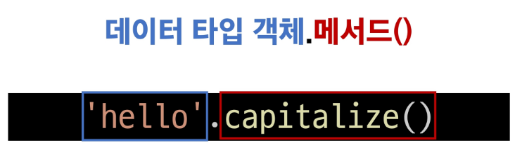
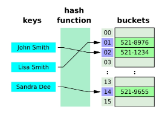

# Data Structure
## Data Structure

### 개요
#### 데이터 구조 (Data Structure)
- 여러 데이터를 효과적으로 사용, 관리하기 위한 구조 (str, list, dict 등)

#### 자료 구조
- 컴퓨터 공학에서는 '자료 구조' 라고 함
- 각 데이터의 효율적인 저장, 관리를 위한 구조를 나눠 놓은 것


#### 데이터 구조 활용
- 문자열, 리스트, 딕셔너리 등 각 데이터 구조의 <span style='color:red;'>메서드</span>를 호출하여 다양한 기능을 활용하기

### 메서드 **method**
- 객체에 속한 함수
- 객체의 상태를 조작하거나 동작을 수행

#### 메서드 특징
- 메서드는 클래스(class) 내부에 정의되는 함수
- 클래스는 파이썬에서 '타입을 표현하는 방법'이며 이미 은연중에 사용해왔음
- 예를 들어 help 함수를 통해 str을 호출해보면 class 였다는 것을 확인 가능


    ```python
    print(help(str))

    """
    Help on class str in module builtins:

    class str(object)
     |  str(object='') -> str
     |  str(bytes_or_buffer[, encoding[, errors]]) -> str
     |
     |  Create a new string object from the given object. If encoding or
     |  errors is specified, then the object must expose a data buffer
     |  …
    """
    ```
    
> 클래스는 후반부 OOP 수업에서 자세히 다룸

#### 지금 시점에 알아야 할 것

메서드는 어딘가(클래스)에 속해 있는 함수이며, 각데이터 타입별로 다양한 기능을 가진 메서드가 존재

#### 메서드 호출 방법

```python
'hello'.capitalize() 

#데이터 타입 객체.메서드()
```


#### 메서드 호출 예시

```python
# 문자열 메서드 예시
print('hello'.capitalize())  # Hello


# 리스트 메서드 예시
numbers = [1, 2, 3]
numbers.append(4)

print(numbers)  # [1, 2, 3, 4]
```

## 시퀀스 데이터 구조
### 문자열
#### 문자열 조회/탐색 및 검증 메서드

|        메서드      	|                                         설명                                        	|
|:------------------:	|:-----------------------------------------------------------------------------------:	|
|      s.find(x)     	|     x의   첫 번째 위치를 반환. 없으면,   -1을 반환                                  	|
|      s.index(x)    	|     x의   첫 번째 위치를 반환. 없으면,   오류 발생                                  	|
|     s.isupper()    	|     대문자 여부                                                                     	|
|     s.islower()    	|     소문자 여부                                                                   	|
|     s.isalpha()    	|     알파벳 문자 여부      *단순 알파벳이 아닌 유니코드 상 Letter (한국어도 포함)    	|

> is 붙은 함수는 T/F 반환 함. 함수 만들 때도 T/F 반환하면 is 붙이기!

#### .find(x)
** find랑 index 헷갈리지 않기!!

- x의 첫 번째 위치를 반환. 없으면, -1을 반환

    ```python
    print('banana'.find('a')) # 1

    print('banana'.find('z')) # -1
    ```

#### .index(x)

- x의 첫 번째 위치를 반환. 없으면, 오류 발생
    
    ```python
    print('banana'.index('a'))  # 1

    print('banana'.index('z'))  # ValueError: substring not found
    ```

#### .isupper / .islower

- 문자열이 모두 대문자/소문자로 이루어져 있는지 확인

    ```python
    string1 = 'HELLO'
    string2 = 'Hello'
    print(string1.isupper()) # True
    print(string2.isupper()) # False
    print(string1.islower()) # False
    print(string2.islower()) # False
    ```

##### .isalpha(x)

- 문자열이 알파벳으로만 이루어져 있는지 확인
    ```python
    string1 = 'Hello'
    string2 = '123'
    print(string1.isalpha()) # True
    print(string2.isalpha()) # False
    ```

#### 문자열 조작 메서드 (새 문자열 반환)

|                  메서드                 	|                                              설명                                            	|
|:---------------------------------------:	|:--------------------------------------------------------------------------------------------:	|
|       s.replace(old,   new[,count])     	|     바꿀 대상 글자를 새로운 글자로 바꿔서 반환                                               	|
|             s.strip([chars])            	|     공백이나 특정 문자를 제거                                                                	|
|     s.split(sep=None,   maxsplit=-1)    	|     공백이나 특정 문자를 기준으로 분리                                                       	|
|       'separator'.join(iterable)      	|     구분자로 iterable의 문자열을 연결한 문자열을 반환                                           |
|              s.capitalize()             	|     가장   첫 번째   글자를   대문자로   변경                                                	|
|                 s.title()               	|     문자열 내 띄어쓰기 기준으로 각 단어의 첫 글자는 대문자로,      나머지는 소문자로 변환    	|
|                 s.upper()               	|     모두   대문자로 변경                                                                     	|
|                 s.lower()               	|     모두   소문자로 변경                                                                     	|
|               s.swapcase()              	|     대↔소문자 서로 변경                                                                      	|

##### .replace(old, new [,count])

- 바꿀 대상 글자를 새로운 글자로 바꿔서 **반환**

    ```python
    text = 'Hello, world!'
    new_text = text.replace('world', 'Python')
    print(new_text) # Hello, Python!

    text = 'Hello, world! world world'
    new_text = text.replace('world', 'Python', 1)
    print(new_text) # Hello, Python! world world
    ```

##### .strip([chars])

- 문자열의 시작과 끝에 있는 공백 혹은 지정한 문자를 제거하고 **반환**

    ```python
    text = '   Hello, world!   '
    new_text = text.strip()
    print(new_text) # 'Hello, world!'
    ```
> rstrip([chars]), lstrip([chars]) : 입력 데이터 공백 없앨 때 사용함

##### .split(sep=None, maxsplit=-1)

- 지정한 문자를 구분자로 문자열을 분리하여 문자열의 리스트로 **반환**

    ```py
    text = 'Hello, world!'
    words = text.split(',')
    print(words) # ['Hello', ' world!']

    # .split() : 공백일시 스페이스를 기준으로 분리
    # () 공백으로 메서드 사용시 기본값이 들어가서 함수 작업 수행중
    ```

##### ‘separator’.join(iterable)

- iterable 의 문자열을 연결한 문자열을 **반환** (split이랑 반대)

    ```py
    words = ['Hello', 'world!']
    text = '-'.join(words)
    print(text) # 'Hello-world!'
    ```

##### 기타 문자열 조작 메서드

    ```python
    text = 'heLLo, woRld!'
    new_text1 = text.capitalize() # 맨 앞 문자만 대문자 변환
    new_text2 = text.title() # 맨 앞 문자, 공백 뒤 문자 대문자 변환
    new_text3 = text.upper() # 모두 다 대문자 변환
    new_text4 = text.swapcase() # 대문자 -> 소문자, 소문자 -> 대문자

    print(new_text1) # Hello, world!
    print(new_text2) # Hello, World!
    print(new_text3) # HELLO, WORLD!
    print(new_text4) # HEllO, WOrLD!
    ```
#### 메서드 이어서 사용하기

- 모든 메서드는 이어서 사용 가능 (=cascading)

    ```python
    text = 'heLLo, woRld!'

    new_text = text.swapcase().replace('l', 'z')
    # swapcase 먼저 진행 하고 리턴 값 있어야 함. 데이터 타입(소문자)도 일치해야 함.

    print(new_text) # HEzzO, WOrLD!
    ```

### 리스트
#### 리스트 값 추가 및 삭제 메서드 (반드시 외우자! == 예시코드를 만들어 볼 수 있다.)
|          메서드         	|                                                   설명                                                  	|
|:-----------------------:	|:-------------------------------------------------------------------------------------------------------:	|
|        L.append(x)      	|     리스트   마지막에 항목 x를   추가                                                                   	|
|        L.extend(m)      	|     Iterable m의   모든 항목들을 리스트 끝에 추가 (+=과   같은 기능)                                    	|
|     L.insert(i,   x)    	|     리스트   인덱스 i에 항목 x를 삽입                                                                   	|
|        L.remove(x)      	|     리스트   가장 왼쪽에 있는 항목(첫 번째)   x를   제거     항목이 존재하지 않을 경우,   ValueError    	|
|          L.pop()        	|     리스트   가장 오른쪽에 있는 항목(마지막)을   반환 후 제거                                           	|
|         L.pop(i)        	|     리스트의 인덱스 i에   있는 항목을 반환 후 제거                                                      	|
|         L.clear()       	|     리스트의 모든 항목 삭제                                                                             	|

##### .append(x)

- 리스트 마지막에 항목 x를 추가

    ```python
    my_list = [1, 2, 3]
    my_list.append(4)
    print(my_list) # [1, 2, 3, 4]
    print(my_list.append(4)) # None (반환이 없기 때문)

    my_list.append([9, 9, 9]) # [1, 2, 3, [9, 9, 9]]
    my_list.append([9, 9, 9], 3, 4) # Error (인자를 하나만 받기 때문)
    ```

##### .extend(iterable)

- 리스트에 다른 반복 가능한 객체의 모든 항목을 추가
    
    ```py
    my_list = [1, 2, 3]
    my_list.extend([4, 5, 6])
    print(my_list) # [1, 2, 3, 4, 5, 6]

    my_list.extend(5) # Error (5는 eterable 아니기 때문. 반복 가능한 객체가 와야함)
    my_list.extend([5, 6, 7], [8, 9, 10]) # Error (인자를 하나만 받기 때문)
    ```

##### .insert(i, x)

- 리스트의 지정한 인덱스 I 위치에 항목 x를 삽입
    
    ```python
    my_list = [1, 2, 3]
    my_list.insert(1, 5)
    print(my_list) # [1, 5, 2, 3]
    ```

##### .remove(x)
- 리스트에서 첫 번째로 일치하는 항목을 삭제
    
    ```python
    my_list = [1, 2, 3]
    my_list.remove(2)
    print(my_list)  # [1, 3]
    ```

##### .pop(i)
- 리스트에서 지정한 인덱스의 항목을 제거하고 **반환**
작성하지 않을 경우 마지막 항목을 제거 
- 반환 값 있음 !!!!!

    ```py
    my_list = [1, 2, 3, 4, 5]
    
    item1 = my_list.pop() # 마지막 항목을 제거
    item2 = my_list.pop(0) # 0자리 항목을 제거
    
    print(item1) # 5
    print(item2) # 1
    print(my_list) # [2, 3, 4]
    ```

##### .clear()
- 리스트의 모든 항목을 삭제

    ```py
    my_list = [1, 2, 3]
    my_list.clear()
    print(my_list) # []
    ```

#### 리스트 탐색 및 정렬 메서드

|               문법              	|                                   설명                                 	|
|:-------------------------------:	|:----------------------------------------------------------------------:	|
|     L.index(x)    	|     리스트에   있는 항목 중 가장 왼쪽에 있는 항목 x의 인덱스를 반환    	|
|            L.count(x)           	|     리스트에서 항목   x의 개수를 반환                                  	|
|            L.reverse()          	|     리스트의 순서를 역순으로 변경 (정렬 X)|
|             L.sort()            	|     리스트를 정렬 (매개변수   이용가능)                                	|

##### .index(x)
- 리스트에서 첫 번째로 일치하는 항목의 인덱스를 **반환**
    
    ```python
    my_list = [1, 2, 3]
    index = my_list.index(2)
    print(index)  # 1
    ```

##### .count(x)
- 리스트에서 항목 x가 등장하는 횟수를 **반환**

    ```py
    my_list = [1, 2, 2, 3, 3, 3]
    count = my_list.count(3)
    print(count)  # 3
    ```

##### .reverse()
- 리스트의 순서를 역순으로 변경(정렬 X) **반환하지 않음**
- 원본을 뒤집는 것 (정렬이 아님!!!!!)

    ```py
    my_list = [1, 3, 2, 8, 1, 9]
    my_list.reverse()
    print(my_list)  # [9, 1, 8, 2, 3, 1]
    ```

##### .sort()
- 원본 리스트를 오름차순으로 정렬 **반환하지 않음**

    ```python
    my_list = [3, 2, 1]
    my_list.sort()
    print(my_list)  # [1, 2, 3]

    # 내림차순
    my_list.sort(reverse=True)
    print(my_list)  # [3, 2, 1]
    ```

## 비시퀀스 데이터 구조

### 딕셔너리 `dictionary`

- 고유한 항목들의 정렬되지 않은 컬렉션

#### 딕셔너리 메서드

|            메서드           	|                                                                                설명                                                                              	|
|:---------------------------:	|:----------------------------------------------------------------------------------------------------------------------------------------------------------------:	|
|           D.clear()         	|     딕셔너리 D의   모든 키/값 쌍을 제거                                                                                                                          	|
|           D.get(k)          	|     키 k에   연결된 값을 반환 (키가 없으면 None을 반환)                                                                                                          	|
|         D.get(k,   v)       	|     키 k에   연결된 값을 반환하거나 키가 없으면 기본 값으로 v를 반환                                                                                             	|
|           D.keys()          	|     딕셔너리 D의   키를 모은 객체를 반환                                                                                                                         	|
|          D.values()         	|     딕셔너리 D의   값을 모은 객체를 반환                                                                                                                         	|
|           D.items()         	|     딕셔너리 D의   키/값 쌍을 모은 객체를 반환                                                                                                                   	|
|           D.pop(k)          	|     딕셔너리 D에서   키 k를 제거하고 연결됐던 값을 반환 (없으면   오류)                                                                                          	|
|         D.pop(k,   v)       	|     딕셔너리 D에서   키 k를 제거하고 연결됐던 값을 반환 (없으면   v를 반환)                                                                                      	|
|        D.setdefault(k)      	|     딕셔너리 D에서   키 k와 연결된 값을 반환                                                                                                                     	|
|     D.setdefault(k,   v)    	|     딕셔너리 D에서   키 k와 연결된 값을 반환     k가   D의 키가 아니면 값 v와   연결한 키 k를 D에   추가하고 v를 반환                                            	|
|        D.update(other)      	|     other 내 각 키에 대해 D에   있는 키면 D에 있는 그 키의 값을 other에 있는 값으로 대체.     other에 있는 각 키에 대해 D에   없는 키면 키/값 쌍을 D에   추가    	|


##### .clear()

- 딕셔너리 D의 모든 키/값 쌍을 제거

    ```py
    person = {'name': 'Alice', 'age': 25}
    person.clear()
    print(person)  # {}
    ```

##### .get(key[,default])

- 키 연결된 값을 반환하거나 키가 없으면 None 혹은 기본 값을 반환

    ```py
    person = {'name': 'Alice', 'age': 25}

    print(person.get('name'))  # Alice
    print(person.get('country'))  # None
    print(person.get('country', 'Unknown'))  # Unknown # get은 기본값을 딕셔너리에 추가시키지 않음 
    ```
##### .keys()

- 딕셔너리 키를 모은 객체를 반환

    ```python
    person = {'name': 'Alice', 'age': 25}
    print(person.keys())  # dict_keys(['name', 'age’])

    for k in person.keys():
        print(k)
    """
    name
    age
    """
    ```

##### .values()

- 딕셔너리 값을 모은 객체를 반환

    ```py
    person = {'name': 'Alice', 'age': 25}
    print(person.keys())  # dict_keys(['name', 'age’])

    for v in person.values():
        print(v)
    """
    Alice
    25
    """
    ```

##### .items()

- 딕셔너리 키/값 쌍을 모은 객체를 반환

    ```python
    person = {'name': 'Alice', 'age': 25}
    
    print(person.items())  # dict_items([('name', 'Alice'), ('age', 25)])
    for k, v in person.items():
        print(k, v)
    """
    name Alice
    age 25
    """
    ```

##### .pop(key[,default])
- 키를 제거하고 연결됐던 값을 반환 (없으면 에러나 default 를 반환)

    ```py
    person = {'name': 'Alice', 'age': 25}
    
    print(person.pop('age'))  # 25
    print(person)  # {'name': 'Alice'}
    print(person.pop('country', None))  # None
    print(person.pop('country'))  # KeyError
    ```

##### .update([other])
- other가 제공하는 키/값 쌍으로 딕셔너리를 갱신 <br>
기존 키는 덮어씀

    ```py
    person = {'name': 'Alice', 'age': 25}
    other_person = {'name': 'Jane', 'gender': 'Female'}

    person.update(other_person)
    print(person)  # {'name': 'Jane', 'age': 25, 'gender': 'Female'}

    person.update(age=50)
    print(person)  # {'name': 'Jane', 'age': 50, 'gender': 'Female'}

    person.update(country='KOREA')
    print(person)  # {'name': 'Jane', 'age': 50, 'gender': 'Female', 'country': 'KOREA'}
    ```

##### .setdefault(key[,default])
- 키와 연결된 값을 반환 <br>
키가 없다면 default와 연결한 키를 딕셔너리에 추가하고 default를 반환

    ```python
    person = {'name': 'Alice', 'age': 25}

    print(person.setdefault('country', 'KOREA'))  # KOREA
    print(person)  # {'name': 'Alice', 'age': 25, 'country': 'KOREA'}
    ```

### 세트 (set)
- 고유한 항목들의 정렬되지 않은 컬렉션

#### 세트 메서드
|           메서드          	|                                설명                               	|
|:-------------------------:	|:-----------------------------------------------------------------:	|
|          s.add(x)         	|     세트 s에 항목   x를 추가. 이미   x가 있다면 변화 없음         	|
|          s.clear()        	|     세트 s의   모든 항목을   제거                                 	|
|         s.remove(x)       	|     세트 s에서   항목 x를 제거. 항목   x가 없을 경우 Key error    	|
|           s.pop()         	|     세트 s에서   랜덤하게 항목을 반환하고,   해당 항목을 제거     	|
|        s.discard(x)       	|     세트 s에서   항목 x를 제거                                    	|
|     s.update(iterable)    	|     세트 s에   다른 iterable 요소를   추가                        	|

##### .add(x)

- 세트에 x를 추가

    ```python
    my_set = {'a', 'b', 'c', 1, 2, 3}

    my_set.add(4) # 순서 매번 달라짐 set는 index가 없기 때문
    print(my_set)  # {1, 'b', 3, 2, 'c', 4, 'a’}
    
    my_set.add(4) # 중복 없음 
    print(my_set)  # {1, 'b', 3, 2, 'c', 4, 'a’}
    ```

##### .clear()

- 세트의 모든 항목을 제거

    ```py
    my_set = {'a', 'b', 'c', 1, 2, 3}
    
    my_set.clear()
    print(my_set)  # set()
    ```

##### .remove(x)

- 세트에서 항목 x를 제거

    ```python
    my_set = {'a', 'b', 'c', 1, 2, 3}
    
    my_set.remove(2)
    print(my_set)  # {'b', 1, 3, 'c', 'a'}
    
    my_set.remove(10)
    print(my_set)  # KeyError
    ```

##### .discard()

- 세트 s에서 항목 x를 제거. remove와 달리 에러 없음

    ```python
    my_set = {1, 2, 3}
    
    my_set.discard(2)
    print(my_set)  # {1, 3, 'a', 'c', 'b’}
    
    my_set.discard(10)
    ```

##### .pop()

- 세트에서 <span style='color:red;'>임의의</span> 요소를 제거하고 <span style='color:red;'>반환</span>

    ```py
    my_set = {'a', 'b', 'c', 1, 2, 3}
    
    element = my_set.pop()
    print(element)  # 1
    print(my_set)  # {2, 3, 'b', 'a', 'c'}
    ```

##### .update(iterable)
- 세트에 다른 iterable 요소를 추가

    ```py
    my_set = {'a', 'b', 'c', 1, 2, 3}
    
    my_set.update([1, 4, 5])
    print(my_set)  # {1, 2, 3, 'c', 4, 5, 'b', 'a'}
    ```

#### 세트의 집합 메서드

|              메서드            	|                                         설명                                       	|         연산자        	|
|:------------------------------:	|:----------------------------------------------------------------------------------:	|:---------------------:	|
|      set1.difference(set2)     	|        set1에는 들어있지만 set2에는      없는   항목으로 세트를 생성 후 반환       	|      set1   – set2    	|
|     set1.intersection(set2)    	|           set1과 set2 모두   들어있는 항목으로      세트를   생성 후 반환          	|     set1   & set 2    	|
|       set1.issubset(set2)      	|               set1의 항목이 모두 set2에 들어있으면      True를   반환              	|     set1   <= set2    	|
|      set1.issuperset(set2)     	|               set1가 set2의   항목을 모두 포함하면      True를   반환              	|     set1   >= set2    	|
|         set1.union(set2)       	|     set1 또는 set2에(혹은   둘 다) 들어있는      항목으로   세트를 생성 후 반환    	|     set1   \| set2    	|


### 참고
[python 공식 자료구조 페이지](https://docs.python.org/ko/3.9/tutorial/datastructures.html#)

#### 문자 유형 판별 메서드

#### 문자열에 포함된 문자들의 유형을 판별하는 메서드 (암기 X)
- `isdecimal()`
    - 문자열이 모두 숫자 문자(0~9)로만 이루어져 있어야 True
- `isdigit()`
    - isdecimal()과 비슷하지만, 유니코드 숫자도 인식 ('①’ 도 숫자로 인식)
- `isnumeric()`
    - isdigit()과 유사하지만, 몇 가지 추가적인 유니코드 문자들을 인식 <br>(분수, 지수, 루트 기호도 숫자로 인식)

- `isdecimal()` ⊆ `isdigit()` ⊆ `isnumeric()`

|     isdecimal()    	|     isdigit()    	|     isnumeric()    	|                  예시                	|
|:------------------:	|:----------------:	|:------------------:	|:------------------------------------:	|
|         True       	|        True      	|         True       	|       "038",   "੦੩੮",   "０３８"     	|
|        **False**       	|        True      	|         True       	|          "⁰³⁸", "🄀⒊⒏", "⓪③⑧"         	|
|        False       	|       **False**      	|         True       	|     "⅛⅘", "ⅠⅢⅧ", "⑩⑬㊿", "壹貳參"    	|
|        False       	|       False      	|        **False**       	|          "abc", "38.0", "-38"        	|


    isdecimal() 메서드 예시:
    '12345'.isdecimal(): True
    '123.45'.isdecimal(): False
    '-123'.isdecimal(): False
    'Ⅳ'.isdecimal(): False
    '½'.isdecimal(): False
    '²'.isdecimal(): False

    isdigit() 메서드 예시:
    '12345'.isdigit(): True
    '123.45'.isdigit(): False
    '-123'.isdigit(): False
    'Ⅳ'.isdigit(): False
    '½'.isdigit(): False
    '²'.isdigit(): True

    isnumeric() 메서드 예시:
    '12345'.isnumeric(): True
    '123.45'.isnumeric(): False
    '-123'.isnumeric(): False
    'Ⅳ'.isnumeric(): True
    '½'.isnumeric(): True
    '²'.isnumeric(): True

#### 파이썬 문법 규격

- BNF
    
    프로그래밍 언어의 문법을 표현하기 위한 표기법
- EBNF

    BNF를 확장한 표기법. 
    메타 기호를 추가하여 더 간결하고 표현력이 강해진 형태
- BNF와 같은 표기법을 사용하는 이유

    서로 다른 프로그래밍 언어, 데이터 형식, 프로토콜 등의 문법을 통일하여 정의하기 위함

#### 해시 테이블 (시험에 안나옴)

해시 함수를 사용하여 변환한 값을 색인(index)으로 삼아 키(key)와 데이터(value)를 저장하는 자료구조

> 데이터를 효율적으로 저장하고 검색하기 위해 사용

##### 해시 테이블 원리

- 키를 해시 함수를 통해 해시 값으로 변환하고, 이 해시 값을 인덱스로 사용하여 데이터를 저장하거나 검색

- 데이터 검색이 매우 빠르게 이루어짐

- 해시 함수는 파이썬이 실행될 때마다 달라짐



##### 해시

- 임의의 크기(key)를 가진 데이터를 고정된 크기의 고유한 값(index)으로 변환하는 것
- 이렇게 생성된 고유한 값은 주로 해당 데이터를 식별하는데 사용될 수 있음
    - 일종의 '지문'과 같은 역할
    - 데이터를 고유하게 식별

- 파이썬에서는 해시 함수를 사용하여 데이터를 해시 값으로 변환하며, 이 해시 값은 정수로 표현됨

##### 해시 함수

- 임의의 길이의 데이터를 입력받아 고정된 길이의 데이터(해시 값)를 출력하는 함수

- 주로 해시 테이블 자료구조에 사용되며, 매우 빠른 데이터 검색을 위한 컴퓨터 소프트웨어에서 유용하게 사용

##### set의 요소 & dictionary 의 키와 해시테이블 관계

- 파이썬에서 세트의 요소와 딕셔너리의 키는 해시 테이블을 이용하여 중복되지 않는 고유한 값을 저장함
- 세트 내의 각 요소는 해시 함수를 통해 해시 값으로 변환되고, 이 해시 값을 기반으로 해시 테이블에 저장됨
- 마찬가지로 딕셔너리의 키는 고유해야 하므로, 키를 해시 함수를 통해 해시 값으로 변환하여 해시 테이블에 저장

    - 따라서 딕셔너리의 키는 매우 빠른 탐색 속도를 제공하며, 중복된 값을 허용하지 않음

##### 파이썬에서의 해시 함수 - 정수

- <span style='color:red;'>**같은 정수는 항상 같은 해시 값을 가짐**</span>

- 해시 테이블에 정수를 저장할 때 효율적인 방법
- 예를 들어, hash(1)과 hash(2)는 항상 서로 다른 해시 값을 갖지만, hash(1)은 항상 동일한 해시 값을 갖게 됨

##### 파이썬에서의 해시 함수 - 문자열

- 문자열은 가변적인 길이를 갖고 있고, 문자열에 포함된 각 문자들의 유니코드 코드 포인트 등을 기반으로 해시 값을 계산

- 이로 인해 문자열의 해시 값은 실행 시마다 다르게 계산됨

##### set의 pop 메서드의 결과와 해시 테이블의 관계

- pop()의 set에서 임의의 요소를 제거하고 반환

- 실행할 때마다 다른 요소를 얻는다는 의미에서의 "무작위"가 아니라 <span style='color:red;'>"임의"라는 의미에서 "무작위"</span>
    - By "arbitrary" the docs don't mean "random"

> 해시 테이블에 나타나는 순서대로 반환하는 것

##### hashable

- hash() 함수의 인자로 전달해서 결과를 반환 받을 수 있는 객체

- 대부분의 불변형 데이터 타입은 hashable
- 단, tuple의 경우 불변형이지만 가변 데이터(해시 불가능한 객체)를 참조 할 때는 tuple 자체도 해시 불가능해짐

##### hashable과 불변성 간의 관계

- 해시 테이블의 키는 불변해야함

    - 객체가 생성된 후에 그 값을 변경할 수 없어야 함
- 불변 객체는 해시 값이 변하지 않으므로 동일한 값에 대해 일관된 해시 값을 유지할 수 있음
- 단, "hash 가능하다 != 불변하다"

##### 가변형 객체가 hashable 하지 않은 이유

- 값이 변경될 수 있기 때문에 동일한 객체에 대한 해시 값이 변경될 가능성이 있음 (해시 테이블의 무결성 유지 불가)

- 가변형 객체가 변경되면 해시 값이 변경되기 때문에, 같은 객체에 대한 서로 다른 해시 값이 반환될 수 있음(해시 값의 일관성 유지 불가)

##### hashable 객체가 필요한 이유

1. 해시 테이블 기반 자료 구조 사용

    - set 와 dict의 key
    - 중복 값 방지
    - 빠른 검색과 조회

2. 불변성을 통한 일관된 해시 값
3. 안정성과 예측 가능성 유지