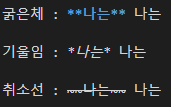

## 1. 마크다운
### 리스트
#### <순서있는 리스트>

    1. 과일
        1. 딸기
        2. 포도
    2. 생선
        1. 고등어 
        2. 갈치

@참고@ shift + tab 상위 탭로 이동

#### <순서없는 리스트>
    - 우산
    - 의류
        - 셔츠
        - 바지
---
### 코드블락


출력화면 :

```python
print('hello')
print("world")
```


### 인라인코드


출력화면 :

파이썬은 `print` 함수를 사용한다.

---
### 링크 첨부


출력화면 : 

[구글](https://www.google.com)

[Naver](https://www.naver.com)


@참고@ 이미지의 너비와 높이는 마크다운으로 조절할 수 없음 (HTML 사용필요)

---
### 텍스트 관련 문법



출력화면 :

굵은체 : **나는** 나는

기울임 : *나는* 나는

취소선 : ~~나는~~ 나는

### 수평선

"---" 사용

### 마크다운 에디터
 - Typora(유료) 
 - MarkText(무료) 
 - Markdown all in one(VS Code 설치)
