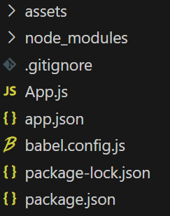

# 리액트 네이티브

## 개발환경 세팅(Expo)

- npm 세팅

전역으로 사용해 줄 수 있게 npm, typescript 설치

```
npm i -g npm
npnm i -g typescript ts-node
```

- Node.js 설치

```
npx create-expo-app@latest 프로젝트명
```

- expo를 이용한 리액트 네이티브 앱 생성

```
npx create-expo-app 프로젝트명 --template expo-template-blank@50
```

## 구조



- assets : 이미지등의 에셋을 보관
- node_modules : 앱 실행에 필요한 모든 라이브러리 저장
- babel.config.js : 바벨을 이용해서 어떻게 코드를 transpile 할지 설정 (바벨: 최신 자바스크립트 문법을 구형 브라우저에서도 돌 수 있게 변환해줌)
- app.json : 리엑트 네이티브 앱 자체의 설정을 넣어주는 곳
- App.js : 화면에 보이게 되는 소스코드를 작성하는 곳

## 실행

