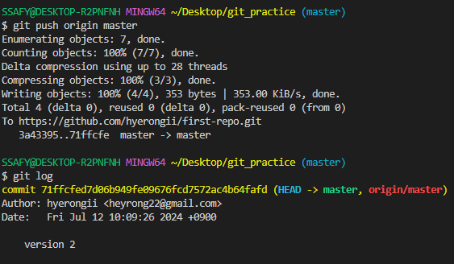
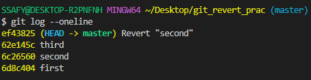

# GIT
## 버전관리
변화를 기록하고 추적하는 것
- 중앙 집중식: 버전은 중앙서버에 저장되고 중앙 서버에서 파일을 가져와 중앙에 업로드
- 분산식 : 버전을 여러 개의 복제된 저장소에 저장 및 관리

    → 작업 하기 전에 서버의 버전과 비교하여 항상 최신으로 업데이트 할 것
## git의 영역
- Working Directory

    실제 작업 중인 파일들이 위치하는 영역
- Staging Area
    
    워킹 디렉토리에서 변경된 파일 중 다음 버전에 포함시킬 파일들을 선택적으로 추가하거나 제외할 수 있는 중간 준비 영역
- Repository
    
    버전 이력과 파일들이 영구적으로 저장되는 영역
    모든 버전과 변경 이력이 기록됨
## git의 문자
```cli
-> git init
    
    로컬 저장소 설정(초기화) 
    
    : git의 버전 관리를 시작할 디렉토리에서 진행

-> git add
    
    변경사항이 있는 파일을 staging area에 추가
    
    파일, 폴더 관계없음
    
    예시)
    git add a.txt, b.txt 
    git add *.txt 
    (txt 확장자 파일 전부 올리고 싶을 때)
    git add . 
    (디렉토리 내 모든 파일 전부 올리고 싶을 때)
    
-> git commit

    staging area에 있는 파일들을 저장소에 기록
    
    변경이력 생성
    
    **주의!! git add를 통해 satging area에 꼭 올리기!**

    예시)
    git commit -m “설정할 커밋 이름”
    
-> git status

    현재 git이 커밋된 것이 있는지 현재 상태 출력해줌

-> git rm —cached
    
    stage에 올라간 파일을 디렉토리로 이동하고 싶을 때

-> git config --global

    레포지토리 같이 사용할 때
    ID 먼저 입력 해주고 commit 할 수 있음
    사용자 설정
    
    예시)
    git config --global user.email "이메일 입력"
    git config --global user.name "닉네임 입력" 
    
-> git log

    commit 목록 확인
    작성자, 날짜, 메세지 나옴
    
-> git log --oneline 
    
    한줄로 각 커밋 정보 간략하게 보여줌
```    
**!! HEAD 는 최신의 commit를 따라감**

---
---
## Remote Repository (원격 저장소)

    코드와 버전 관리 이력을 온라인 상의 특정 위치에 저장하여 여러 개발자가 협업하고 코드를 공유할 수 있는 저장 공간

    ex) gitlab, github, bitbucket

## 로컬 & 원격 저장소

### 로컬 저장소에 원격 저장소 추가
```cli
-> git remote add origin(닉네임) remote_repo_url(github 레포지토리 주소)

    origin : 추가하는 원격 저장소 별칭
    별칭을 사용해 로컬저장소에 여러개 연결할 수 있음

-> git remote -v 

    잘 연결 되어 있는지 확인 
```


### push / pull & clone
#### - push

```cli
-> git push origin master
```
    원격 저장소에 commit 목록을 업로드
    -> git 아 origin이라는 이름의 원격 저장소에 master branch를 push해줘

**!!주의!! 파일 수정 후 저장후 커밋찍고 push 할 것**



local에 있는 branch인 master, 원격에 있는 branch인 origin/master 의 가장 최신 commit은 HEAD

**!!원격 저장소에는 commit이 올라가는 것!!**

#### - pull & clone
```cli
-> git pull origin master

    원격 저장소의 변경사항만을 받아옴(업데이트)

-> git clone remote_repo_url

    원격 저장소 전체를 복제(다운로드)
```
**!!branch 표시 없을 때 깃 클론 할 수 있다.**

**!!이미 git init 되어있다.**

**@@ 참고 @@ 파일명 cli로 변경하고 싶을 때**
```cli
-> mv -f 변경하고싶은파일명 변경할파일명
```

**@@ 참고 @@**

다른 인원 레포지토리 수정 원한다면 레포지토리 - 세팅 - 콜라보레이터 에서 인원 추가하고 레포지토리 주소 공유하기 그 후 참여자가 메세지 승인해야 함께 작업할 수 있음!!

## gitignore

Git에서 특정 파일이나 디렉토리를 추적하지 않도록 설정하는 데 사용되는 텍스트 파일

예시)

    .gitignore 파일 생성 (확장자 없음)
    a.txt와 b.txt 파일 생성
    gitignore 파일 안에 a.txt 작성
    git init
    git status

git init 전에 gitignore 사용할 것!!

* 목록 생성 서비스 

https://www.toptal.com/developers/gitignore

에서 운영체제, 사용 언어 입력 후 복사하여 gitignore 파일에 복붙

**@@참고@@**
```cli
->  -rm -r .git 

    .git 삭제
```

## GitHub 활용

### TIL

    Today I Learned
    매일 내가 배운 것을 마크다운으로 정리해서 문서화 하는 것
    
    문서화 하는 것 개발자로서 매우 중요하다!


**!! README.md 로 레포지토리 대문화면 꾸밀 수 있음**

**@@ 나중에 해보기~~ 깃허브 프로파일 꾸미기**

## Git 기타 명령어
```cli
-> git remote -v

현재 로컬 저장소에 등록된 원격 저장소 목록 보기

-> git remote rm 원격_저장소_이름
    
현재 로컬 저장소에 등록된 원격 저장소 삭제
```
## Git revert & reset

### Git revert

```cli
-> git revert (커밋 아이디)
```
    "재설정"
    단일 commit을 실행 취소 하는 것
    프로젝트 기록에서 commit을 없었던 일로 처리 후 그 결과를 새로운 commit으로 추가함


<실행화면>



    변경 사항을 안전하게 실행 취소할 수 있도록 도와줌
    commit 기록에서 commit을 삭제하거나 분리하는 대신, 지정된 변경사항을 반전시키는 새 commit을 생성
    git 에서 기록이 손실되는 것을 방지하고 무결성과 협업의 신뢰성을 높임

### Git reset
**!! 사용시 주의 필요**
```cli
-> git reset (커밋 아이디)
```

    "되돌리기"
    시계를 마치 과거로 돌리는 듯한 행위
    특정 commit으로 되돌아 갔을 때, 되돌아간 commit 이후의 commit은 모두 삭제

    - reset의 3가지 옵션
        
        --soft, --mixed, --hard

    -> --soft
        삭제된 commit의 기록을 staging area에 남김
    
    -> --mixed 
        삭제된 commit의 기록을 working directory에 남김 (기본 옵션 값)

    -> --hard
        삭제된 commit의 기록을 남기지 않음

### Git reflog 
```cli
-> git reflog (커밋 아이디)
```

    hard reset 한 commit 복구 할 수 있음

### Git restore
```cli
-> git restore (커밋 아이디)
```
    워킹디렉토리에서 파일을 수정한 뒤, 파일의 수정사항을 취소하고, 원래 모습으로 되돌리는 작업

### Staging area 에 올라간 파일을 Unstage 하기
```cli
-> git rm --cached

git 저장소에 커밋이 없는 경우 staging area에서 워킹 디렉토리로 내리게 함

-> git restore --staged

레포지토리까지 커밋이 쌓였을 때 워킹트리 클린까지 되었을 때
이후 파일을 다시 수정 후 modified 된 것 staging area에 올린 상태일 때
워킹 디렉토리로 다시 내리게 함
```

