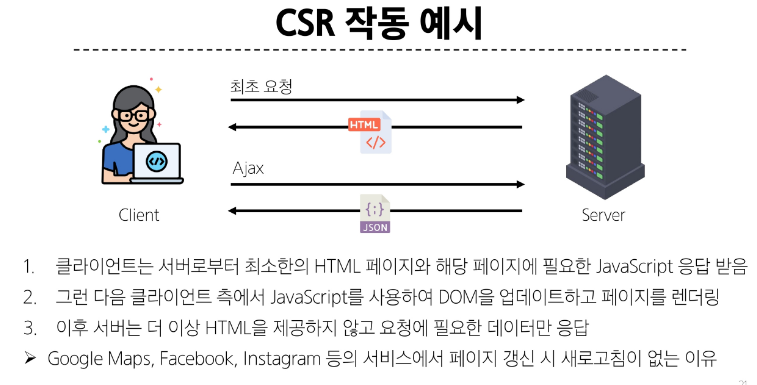
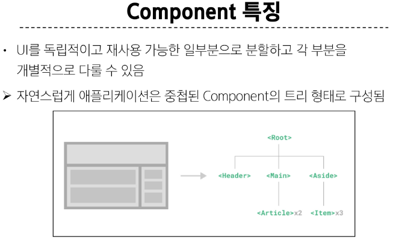

# Frontend Development

웹사이트와 웹애플리케이션의 사용자 인터페이스와 사용자 경험을 만들고 디자인 하는 것

> HTML, CSS, Javascript 등을 활용하여 사용자가 직접 상호작용하는 부분을 개발

## client-side frameworks

클라이언트 측에서 UI와 상호작용을 개발하기 위해 사용되는 JavaScript 기반 프레임워크

### 필요성

1. 동적이고 반응적인 웹 애플리케이션 개발
  - 실시간 데이터 업데이트

2. 코드 재사용성 증가
  - 컴포넌트 기반 아키텍처
  - 모듈화된 코드 구조

3. 개발 생산성 향상
  - 강력한 개발 도구 지원

## SPA(Single Page Application)

단일 페이지에서 동작하는 웹 애플리케이션

- 최초 로드 시 필요한 모든 리소스 다운로드
- 이후 페이지 갱신에 대해 필요한 데이터만을 비동기적으로 전달 받아 화면의 필요한 부분만 동적으로 갱신
  - AJAX 와 같은 기술을 사용하여 필요한 데이터만 비동기적으로 로드
  - 페이지 전체를 다시 로드 할 필요 없이 필요한 데이터만 서버로부터 가져와서 화면에 표시

- JavaScript를 사용하여 클라이언트 측에서 동적으로 콘텐츠를 생성하고 업데이트 (CSR 방식)

> SPA 가 작동하는 원리 = CSR 방식

## CSR(Client-side Rendering)

- 클라이언트에서 콘텐츠를 렌더링하는 방식

### CSR 작동 원리

1. 사용자가 웹사이트에 요청을 보냄

2. 서버는 최소한의 HTML과 JavaScript 파일을 클라이언트로 전송
3. 클라이언트는 HTML과 JavaScript를 다운로드 받음
4. 브라우저가 JavaScript를 실행하여 동적으로 페이지 콘텐츠를 생성
5. 필요한 데이터는 API를 통해 서버로부터 비동기적으로 가져옴



### SPA와 CSR의 장점

1. 빠른 페이지 전환
  - 페이지가 처음 로드된 후에는 필요한 데이터만 가져오고 JavaScript는 전체 페이지를 새로 고치지 않고 페이지의 일부를 다시 렌더링
  - 서버로 전송되는 데이터의 양을 최소화 (서버 부하 방지)

2. 사용자 경험
  - 새로고침이 발생하지 않아 네이티브 앱과 유사한 사용자 경험을 제공

3. Frontend와 Backend의 명확한 분리
  - Frontend는 UI 렌더링 및 사용자 상호 작용 처리를 담당 & Backend는 데이터 및 API 제공을 담당
  - 대규모 애플리케이션을 더 쉽게 개발하고 유지 관리 가능

### SPA와 CSR의 단점

1. 느린 초기 로드 속도
  - 전체 페이지를 보기 전에 약간의 지연 느낄 수 있음

2. SEO (검색 엔진 최적화) 문제
  - 검색에 잘 노출되지 않을 수 있음
  - 콘텐츠 모두 존재 x

#### SPA vs MPA / CSR vs SSR

- Multi Page Application (MPA)
  - 여러 개의 HTML 파일이 서버로부터 각각 로드
  - 사용자가 다른 페이지로 이동할 때마다 새로운 HTML 파일이 로드됨

- Server-side Rendering (SSR)
  - 서버에서 화면을 렌더링 하는 방식
  - 모든 데이터가 담긴 HTML을 서버에서 완성 후 클라이언트에게 전달

# Vue
## What is Vue

- 사용자 인터페이스를 구축하기 위한 JavaScript 프레임 워크

### 학습하는 이유

1. 낮은 학습 곡선
2. 확장성과 생태계
3. 유연성 및 성능

### vue의 2가지 핵심 기능

1. 선언적 렌더링
  - 표준 HTML을 확장하는 Vue '템플릿 구문'을 사용하여 js 상태(데이터)를 기반으로 화면에 출력될 HTML을 선언적으로 작성

2. 반응성 
  - JavaScript 상태 변경을 추적하고, 변경사항이 발생하면 자동으로 DOM을 업데이트

### Vue의 주요 특징 정리

1. 반응형 데이터 바인딩
2. 컴포넌트 기반 아키텐처
3. 간결한 문법과 직관적인 API
4. 유연한 스케일링

## Component

- 재사용 가능한 코드 블록



# Vue Application

- Vue를 사용하는 방법
  
  1. CDN 방식
  2. NPM 설치 방식
    - CDN 방식 이후 진행

## Vue Application 생성

1. CDN 작성

```html
<script src="https://unpkg.com/vue@3/dist/vue.global.js"></script>
```

2. Application instance 

- CDN에서 Vue를 사용하는 경우 전역 Vue 객체를 불러오게 됨
- 구조분해할당 문법으로 Vue 객체의 createApp 함수를 할당

- 모든 Vue 애플리케이션은 createApp 함수로 새 Application instance를 생성하는 것으로 시작함

```html
<script src="https://unpkg.com/vue@3/dist/vue.global.js"></script>
<script>
  const { createApp, ref } = Vue

  const app = createApp({})
</script>
```

3. Root Component
  - createApp 함수에는 객체(컴포넌트)가 전달됨
  - 모든 App에는 다른 컴포넌트들을 하위 컴포넌트로 포함할 수 있는 Root(최상위) 컴포넌트가 필요 (현재는 단일 컴포넌트)

```html
<script src="https://unpkg.com/vue@3/dist/vue.global.js"></script>
<script>
  const { createApp, ref } = Vue

  const app = createApp({})
</script>
```

4. Mounting the App (앱 연결)
  - HTML 요소에 Vue Application instance를 탑재(연결)
  - 각 앱 인스턴스에 대해 mount()는 한 번만 호출할 수 있음

```html
<script src="https://unpkg.com/vue@3/dist/vue.global.js"></script>
<script>
  const { createApp, ref } = Vue

  const app = createApp({})
  app.mount('#app')
</script>
```

## 반응형 상태

#### ref()

- 반응형 상태(데이터)를 선언하는 함수
- .value 속성이 있는 ref 객체로 래핑하여 반환하는 함수
- ref로 선언된 변수의 값이 변경되면, 해당 값을 사용하는 템플릿에서 자동으로 업데이트

- 인자는 어떠한 타입도 가능

```html
<script>
  const { createApp, ref } = Vue

  const app = createApp({
    setup() {
      const message = ref('Hello vue!')
      console.log(message)
      console.log(message.value)
    }
  })
</script>
```

- 템플릿의 참조에 접근하려면 setup 함수에서 선언 및 반환 필요
- 편의상 템플릿에서 ref를 사용할 때는 .value를 작성할 필요 없음

```html
<div id="app">
  <h1>{{ message }}</h1>
</div>

<script>
  const { createApp, ref } = Vue

  const app = createApp({
    setup() {
      const message = ref('Hello vue!')
      return {
        message
      }
    }
  })
</script>
```

## Vue 기본 구조

- createApp()에 전달되는 객체는 Vue 컴포넌트
- 컴포넌트의 상태는 setup() 함수 내에서 선언되어야 하며 객체를 반환해야 함

### 템플릿 렌더링

- 반환된 객체의 속성은 템플릿에서 사용할 수 있음
- Mustache syntax(콧수염 구문)를 사용하여 메시지 값을 기반으로 동적 텍스트를 렌더링
- 콘텐츠는 식별자나 경로에만 국한되지 않으며 유효한 js 표현식을 사용할 수 있음

```html
<h1>{{ message.split('').reverse().join('') }}</h1>
```

# Template Syntax

- DOM을 기본 구성 요소 인스턴스의 데이터에 선언적으로 바인딩(Vue instance와 DOM 연결)할 수 있는 HTML 기반 템플릿 구문(확장된 문법 제공)을 사용

1. Text Interpolation

  ```html
  <p>Message: {{ msg }}</p>

  <script>
  const msg = 'Hello'
  </script>
  ```

  - 데이터 바인딩의 가장 기본적인 형태
  - 이중 중괄호 구문 사용
  - 콧수염 구문은 해당 구성요소 인스턴스의 msg 속성 값으로 대체
  - msg 속성이 변경될 때마다 업데이트 됨

2. Raw HTML
   
  ```html
  <div v-html="rawHtml"></div>

  <script>
  const rawHtml = ref('<span style="color:red">This should be red.</span>')
  </script>
  ```

  - 콧수염 구문은 데이터를 일반 텍스트로 해석하기 때문에 실제 HTML을 출력하려면 v-html을 사용해야함

3. Attribute Bindings

  ```html
  <div v-bind:id="dynamicId">attribute bindings</div>

  <script>
  const dynamicId = ref('my-id')
  </script>
  ```

  - 콧수염 구문은 HTML 속성 내에서 사용할 수 없기 때문에 v-bind를 사용
  - HTML의 id 속성 값을 vue의 dynamicId 속성과 동기화 되도록 함
  - 바인딩 값이 null이나 undefined인 경우 렌더링 요소에서 제거됨

4. JavaScript Expressions
  
  ```html
  <p>{{ number + 1 }}</p>
  <p>{{ ok ? 'YES' : 'NO' }}</p>
  <p>{{ msg.split('').reverse().join('') }}</p>
  <div v-bind:id="`list-${id}`"></div>

  <script>
    const dynamicId = ref('my-id')
    const number = ref(1)
    const ok = ref(true)
    const id = ref(1)
  </script>
  ```

  - vue는 모든 데이터 바인딩 내에서 js 표현식의 모든 기능을 지원
  - vue 템플릿에서 js 표현식을 사용할 수 있는 위치
    - 콧수염 구문 내부
    - 모든 directive의 속성 값 ("v-로 시작하는 특수 속성")

#### Expressions 주의사항

- 각 바인딩에는 하나의 단일 표현식만 포함될 수 있음
  - 표현식은 값으로 평가할 수 있는 코드 조각 (return 뒤에 사용할 수 있는 코드여야함)

# 참고
## ref 객체 

- vue는 템플릿에서 ref 를 사용하고 나중에 ref의 값을 변경하면 자동으로 변경사항을 감지하고 그에 따라 DOM을 업데이트함
- 
- vue는 렌더링 중에 사용된 모든 ref를 추적하며, 나중에 ref가 변경되면 이를 추적하는 구성 요소에 대해 다시 렌더링

## Ref Unwrap 주의사항

- 템플릿에서의 unwrap은 ref가 최상위 속성인 경우에만 적용가능

```html
  <div id="app">
    <!-- unwrap 문제 상황 -->
    <p>{{ object.id + 1}}</p>

    <!-- 해결책 : ref가 최상위 속성이 되어야 함 -->
    <p>{{ id + 1 }}</p>

    <!-- 단, ref가 {{}}의 최종 평가 값인 경우는 unwrap 가능 -->
    <p>{{ object.id }}</p>
  </div>

  <script src="https://unpkg.com/vue@3/dist/vue.global.js"></script>
  <script>
    const { createApp, ref } = Vue

    const app = createApp({
      setup() {
        const object = {
          id: ref(0)
        }
        // id를 최상위 속성으로 분해
        const { id } = object
        return {
          object,
          id
        }
      }
    })

    app.mount('#app')
  </script>
```

## SEO (Search Engine Optimizaion)

- 검색 엔진 등에 서비스나 제품이 효율적으로 검색 엔진에 노출되도록 개선하는 과정
- 정보의 대상은 주로 HTML에 작성된 내용

- 최근에는 SPA, 즉 CSR로 구성된 서비스의 비중이 증가
- SPA 서비스도 검색 대상으로 넓히기 위해 JS를 지원하는 방식으로 발전하는 중

## CSR과 SSR

- CSR과 SSR은 흑과 백이 아님
- 애플리케이션의 목적, 규모, 성능 및 SEO 요구사항에 따라 달라질 수 있음

- SPA 서비스에서도 SSR을 지원하는 Framework가 발전하고 있음
  - Vue의 Nuxt.js
  - React의 Next.js