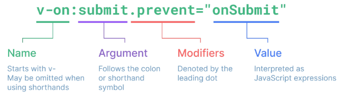
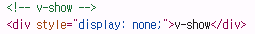
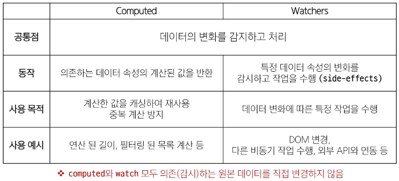

# Basic Syntax 01

## Template Syntax


- DOM을 기본 구성 요소 인스턴스의 데이터에 선언적으로 바인딩(Vue instance와 DOM 연결)할 수 있는 HTML 기반 템플릿 구문(확장된 문법 제공)을 사용

1. Text Interpolation

  ```html
  <p>Message: {{ msg }}</p>

  <script>
  const msg = 'Hello'
  </script>
  ```

  - 데이터 바인딩의 가장 기본적인 형태
  - 이중 중괄호 구문 사용
  - 콧수염 구문은 해당 구성요소 인스턴스의 msg 속성 값으로 대체
  - msg 속성이 변경될 때마다 업데이트 됨

2. Raw HTML
   
  ```html
  <div v-html="rawHtml"></div>

  <script>
  const rawHtml = ref('<span style="color:red">This should be red.</span>')
  </script>
  ```

  - 콧수염 구문은 데이터를 일반 텍스트로 해석하기 때문에 실제 HTML을 출력하려면 v-html을 사용해야함

3. Attribute Bindings

  ```html
  <div v-bind:id="dynamicId">attribute bindings</div>

  <script>
  const dynamicId = ref('my-id')
  </script>
  ```

  - 콧수염 구문은 HTML 속성 내에서 사용할 수 없기 때문에 v-bind를 사용
  - HTML의 id 속성 값을 vue의 dynamicId 속성과 동기화 되도록 함
  - 바인딩 값이 null이나 undefined인 경우 렌더링 요소에서 제거됨

4. JavaScript Expressions
  
  ```html
  <p>{{ number + 1 }}</p>
  <p>{{ ok ? 'YES' : 'NO' }}</p>
  <p>{{ msg.split('').reverse().join('') }}</p>
  <div v-bind:id="`list-${id}`"></div>

  <script>
    const dynamicId = ref('my-id')
    const number = ref(1)
    const ok = ref(true)
    const id = ref(1)
  </script>
  ```

  - vue는 모든 데이터 바인딩 내에서 js 표현식의 모든 기능을 지원
  - vue 템플릿에서 js 표현식을 사용할 수 있는 위치
    - 콧수염 구문 내부
    - 모든 directive의 속성 값 ("v-로 시작하는 특수 속성")

#### Expressions 주의사항

- 각 바인딩에는 하나의 단일 표현식만 포함될 수 있음
  - 표현식은 값으로 평가할 수 있는 코드 조각 (return 뒤에 사용할 수 있는 코드여야함)

### Directive

- "v-" 접두사가 있는 특수 속성
- Directive의 속성 값은 단일 JavaScript 표현식이어야함 (v-for, v-on 제외)
- 표현식 값이 변경될 때 DOM에 반응적으로 업데이트를 적용

```js
<p v-if="seen">Hi there</p>
```

#### Directive - Arguments

- 일부 directive는 directive 뒤에 콜론(:)으로 표시되는 인자를 사용할 수 있음
- 아래 예시의 href는 HTML `<a>` 요소의 href 속성 값을 myUrl 값에 바인딩 하도록 하는 v-bind의 인자

```js
<a v-bind:href="myUrl">Link</a>
```

- 아래 예시의 click은 이벤트 수신할 이벤트 이름을 작성하는 v-on의 인자

```js
<button v-bind:click="doSomething">button</button>
```

#### Directive - Modifiers

- . 로 표시되는 특수 접미사로, directive가 특별한 방식으로 바인딩되어야 함을 나타냄
- 아래 예시의 .prevent는 발생한 이벤트에서 event.preventDefault()를 호출하도록 v-on에 지시하는 modifier

```js
<form v-on:submit.prevent="onSubmit">
  <input type="submit">
</form>
```

#### Built-in Directives

- v-text
- v-show
- v-if
- v-for ...
- 공식문서에서 더 확인 가능

## Dynamically data binding
### v-bind

- 하나 이상의 속성 또는 컴포넌트 데이터를 표현식에 동적으로 바인딩

- v-bind 사용처
  1. Attribute Bindings
  2. Class and Style Bindings

### Attribute Bindings

- HTML의 속성 값을 Vue의 상태 속성 값과 동기화 되도록 함

```html

<a v-bind:href="myUrl">Move to url</a>
```

- v-bind shorthand 약어
  - ':' colon

```html

<a :href="myUrl">Move to url</a>
```

#### Dynamic atrribute name(동적 인자 이름)

- 대괄호([])로 감싸서 directive argument에 JavaScript 표현식을 사용할 수 있음
- 표현식에 따라 동적으로 평가된 값이 최종 argument 값으로 사용됨

```js
<button :[key]="myValue"></button>
//  대괄호 안에 작성하는 이름은 반드시 소문자로만 구성 가능(브라우저가 속성 이름을 소문자로 강제 변환하기 때문)
```

### Class and Style Bindings

- class와 style은 모두 HTML 속성이므로 다른 속성과 마찬가지로 v-bind를 사용하여 동적으로 문자열 값을 할당할 수 있음

- Vue는 class 및 style 속성 값을 v-bind로 사용할 때 객체 또는 배열을 활용하여 작성할 수 있도록 함
  > 단순히 문자열 연결을 사용하여 이러한 값을 생성하는 것은 번거롭고 오류가 발생하기가 쉽기 때문

#### Class and Style Bindings 가 가능한 경우

1. Binding HTML classes
  1) Binding to Objects
 - 객체를 : class에 전달하여 클래스를 동적으로 전환할 수 있음

      ```js
      <div :class="{ active: isActive }">Text</div>
      // isActive의 Boolean 값에 의해 active 클래스의 존재가 결정됨
      const isActive = ref(true)
      ```

  - 객체에 더 많은 필드를 포함하여 여러 클래스를 전환할 수 있음
    
      ```js
      <div class="static" :class="{ active:isActive, 'text-primary':hasInfo}">Text</div>
      // :class directive를 일반 클래스 속성과 함께 사용 가능
      const isActive = ref(true)
      const hasInfo = ref(true)
      ```
    - 반드시 inline 방식으로 작성하지 않아도 됨
  
  - 반응형 변수를 활용해 객체를 한번에 작성하는 방법

      ```js
      <div class="static" :class="classObj">Text</div>
      // ref는 반응 객체의 속성으로 액세스되거나 변경될 때 자동으로 unwrap
      const isActive = ref(true)
      const hasInfo = ref(true)
      const classObj = ref({
        active:isActive,
        'text-primary':hasInfo
      })
      ```

  1) Binding to Arrays

  - : class를 배열에 바인딩하여 클래스 목록을 적용할 수 있음
    
    ```js
    <div :class="[activeClass, infoClass]">Text</div>
    const activeClass = ref('active')
    const infoClass = ref('text-primary')
    ```

  - 배열 구문 내에서 객체 구문을 사용하는 경우
    
    ```js
    <div :class="[{active: isActive}, infoClass]">Text</div>
    ```

2. Binding Inline Styles
  1) Binding to Objects
  - :style은 JavaScript 객체 값에 대한 바인딩을 지원 (HTML style 속성에 해당)
  
    ```js
    <div :style="{color:activeColor, fontSize:fontSize+'px'}">Text</div>
    const activeColor = ref('crimson')
    const fontSize = ref(50)
    ```

  - 실제 css 에서 사용하는 것처럼 :style은 kebab-cased 키 문자열도 지원(단, camelCase 작성을 권장)

    ```js
      <div :style="{color:activeColor, 'font-size':fontSize+'px'}">Text</div>
      const activeColor = ref('crimson')
      const fontSize = ref(50)
    ```

  - 반드시 inline 방식으로 작성하지 않아도 됨
  - 반응형 변수를 활용해 객체를 한번에 작성하는 방법
    
    ```js
      <div :style="styleObj">Text</div>
      const activeColor = ref('crimson')
      const fontSize = ref(50)
      const styleObj = ref({
        color: activeColor,
        fontSize:fontSize.value+'px' // ref 객체 + 'px'
      })
    ```

  1) Binding to Arrays
  
  - 여러 스타일 객체를 배열에 작성해서 :style을 바인딩 할 수 있음
  - 작성한 객체는 병합되어 동일한 요소에 적용
    
    ```js
    <div :style="[styleObj, styleObj2]">Text</div>
    const styleObj = ref({
      color: activeColor,
      fontSize:fontSize.value+'px' // ref 객체 + 'px'
    })
    const styleObj2 = ref({
      color:'blue',
      border:'1px solid black'
    })
    ```

## Event Handling
### v-on

- DOM 요소에 이벤트 리스너를 연결 및 수신



#### v-on 구성

v-on:event='handler'

- handler 종류
  1. inline handlers : 이벤트가 트리거 될 때 실행 될 JavaScript 코드
  2. Method handlers : 컴포넌트에 정의된 메서드 이름

- v-on shorthand (약어)
  - '@'
  - @event = 'handler'

### Event Handling 

1. Inline handlers

- Inline handlers는 주로 간단한 상황에 사용
  ```js
  const count = ref(0)

  <button @click="count++">Add 1</button>
  <p>Count: {{ count }}</p>
  ```
- Inline Handlers에서의 메서드 호출
  - 메서드 이름에 직접 바인딩 하는 대신 Inline Handlers 에서 메서드를 호출할 수도 있음
  - 이렇게 하면 기본 이벤트 대신 사용자 지정 인자를 전달할 수 있음
  
  ```js
  const greeting = function (message) {
    console.log(message)
  }
  <button @click="greeting('hello')">Say hello</button>
  <button @click="greeting('bye')">Say bye</button>
  ```
- Inline Handlers 에서의 event 인자에 접근하기
  - Inline Handlers에서 원래 DOM 이벤트에 접근하기
  - $event 변수를 사용하여 메서드에 전달

    ```html
    <!-- Accessing Event Argument in Inline Handlers -->
    <!-- global 변수들은 앞에 $를 붙이면서 내장되어있는 event 객체를 의미함 -->
    <button @click="warning('경고입니다.', $event)">Submit</button>
    <script>
    const warning = function (message, event) {
      console.log(message)
      console.log(event)
    }
    </script>
    ```
1. Method Handlers
  
- Inline handlers 로는 불가능한 대부분의 상황에서 사용
- Method Handlers는 이를 트리거 하는 기본 DOM Event 객체를 자동으로 수신
  
  ```js
  <button @click="myFunc">Hello</button>

  const name = ref('Alice')
  const myFunc = function (event) {
    console.log(event)
    console.log(event.currentTarget)
    console.log(name.value)
  }
  ```

### Modifiers

#### Event Modifiers

- Event Modifiers를 활용해 event.preventDefault()와 같은 구문을 메서드에서 작성하지 않도록 함
- stop, prevent, self 등 다양한 modifiers 를 제공

> 메서드는 DOM 이벤트에 대한 처리보다는 데이터에 관한 논리를 작성하는 것에 집중할 것

  ```html
  <!-- event modifiers -->
  <form @submit.prevent="onSubmit">
    <input type="submit">
  </form>
  <a @click.stop.prevent="onLink">onLink</a>
  <!-- Modifiers는 chained 되게끔 작성할 수 있으며 이때는 작성된 순서로 실행되기 때문에 작성 순서에 유의 -->
  ```

#### Key Modifiers

- 키보드 이벤트를 수신할 때 특정 키에 관한 별도 modifiers를 사용할 수 있음

- 예시
  - key가 Enter 일 때만 onSubmit 이벤트를 호출하기

  ```html
  <!-- key modifiers -->
  <input @keyup.enter="onSubmit">
  ```
## Form Input Bindings

- 폼 입력 바인딩 
- form을 처리할 때 사용자가 input에 입력하는 값을 실시간으로 JavaScript 상태에 동기화해야 하는 경우(양방향 바인딩)

- 양방향 바인딩 방법
  1. v-bind 와 v-on을 함께 사용
  2. v-model 사용

### v-bind with v-on

1. v-bind를 사용하여 input 요소의 value 속성 값을 입력 값으로 사용
2. v-on을 사용하여 input 이벤트가 발생할 때마다 input 요소의 value 값을 별도 반응형 변수에 저장하는 핸들러를 호출

- chrome 확장 프로그램 으로 실시간 디버깅 가능!

```js
const inputText1 = ref('')
const onInput = function (event) {
  inputText1.value = event.currentTarget.value
}

<input :value="inputText1" @input="onInput">
```

### v-model

- form input 요소 또는 컴포넌트에서 양방향 바인딩을 만듦

- 사용자 입력 데이터와 반응형 변수를 실시간 동기화

> IME 가 필요한 언어(한국어, 중국어, 일본어 등)의 경우 v-model이 제대로 업데이트 되지 않음
> 해당언어에 대해 올바르게 응답하려면 v-bind와 v-on 방법을 사용해야함

  ```js
  const inputText2 = ref('')

  <p>{{ inputText2 }}</p>
  <input v-model="inputText2">
  ```

### v-model 활용

- v-model은 단순 Text-input 뿐만 아니라 Checkbox,Radio,Select 등 다양한 타입의 사용자 입력 방식과 함께 사용 가능

#### Checkbox 활용
1. 단일 체크박스와 boolean 값 활용

  ```js
  const checked = ref(false)

  // single checkbox
  <input type="checkbox" id="checkbox" v-model="checked">
  <label for="checkbox">{{ checked }}</label>
  ```

1. 여러 체크박스와 배열 활용

  - 해당 배열에는 현재 선택된 체크박스의 값이 포함됨
      
    ```js
    const checkedNames = ref([])

    // multiple checkbox 
    <div>Checked names: {{ checkedNames }}</div>

    <input type="checkbox" id="alice" value="Alice" v-model="checkedNames">
    <label for="alice">Alice</label>

    <input type="checkbox" id="bella" value="Bella" v-model="checkedNames">
    <label for="bella">Bella</label>
    ```

  - select 에서 v-model 표현식의 초기 값이 어떤 option 과도 일치하지 않은 경우 select 요소는 "선택되지 않은(unselected)" 상태로 렌더링 됨

    ```js
    const selected = ref('')

    // single select
    <div>Selected: {{ selected }}</div>

    <select v-model="selected">
      <option disabled value="">Please select one</option>
      <option>Alice</option>
      <option>Bella</option>
      <option>Cathy</option>
    </select>
    ```

> vue 공식 문서 꼭 참고해보기!

[vue 공식 문서!](https://vuejs.org/guide/essentials/forms.html)

## 참고
### 접두어 $

- Vue 인스턴스 내에서 제공되는 내부 변수

> 사용자가 지정한 반응형 변수나 메서드와 구분하기 위함
> 주로 Vue 인스턴스 내부 상태를 다룰 때 사용

### IME

- 사용자가 입력장치에서 기본적으로 사용할 수 없는 문자(비영어권 언어)를 입력할 수 있도록 하는 운영체제 구성 프로그램
- 일반적으로 키보드 키보다 자모가 더 많은 언어에서 사용해야 함

- v-on , v-bind 같이 활용해서 문제 해결 가능!!

> IME 가 동작하는 방식과 Vue의 양방향 바인딩(v-model)동작 방식이 상충하기 때문에 한국어 입력 시 예상대로 동작하지 않았던 것


# Basic Syntax 02
## Computed Property
### Computed

- 계산된 속성을 정의하는 함수

> 미리 계산된 속성을 사용하여 템플릿에서 표현식을 단순하게 하고 불필요한 반복 연산을 줄임

#### computed 가 필요한 경우

- 할 일이 남았는지 여부에 따라 다른 메시지를 출력하기

> 템플릿이 복잡해지며 todos에 따라 계산을 수행하게 됨
> 만약 이 계산을 템플릿에 여러번 사용하는 경우에는 반복이 발생

- computed 적용 후 
- 반응형 데이터를 포함하는 복잡한 로직의 겨우 computed 를 활용하여 미리 값을 계산하여 계산된 값을 사용

  ```js
  const todos = ref([
    { text: 'Vue 실습' },
    { text: '자격증 공부' },
    { text: 'TIL 작성' }
  ])
  
  const restOfTodos = computed(() => {
    return todos.value.length > 0 ? '아직 남았다' : '퇴근!'
  })
  ```

#### computed 특징

- 반환되는 값은 computed ref 이며 일반 refs와 유사하게 계산된 결과를 .value로 참조할 수 있음 (템플릿에서는 .value 생략 가능)

- computed 속성은 의존된 반응형 데이터를 자동으로 추적
- 의존하는 데이터가 변경될 때만 재평가
  -  restOfTodos의 계산은 todos에 의존하고 있음
  -  따라서 todos 가 변경될 때만 restOfTodos가 업데이트 됨


### Computed vs Methods

- computed 속성 대신 method로도 동일한 기능을 정의할 수 있음

  ```js
  const getRestOfTodos = function () {
    return todos.value.length > 0 ? '아직 남았다' : '퇴근!'
  }
  ```

#### computed와 method 차이

- computed 속성은 **의존된 반응형 데이터를 기반으로 캐시(cached)**됨
- 의존하는 데이터가 변경된 경우에만 재평가됨
- 즉, 의존된 반응형 데이터가 변경되지 않는 한 이미 계산된 결과에 대한 여러 참조는 다시 평가할 필요 없이 이전에 계산된 결과를 즉시 반환

> 반면, method 호출은 다시 렌더링이 발생할 때마다 항상 함수를 실행

#### cache(캐시)

- 데이터나 결과를 일시적으로 저장해두는 임시 저장소
- 이후에 같은 데이터나 결과를 다시 계산하지 않고 빠르게 접근할 수 있도록 함

#### computed와 method의 적절한 사용처

- computed 
  - 의존된 데이터가 변경되면 자동으로 업데이트

  - 의존하는 데이터에 따라 결과가 바뀌는 계산된 속성을 만들 때 유용
  - 동일한 의존성을 가진 여러 곳에서 사용할 때 계산 결과를 캐싱하여 중복 계산 방지

- method
  - 호출해야만 실행됨

  - 단순히 특정 동작을 수행하는 함수를 정의할 때 사용
  - 데이터에 의존하는지 여부와 관계없이 항상 동일한 결과를 반환하는 함수 

> 무조건 computed 만 사용하는 것이 아니라 사용 목적과 상황에 맞게 computed 와 method 를 적절히 조합하여 사용

## Conditional Rendering
### v-if

#### v-if

- 표현식 값의 true/false를 기반으로 요소를 조건부로 렌더링
- 'v-if' directive를 사용하여 조건부로 렌더링

#### v-else

- 'v-else' directive를 사용하여 v-if에 대한 else 블록을 나타낼 수 있음

  ```html
  <!-- if else -->
  <p v-if="isSeen">true일때 보여요</p>
  <p v-else>false일때 보여요</p>
  <button @click="isSeen = !isSeen">토글</button>
  ```
#### v-else-if

- 'v-else-if' directive를 사용하여 v-if에 대한 else if 블록을 나타낼 수 있음

  ```html
  <!-- else if -->
  <div v-if="name === 'Alice'">Alice입니다</div>
  <div v-else-if="name === 'Bella'">Bella입니다</div>
  <div v-else-if="name === 'Cathy'">Cathy입니다</div>
  <div v-else>아무도 아닙니다.</div>
  ```
#### HTML <template> element

- HTML template 요소에 v-if를 사용하여 하나 이상의 요소에 대해 적용할 수 있음 (v-else, v-else-if 모두 적용 가능)

  ```html
  <!-- v-if on <template> -->
  <template v-if="name==='Cathy'">
    <div>Cathy입니다</div>
    <div>나이는 30살입니다</div>  
  </template>
  ```
- 페이지가 로드 될 때 렌더링 되지 않지만 javascript 를 사용하여 나중에 문서에서 사용할 수 있도록 하는 HTML을 보유하기 위한 메커니즘

> 보이지 않는 wrapper 역할

### v-show 

- 표현식 값의 true/false 를 기반으로 요소의 가시성을 전환
- v-show 요소는 항상 DOM에 렌더링 되어있음
- css display 속성만 전환하기 때문

  ```html
  <!-- v-show -->
  <div v-show="isShow">v-show</div>
  ```
  

### v-if vs v-show

- v-if (cheap initial load, expensive toggle)
  - 초기 조건이 false인 경우 아무 작업도 수행하지 않음
  - 토글 비용이 높음

- v-show (Expensive initial load, cheap toggle)
  - 초기 조건에 관계 없이 항상 렌더링
  - 초기 렌더링 비용이 더 높음

> 콘텐츠를 매우 자주 전환해야 하는 경우에는 v-show를, 실행중에 조건이 변경되지 않는 경우에는 v-if를 권장


## List Rendering
### v-for

- 소스 데이터(Array, Object, Number, String, Iterable)를 기반으로 요소 또는 템플릿 블록을 여러번 렌더링

- v-for는 alias in expression 형식의 특수 구문을 사용

  ```html
  
  <!-- 배열 반복 -->
  <div v-for="item in myArr">
    {{ item.name }} / {{ item.age }}
  </div>
  <!-- 두번째 인자는 index! -->
  <div v-for="(item, index) in myArr">
    {{ index }} / {{ item }}
  </div>
  <!-- 객체 반복 -->
  <div v-for="(value, key, index) in myObj">
    {{ value }} / {{ key }} / {{ index }}
  </div>

  const myArr = ref([
    { name: 'Alice', age: 20 },
    { name: 'Bella', age: 21 }
  ])
  const myObj = ref({
    name: 'Cathy',
    age: 30
  })
  ```

- 여러 요소에 대한 v-for 적용
  - HTML template 요소에 v-for 를 사용하여 하나 이상의 요소에 대해 반복 렌더링

    ```html
    <!-- v-for on <template> -->
    <ul>
      <template v-for="item in myArr">
        <li>{{ item.name }}</li>
        <li>{{ item.age }}</li>
        <hr>
      </template>
    </ul>
    ```

- 중첩된 v-for
  - 각 v-for 의 하위 영역은 상위 영역에 접근 할 수 있음
  
    ```html
    <!-- nested v-for -->
    <ul v-for="item in myInfo">
      <li v-for="friend in item.friends">
        {{ item.name }} - {{ friend }}
      </li>
    </ul>
    ```

### v-for with key

**반드시 v-for와 key를 함께 사용한다**

- 내부 컴포넌트의 상태를 일관 되게 하여 데이터의 예측 가능한 행동을 유지하기 위함

- key는 반드시 각 요소에 대한 고유한 값을 나타낼 수 있는 식별자여야함

  ```html
  <!-- 
    "올바른 key 사용법"

    1. 권장되는 key 값
    - 데이터베이스의 고유 ID
    - 항목의 고유한 식별자
    - 변경되지 않는 속성 값

    2. 피해야 할 사항
    - 배열의 인덱스를 key로 사용하는 것
    - 객체를 key로 사용하는 것
  -->

  <!-- Maintaining State with key -->
  <!-- key 속성은 Vue의 내부 Virtual DOM 알고리즘이 노드를 식별하는 데 필수적인 힌트를 제공 -->
  <!-- 에러가 발생하지 않더라도 key 속성을 사용하는 것이 Vue 애플리케이션의 안정성과 성능을 위해 매우 중요 -->
  <div v-for="item in items" :key="item.id">
    {{ item.name }}
  </div>
  ```

#### 내장 특수 속성 'key'

- number 혹은 string으로만 사용해야 함
- Vue의 내부 가상 DOM 알고리즘이 이전 목록과 새 노드 목록을 비교할 때 각 node를 식별하는 용도로 상요

> Vue 내부 동작 관련된 부분이기에 최대한 작성하려고 노력할 것


### v-for with v-if

**동일 요소에 v-for와 v-if를 함께 사용하지 않는다**

- 동일한 요소에서 v-if가 v-for 보다 우선순위가 더 높기 때문

> v-if 에서의 조건은 v-for 범위의 변수에 접근할 수 없음

- v-for와 v-if 해결법 2가지
  1. computed 활용
  2. v-for와 <template> 요소 활용

    ```html
    <!-- [Bad] v-for with v-if -->
    <!-- 동일 요소에 v-for와 v-if를 함께 사용하지 않는다. -->
    <!-- if 가 먼저 실행 되어버려서 todo 가 존재하지 않기 때문에 아무것도 출력 안됨 -->
    <ul>
      <li v-for="todo in todos" v-if="!todo.isComplete" :key="todo.id">
        {{ todo.name }}
      </li>
    </ul>

    <!-- [Good] computed 활용 -->
    <!-- 해결책 1. computed를 활용해 이미 필터링 된 목록을 반환하여 반복 -->
    <ul>
      <li v-for="todo in completeTodos" :key="todo.id">
        {{ todo.name }}
      </li>
    </ul>

    <!-- [Good] template 활용 -->
    <!-- 해결책 2. template 요소를 사용하여 v-for와 v-if의 위치를 분리 -->
    <ul>
      <template v-for="todo in todos" :key="todo.id"> 
        <li v-if="!todo.isComplete">
          {{ todo.name }}
        </li>
      </template>
    </ul>


    const todos = ref([
      { id: id++, name: '복습', isComplete: true },
      { id: id++, name: '예습', isComplete: false },
      { id: id++, name: '저녁식사', isComplete: true },
      { id: id++, name: '노래방', isComplete: false }
    ])

    const completeTodos = computed(() => {
      return todos.value.filter((todo) => !todo.isComplete)
    })
    ```

## Watchers
### watch

#### watch()
- 하나 이상의 반응형 데이터를 감시하고, 감시하는 데이터가 변경되면 콜백 함수를 호출

  ```js
  watch(source, (newValue, oldValue) => {
    // do something
  })
  ```

- 첫번째 인자 (source)
  - watch 가 감시하는 대상 (반응형 변수, 값을 반환하는 함수 등)

- 두번째 인자 (callback function)
  - source가 변경될 때 호출되는 콜백 함수
  
  1. newValue
    - 감시하는 대상이 변화된 값

  2. oldValue (optional)
    - 감시하는 대상의 기존 값

- watch 기본 동작

  ```html    
  <!-- 1 -->
  <button @click="count++">Add 1</button>
  <p>Count: {{ count }}</p>

  <script>
    const { createApp, ref, watch } = Vue
    const count = ref(0)

    watch(count, (newValue, oldValue) => {
      console.log(`newValue: ${newValue}, oldValue: ${oldValue}`)
    })
  </script>
  ```

- watch 예시

  ```html
  <!-- 2 -->
  <input v-model="message">
  <p>Message length: {{ messageLength }}</p>

  <script>
    const message = ref('')
    const messageLength = ref(0)

    watch(message, (newValue) => {
      messageLength.value = newValue.length
    })
  </script>
  ```

- 여러 source를 감시하는 watch
  - 배열을 활용하여 여러 대상을 감시할 수 있음

    ```js
    watch([foo, bar], ([newFoo, newBar], [prevFoo, prevBar]) => {
      /* ... */
    })
    ```

### computed vs watch



## Lifecycle Hooks

- Vue 컴포넌트의 생성부터 소멸까지 각 단계에서 실행되는 함수

#### Lifecycle Hooks Diagram

- 컴포넌트의 생애 주기 중간 중간에 함수를 제공

> 개발자는 컴포넌트의 특정 시점에 원하는 로직을 실행할 수 있음

https://vuejs.org/guide/essentials/lifecycle

참고하기!

#### Lifecycle Hooks 활용 예시 - Mounting

1. Vue 컴포넌트 인스턴스가 **초기 렌더링 및 DOM 요소 생성이 완료된 후** 특정 로직을 수행하기

  ```js
  const { createApp, ref, onMounted } = Vue

  setup() {
    onMounted(() => {
      console.log('mounted')
    })
  }
  ```

2. 반응형 데이터의 변경으로 인해 컴포넌트의 **DOM이 업데이트된 후** 특정로직을 수행하기

  ```js
  const { createApp, ref, onUpdated } = Vue

  setup() {
    onUpdated(() => {
      message.value = 'updated!'
    })
  }
  ```

!! 주의 !!

- 비동기 함수 내에서 Lifecycle Hooks 사용하면 안됨

- 생성/ 마운트/ 업데이트/ 소멸 단계등 다양한 단계 존재
- 가장 일반적으로 사용되는 것은 onMounted, onUpdated, onUnmounted

## Vue Style Guide

## 참고
### computed 주의사항

1. computed의 반환 값은 변경하지 말 것

  - computed의 반환 값은 의존하는 데이터의 파생된 값
    - 이미 의존하는 데이터에 의해 계산이 완료된 값
  - 일종의 snapshot이며 의존하는 데이터가 변경될 때만 새 snapshot이 생성됨
  - 계산된 값은 읽기 전용으로 취급되어야하며 변경되어서는 안됨
  - 대신 새 값을 얻기 위해서는 의존하는 데이터를 업데이트 해야함

2. computed 사용 시 원본 배열 변경하지 말 것
  - computed에서 reverse() 및 sort() 사용시 원본 배열을 변경하기 때문에 원본 배열의 복사본을 만들어서 진행해야함

### Lifecycle Hooks 주의사항

#### Lifecycle Hooks는 동기적으로 작성할 것

1. 컴포넌트 상태의 일관성 유지
2. Vue 내부 메커니즘과의 동기화

### 배열과 v-for 관련

- v-for 와 배열을 함께 사용시 배열의 메서드를 주의해서 사용해야함

1. 변화 메서드
  - 호출하는 원본 배열을 변경
  - push(), pop(), shift(), unshift(), splice(), sort(), reverse()

2. 배열 교체
  - 원본 배열을 수정하지 않고 항상 새 배열을 반환
  - filter(), concat(), slice()

#### v-for와 배열을 활용해 '필터링/정렬' 활용하기

- 원본 데이터를 수정하거나 교체하지 않고 필터링하거나 정렬된 새로운 데이터를 표시하는 방법
  
  1. computed 활용
    

  2. method 활용 (computed가 불가능한 중첩된 v-for에 경우 사용)
    