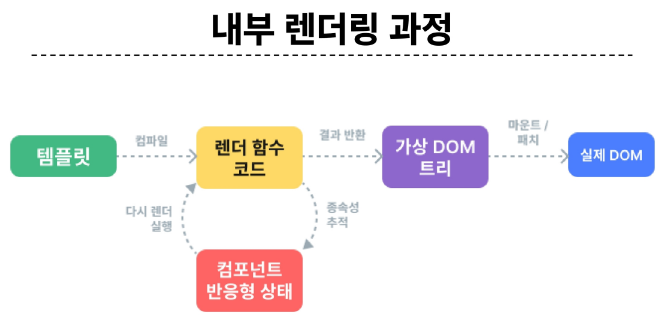
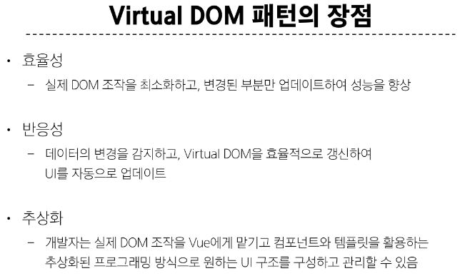
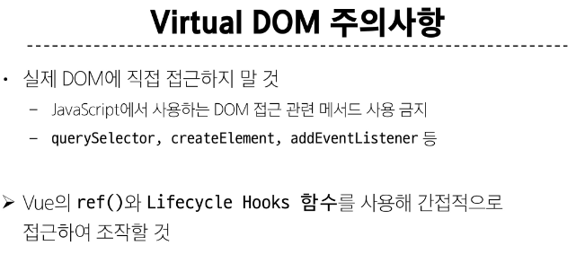
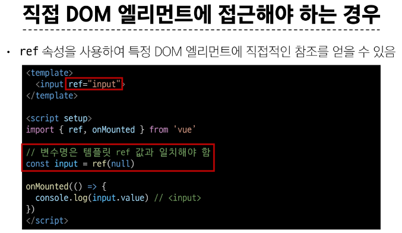
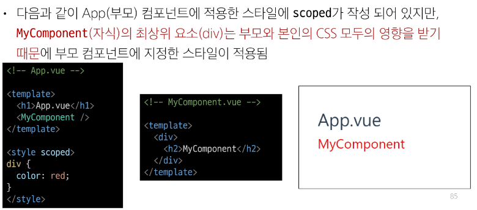
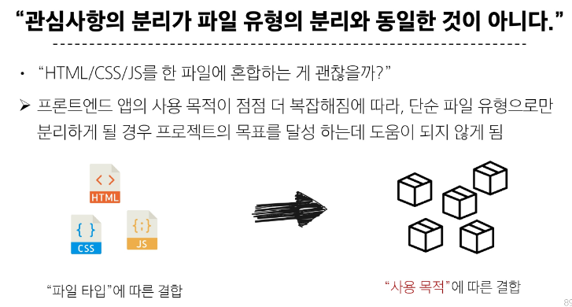

# single-File Components
## Component

- 재사용 가능한 코드 블록
- UI를 독립적이고 재사용 가능한 일부분으로 분할하고 각 부분을 개별적으로 다룰 수 있음

> 자연스럽게 애플리케이션은 중첩된 Component의 트리 형태로 구성됨

#### Single-File Components (SFC)

- 컴포넌트의 템플릿, 로직 및 스타일을 하나의 파일로 묶어낸 특수한 파일 형식 (*.vue 파일)

- Vue SFC는 HTML, CSS 및 JavaScript를 단일 파일로 합친 것
- `<template>`, `<script>` 및 `<style>` 블록은 하나의 파일에서 컴포넌트의 뷰, 로직 및 스타일을 독립적으로 배치


## SFC 구성요소

- 각 *.vue 파일은 세가지 유형의 최상위 언어 블록 `<template>`, `<script>`, `<style>` 으로 구성됨

> 언어 블록의 작성 순서는 상관 없으나 일반적으로 template -> script -> style 순서로 작성

  ```vue
  <template>
    <div class="greeting">
      {{ msg }}
    </div>
  </template>

  <script setup>
    import { ref } from 'vue'
    const msg = ref('hello')
    // 리턴 따로 필요없음
  </script>

  <!-- scoped: 해당 template 영역만 style 적용하겠다는 선언 -->
  <style scoped>
    .greeting {
      color:red;
    }
  </style>
  ```

#### <template> 블록

- 각 *.vue 파일은 최상위 'template' 블록을 하나반 포함할 수 있음

#### <script setup> 블록

- 각 *.vue 파일은 'script setup' 블록을 하나만 포함할 수 있음 (일반 'script'제외)
- 컴포넌트의 setup() 함수로 사용되며 컴포넌트의 각 인스턴스에 대해 실행

> 변수 및 함수는 동일한 컴포넌트의 템플릿에서 자동으로 사용 가능

#### <style scoped>블록

- *.vue 파일에는 여러 <style> 태그가 포함될 수 있음
- scoped 가 지정되면 CSS는 현재 컴포넌트에만 적용됨

#### 컴포넌트 사용하기

- https://play.vuejs.org/ 에서 Vue 컴포넌트 코드 작성 및 미리보기
- Vue SFC는 일반적인 방법으로 실행할 수 없으며 컴파일러를 통해 컴파일 된 후 빌드 되어야함

> 실제 프로젝트에서는 Vite와 같은 공식 빌드 도구를 사용

# SFC build tool
## vite

- 프론트 엔드 개발 도구

> 빠른 개발 환경을 위한 빌드 도구와 개발 서버를 제공
  https://vitejs.dev/

#### Build

- 프로젝트의 소스 코드를 최적화하고 번들링하여 배포할 수 있는 형식으로 변환하는 과정
- 개발 중에 사용되는 여러 소스 파일 및 리소스 (js, css, 이미지등)를 최적화된 형태로 조합하여 최종 소프트웨어 제품을 생성하는 것

> Vite는 이러한 빌드 프로세스를 수행하는데 사용되는 도구

## Vue Project

1. Vue Project (Application) 생성 (Vite 기반 빌드)

  > $ npm create vue@latest


2. 프로젝트 설정 관련 절차 진행

  - yes or no 선택

3. 프로젝트 폴더 이동

  > $ cd vue-project

4. 패키지 설치 
  
  > $ npm install

5. Vue 프로젝트 서버 실행
  
  > $ npm run dev

## NPM

- Node Package Manager
- Node.js의 기본 패키지 관리자

#### Node js 

- Chrome의 V8 JavaScript 엔진을 기반으로 하는 Server-Side 실행 환경

- 기존에 브라우저 안에서만 동작할 수 있었던 JavaScript를 브라우저가 아닌 서버 측에서도 실행할 수 있게 함

> 프론트엔드와 백엔드에서 동일한 언어로 개발할 수 있게 됨

- NPM 을 활용해 수많은 오픈 소스 패키지와 라이브러리를 제공하여 개발자들이 손쉽게 코드를 공유하고 재사용할 수 있게 함

## 모듈과 번들러

### Module 

- 프로그램을 구성하는 독립적인 코드 블록 (*.js 파일)

- 개발하는 애플리케이션의 크기가 커지고 복잡해지면서 파일 하나에 모든 기능을 담기가 어려워짐 따라서 자연스럽게 파일을 여러 개로 분리하여 관리를 하게 되었고, 이때 분리된 각 파일이 바로 모듈(module)

> *.js 파일 하나가 하나의 모듈

- 하지만 모듈의 개수가 증가하면서 성능 병목 현상 발생하면서 모듈간의 의존성(연결성)이 깊어지면서 특정한 곳에서 발생한 문제가 어떤 모듈간의 문제인지 파악하기 어려워 짐

- 복잡하고 깊은 모듈 간 의존성 문제를 해결하기 위한 도구가 필요
> Bundler

### Bundler

- 여러 모듈과 파일을 하나 (혹은 여러개)의 번들로 묶어 최적화하여 애플리케이션에서 사용할 수 있게 만들어주는 도구

- 의존성 관리, 코드 최적화, 리소스 관리 등
- Bundler가 하는 작업을 Bundling이라 함

> 참고. Vite는 Rollup이라는 Bundler를 사용하며 개발자가 별도로 기타 환경설정에 신경쓰지 않도록 모두 설정해두고 있음

# Vue Project 구조

### node_modules

- Node.js 프로젝트에서 사용되는 외부 패키지들이 저장되는 디렉토리
- 프로젝트의 의존성 듈을 저장하고 관리하는 공간
- 프로젝트가 실행될 때 필요한 라이브러리와 패키지들을 포함
- .gitignore에 작성됨

- package.json을 기반으로 npm install 하면 node_modules, package-lock.json 생김
- **package.json, package-lock.json을 공유해서 환경 맞추는 것이 좋음!!**

### package-lock.json

- 패키지들의 실체 설치 버전, 의존성 관계, 하위 패키지등을 포함하여 패키지 설치에 필요한 모든 정보를 포함

- 패키지들의 정확한 버전을 보장, 개발자가 협업하거나 서버 환경에서 일관성 있는 의존성을 유지하는데 도움
- npm install 명령을 통해 패키지를 설치할 때, 명시된 버전과 의존성을 기반으로 설치

### package.json

- 프로젝트의 메타 정보와 의존성 패키지 목록을 포함
- 프로젝트의 이름, 버전, 작성자, 라이선스 등과 같은 메타 정보를 정의

> package-lock.json 과 함께 프로젝트의 의존성을 관리하고, 버전 충돌 및 일관성 유지하는 역할

> npm install 할때마다 package.json, package-lock.json 에 알아서 업데이트 됨. 수정할 필요 xxx

### public 디렉토리

- 주로 다음 정적 파일을 위치 시킴
  - 소스코드에서 참조되지 않는
  - 항상 같은 이름을 갖는
  - import 할 필요 없는

- 항상 root 절대 경로를 사용하여 참조
  - public/icon.png는 소스코드에서 /icon.png로 참조할 수 있음

### src 디렉토리

- 프로젝트의 주요 소스코드를 포함하는 곳
- 컴포넌트, 스타일, 라우팅 등 프로젝트의 핵심 코드를 관리

#### src/assets

- 프로젝트 내에서 사용되는 자원 (이미지, 폰트, 스타일 시트 등)을 관리

- 컴포넌트 자체에서 참조하는 내부 파일을 저장하는데 사용
- 컴포넌트가 아닌 곳에서는 public 디렉토리에 위치한 파일을 사용

#### src/components

- Vue 컴포넌트들을 작성하는 곳

#### src/App.vue

- Vue 앱의 최상위 Root 컴포넌트
- 다른 하위 컴포넌트들을 포함
- 애플리케이션 전체의 레이아웃과 공통적인 요소를 정의

#### src/main.js

- Vue 인스턴스를 생성하고, 애플리케이션을 초기화하는 역할
- 필요한 라이브러리를 import 하고 전역 설정을 수행

### index.html

- Vue 앱의 기본 HTML 파일
- 앱의 진입점 (entry point)
- Root 컴포넌트인 App.vue가 해당 페이지에 마운트(mount)됨

> Vue 앱이 SPA인 이유

- 필요한 스타일 시트, 스크립트 등의 외부 리소스를 로드 할 수 있음 (ex. bootstrap CDN)

### 기타 설정 파일

- jsconfig.json : 컴파일 옵션, 모듈 시스템 등 설정
- vite.config.js : Vite 프로젝트 설정 파일, 플러그인, 빌드 옵션, 개발 서버 설정 등


# Vue Component 활용

1. 컴포넌트 파일 생성
2. 컴포넌트 등록(import)

### 실습

1. 사전 준비 
  - 초기에 생성된 모든 컴포넌트 삭제
  - App.vue 코드 초기화

2. 컴포넌트 파일 생성
  - MyComponent.vue 생성 (components 폴더에)

3. 컴포넌트 등록
  - App 컴포넌트에 MyComponent를 등록
  - App(부모) - MyComponent(자식) 관계 형성

    ```vue
    <template>
    <h1>App.vue</h1>
    <MyComponent/>
    </template>

    <script setup>
    // import MyComponent from "./components/MyComponent.vue"
    // @ - src를 뜻하는 약어
    import MyComponent from "@/components/MyComponent.vue"
    </script>
    ```

- MyComponentItem은 MyComponent의 자식 컴포넌트

  ```vue
  <template>
  <div>
    <h2>MyComponent</h2>
    <MyComponentItem/>
    <MyComponentItem/>
    <MyComponentItem/>
  </div>
  </template>

  <script setup>
  import MyComponentItem from "@/components/MyComponentItem.vue"
  </script>

  <style scoped>
  </style>  
  ```

# 추가주제
## Virtual DOM

- 가상의 DOM을 메모리에 저장하고 실제 DOM과 동기화하는 프로그래밍 개념

- 실제 DOM과 변경사항 비교를 통해 변경된 부분만 실제 DOM에 적용하는 방식
- 웹 애플리케이션의 성능을 향상시키기 위한 Vue의 내부 렌더링 기술









## Composition API & Option API

- composition API : vue3 권장 방식
- opion API : vue2 권장 방식

# 참고
## Single Root Element

- 모든 컴포넌트에는 최상단 HTML 요소가 작성되는 것이 권장
  - 가독성, 스타일링, 명확한 컴포넌트 구조를 위해 각 컴포넌트에는 최상단 HTML 요소를 작성해야함

## CSS Scoped

- scoped 속성을 사용하면 해당 CSS는 현재 컴포넌트 요소에만 적용됨
  - 부모 컴포넌트의 스타일이 자식 컴포넌트로 유출되지 않음
  - 사용하지 않으면 모든 컴포넌트에 영향을 미침

- 그러나 자식 컴포넌트의 최상위 요소는 부모 CSS와 본인 CSS 모두에게서 영향을 받음
  - 자식 컴포넌트의 최상위 요소는 부모에서 사용되기 때문

> 이는 부모가 레이아웃 목적으로 자식 컴포넌트 최상위 요소의 스타일을 지정할 수 있도록 의도적으로 설계된 것



## Scaffolding

- 새로운 프로젝트나 모듈을 시작하기 위해 초기 구조와 기본 코드를 자동으로 생성하는 과정
- 개발자들이 프로젝트를 시작하는데 도움을 주는 틀이나 기반을 제공하는 작업
- 초기 설정, 폴더 구조, 파일 템플릿, 기본 코드 등을 자동으로 생성하여 개발자가 시작할 때 시간과 노력을 절약하고 일관된 구조를 유지할 수 있도록 도와줌

