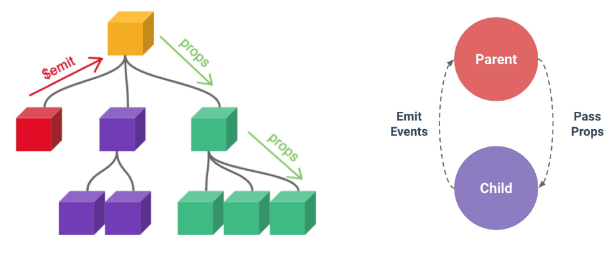
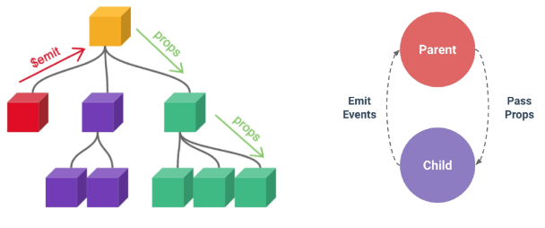
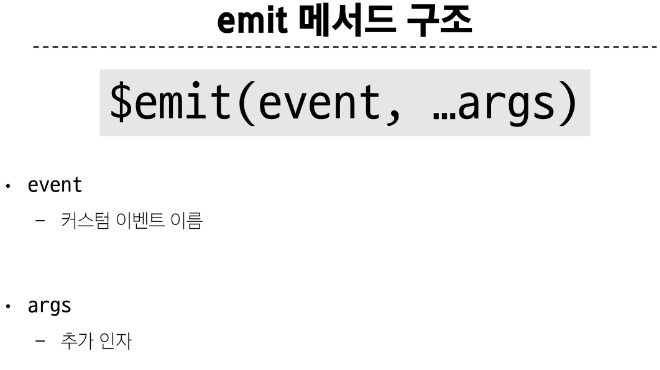

# Passing Props

- 동일한 데이터, 하지만 다른 컴포넌트 
  > 공통된 부모 컴포넌트에서 관리하자!



## Props

- 부모 컴포넌트로부터 자식 컴포넌트로 데이터를 전달하는데 사용되는 속성
- 부모 속성이 업데이트되면 자식으로 전달 되지만 그 반대는 안됨
- 자식 컴포넌트 내부에서 props를 변경하려고 시도해서는 안됨

> 부모 컴포넌트에서만 변경하고 이를 내려 받는 자식 컴포넌트는 자연스럽게 갱신

#### One-Way Data Flow 

모든 props는 자식속성과 부모속성 사이에 하향식 단방향 바인딩을 형성 (one-way-down binding)

- 하위 컴포넌트가 실수로 상위 컴포넌트의 상태를 변경하여 앱에서의 데이터 흐름을 이해하기 어렵게 만드는 것을 방지하기 위함
> 데이터 흐름의 '일관성' 및 '단순화'

## Props 선언

- 사전 준비
  
  1. vue 프로젝트 생성
  2. 초기 생성된 컴포넌트 모두 삭제 (App.vue 제외)
  3. src/assets 내부 파일 모두 삭제
  4. main.js 해당 코드 삭제
    ```js
    // main.js
    import './assets/main.css'
    ```
  5. App.vue 내용 삭제 - 기본 형태로 유지
  6. App > Parent > ParentChild 컴포넌트 관계 작성
    - App.vue 에 Parent 등록
    - Parent에 ParentChild 등록 

- 부모 컴포넌트에서 내려보낸 props를 사용하기 위해서는 자식 컴포넌트에서 명시적인 props 선언이 필요

### Props 작성

- 부모 컴포넌트 Parent에서 자식 컴포넌트 ParentChild에 보낼 props 작성


  ```vue
  <!-- Parent.vue -->
  <template>
  <div>
    <ParentChild 
      my-msg="message"
    />
  </div>
  </template>
  ```
### Props 선언

1. "문자열 배열"을 사용한 선언
2. "객체"를 사용한 선언

#### 문자열 배열을 사용한 선언

- 배열의 문자열 요소로 props 선언
- 문자열 요소의 이름은 전달된 props의 이름

- parent는 HTML 속성: kebabcase, parentchild는 js 속성:camelCase

  ```vue
  <!-- ParentChild.vue -->
  <template>
  <div>
    {{myMsg}}
  </div>
  </template>

  <script setup>
  // 내려받은 Props 선언
  // 1. 배열 선언 방식
  defineProps(['myMsg'])
  </script>
  ```

#### 객체를 사용한 선언

- 각 객체 속성의 키가 전달받은 prop 이름이 되며, 객체 속성의 값은 값이 될 데이터의 타입에 해당하는 생성자 함수(Number, String...) 여야함

> 객체 선언 문법 사용권장

  ```vue
  <template>
  <div>
    {{myMsg}}
  </div>
  </template>

  <script setup>
  // 내려받은 Props 선언
  // 2. 객체 선언 방식
  defineProps({
    myMsg: String
  })
  </script>
  ```

### props 데이터 사용

- props 선언 후 템플릿에서 반응형 변수와 같은 방식으로 활용

  ```vue
  <!-- ParentChild.vue -->

  <template>
  <div>
    {{myMsg}}
  </div>
  </template> 
  ```

- props를 객체로 반환하므로 필요한 경우 JavaScript에서 접근 가능

  ```vue
  <script setup>
  // props 데이터를 활용해야 하는 경우
  const props = defineProps({myMsg: String})
  console.log(props)
  console.log(props.myMsg)
  </script>
  ```

#### 한단계 더 props 내려 보내기

- ParentChild 컴포넌트를 부모로 갖는 ParentGrandChild 컴포넌트 생성 및 등록

- ParentChild 컴포넌트에서 Parent로 부터 받은 props인 myMsg를 ParentGrandChild에게 전달

  ```vue
  <!-- ParentChild.vue -->
  <template>
  <div>
    <p>{{myMsg}}</p>
    <ParentGrandChild
      :my-msg="myMsg"
    />
  </div>
  </template>

  <script setup>
  import ParentGrandChild from '@/ParentGrandChild.vue'

  const props = defineProps({
    myMsg: String
  })
  </script>
  ```

  ```vue
  <!-- ParentGrandChild.vue -->
  <template>
  <div>
    <p>{{ myMsg }}</p>
  </div>
  </template>

  <script setup>
  defineProps({
    myMsg:String,
  })
  </script>
  ```
- Parent가 props를 변경할 경우 이를 전달받고 있는 ParentChild, ParentGrandChild에서도 모두 업데이트 됨

## Props 세부사항

1. Props Name Casing (Props 이름 컨벤션)
2. Static Props와 Dynamic Props

### Props Name Casing

- 자식 컴포넌트로 전달 시 (kebab-case, HTML 속성)

  ```vue
  <ParentChild my-msg="message">
  ```

- 선언 및 템플릿 참조 시 (camelCase, Javascript 속성)
  
  ```vue 
  <p>{{ myMsg }}</p>

  defineProps({
    myMsg: String
  })
  ```

### Static props & Dynamic props

- 위의 것들은 Static props
- v-bind 사용하여 동적으로 할당된 props를 사용할 수 있음

  1. Dynamic props 정의
  
    ```vue
    <template>
    <div>
      <ParentChild 
        my-msg="message"
        :dynamic-props="name"
      />
    </div>
    </template>

    <script setup>
    import ParentChild from '@/components/ParentChild.vue'
    import {ref} from 'vue'

    const name = ref('Alice')
    </script>
    ```
  2. Dynamic props 선언 및 출력
  
    ```vue
    <template>
    <div>
      <p>{{ myMsg }}</p>
      <p>{{ dynamicProps }}</p>
      <ParentGrandChild
        :my-msg="myMsg"
      />
    </div>
    </template>

    <script setup>
    import ParentGrandChild from '@/components/ParentGrandChild.vue'

    defineProps({
      myMsg: String,
      dynamicProps: String,
    })

    </script>
    ``` 

## Props 활용

- v-for와 함께 사용하여 반복되는 요소를 props로 전달하기

- ParentItem 컴포넌트 생성 및 Parent의 하위 컴포넌트로 등록

- 데이터 정의 및 v-for 디렉티브의 반복 요소로 활용
- 각 반복 요소를 props로 내려 보내기

  ```vue
  <!-- Parent.vue -->
  <template>
  <div>
    <ParentItem
      v-for="item in items"
      :key="item.id"
      :my-prop="item"
    />
  </div>
  </template>

  <script setup>
  import ParentItem from '@/components/ParentItem.vue'

  const items = ref([
    {id:1, name: '사과'},
    {id:2, name: '바나나'},
    {id:3, name: '딸기'}
  ])
  </script>
  ```
  - props 선언

  ```vue
  <!-- ParentItem.vue -->

  <template>
  <div>
    <p>{{ myProp.id }}</p>
    <p>{{ myProp.name }}</p>
  </div>
  </template>

  <script setup>
  defineProps({
    myProp: Object
  })
  </script>
  ```

# Component Events
## Emit



- 부모는 자식에게 데이터를 전달(Pass Props)하며, 자식은 자신에게 일어난 일을 부모에게 알림(Emit event)

> 부모가 props 데이터를 변경하도록 소리쳐야 한다.

### $emit()

- 자식 컴포넌트가 이벤트를 발생시켜 부모 컴포넌트로 데이터를 전달하는 역할의 메서드
  - '$' 표기는 Vue 인스턴스의 내부 변수들을 가리킴
  - Life cycle hooks. 인스턴스 메서드 등 내부 특정 속성에 접근할 때 사용



## 이벤트 발신 및 수신

- $emit을 사용하여 템플릿 표현식에서 직접 사용자 정의 이벤트를 발신
  ```vue
  <button @click="$emit('someEvent')">클릭</button>
  ```
- 그런 다음 부모는 v-on을 사용하여 수신할 수 있음
  ```vue
  <ParentComp @some-event="someCallback"/>
  ```

### 이벤트 발신 및 수신하기

- parentChild 에서 someEvent라는 이름의 사용자 정의 이벤트를 발신
  ```vue
  <!-- ParentChild.vue -->
  <button @click="$emit('someEvent')">클릭</button>
  ```

- ParentChild 의 부모 Parent는 v-on을 사용하여 발신된 이벤트를 수신
- 수신 후 처리할 로직 및 콜백함수 호출

  ```vue
  <!-- Parent.vue -->
  <ParentChild 
  @some-event="someCallback"
  />

  const someCallback = function () {
  console.log('ParentChild가 발신한 이벤트를 수신했어요')
  }
  ```

## emit 이벤트 선언

- defineEmits()를 사용하여 발신한 이벤트를 선언
- props와 마찬가지로 defineEmits()에 작성하는 인자의 데이터 타입에 따라 선언 방식이 나뉨(배열, 객체)
- defineEmits()는 $emit 대신 사용할 수 있는 동등한 함수를 반환

  ```js
  // ParentChild.vue
  
  <button @click="buttonClick">클릭</button>

  // emit 이벤트 선언 (배열방식, 객체방식)
  const emit= defineEmits(['someEvent', 'emitArgs'])

  const buttonClick = function () {
    emit('someEvent')
  }
  ```

## 이벤트 전달

- 이벤트 발신 시 추가 인자를 전달하여 값을 제공할 수 있음
- ParentChild에서 이벤트를 발신하여 Parent로 추가 인자 전달하기

  ```js
  // ParentChild.vue

  <button @click="emitArgs">추가인자 전달</button>

  const emit= defineEmits(['emitArgs'])

  const emitArgs = function () {
    emit('emitArgs', 1, 2, 3)
  }
  ```

- ParentChild에서 발신한 이벤트를 Parent에서 수신

  ```js
  // Parent.vue
  <ParentChild 
  @emit-args="getNumbers"
  />

  const getNumbers = function (...args) {
  console.log(args)
  } 
  ```

## 이벤트 세부사항

### Event Name Casing

- 선언 및 발신 시 (camelCase)
  ```js
  <button @click="$emit('someEvent')">클릭</button>

  const emit= defineEmits(['someEvent'])
  ```

- 부모 컴포넌트에서 수신 시 (kebab-case)
  ```js
  <ParentChild 
    @some-event="someCallback"
  />
  ```

## emit 이벤트 활용

- 최하단 컴포넌트 ParentGrandChild에서 Parent 컴포넌트의 name 변수 변경 요청하기


- ParentGrandChild에서 이름 변경을 요청하는 이벤트 발신

  ```js
  // ParentGrandChild.vue

  <button @click="updateName">이름 변경</button>

  const emit = defineEmits(['updateName'])

  const updateName = function () {
    emit('updateName')
  }
  ```

- 이벤트 수신 후 이름 변경을 요청하는 이벤트 발신

  ```js
  // ParentChild.vue

  <ParentGrandChild
  @update-name="updateName"
  />

  const emit= defineEmits(['updateName'])
  const updateName = function () {
    emit('updateName')
  }
  ```

- 이벤트 수신 후 이름 변수 변경 메서드 호출
- 해당 변수를 props로 받는 모든 곳에서 자동 업데이트 
  
  ```js
  // Parent.vue

  <ParentChild 
  @update-name="updateName"
  />

  const updateName = function () {
  name.value = 'Bella'
  }
  ```

# 참고
## 정적 & 동적 props 주의사항

- 첫 번째는 정적 props로 문자열 "1"을 전달
- 두 번째는 동적 props로 숫자 1을 전달

  ```vue
  <SomeComponent num-props="1"/>
  <SomeComponent :num-props="1"/>
  ```

## Props & Emit 객체 선언 문법

#### Props 선언 시 '객체 선언 문법'을 권장하는 이유

- 컴포넌트를 가독성이 좋게 문서화하는데 도움이 되며,
- 다른 개발자가 잘못된 유형을 전달할 때에 브라우저 콘솔에 경로를 출력하도록 함
- 추가로 props 에 대한 유효성 검사로써 활용 가능