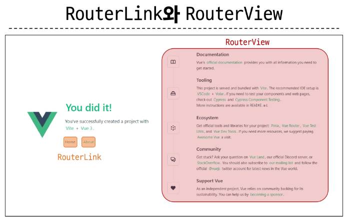
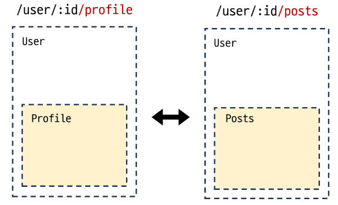
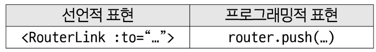
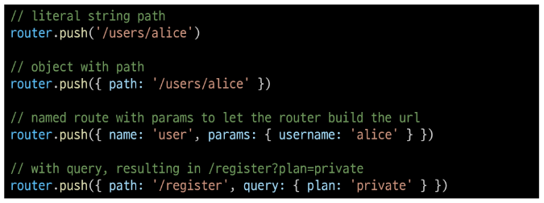
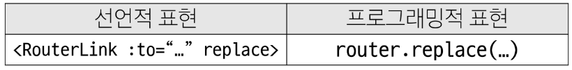
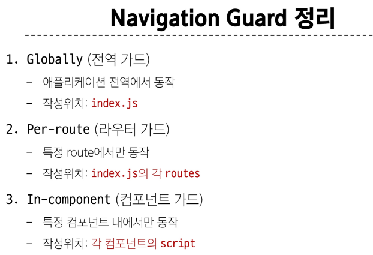
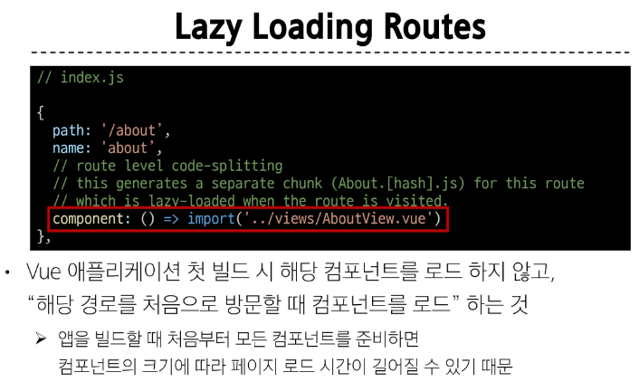

# Routing
## Routing

- 네트워크에서 경로를 선택하는 프로세스

> 웹 애플리케이션에서 다른 페이지 간의 전환과 경로를 관리하는 기술

### SSR에서의 Routing

- SSR에서 routing은 **서버 측**에서 수행
- 서버가 사용자가 방문한 URL 경로를 기반으로 응답을 전송
- 링크를 클릭하면 브라우저는 서버로부터 HTML 응답을 수신하고 새 HTML로 전체 페이지를 다시 로드

### CSR에서의 Routing

- CSR에서 routing은 **클라이언트 측**에서 수행
- 클라이언트 측 JavaScript가 새 데이터를 동적으로 가져와 전체 페이지를 다시 로드 하지 않음

### SPA에서 Routing이 없다면

- 유저가 URL을 통한 페이지의 변화를 감지할 수 없음
- 페이지가 무엇을 렌더링 중인지에 대한 상태를 알 수 없음
  - URL이 1개이기 때문에 새로 고침시 처음 페이지로 되돌아감
  - 링크를 공유할 시 첫 페이지만 공유 가능
- 브라우저의 뒤로 가기 기능을 사용할 수 없음

> 페이지는 1개이지만, 주소에 따라 여러 컴포넌트를 새로 렌더링하여 마치 여러 페이지를 사용하는 것처럼 보이도록 해야 함

## Vue Router

- Vue 공식 라우터 (The official Router for Vue.js)
- Vite로 프로젝트 생성시 Router 추가

#### Vue 프로젝트 구조 변화

1. App.vue 코드 변화
2. router 폴더 신규 생성
3. views 폴더 신규 생성

#### RouterLink

- 페이지를 다시 로드 하지 않고 URL을 변경하여 URL 생성 및 관련 로직을 처리

- HTML의 <a> 태그를 렌더링

#### RouterView

- RouterLink URL에 해당하는 컴포넌트를 표시
- 원하는 곳에 배치하여 컴포넌트를 레이아웃에 표시 할 수 있음



#### router/index.js

- 라우팅에 관련된 정보 및 설정이 작성되는 곳
- router에 URL과 컴포넌트를 매핑

#### views 

- RouterView 위치에 렌더링 할 컴포넌트를 배치
- 기존 components 폴더와 기능적으로 다른 것은 없으며 단순 분류의 의미로 구성됨

> 일반 컴포넌트와 구분하기 위해 컴포넌트 이름을 View로 끝나도록 작성하는 것은 권장

### Basic Routing

1. Index.js에 라우터 관련 설정 작성(주소, 이름, 컴포넌트)

  ```js
  // index.js

  const router = createRouter({
    routes: [
      {
        path: '/',
        name: 'home',
        component: HomeView,
      }
    ],
  })
  ```

2. RouterLink의 'to' 속성으로 index.js에서 정의한 주소 값(path)을 사용

  ```js
  // App.vue

  <nav>
    <RouterLink to="/">Home</RouterLink>
    <RouterLink to="/about">About</RouterLink>
  </nav>
  ```

3. RouterLink 클릭 시 경로와 일치하는 컴포넌트가 RouterView에서 렌더링 됨

  ```js
  // App.vue

  <RouterView />
  ```

### Named Routes

- 경로에 이름을 지정하는 라우팅

- name 속성 값에 경로에 대한 이름을 지정
- 경로에 연결하려면 RouterLink에 v-bind을 사용해 'to' props 객체로 전달

- 하드 코딩된 URL을 사용하지 않아도 됨
- URL 입력시 오타 방지

  ```js
  // index.js

  const router = createRouter({
    history: createWebHistory(import.meta.env.BASE_URL),
    routes: [
      {
        path: '/',
        // 여기서 설정된 name
        name: 'home',
        component: HomeView,
      },
      {
        path: '/about',
        // 여기서 설정된 name
        name: 'about',
        component: () => import('../views/AboutView.vue'),
      },
    ],
  })

  // App.vue
  // 아래와 같이 v-bind 사용해 나타낼 수 있음
  <RouterLink :to="{name: 'home'}">Home</RouterLink>
  <RouterLink :to="{name: 'about'}">About</RouterLink>
  ```

### Dynamic Route Matching

- URL의 일부를 변수로 사용하여 경로를 동적으로 매칭
- 주어진 패턴 경로를 동일한 컴포넌트에 매핑해야하는 경우 활용

#### 매기변수를 사용한 동적 경로 매칭 활용

- views 폴더 내 UserView 컴포넌트 작성

  ```js
  // UserView.vue

  <template>
    <div>
      <h1>UserView</h1>
    </div>
  </template> 
  ```

- 매개변수는 콜론(:)으로 표기

>UserView 컴포넌트 라우트 등록

  ```js
  import UserView from '@/views/UserView.vue'

  {
    path: '/user/:id',
    name: 'user',
    component: UserView,
  },
  ```
- 매개변수는 객체의 params 속성의 객체 타입으로 전달
- 단, 객체의 key 이름과  index.js에서 지정한 매개변수 이름이 같아야함
> UserView 컴포넌트로 이동하기 위한 RouterLink 작성

  ```js
  // App.vue

  // script
  import {ref} from 'vue'
  const userId = ref(1)

  // template
  <RouterLink :to="{name: 'user'}">User</RouterLink>

  ```

- 경로가 일치하면 라우트의 매개변수는 컴포넌트에서 $route.params 로 참조 가능
> 현재 사용자의 id를 출력하기

  ```vue
  <template>
    <div>
      <h1>UserView</h1>
      <h2>{{ $route.params.id }}번 User 페이지</h2>
    </div>
  </template>
  ```

- userRoute() 함수를 사용해 스크립트 내에서 반응형 변수에 할당 후 템플릿에 출력하는 것을 권장
- 템플릿에서 $route를 사용하는 것과 동일
  
  ```vue
  <!-- UserView.vue -->

  <template>
    <div>
      <h1>UserView</h1>
      <h2>{{ userId }}번 User 페이지</h2>
    </div>
  </template>

  <script setup>
    import {ref} from 'vue'
    import { useRoute } from 'vue-router'

    const route = useRoute()
    const userId = ref(route.params.id)
  </script>

  ```

### Nested Routes

- 중첩된 라우팅



- 애플리케이션의 UI는 여러 레벨 깊이로 중첩된 컴포넌트로 구성되기도 함
- 이 경우 URL을 중첩된 컴포넌트의 구조에 따라 변경되도록 이 관계를 표현할 수 있음

1. 컴포넌트 생성
  - components 폴더에 UserProfile, Userposts 컴포넌트 작성

2. 라우터 등록
  - index.js에 두 컴포넌트를 import 
  
  - children 옵션은 배열 형태로 필요한 만큼 중첩 관계를 표현할 수 있음
  - children 옵션을 사용해 중첩된 라우터에 컴포넌트를 등록
  
    ```js
    //index.js

    import UserPosts from '@/components/UserPosts.vue'
    import UserProfile from '@/components/UserProfile.vue'

    {
      path: '/user/:id',
      // name: 'user',
      component: UserView,
      children: [
        // 중첩된 주소가 존재 하는 경우 첫페이지에 가져올 vue 파일 따로 설정해줄 수 있음
        {path:'', name: 'user', component: UserProfile},
        {path:'profile', name: 'user-profile', component: UserProfile},
        {path:'posts', name: 'user-posts', component: UserPosts},
      ]
    },
    ```
3. 두 컴포넌트에 대한 RouterLink 및 RouterView 작성
  
  ```vue
  <!-- UserView.vue -->
  <template>
    <div>
      <h1>UserView</h1>
      <RouterLink :to="{name: 'user-profile'}">Profile</RouterLink>
      <RouterLink :to="{name: 'user-posts'}">Posts</RouterLink>

      <h2>{{ userId }}번 User 페이지</h2>

      <hr>
      <RouterView/>
    </div>
  </template>
  ```

#### 주의! 중첩된 라우팅

- 컴포넌트 간 부모-자식 관계 관점이 아닌 URL에서의 중첩된 관계를 표현하는 관점으로 바라보기

### Programmatic Navigation

- RouterLink 대신 JavaScript를 사용해 페이지를 이동하는 것

- 프로그래밍으로 URL 이동하기
- router의 인스턴스 메서드를 사용해 RouterLink로 <a> 태그를 만드는 것 처럼 프로그래밍으로 네비게이션 관련 작업을 수행할 수 있음

#### router의 메서드 

1. 다른 위치로 이동하기 
  - router.push()

2. 현재 위치 바꾸기
  - router.replace()

#### router.push()

- 다른 URL로 이동하는 메서드
- 새 항목을 history stack에 push 하므로 사용자가 브라우저 뒤로 가기 버튼을 클릭하면 이전 URL로 이동할 수 있음 

- RouterLink 를 클릭했을 때 내부적으로 호출되는 메서드이므로 RouterLink를 클릭하는 것은 router.push()를 호출하는 것과 같음



- UserView 컴포넌트에서 HomeView 컴포넌트로 이동하는 버튼 만들기

  ```js
  // UserView.vue
  import { useRoute, useRouter} from 'vue-router'

  const router = useRouter()
  const goHome = function () {
    router.push({name: 'home'})
  }

  <button @click="goHome">홈으로!</button>
  ```

- 참고: router.push 의 인자 활용



#### router.replace()

- push 메서드와 달리 history stack에 새로운 항목을 push 하지 않고 다른 URL로 이동 (===이동 전 URL로 뒤로 가기 불가)



  ```js
  const goHome = function () {
    // router.push({name: 'home'})
    router.replace({name: 'home'})
  }
  ```

## Navigation Guard

- Vue router를 통해 특정 URL에 접근할 때 다른 URL로 redirect를 하거나 취소하여 네비게이션을 보호

> 라우트 전환 전/후 자동으로 실행되는 Hook

1. Globally (전역 가드)
  - 애플리케이션 전역에서 모든 라우트 전환에 적용되는 가드

2. Per-route (라우터 가드)
  - 특정 라우트에만 적용되는 가드

3. In-component (컴포넌트 가드)
  - 컴포넌트 내에서만 적용되는 가드

### Globally Guard

- 애플리케이션 전역에서 동작하는 가드 
> 작성위치: index.js

#### beforeEach()

- 다른 URL로 이동하기 직전에 실행되는 함수 (Global Before Guards)

  ```js
  router.beforeEach((to, from) => {
    //...
    return false 또는 return {name: 'About'}
  })
  ```
- 모든 가드는 2개의 인자를 받음
  - to: 이동할 URL 정보가 담긴 Route 객체
  - from: 현재 URL 정보가 담긴 Route 객체

- 선택적으로 다음 값 중 하나를 반환
  1. false
    - 현재 내비게이션을 취소
    - 브라우저 URL이 변경된 경우 (사용자가 수동으로 또는 뒤로가기 버튼을 통해) 'from' 경로의 URL로 재설정
  2. Route Location
    - router.push()를 호출하는 것처럼 경로 위치를 전달하여 다른 위치로 redirect
    - return이 없다면 자동으로 'to' URL Route 객체로 이동

#### beforeResolve()
#### afterEach()

### Per-route Guard

- 특정 라우터에서만 동작하는 가드 
> 작성위치: index.js의 각 routes

#### beforeEnter()

- 특정 route에 집입했을 때만 실행되는 함수 

> 단순히 URL의 매개변수나 쿼리 값이 변경될 때는 실행되지 않고, 다른 URL에서 탐색해 올 때만 실행됨

- routes 객체에서 정의

  ```js
  {
    path: '/user/:id',
    name: 'user',
    component: UserView,
    beforeEnter:(to, from) => {
      //...
      return false
    }
  },
  ```

### In-component Guard

- 특정 컴포넌트 내에서만 동작하는 가드 

> 작성위치: 각 컴포넌트의 <script> 내부

- onBeforeRouteLeave()
  - 현재 라우트에서 다른 라우트로 이동하기 전에 실행
  > 사용자가 현재 페이지를 떠나는 동작에 대한 로직을 처리

  ```js
  import { onBeforeRouteLeave } from 'vue-router'

  onBeforeRouteLeave((to, from) => {
    const answer = window.confirm('정말 떠나실 건가요?')
    if (answer === false) {
      return false
    }
  })
  ```

- onBeforeRouteUpdate()
  - 이미 렌더링 된 컴포넌트가 같은 라우트 내에서 업데이트 되기 전에 실행
  > 라우트 업데이트 시 추가적인 로직을 처리

  ```js
  import { onBeforeRouteUpdate } from 'vue-router'

  const routeUpdate = function () {
    router.push({name: 'user', params: {id: 100}})
  }

  onBeforeRouteUpdate((to, from) => {
    userId.value = to.params.id
  })
  ```



## 참고
### Laxy Loading Routes

