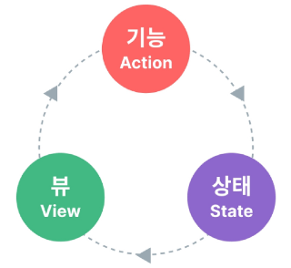
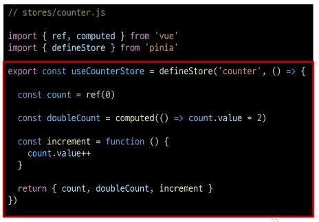
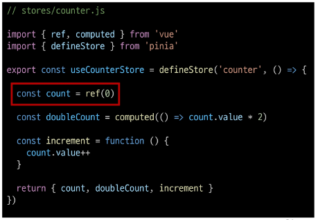
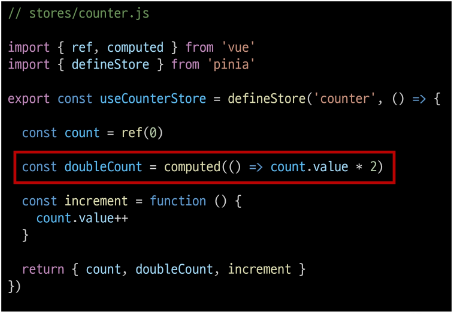
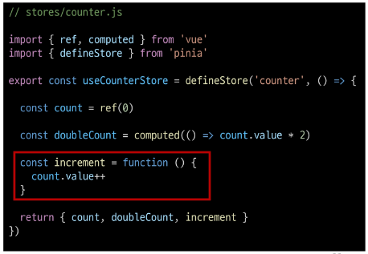
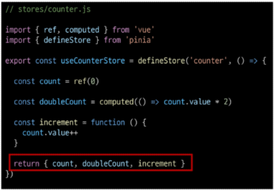
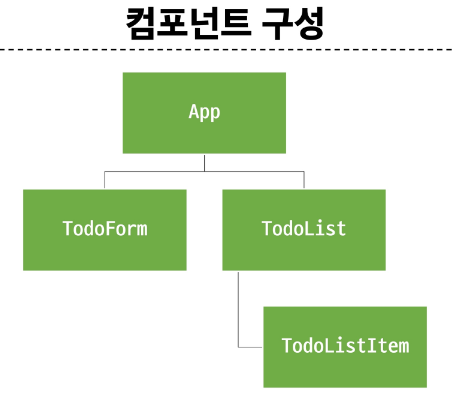

# State Management

- Vue 컴포넌트는 이미 반응형 상태를 관리하고 있음
> 상태 === 데이터

#### 컴포넌트 구조의 단순화

- 상태 (State)
  - 앱 구동에 필요한 기본 데이터

- 뷰(View)
  - 상태를 선언적으로 매핑하여 시각화

- 기능(Actions)
  - 뷰에서 사용자 입력에 대해 반응적으로 상태를 변경할 수 있게 정의된 동작

> 단방향 데이터 흐름의 간단한 표현



#### 상태 관리의 단순성이 무너지는 시점

- 여러 컴포넌트가 상태를 공유할 때

  1. 여러 뷰가 동일한 상태에 종속되는 경우
    - 공유 상태를 공통 조상 컴포넌트로 끌어올린 다음 props로 전달하는 것
    - 하지만 계층 구조가 깊어질 경우 비효율적, 관리가 어려워 짐
  
  2. 서로 다른 뷰의 기능이 동일한 상태를 변경시켜야 하는 경우
    - 발신(emit)된 이벤트를 통해 상태의 여러 복사본을 변경 및 동기화 하는 것
    - 마찬가지로 관리의 패턴이 깨지기 쉽고 유지 관리할 수 없는 코드가 됨

#### 해결책

- 각 컴포넌트의 공유 상태를 추출하여, 전역에서 참조할 수 있는 저장소에서 관리
- 컴포넌트 트리는 하나의 큰 view 가 되고 모든 컴포넌트는 트리 계층 구조에 관계없이 상태에 접근하거나 기능을 사용할 수 있음

> Vue 의 공식 상태 관리 라이브러리 === "Pinia"

## State management library (Pinia)
### Pinia

- Vue 공식 상태 관리 라이브러리

### Pinia 구조

1. store
  - 중앙 저장소
  - 모든 컴포넌트가 공유하는 상태, 기능 등이 작성됨
  > defineStore()의 반환 값의 이름은 use와 store를 사용하는 것을 권장
  > defineStore()의 첫번째 인자는 애플리케이션 전체에 걸쳐 사용하는 store의 고유 ID

  

2. state
  - 반응형 상태(데이터)
  - ref() === state
  

3. getters
  - 계산된 값
  - computed() === getters
  

4. actions
  - 메서드
  - function() === actions
  

  - Setup Stores의 반환 값
    - pinia의 상태들을 사용하려면 반드시 반환해야함
    > store에서는 공유하지 않는 private한 상태 속성을 가지지 않음
    

5. plugin
  
  - 애플리케이션의 상태 관리에 필요한 추가 기능을 제공하거나 확장하는 도구나 모듈
  - 애플리케이션의 상태 관리를 더욱 간편하고 유연하게 만들어주며 패키지 매니저로 설치 이후 별도 설정을 통해 추가 됨

### Pinia 구성 요소 활용

#### State

- 각 컴포넌트 깊이에 관계 없이 store 인스턴스로 state에 접근하여 직접 읽고 쓸 수 있음
- 만약 store에 state를 정의하지 않았다면 컴포넌트에서 새로 추가할 수 없음

  ```js
  <script setup>
  // 1. 중앙 저장소 가져오기 
  import { useCounterStore } from '@/stores/counter'

  // 2. 중앙 저장소 활용해 인스턴스 생성
  const store = useCounterStore()

  // 3. 중앙 저장소에 상태를 참조
  console.log(store.count)

  // [주의] 각 컴포넌트에서는 중앙저장소에 새로운 상태를 생성할 수 없다.
  // store.ssafy = 'ssafy'
  </script>
  ```

  ```js
  <template>
    <div>
      <p>state : {{ store.count }}</p>
    </div>
  </template>
  ```

#### Getters 

- store의 모든 getters 또한 state 처럼 직접 접근할 수 있음

  ```js
  <template>
    <div>
      <p>getters : {{ store.doubleCount }}</p>
    </div>
  </template>
  ```

#### Actions

- store의 모든 actions 또한 직접 접근 및 호출 할 수 있음
- getters와 달리 state 조작, 비동기, API 호출이나 다른 로직을 진행할 수 있음

  ```js
  // 액션 호출
  store.increment()
  ```
  ```js
  <template>
    <div>
      <button @click="store.increment()">++</button>
    </div>
  </template>
  ```  

## Pinia 실습

- Todo CRUD 구현
- Todo 개수 계산 
  - 완료된 Todo 개수



- TodoListItem -> TodoList, TodoForm 컴포넌트 작성
- App.vue 등록 

### Read Todo

- Todo 조회
  - store에 임시 todos 목록 state를 정의

    ```js
    // counter.js
    import { ref, computed } from 'vue'
    import { defineStore } from 'pinia'

    export const useCounterStore = defineStore('counter', () => {
      let id = 0 
      const todos = ref([
        {id: id++, text: '할 일 1', isDone: false},
        {id: id++, text: '할 일 2', isDone: false},
      ])

      return { todos }
    })

    ```
  - store의 todos state를 참조
  - 하위 컴포넌트인 TodoListItem을 반복하면서 개별 todo를 props로 전달

    ```js
    // TodoList.vue
    <template>
      <div>
        <TodoListItem
          v-for="todo in store.todos"
          :key="todo.id"
          :todo="todo"
        />
      </div>
    </template>

    <script setup>
    import TodoListItem from "@/components/TodoListItem.vue"
    import { useCounterStore } from "@/stores/counter";

    const store = useCounterStore()
    // console.log(store.todos)

    </script>
    ```

  - props 정의 후 데이터 출력 확인
  
    ```js
    // TodoListItem.vue 
    <template>
    <div>
      {{ todo.text }}
    </div>
    </template>

    <script setup>
    defineProps({
      todo:Object
    })
    </script>
    ```

### Create Todo

- todos 목록에 todo를 생성 및 추가하는 addTodo 액션 정의
  ```js
  // counter.js
  const addTodo = function (todoText) {
    todos.value.push({
      id: id++,
      text: todoText,
      isDone: false
    })
  }

  return { todos, addTodo }
  ```

- TodoForm에서 실시간으로 입력되는 사용자 데이터를 양방향 바인딩하여 반응형 변수로 할당
- submit 이벤트가 발생했을 때 사용자 입력 텍스트를 인자로 전달하여 store에 정의한 addTodo 액션 메서드를 호출
- form 요소를 선택하여 todo 입력 후 input 데이터를 초기화 할 수 있도록 처리

  ```js
  // TodoForm.vue
  <template>
    <div>
      <form @submit.prevent="createTodo(todoText)" ref="formElem">
        <input type="text" v-model="todoText">
        <input type="submit">
      </form>
    </div>
  </template>

  <script setup>
  import { useCounterStore } from '@/stores/counter';
  import { ref } from 'vue'

  const store = useCounterStore()
  const todoText = ref('')

  // form 태그 선택
  const formElem = ref(null)

  // 중앙 저장소의 addTodo 액션을 직접 호출해도 되지만 
  // 굳이 createTodo를 만들어서 호출하는 이유는 
  // addTodo 호출 전후로 추가 로직을 작성할 수 있기 때문
  const createTodo = function(todoText) {
    store.addTodo(todoText)
    // form의 value를 reset 함
    formElem.value.reset()
  }
  </script>
  ```

### Delete Todo

- todos 목록에서 특정 todo를 삭제하는 deleteTodo 액션 정의
- 전달받은 todo의 id 값을 활용해 선택된 todo의 인덱스를 구함
- 특정 인덱스 todo를 삭제후 todos 배열을 재설정

  ```js
  // counter.js

  const deleteTodo = function (selectedId) {
    const index = todos.value.findIndex((todo) => todo.id === selectedId)
    todos.value.splice(index, 1)
  }

  return { todos, addTodo, deleteTodo }
  ```

- 각 todo에 삭제 버튼을 작성
- 버튼을 클릭하면 선택된 todo의 id를 인자로 전달해 deleteTodo 메서드 호출

  ```js
  <template>
    <div>
      <span>{{ todo.text }}</span>
      <button @click="store.deleteTodo(todo.id)">Delete</button>
    </div>
  </template>

  <script setup>
  import { useCounterStore } from '@/stores/counter'

  defineProps({
    todo:Object
  })

  const store = useCounterStore()
  </script>
  ```

### Update Todo

- 각 todo 상태의 isDone 속성을 변경하여 todo의 완료 유무 처리하기
- 완료된 todo에는 취소선 스타일 적용하기

- todos 목록에서 특정 todo의 isDone 속성을 변경하는 updateTodo 액션 정의
- 전달받은 todo의 id 값을 활용해 선택된 todo와 동일 todo를 목록에서 검색
- 일치하는 todo 데이터의 isDone 속성 값을 반대로 재할당 후 새로운 todo 목록 반환

  ```js
  // counter.js

  const updateTodo = function (selectedId) {
    todos.value = todos.value.map((todo) => {
      if (todo.id === selectedId) {
        todo.isDone = !todo.isDone
      }
      return todo
    })
  }

  return { todos, addTodo, deleteTodo, updateTodo }
  ```

- todo 내용을 클릭하면 선택된 todo의 id를 인자로 전달해 updateTodo 메서드를 호출
- todo 객체의 isDone 속성 값에 따라 스타일 바인딩 적용하기

  ```js
  <template>
    <div>
      <span 
        @click="store.updateTodo(todo.id)"
        :class="{'is-done' : todo.isDone}"
      >{{ todo.text }}</span>
      <button @click="store.deleteTodo(todo.id)">Delete</button>
    </div>
  </template>

  <script setup>
  import { useCounterStore } from '@/stores/counter'

  defineProps({
    todo:Object
  })

  const store = useCounterStore()
  </script>

  <style scoped>
  .is-done {
    text-decoration: line-through;
  }
  </style>
  ```

### Counting Todo

- todos 배열의 길이 값을 반환하는 함수 doneTodosCount 작성(getters)
  
  ```js
  const doneTodosCount = computed(() => {
    const doneTodos = todos.value.filter((todo) => todo.isDone)
    return doneTodos.length
  })

  return { todos, addTodo, deleteTodo, updateTodo, doneTodosCount }
  ```

- App 컴포넌트에서 doneTodosCount getter를 참조
  
  ```js
  <h2>완료된 Todo: {{ store.doneTodosCount }}</h2>

  import { useCounterStore } from './stores/counter'

  const store = useCounterStore()
  ```

### Local Storage

- 브라우저 내에 key-value 쌍을 저장하는 웹 스토리지 객체

- 페이지를 새로 고침하고 브라우저를 다시 실행해도 데이터가 유지
- 쿠키와 다르게 네트워크 요청시 서버로 전송되지 않음
- 여러 탭이나 창 간에 데이터를 공유할 수 있음

- 웹 애플리케이션에서 사용자 설정, 상태 정보, 캐시 데이터 등을 클라이언트 측에서 보관하여 웹사이트의 성능을 향상시키고 사용자 경험을 개선하기 위함

#### pinia-plugin-persistedstate

- pinia의 플러그인 중 하나
- 웹 애플리케이션의 상태(state)를 브라우저의 local storage나 session storage에 영구적으로 저장하고 복원하는 기능을 제공

참고: https://prazdevs.github.io/pinia-plugin-persistedstate/guide/

  ```bash
  npm i pinia-plugin-persistedstate
  ```

  ```js
  // main.js

  import { createApp } from 'vue'
  import { createPinia } from 'pinia'
  import piniaPluginPersistedstate from 'pinia-plugin-persistedstate'

  import App from './App.vue'


  const app = createApp(App)
  const pinia = createPinia()

  pinia.use(piniaPluginPersistedstate)

  // app.use(createPinia())
  app.use(pinia)

  app.mount('#app')
  ```

  ```js
  // counter.js

  export const useCounterStore = defineStore('counter', () => 
    
    //.... 내용

    return { todos, addTodo, deleteTodo, updateTodo, doneTodosCount }, {persist: true})
  ```

  

- 새로고침해도 사라지지 않음
- drf 인증키를 local storage 에 저장해놓으면 계속 요청 안보내도 됨
  
## 참고 
### Pinia 활용 시점

- pinia 를 사용한다고 해서 모든 데이터를 state에 넣어야 하는 것은 아님
- pass props, emit event를 함께 사용하여 애플리케이션을 구성해야함
- 상황에 따라 적절하게 사용하는 것이 필요

- 애플리케이션이 단순하다면 pinia가 없는 것이 더 효율적일 수 있음 
- 그러나 중대형 규모의 SPA를 구축하는 경우 Pinia는 자연스럽게 선택할 수 있는 단계가 오게 됨

> 결과적으로 적절한 상황에서 활용했을 때 Pinia 효용을 극대화 할 수 있음