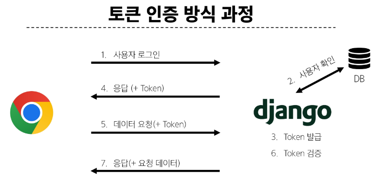

# View with DRF

## 프로젝트 개요

1. Vue with DRF 1
  - Vue 와 DRF 간 기본적인 요청과 응답

2. Vue with DRF 2
  - Vue와 DRF에서의 인증 시스템


### DRF 프로젝트 안내
### Vue 프로젝트 안내 

## 메인 페이지 구현
### 게시글 목록 출력
### DRF와의 요청과 응답

- 이제는 임시 데이터가 아닌 DRF 서버에 요청하여 데이터를 응답받아 store에 저장 후 출력하기

- DRF 서버로서의 AJAX 요청을 위한 axios 설치 및 관련 코드 작성
- DRF 서버로 요청을 보내고 응답 데이터를 처리하는 getArticles 함수 작성

  > npm install axios

  ```js
  //counter.js

  import axios from 'axios'

  export const useCounterStore = defineStore('counter', () => {
    const articles = ref([])

    // 장고 포트 번호
    const API_URL = 'http://127.0.0.1:8000'

    // DRF로 전체 게시글 요청을 보내고 응답을 받아 articles에 저장하는 함수
    const getArticles = function () {
      axios({
        method: 'get',
        //  보내고자 하는 장고 url
        url: `${API_URL}/api/v1/articles/`,
      })
        //  응답 받으면 응답 출력
        .then((res) => {
          console.log(res)
        })
        //  에러나면 에러 출력 
        .catch((error) => {
          console.log(error)
        })
    }

    return { articles, API_URL, getArticles }
  }, { persist: true })

  ```

- ArticleView 컴포넌트가 마운트 될 때 getArticles 함수가 실행되도록 함

> 해당 컴포넌트가 렌더링 될 때 항상 최신 게시글 목록을 불러오기 위함

  ```js
  import ArticleList from '@/components/ArticleList.vue'
  import { useCounterStore } from '@/stores/counter';
  import { onMounted } from 'vue'

  const store = useCounterStore()

  onMounted(() => {
    // mount 되기 전에 store에 있는 전체 게시글 요청 함수를 호출
    store.getArticles()
  })
  ```

> 서버는 응답했으나 브라우저 측에서 거절함.... CORS policy에 의해 차단됨

## CORS Policy

- SOP : Same-origin-policy (동일 출처 정책)

- URL 의 Protocol, Host, Port 를 모두 포함하여 출처라고 부름 
- Same Origin 예시
  - 아래 세 영역이 일치하는 경우에만 동일 출처 (Same-origin)로 인정

  

> CORS는 웹서버가 리소스에 대한 서로 다른 출처 간 접근을 허용하도록 선택할 수 있는 기능을 제공

- CORS : 교차 출처 리소스 공유
- 다른 출처의 자원에 접근할 수 있는 권한을 부여

### CORS Policy

- 교차 출처 리소스 공유 정책
> CORS header 를 포함한 응답을 반환


### CORS Headers 설정

> pip install django-cors-headers

  ```py
  # django 프로젝트의 settings.py

  INSTALLED_APPS = [
    'corsheaders',
  ]

  MIDDLEWARE = [
    'corsheaders.middleware.CorsMiddleware',
  ]

  CORS_ALLOWED_ORIGINS = [
    'http://127.0.0.1:5173',
    'http://localhost:5173',
  ]
  ```

## Article CR 구현

- 07-01-vue-with-drf 확인


## 인증  with DRF 
### 인증

- Authentication (인증)
- 수신된 요청을 해당 요청의 사용자 또는 자격 증명과 연결하는 메커니즘 

> 누구인지를 확인하는 과정

- Permissions (권한)
- 요청에 대한 접근 허용 또는 거부 여부를 결정

#### DRF에서의 인증

- 인증은 항상 view함수 시작시, 권한 및 제한 확인이 발생하기 전, 다른 코드의 진행이 허용되기 전에 실행됨

> 인증 자체로는 들어오는 요청을 허용하거나 거부할 수 없으며, 단순히 요청에 사용된 자격 증명만 식별한다는 점에 유의

#### 오류 코드 응답

1. HTTP 401 Unauthorized
  - 요청된 리소스에 대한 유효한 인증 자격 증명이 없기 때문에 클라이언트 요청이 완료되지 않았음을 나타냄 (누구인지를 증명할 자료가 없음)

2. HTTP 403 Forbidden (Permission Denied)
  - 서버에 요청이 전달되었지만, 권한 때문에 거절되었다는 것을 의미
  - 401과 다른 점은 서버는 클라이언트가 누구인지 알고 있음

### 인증 정책 설정

1. 전역 설정

- 프로젝트 전체에 적용되는 기본 인증 방식을 정의
- 기본 값: SessionAuthentication 과 BasicAuthentication

  ```py
  # settings.py

  REST_FRAMEWORK = {
        #Authentication
       'DEFAULT_AUTHENTICATION_CLASSES': [
           'rest_framework.authentication.TokenAuthentication',
       ],
   }
  ```

2. View 함수 별 설정

- authentication_calsses 데코레이터를 사용
- 개별 view에 지정하여 재정의

  ```py
  # permission Decorators
   from rest_framework.decorators import permission_classes
   from rest_framework.permissions import IsAuthenticated

   @permission_classes([IsAuthenticated])
  ```

### Token 인증 설정

#### TokenAuthentication

- token 기반 HTTP 인증 체계
- 기본 데스크톱 및 모바일 클라이언트와 같은 클라이언트 - 서버 설정에 적합

> 서버가 인증된 사용자에게 토큰을 발급하고 사용자는 매요청마다 발급받은 토큰을 요청과 함께 보내 인증과정을 거침

1. 인증 클래스 설정
  
  ```py
  #settings.py

  REST_FRAMEWORK = {
      # Authentication
      'DEFAULT_AUTHENTICATION_CLASSES': [
          'rest_framework.authentication.TokenAuthentication',
      ],
  }
  ```

2. INSTALLED_APPS 추가 
  - rest_framework.authtoken 주석 해제 

    ```py
    # Application definition
    INSTALLED_APPS = [
        'articles',
        'accounts',
        'rest_framework',
        'rest_framework.authtoken',
    ]
    ```

3. Migrate 진행
  > python manage.py migrate

4. 토큰 생성 코드 작성
  > 인증된 사용자에게 자동으로 토큰을 생성해주는 역할

    ```py
    # accounts/signals.py

    from django.db.models.signals import post_save
    from django.dispatch import receiver
    from rest_framework.authtoken.models import Token
    from django.conf import settings


    @receiver(post_save, sender=settings.AUTH_USER_MODEL)
    def create_auth_token(sender, instance=None, created=False, **kwargs):
        if created:
            Token.objects.create(user=instance)

    ```




### Dj-Rest-Auth 라이브러리

- 회원가입, 인증(소셜미디어 인증 등), 비밀번호 재설정, 사용자 세부 정보 검색, 회원 정보 수정 등 다양한 인증 관련 기능을 제공하는 라이브러리


#### Dj-Rest_Auth 설치 및 적용

1. 설치 
  > pip install dj-rest-auth

2. 앱 등록
  ```py
  INSTALLED_APPS = [
      'dj_rest_auth',
  ]
  ```

3. URL 등록 
  ```py
  # my_api/urls.py

  urlpatterns = [
    path('admin/', admin.site.urls),
    path('api/v1/', include('articles.urls')),
    path('accounts/', include('dj_rest_auth.urls')),
    ]
  ```

#### Dj-Rest_Auth의 Registration(등록) 기능 추가 설정

1. 패키지 추가 설치
  > pip install 'dj-rest-auth[with-social]'

2. setting 설정
  
  ```py
  INSTALLED_APPS = [
    'django.contrib.sites',
    'allauth',
    'allauth.account',
    'allauth.socialaccount',
    'dj_rest_auth.registration',
    ]

  SITE_ID = 1

  MIDDLEWARE = [
    'allauth.account.middleware.AccountMiddleware',
  ]
  ```
3. URL 등록
  
  ```py
  # my_api/urls.py

  urlpatterns = [
      path('accounts/signup/', include('dj_rest_auth.registration.urls')),
  ]
  ```

4. Migrate 진행

  > python manage.py migrate

### Token 발급 및 활용

- 회원 가입 및 로그인을 진행하여 토큰 발급 테스트 하기

- 회원가입 진행
- http://127.0.0.1:8000/accounts/signup/

- 로그인 진행
- http://127.0.0.1:8000/accounts/login/

- 로그인 성공 후 DRF 로 부터 발급 받은 Token 확인
> 이제 이 Token을 Vue에서 별도로 저장하여 매 요청마다 함께 보내야함

- Postman 사용해서 Body에 게시글 제목과 내용 입력
- Headers에 발급받은 Token 작성 후 요청 성공 확인
  - key: Authorization
  - Value: Token 토큰값

#### 클라이언트가 Token으로 인증 받는 방법

1. **Authorizaion** HTTP Header에 포함
2. 키 앞에는 문자열 **Token**이 와야하며 **'공백'으로 두 문자열을 구분해야 함**

**발급 받은 Token을 인증이 필요한 요청마다 함께 보내야함**

## 권한 with DRF
### 권한 정책 설정

1. 전역 설정

- 프로젝트 전체에 적용되는 기본 인증 방식을 정의
- 기본 값: SessionAuthentication 과 BasicAuthentication

  ```py
  # settings.py

  REST_FRAMEWORK = {
       # permission
       'DEFAULT_PERMISSION_CLASSES': [
           'rest_framework.permissions.AllowAny',
       ],
   }
  ```

2. View 함수 별 설정

- permission_classes 데코레이터를 사용
- 개별 view에 지정하여 재정의

  ```py
  # permission Decorators
   from rest_framework.decorators import permission_classes
   from rest_framework.permissions import IsAuthenticated

   @permission_classes([IsAuthenticated])
  ```

### IsAuthenticated 설정

- 인증되지 않은 사용자에 대한 권한을 거부하고 그렇지 않은 경우 권한을 허용
> 등록된 사용자만 API에 액세스 할 수 있도록 하려는 경우에 적합

  ```py
  
  # settings.py

  REST_FRAMEWORK = {
    # permission
    'DEFAULT_PERMISSION_CLASSES': [
        'rest_framework.permissions.AllowAny',
    ],
  }
  

  # views.py
  # permission Decorators
  from rest_framework.decorators import permission_classes
  from rest_framework.permissions import IsAuthenticated, IsAdminUser

  # 로그인한 사람만 접근 가능
  @permission_classes([IsAuthenticated])

  # 관리자만 접근 가능
  @permission_classes([IsAdminUser])
  ```

## 인증 with Vue

- 07-02-vue-with-drf 참고

## 참고
### 기타 기능 구현
### Django Signals
### 환경변수
### Vue 참고 자료