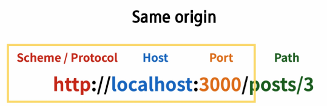
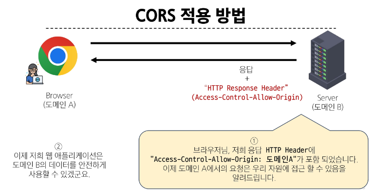

# View with DRF

## 프로젝트 개요

1. Vue with DRF 1
  - Vue 와 DRF 간 기본적인 요청과 응답

2. Vue with DRF 2
  - Vue와 DRF에서의 인증 시스템


### DRF 프로젝트 안내
### Vue 프로젝트 안내 

## 메인 페이지 구현
### 게시글 목록 출력
### DRF와의 요청과 응답

- 이제는 임시 데이터가 아닌 DRF 서버에 요청하여 데이터를 응답받아 store에 저장 후 출력하기

- DRF 서버로서의 AJAX 요청을 위한 axios 설치 및 관련 코드 작성
- DRF 서버로 요청을 보내고 응답 데이터를 처리하는 getArticles 함수 작성

  > npm install axios

  ```js
  //counter.js

  import axios from 'axios'

  export const useCounterStore = defineStore('counter', () => {
    const articles = ref([])

    // 장고 포트 번호
    const API_URL = 'http://127.0.0.1:8000'

    // DRF로 전체 게시글 요청을 보내고 응답을 받아 articles에 저장하는 함수
    const getArticles = function () {
      axios({
        method: 'get',
        //  보내고자 하는 장고 url
        url: `${API_URL}/api/v1/articles/`,
      })
        //  응답 받으면 응답 출력
        .then((res) => {
          console.log(res)
        })
        //  에러나면 에러 출력 
        .catch((error) => {
          console.log(error)
        })
    }

    return { articles, API_URL, getArticles }
  }, { persist: true })

  ```

- ArticleView 컴포넌트가 마운트 될 때 getArticles 함수가 실행되도록 함

> 해당 컴포넌트가 렌더링 될 때 항상 최신 게시글 목록을 불러오기 위함

  ```js
  import ArticleList from '@/components/ArticleList.vue'
  import { useCounterStore } from '@/stores/counter';
  import { onMounted } from 'vue'

  const store = useCounterStore()

  onMounted(() => {
    // mount 되기 전에 store에 있는 전체 게시글 요청 함수를 호출
    store.getArticles()
  })
  ```

> 서버는 응답했으나 브라우저 측에서 거절함.... CORS policy에 의해 차단됨

## CORS Policy

- SOP : Same-origin-policy (동일 출처 정책)

- URL 의 Protocol, Host, Port 를 모두 포함하여 출처라고 부름 
- Same Origin 예시
  - 아래 세 영역이 일치하는 경우에만 동일 출처 (Same-origin)로 인정

  

> CORS는 웹서버가 리소스에 대한 서로 다른 출처 간 접근을 허용하도록 선택할 수 있는 기능을 제공

- CORS : 교차 출처 리소스 공유
- 다른 출처의 자원에 접근할 수 있는 권한을 부여

### CORS Policy

- 교차 출처 리소스 공유 정책
> CORS header 를 포함한 응답을 반환



### CORS Headers 설정

> pip install django-cors-headers

  ```py
  # django 프로젝트의 settings.py

  INSTALLED_APPS = [
    'corsheaders',
  ]

  MIDDLEWARE = [
    'corsheaders.middleware.CorsMiddleware',
  ]

  CORS_ALLOWED_ORIGINS = [
    'http://127.0.0.1:5173',
    'http://localhost:5173',
  ]
  ```

## Article CR 구현
### 전체 게시글 조회
### 단일 게시글 조회
### 게시글 작성