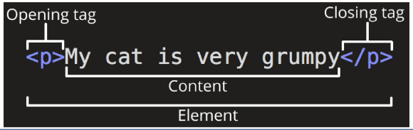
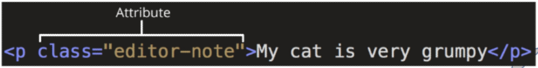

# Web
## 웹

- 웹 : web site, web application 등을 통해 사용자들이 정보를 검색하고 상호 작용하는 기술
- 웹 사이트: 인터넷에서 여러 개의 web page가 모인 것으로, 사용자들에게 정보나 서비스를 제공하는 공간
- 웹 페이지: HTML, CSS등의 웹 기술을 이용하여 만들어진, "web site"를 구성하는 하나의 요소

## 웹 구조화
### HTML
- HyperText Markup Language, 웹 페이지의 의미와 구조를 정의하는 언어

#### Hypertext
- 웹 페이지를 다른 페이지로 연결하는 링크. 참조를 통해 사용자가 한 문서에서 다른 문서로 즉시 접근할 수 있는 텍스트
- 비선형성, 상호연결성, 사용자 주도적 탐색

#### Markup Language
- 태그 등을 이용하여 문서나 데이터의 구조를 명시하는 언어
    - ex. HTML, Markdown

## HTML
### HTML 구조

```html
<!DOCTYPE html>  <!--해당 문서가 html 문서라는 것을 나타냄-->
<html lang="en"> <!--전체 페이지의 콘텐츠를 포함-->
<head> <!--html 문서에 관련된 설명, 설정 등 컴퓨터가 식별하는 메타데이터를 작성. 사용자에게 보이지 않음--> 
    <meta charset="UTF-8">
    <title>My page</title> <!--브라우저 탭 및 즐겨찾기 시 표시되는 제목으로 사용-->
</head>
<body> <!--html 문서의 내용을 나타냄, 페이지에 표시되는 모든 콘텐츠를 작성, 한 문서에 하나의 body 요소만 존재-->
    <p>This is my page</p>
</body>
</html>
```

### HTML 요소
- 하나의 요소는 여는 태그와 닫는 태그 그리고 그 안의 내용으로 구성됨

- 닫는 태그는 태그 이름 앞에 슬래시가 포함됨
    - 닫는 태그가 없는 태그도 존재


### HTML 속성
- 사용자가 원하는 기준에 맞도록 요소를 설정하거나 다양한 방식으로 요소의 동작을 조절하기 위한 값
- 목적
    - 나타내고 싶지 않지만 추가적인 기능, 내용을 담고 싶을 때 사용
    - CSS에서 스타일 적용을 위해 해당 요소를 선택하기 위한 값으로 활용됨


#### 속성 작성 규칙
1. 속성은 요소 이름과 속성 사이에 공백이 있어야함
2. 하나 이상의 속성들이 있는 경우엔 속성 사이에 공백으로 구분함
3. 속성 값은 열고 닫는 따옴표로 감싸야 함 (쌍따옴표로 하기)

### Text Structure
#### HTML Text structure
- html의 주요 목적 중 하나는 텍스트 구조와 의미를 제공하는 것
- html은 웹 페이지의 의미와 구조를 정의하는 언어
- 예를 들어 h1 요소는 단순히 텍스트를 크게만 만드는 것이 아닌 현재 문서의 최상위 제목이라는 의미를 부여하는 것

- 대표적인 HTML Text structure
    - Heading & Paragraphs
        - h1~6, p
    - Lists
        - ol, ul, li
    - Emphasis & Importance
        - em, strong