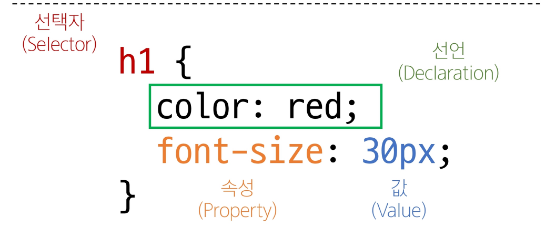

# Web 
## CSS
- cascading style sheet
- 웹 페이지의 디자인과 레이아웃을 구성하는 언어

### CSS 구문

- 세미콜론 문장 끝에 꼭 기입

### CSS 적용방법
- 03-css-basic.html 참고

1. 인라인 스타일 (권장 x)
    - HTML 요소 안에 style 속성 값으로 작성
2. 내부 스타일 시트
    - head 태그 안에 style 태그에 작성
3. 외부 스타일 시트
    - 별도 CSS 파일 생성 후 HTML link 태그를 사용해 불러오기

### CSS 선택자
- HTML 요소를 선택하여 스타일을 적용할 수 있도록 하는 선택자

#### CSS 선택자 종류
- 기본 선택자
    - 전체(*) 선택자
        - HTML 모든 요소를 선택
    - 요소(tag) 선택자
        - 지정한 모든 태그를 선택
    - 클래스 선택자('.'(dot))
        - 주어진 클래스 속성을 가진 모든 요소를 선택
    - 아이디 선택자('#')
        - 주어진 아이디 속성을 가진 요소 선택
        - 문서에는 주어진 아이디를 가진 요소가 하나만 있어야 함

### CSS 결합자
- 자손 결합자(" " (space))
    - 첫번째 요소의 자손 요소들 선택
    - 예) p span은 
안에 있는 모든 를 선택(하위 레벨 상관 없이)
- 자식 결합자(">")
    - 첫번째 요소의 직계 자식만 선택
    - 예) ul > li은 <ul> 안에 있는 모든 <li>를 선택(한단계 아래 자식들만)

### 명시도 (specificity)
- 결과적으로 요소에 적용할 css 선언을 결정하기 위한 알고리즘
- css 선택자에 가중치를 계산하여 어떤 스타일을 적용할지 결정
    - 동일한 요소를 가리키는 2개 이상의 css 규칙이 있는 경우 가장 높은 명시도를 가진 선택자가 승리하여 스타일이 적용됨

- 계단식(cascade) : 한 요소에 동일한 가중치를 가진 선택자가 적용될 때 css에서 마지막에 나오는 선언이 사용됨

#### 명시도가 높은 순
1. Importance
    - !important 
2. Inline 스타일
3. 선택자
    - id 선택자 > **class 선택자** > 요소 선택자
4. 소스 코드 선언 순서

> 앞으로 선택자 사용할 때 class 선택자만 거의 사용함
> !important (다른 우선순위 규칙보다 우선하여 적용하는 키워드)사용 권장하지 않음

### CSS 상속
- 기본적으로 CSS는 상속을 통해 부모 요소의 속성을 자식에게 상속해 재사용성을 높임

- 상속 되는 속성
    - Text 관련 요소(font, color, text-align), opacity, visibility 등
- 상속 되지 않는 속성
    - Box model 관련 요소(width, height, border, box-sizing ..)
    - position 관련 요소(position, top/right/bottom/left, z-index)등

### CSS BOX Model
- 웹 페이지의 모든 HTML 요소를 감싸는 사각형 상자 모델

#### 박스타입
1. Block box
2. Inline box

> 박스 타입에 따라 페이지에서의 배치 흐름 및 다른 박스와 관련하여 박스가 동작하는 방식이 달라짐

#### 박스 표시 타입
1. Outer display type
    - 박스가 문서 흐름에서 어떻게 동작할지를 결점
    - 속성
        - block, inline
    - block
        - 항상 새로운 행으로 나뉨
        - width와 height 속성 사용 가능
        - padding, margin, border로 인해 다른 요소를 상자로부터 밀어냄
        - width 속성을 지정하지 않으면 박스는 inline 방향으로 사용가능한 공간을 모두 차지함
            - 상위 컨테이너 너비 100%로 채우는 것
        - 대표적인 block 타입 태그
    - inline
        - 새로운 행으로 넘어가지 않음
        - width와 height 속성 사용 불가
        - 수직방향
            - padding, margin, border 가 적용되지만 다른 요소를 밀어낼 수는 없음
        - 수평방향
            - padding, margins, borders 가 적용되어 다른 요소를 밀어낼 수 있음
        - 대표적인 inline 타입 태그
            - a, img, span, strong, em 

    - 02-box-model 예시 확인
2. Inner display type
    - 박스 내부의 요소들이 어떻게 배치될지를 결정
    - 속성
        - flex
    