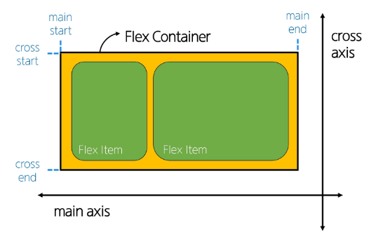
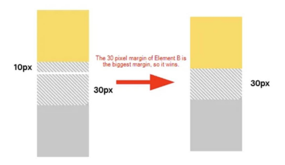

# Web 
## CSS
- cascading style sheet
- 웹 페이지의 디자인과 레이아웃을 구성하는 언어

### CSS 구문

- 세미콜론 문장 끝에 꼭 기입

### CSS 적용방법
- 03-css-basic.html 참고

1. 인라인 스타일 (권장 x)
    - HTML 요소 안에 style 속성 값으로 작성
2. 내부 스타일 시트
    - head 태그 안에 style 태그에 작성
3. 외부 스타일 시트
    - 별도 CSS 파일 생성 후 HTML link 태그를 사용해 불러오기

### CSS 선택자
- HTML 요소를 선택하여 스타일을 적용할 수 있도록 하는 선택자

#### CSS 선택자 종류
- 기본 선택자
    - 전체(*) 선택자
        - HTML 모든 요소를 선택
    - 요소(tag) 선택자
        - 지정한 모든 태그를 선택
    - 클래스 선택자('.'(dot))
        - 주어진 클래스 속성을 가진 모든 요소를 선택
    - 아이디 선택자('#')
        - 주어진 아이디 속성을 가진 요소 선택
        - 문서에는 주어진 아이디를 가진 요소가 하나만 있어야 함

### CSS 결합자
- 자손 결합자(" " (space))
    - 첫번째 요소의 자손 요소들 선택
    - 예) p span은 
안에 있는 모든 를 선택(하위 레벨 상관 없이)
- 자식 결합자(">")
    - 첫번째 요소의 직계 자식만 선택
    - 예) ul > li은 <ul> 안에 있는 모든 <li>를 선택(한단계 아래 자식들만)

### 명시도 (specificity)
- 결과적으로 요소에 적용할 css 선언을 결정하기 위한 알고리즘
- css 선택자에 가중치를 계산하여 어떤 스타일을 적용할지 결정
    - 동일한 요소를 가리키는 2개 이상의 css 규칙이 있는 경우 가장 높은 명시도를 가진 선택자가 승리하여 스타일이 적용됨

- 계단식(cascade) : 한 요소에 동일한 가중치를 가진 선택자가 적용될 때 css에서 마지막에 나오는 선언이 사용됨

#### 명시도가 높은 순
1. Importance
    - !important 
2. Inline 스타일
3. 선택자
    - id 선택자 > **class 선택자** > 요소 선택자
4. 소스 코드 선언 순서

> 앞으로 선택자 사용할 때 class 선택자만 거의 사용함
> !important (다른 우선순위 규칙보다 우선하여 적용하는 키워드)사용 권장하지 않음

### CSS 상속
- 기본적으로 CSS는 상속을 통해 부모 요소의 속성을 자식에게 상속해 재사용성을 높임

- 상속 되는 속성
    - Text 관련 요소(font, color, text-align), opacity, visibility 등
- 상속 되지 않는 속성
    - Box model 관련 요소(width, height, border, box-sizing ..)
    - position 관련 요소(position, top/right/bottom/left, z-index)등

### CSS BOX Model
- 웹 페이지의 모든 HTML 요소를 감싸는 사각형 상자 모델
> 내용(content), 안쪽여백(padding), 테두리(border), 외부간격(margin)으로 구성되어 요소의 크기와 배치를 결정

#### 박스타입
1. Block box
2. Inline box

> 박스 타입에 따라 페이지에서의 배치 흐름 및 다른 박스와 관련하여 박스가 동작하는 방식이 달라짐

#### 박스 표시 타입 
1. Outer display type
    - 박스가 문서 흐름에서 어떻게 동작할지를 결점
    - 속성
        - block, inline
    - block
        - 항상 새로운 행으로 나뉨
        - width와 height 속성 사용 가능
        - padding, margin, border로 인해 다른 요소를 상자로부터 밀어냄
        - width 속성을 지정하지 않으면 박스는 inline 방향으로 사용가능한 공간을 모두 차지함
            - 상위 컨테이너 너비 100%로 채우는 것
        - 대표적인 block 타입 태그
            - h1~6, p, div
    - inline
        - 새로운 행으로 넘어가지 않음
        - width와 height 속성 사용 불가
        - 수직방향
            - padding, margin, border 가 적용되지만 다른 요소를 밀어낼 수는 없음
        - 수평방향
            - padding, margins, borders 가 적용되어 다른 요소를 밀어낼 수 있음
        - 대표적인 inline 타입 태그
            - a, img, span, strong, em 

    > 02-box-model/01-normal-flow 예시 확인하기

2. Inner display type
    - 박스 내부의 요소들이 어떻게 배치될지를 결정
    - 속성
        - flex
    
#### Box 구성 요소

- content box
    - 실제 콘텐츠가 표시되는 영역 크기
    - width 및 height 속성을 사용하여 크기 조정

- padding box
    - 콘텐츠 주위에 공백
    - padding 관련 속성을 사용하여 크기 조정

- border box
    - 콘텐츠와 패딩을 래핑
    - border 관련 속성을 사용하여 크기 조정

- margin box
    - 콘텐츠, 패딩 및 테두리를 래핑
    - 박스와 다른 요소 사이의 공백
    - margin 관련 속성을 사용하여 크기 조정

#### shorthand 속성
- border
    - width, style, color 를 한번에 설정 가능
        - border: 2px solid black;

- margin, padding
    - 4방향의 속성을 각각 지정하지 않고 한번에 지정할 수 있는 속성
        - 4개연달아 - 상/우/하/좌
        - 3개연달아 - 상/좌우/하
        - 2개 - 상하/좌우
        - 1개 - 공통

#### box-sizing 속성

- The standard CSS box model
    - 표준 상자 모델에서 width와 height 속성 값을 설정하면 이 값은 content box의 크기를 조정하게 됨

- The alternative CSS box model
    - 대체 상자 모델에서 모든 width와 height는 실제 상자의 너비 실제 박스 크기를 정하기 위해 테두리와 패딩을 조정할 필요없음
    - 대체 상자 모델로 변경 하려면
        - box-sizing: border-box; 
        - 박스가 패딩마진상관없이 테두리 너비로 조절됨

#### 기타 display 속성
1. inline-block
    - inline과 block요소 사이의 중간 지점을 제공하는 display값
    - width 및 height 속성 사용 가능
    - padding, margin 및 border로 인해 다른 요소가 상자에서 밀려남
    - 새로운 행으로 넘어가지 않음
    > 요소가 줄 바꿈 되는 것을 원하지 않으면서 너비와 높이를 적용하고 싶은 경우에 사용
2. none
    - 요소를 화면에 표시하지 않고, 공간조차 부여되지 않음
    - 원래있던 속성 none으로 없앰..

### CSS Position

> 전체 페이지에 대한 레이아웃을 구성하는 것 보다는 페이지 특정 항목의 위치를 조정하는 것

#### CSS Layout
- 각 요소의 위치와 크기를 조정하여 웹페이지의 디자인을 결정하는 것
    - display, position, flex  box 등

#### CSS Position
- 요소를 Normal Flow에서 제거하여 다른 위치로 배치하는 것
    - 다른 요소 위에 올리기, 화면의 특정 위치에 고정시키기 등

- Position 이동 방향

#### static
- 요소를 Normal Flow에 따라 배치
- top, right, bottom, left 속성이 적용되지 않음
- 기본 값

#### relative 
- 요소를 Normal Flow에 따라 배치
- 자신의 원래 위치(static)을 기준으로 이동
- top, right, bottom, left 속성으로 위치를 조정
- 다른 요소의 레이아웃에 영향을 주지 않음(요소가 차지하는 공간은 static일 때와 같음)

#### absolute
- 요소를 Normal Flow에서 제거
- 가장 가까운 relative 부모 요소를 기준으로 이동
    - 만족하는 부모 요소가 없다면 body 태그를 기준으로 함
- top, right, bottom, left 속성으로 위치를 조정
- 문서에서 요소가 차지하는 공간이 없어짐

#### fixed
- 요소를 Normal Flow에서 제거
- 현재 화면영역(viewport)을 기준으로 이동
- 스크롤해도 항상 같은 위치에 유지됨
- top, right, bottom, left 속성으로 위치를 조정
- 문서에서 요소가 차지하는 공간이 없어짐

#### sticky
- relative와 fixed의 특성을 결합한 속성
- 스크롤 위치가 임계점에 도달하기 전에는 relative처럼 동작
- 스크롤이 특정 임계점에 도달하면 fixed처럼 동작하여 화면에 고정됨
- 만약 다음 sticky 요소가 나오면 다음 sticky 요소가 이전 sticky 요소의 자리를 대체
    > 이전 sticky 요소가 고정되어 있던 위치와 다음 sticky요소가 고정되어야 할 위치가 겹치게 되기 때문

#### z-index
- 요소의 쌓임 순서(stack order)를 정의하는 속성
- 정수 값을 사용해 z축 순서를 지정
- 값이 클수록 요소가 위에 쌓이게 됨
- static이 아닌 요소에만 적용됨

- 기본값은 auto
- 부모 요소의 z-index 값에 영향을 받음
- 같은 부모 내에서만 z-index 값을 비교
- 부모의 z-index가 낮으면 자식의 z-index가 아무리 높아도 부모보다 위로 올라갈 수 없음
- z-index 값이 같으면 HTML 문서 순서대로 쌓임

### CSS Flexbox
- 요소를 행과 열 형태로 배치하는 1차원 레이아웃 방식
    - 공간 배열 & 정렬
- inner display type 임

#### flexbox 구성 요소

- main axis (주 축)
    - flex item 들이 배치되는 기본 축
    - main start에서 시작하여 main end 방향으로 배치(기본 값)

- cross axis (교차 축)
    - main axis에 수직인 축
    - cross start에서 시작하여 cross end 방향으로 배치(기본 값)

- Flex Container
    - display: flex; 혹은 display: inline-flex; 가 설정된 부모 요소
    - 이 컨테이너의 1차 자식 요소들이 flex item이 됨
    - flexbox 속성 값들을 사용하여 자식 요소 flex item들을 배치하는 주체

- Flex Item
    - flex container 내부에 레이아웃 되는 항목

#### flexbox 속성
- flex container 관련 속성
    - display, flex-direction, flex-wrap, justify-content, align-items, align-content

- flex item 관련 속성
    - align-self, flex-grow, flex-basis, order

1. flex container 지정
    - flex item은 기본적으로 행(주 축의 기본값인 가로 방향)으로 나열
    - flex item은 주 축의 시작 선에서 시작
    - flex item은 교차 축의 크기를 채우기 위해 늘어남

2. flex-direction
    - flex item이 나열되는 방향을 지정
    - column으로 지정할 경우 주 축이 변경됨
    - "reverse"로 지정하면 flex item 배치의 시작선과 끝 선이 서로 바뀜

3. flex-wrap 
    - flex-item 목록이 flex container의 한 행에 들어가지 않을 경우 다른 행에 배치할지 여부 설정

4. justify-content
    - 주 축을 따라 flex item과 주위에 공간을 분배

5. align-content
    - 교차 축을 따라 flex item과 주위에 공간을 분배
        - flex-wrap이 wrap 또는 wrap-reverse 로 설정된 여러 행에만 적용됨
        - 한 줄 짜리 행에는 효과 없음(flex-wrap이 nowrap으로 설정된 경우)

6. align-items
    - 교차 축을 따라 flex item 행을 정렬

7. align-self
    - 교차 축을 따라 개별 flex item을 정렬

> justify-content: center; align-items: center; 상하 좌우 센터로 정렬 가능

8. flex-grow
    - 남는 행 여백을 비율에 따라 각 flex item에 분배
        - 아이템이 컨테이너 내에서 확장하는 비율을 지정
        - grow 비율이기 때문에 다 나눠짐
    - flex-grow의 반대는 flex-shrink

9. flex-basis
    - flex item의 초기 크기 값을 지정
    - flex-basis와 width 값을 동시에 적용한 경우 felx-basis가 우선

#### 목적에 따른 속성 분류

- 배치
    - flex-direction
    - flex-wrap

- 공간 분배
    - justify-content
    - align-content

- 정렬
    - align-items
    - align-self

%% 속성명 TIP!
- justify : 주축
- align : 교차축

#### flex-wrap 응용
- 반응형 레이아웃
    - 다양한 디바이스와 화면 크기에 자동으로 적응하여 콘텐츠를 최적으로 표시하는 웹 레이아웃 방식
    - flex-wrap 이랑 flex-grow로 구현 가능

#### justify-items 및 justify-self 속성이 없는 이유
- 필요없음
- margin auto를 통해 정렬 및 배치가 가능

### 참고

#### Margin collapsing (마진 상쇄)
- 두 block 타입 요소의 martin top과 bottom이 만나 더 큰 margin으로 결합되는 현상

- 복잡한 레이아웃에서 요소 간 간격을 일관 되게 유지하기 위함
- 요소 간의 간격을 더 예측 가능하고 관리하기 쉽게 만듬
    > 일관성, 단순화

#### 박스 타입 별 수평 정렬

##### Block 요소의 수평 정렬
- margin: auto 사용
    - 블록 요소의 너비를 지정하고 좌우 마진을 auto로 설정

##### Inline 요소의 수평 정렬
- text-align 사용
    - 부모 요소에 적용

##### Inline-block 요소의 수평 정렬
- text-align 사용
    - 부모 요소에 적용